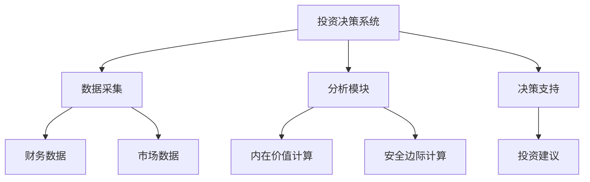

                 


# 巴菲特的'大赌注'：何时集中投资是明智之举

## 关键词：巴菲特，集中投资，价值投资，安全边际，投资策略

## 摘要： 
本文深入分析了巴菲特的投资哲学，重点探讨了集中投资的定义、优缺点，以及何时选择集中投资的明智策略。通过数学模型和实际案例，揭示了巴菲特集中投资的成功关键，并结合系统架构设计，为读者提供了从理论到实践的完整指南。

---

# 第一部分：背景介绍

## 第1章：集中投资的定义与特点

### 1.1 集中投资的定义
集中投资是一种投资策略，指将大部分资金投资于少数几只股票或资产，以追求超额收益。其核心在于选择具有强大竞争优势、良好管理和明确增长前景的企业。

### 1.2 集中投资的特点
- **高风险高回报**：集中投资的风险较高，但潜在回报也更大。
- **长期视角**：注重企业的长期价值，而非短期市场波动。
- **精选个股**：选择具有强大竞争优势的企业。

### 1.3 集中投资与其他投资策略的对比
| 投资策略 | 集中投资 | 分散投资 |
|----------|----------|----------|
| 风险     | 高       | 低       |
| 回报     | 高       | 中等     |
| 管理复杂度 | 高       | 低       |
| 适合场景 | 高成长企业 | 稳定市场 |

---

## 第2章：巴菲特投资哲学概述

### 2.1 巴菲特投资哲学的核心理念
- **价值投资**：寻找市场价格低于内在价值的企业。
- **安全边际**：买入价格低于内在价值的企业。
- **长期思维**：关注企业的长期增长潜力。

### 2.2 巴菲特集中投资的背景
- 巴菲特早期的投资理念受到格雷厄姆的影响，但逐渐发展出自己的价值投资体系。
- 通过集中投资，巴菲特能够更深入地研究企业的基本面，并长期持有优质企业。

### 2.3 集中投资的意义
- 通过集中投资，巴菲特能够将资源集中在少数优质企业上，从而获得更高的回报。

---

# 第二部分：集中投资的数学模型与公式

## 第3章：价值投资的数学模型

### 3.1 企业内在价值的计算公式
$$ V = \frac{E}{k} $$
其中，V为内在价值，E为企业预期收益，k为折现率。

### 3.2 安全边际的计算公式
$$ \text{安全边际} = \text{市场价格} - \text{内在价值} $$

### 3.3 集中投资的组合优化模型
$$ \min_w \left( w^T \Sigma w \right) $$
$$ \text{s.t.} \quad w^T \mu = r_p, \quad w^T 1 = 1 $$

---

# 第三部分：集中投资的条件与时机

## 第4章：市场周期的分析
- **市场周期**：市场的波动周期，包括牛市、熊市、震荡市等阶段。
- **集中投资时机**：在市场恐慌或低谷时期，集中投资优质企业可以获得更大的收益。

## 第5章：企业基本面的分析
- **财务指标**：ROE、ROA、毛利率等。
- **竞争优势**：企业的核心竞争力，如品牌、技术、成本优势等。
- **管理层评估**：管理层的能力和决策水平。

---

# 第四部分：系统分析与架构设计

## 第6章：投资决策系统的架构

### 6.1 系统功能设计
- 数据采集模块：收集企业的财务数据、市场数据。
- 分析模块：计算内在价值、安全边际。
- 决策支持模块：基于分析结果，提供投资建议。

### 6.2 系统架构设计


---

# 第五部分：项目实战

## 第7章：建立集中投资系统

### 7.1 环境安装
- 数据库：MySQL
- 分析工具：Python（Pandas, NumPy）
- 可视化工具：Matplotlib

### 7.2 核心代码实现
```python
import pandas as pd
import numpy as np

# 计算企业内在价值
def calculate_intrinsic_value(revenue, profit_margin, discount_rate):
    net_income = revenue * profit_margin
    return net_income / discount_rate

# 计算安全边际
def calculate_margin_of_safety(current_price, intrinsic_value):
    return current_price - intrinsic_value

# 示例数据
revenue = 100000000
profit_margin = 0.1
discount_rate = 0.08
current_price = 50

# 计算内在价值
iv = calculate_intrinsic_value(revenue, profit_margin, discount_rate)
# 计算安全边际
mos = calculate_margin_of_safety(current_price, iv)

print(f"内在价值: {iv:.2f}")
print(f"安全边际: {mos:.2f}")
```

### 7.3 代码应用与解读
- **内在价值计算**：根据企业收入和利润率，计算其内在价值。
- **安全边际计算**：评估当前价格是否低于内在价值，决定是否投资。

---

# 第六部分：总结与展望

## 第8章：总结与最佳实践

### 8.1 投资心态与纪律
- 长期思维，避免短期波动干扰。
- 保持纪律，严格执行投资策略。

### 8.2 风险管理
- 设置止损点，控制风险。
- 定期评估投资组合，及时调整。

### 8.3 持续学习与进化
- 关注市场变化，学习新的投资理念。
- 不断优化投资模型，提高决策效率。

### 8.4 长期思维与价值创造
- 选择具有长期竞争优势的企业。
- 关注企业基本面，寻找具有增长潜力的企业。

---

## 第9章：未来展望

### 9.1 投资策略的演变
- 结合人工智能技术，优化投资决策。
- 利用大数据分析，提升投资效率。

### 9.2 投资教育的重要性
- 提高投资者的金融素养。
- 帮助投资者建立正确的投资理念。

---

# 结语

通过本文的分析，读者可以全面理解巴菲特的集中投资策略，并将其应用于实际投资中。从理论到实践，从数学模型到系统设计，集中投资的成功离不开深入的研究、严格的纪律和长期的坚持。希望本文能为读者提供有价值的参考和启发。

