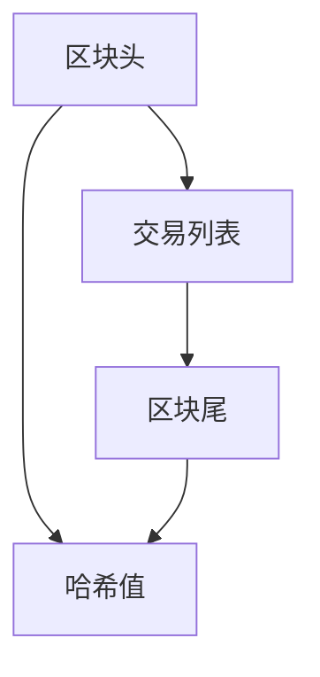
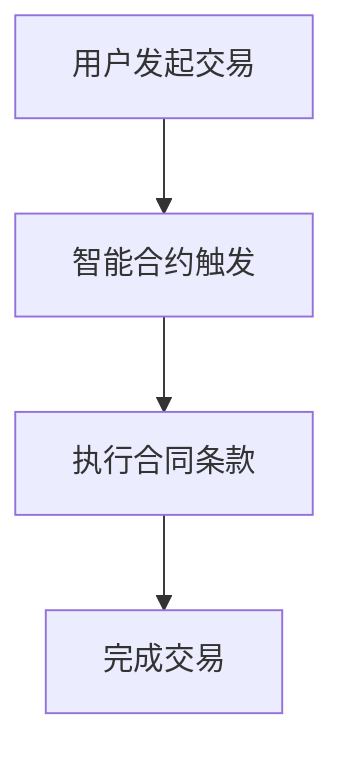
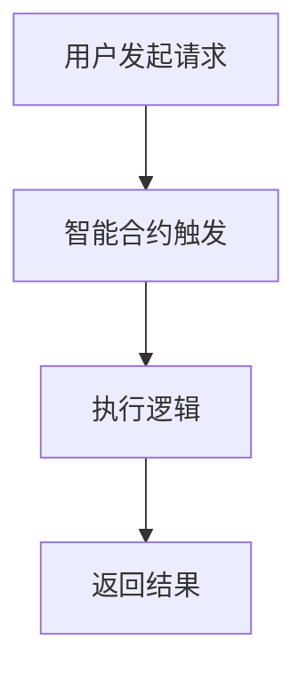
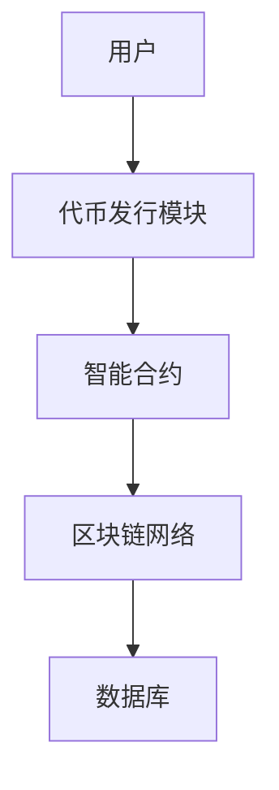
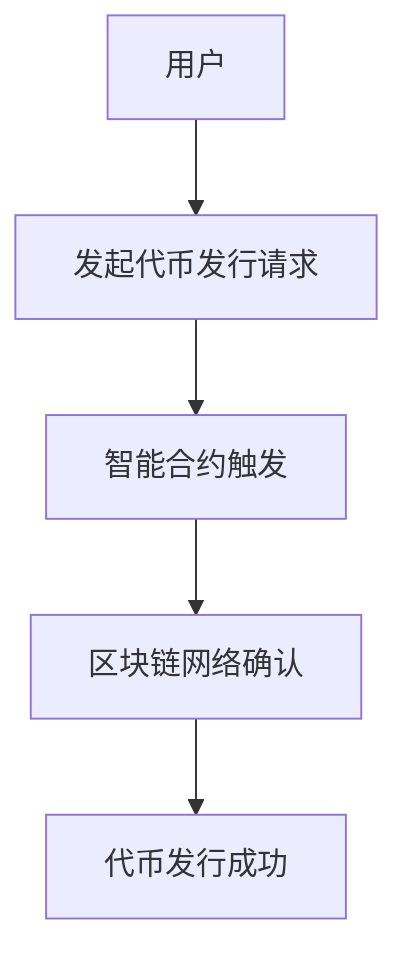

                 


# 巴菲特的价值投资在数字资产代币化中的新维度

> **关键词**: 巴菲特价值投资，数字资产代币化，区块链，智能合约，投资策略

> **摘要**: 本文探讨了巴菲特的价值投资理念在数字资产代币化中的新维度。通过分析数字资产代币化的技术基础、系统架构以及实际案例，展示了如何将巴菲特的长期稳健投资策略应用于数字资产领域。结合区块链和智能合约的技术优势，本文提出了数字资产代币化的新投资模型，并对未来的发展趋势进行了展望。

---

## 第一章: 数字资产代币化的背景与基础

### 1.1 数字资产代币化的定义与分类

#### 1.1.1 代币化的定义
数字资产代币化是指将现实世界中的资产（如股权、债权、艺术品等）转化为数字形式的代币，通过区块链技术进行记录和交易。代币化资产具有可分割性、透明性和高效流动性等特点。

#### 1.1.2 代币的分类与特点
代币主要分为以下几类：
1. **支付型代币（Utility Token）**: 用于支付或购买特定服务，如以太坊的_gas_。
2. **资产型代币（Asset Token）**: 代表特定资产的所有权，如房地产或艺术品的代币。
3. **股权型代币（Equity Token）**: 代表公司股权的数字形式。

#### 1.1.3 代币化与传统金融的区别
- **透明性**: 代币化资产通过区块链记录，交易透明可追溯。
- **流动性**: 代币化资产通常具有较高的流动性，便于快速交易。
- **效率**: 代币化减少了传统金融中的中介环节，降低了交易成本。

### 1.2 数字资产代币化的技术基础

#### 1.2.1 区块链技术的概述
区块链是一种去中心化的分布式账本技术，通过链式结构存储数据，确保数据的安全性和不可篡改性。区块链的核心特性包括去中心化、共识机制、智能合约等。

**区块链结构的 mermaid 图:**


#### 1.2.2 智能合约的工作原理
智能合约是区块链上的自动执行程序，用于自动执行合同条款。通过智能合约，可以实现资产的自动发行、转让和清算。

**智能合约流程的 mermaid 图:**


#### 1.2.3 代币发行的流程与机制
代币发行通常包括以下步骤：
1. **定义代币属性**: 确定代币的类型、发行总量、持有人权益等。
2. **编写智能合约**: 实现代币发行、转让和销毁的逻辑。
3. **部署到区块链**: 将智能合约部署到目标区块链网络。
4. **发行与交易**: 用户可以通过钱包进行代币的购买和转让。

---

## 第二章: 巴菲特价值投资的核心理念

### 2.1 巴菲特价值投资的哲学基础

#### 2.1.1 投资的本质与目标
巴菲特认为，投资的本质是通过购买优质资产，长期获取资产增值收益。投资的目标是找到具有持续竞争优势和良好管理的公司。

#### 2.1.2 价值投资的核心原则
1. **长期投资**: 避免短期市场的波动，关注企业的长期价值。
2. **安全边际**: 以低于内在价值的价格买入资产。
3. **基本面分析**: 重点分析企业的财务状况、盈利能力和发展前景。

#### 2.1.3 长期投资与安全边际的重要性
- 长期投资可以平滑短期市场的波动，降低投资风险。
- 安全边际确保在市场波动中仍能获得正收益。

### 2.2 巴菲特投资策略的关键要素

#### 2.2.1 公司基本面分析
- **财务指标**: 如ROE（净资产收益率）、净利润率、资产负债率等。
- **竞争优势**: 如品牌优势、成本优势、技术壁垒等。

#### 2.2.2 财务指标的评估
巴菲特特别关注企业的盈利能力、财务健康状况和分红能力。

#### 2.2.3 管理层能力和企业竞争优势
- 优秀的管理层是企业长期发展的关键。
- 企业的竞争优势决定了其在市场中的地位。

### 2.3 巴菲特价值投资的哲学与实践

#### 2.3.1 投资的长期性与耐心
巴菲特强调长期投资的重要性，避免频繁交易带来的成本和风险。

#### 2.3.2 风险控制与安全边际
通过安全边际的设置，巴菲特能够在市场下跌时仍保持收益。

#### 2.3.3 投资组合的构建与优化
- 投资组合应分散投资，降低单一资产的风险。
- 定期评估和调整投资组合，确保其与市场变化保持一致。

---

## 第三章: 数字资产代币化与巴菲特价值投资的结合

### 3.1 数字资产代币化对价值投资的影响

#### 3.1.1 代币化如何改变资产的价值评估
- 代币化资产的透明性和可分割性为价值评估提供了新的维度。
- 区块链技术确保了资产的真实性和可追溯性。

#### 3.1.2 代币化对投资标的流动性的影响
- 代币化资产通常具有较高的流动性，投资者可以随时买卖资产。
- 高流动性降低了资产的交易成本，提高了投资效率。

#### 3.1.3 代币化对投资风险的重新定义
- 代币化资产的风险包括技术风险、市场风险和法律风险。
- 区块链技术降低了操作风险，但增加了技术依赖风险。

### 3.2 巴菲特价值投资理念在数字资产中的应用

#### 3.2.1 代币化资产的长期投资价值
- 选择具有持续增长潜力的代币项目，如区块链基础设施或去中心化金融（DeFi）项目。
- 关注项目的长期愿景和技术创新能力。

#### 3.2.2 数字资产的公司基本面分析
- 评估项目的团队背景、技术实现和市场应用前景。
- 关注项目的财务状况、用户基础和生态系统的完善性。

#### 3.2.3 代币化项目的风险评估与控制
- 通过分散投资降低市场风险。
- 关注项目的合规性，避免法律风险。

### 3.3 数字资产代币化与价值投资的未来趋势

#### 3.3.1 数字资产代币化的技术创新
- 区块链技术的进一步发展，如Layer 2扩展解决方案和跨链技术。
- 智能合约的升级，实现更复杂的金融产品。

#### 3.3.2 价值投资理念的数字化转型
- 数字资产投资将更加注重项目的长期价值和生态系统的完善性。
- 投资者将更加依赖数据和技术分析，而不是单纯的市场情绪。

#### 3.3.3 代币化与传统金融的融合与创新
- 传统金融机构将更多地参与数字资产市场，推动金融创新。
- 代币化资产将逐步成为金融体系的重要组成部分。

---

## 第四章: 数字资产代币化的技术原理

### 4.1 区块链技术的核心算法

#### 4.1.1 哈希函数的作用
哈希函数用于生成区块的唯一标识，确保数据的完整性和一致性。

**哈希函数的数学公式:**
$$ H(x) = f(x) $$

#### 4.1.2 共识机制的选择
常见的共识机制包括工作量证明（PoW）、权益证明（PoS）和 delegated PoS（dPoS）。

#### 4.1.3 交易的验证与确认
交易通过区块链网络中的节点验证，形成共识后被确认为有效交易。

### 4.2 智能合约的算法实现

#### 4.2.1 智能合约的执行流程
智能合约在区块链上运行，根据预设的逻辑自动执行合同条款。

**智能合约执行流程的 mermaid 图:**


#### 4.2.2 智能合约的安全性
- 智能合约的安全性依赖于代码的正确性和网络的去中心化特性。
- 定期审计和漏洞修复是确保智能合约安全的重要措施。

---

## 第五章: 数字资产代币化的系统架构与设计

### 5.1 系统功能设计

#### 5.1.1 用户功能
- 代币发行：用户可以创建和发行自己的代币。
- 资产转让：用户可以通过智能合约进行代币的转让和交易。
- 资产查询：用户可以查询代币的余额和交易记录。

#### 5.1.2 管理功能
- 资产监控：管理员可以监控代币的发行和交易情况。
- 系统设置：管理员可以配置系统的参数和权限。

### 5.2 系统架构设计

#### 5.2.1 系统架构图


#### 5.2.2 接口设计
- 用户接口：包括代币发行、转让和查询功能。
- 后台接口：包括资产监控和系统设置功能。

#### 5.2.3 交互流程
**用户代币发行的 mermaid 图:**


---

## 第六章: 项目实战 - 数字资产代币化系统的实现

### 6.1 环境安装

#### 6.1.1 安装以太坊钱包
- 使用 MetaMask 或其他以太坊钱包进行代币的存储和管理。

#### 6.1.2 部署智能合约
- 将智能合约部署到以太坊测试网络或主网络。

### 6.2 核心代码实现

#### 6.2.1 代币发行的智能合约代码
```solidity
// SPDX-License-Identifier: MIT
pragma solidity ^0.8.0;

contract Token {
    string public name = "MyToken";
    string public symbol = "MT";
    uint256 public decimals = 18;

    mapping(address => uint256) balances;

    event Transfer(address indexed from, address indexed to, uint256 value);

    function transfer(address to, uint256 value) public {
        require(balances[msg.sender] >= value, "Insufficient balance");
        balances[msg.sender] -= value;
        balances[to] += value;
        emit Transfer(msg.sender, to, value);
    }
}
```

#### 6.2.2 代币发行的前端代码
```javascript
// 前端页面代码
const contractAddress = '0x...'; // 智能合约地址
const contractABI = [...]； // 智能合约ABI

async function transferTokens(toAddress, amount) {
    const provider = new ethers.providers.Web3Provider(window.ethereum);
    const signer = provider.getSigner();
    const contract = new ethers.Contract(contractAddress, contractABI, signer);
    const tx = contract.transfer(toAddress, amount);
    const receipt = await tx.wait();
    return receipt;
}
```

### 6.3 案例分析与实现

#### 6.3.1 案例分析
以NFT（非同质化代币）为例，分析其代币化的过程和价值投资的潜力。

#### 6.3.2 实现步骤
1. 创建NFT项目，定义代币的属性和功能。
2. 部署智能合约到区块链网络。
3. 发行代币并进行交易和转让。

### 6.4 项目小结

---

## 第七章: 结论与展望

### 7.1 本文总结
本文探讨了巴菲特的价值投资理念在数字资产代币化中的新维度，分析了数字资产代币化的技术基础和系统架构，提出了数字资产代币化的新投资模型。

### 7.2 未来展望
随着区块链技术和智能合约的不断发展，数字资产代币化将为价值投资提供更多的可能性。未来的投资策略将更加依赖数据和技术分析，投资者需要具备更高的技术素养和市场敏感性。

### 7.3 投资建议
- 投资者应关注数字资产的长期价值和技术创新。
- 选择具有强大团队和良好生态系统的项目进行投资。
- 保持对市场的敏感性，及时调整投资策略。

### 7.4 注意事项
- 数字资产投资存在较高的风险，投资者需谨慎操作。
- 关注法律法规的变化，避免法律风险。

### 7.5 拓展阅读
建议读者进一步阅读区块链和智能合约相关的技术书籍，深入了解数字资产代币化的技术细节和应用场景。

---

## 参考文献
（此处列出相关的书籍、论文和技术文档）

---

通过本文的分析，我们可以看到，数字资产代币化为巴菲特的价值投资提供了新的维度，也为传统金融的数字化转型提供了新的思路。未来，随着技术的不断发展，数字资产代币化将在金融领域发挥更大的作用。

