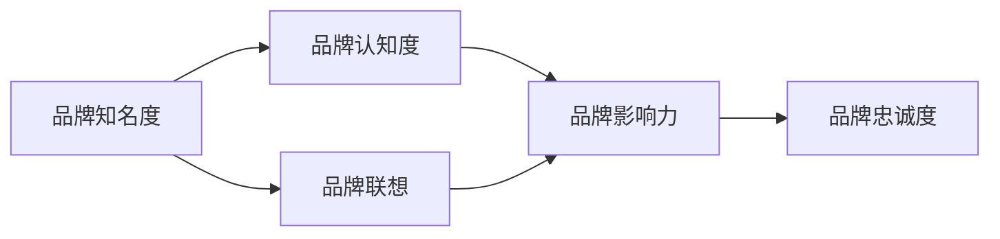
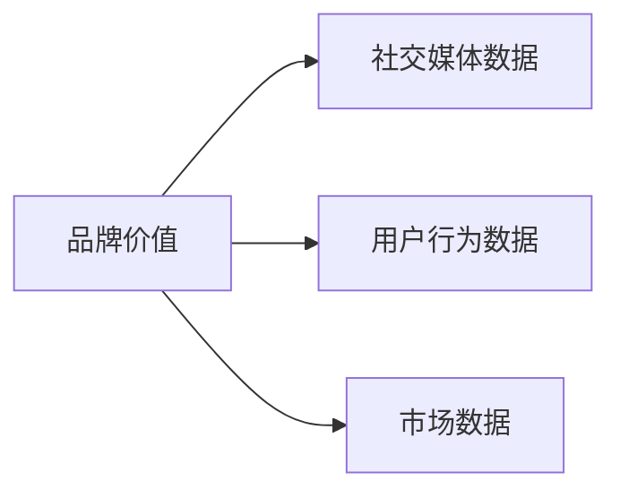
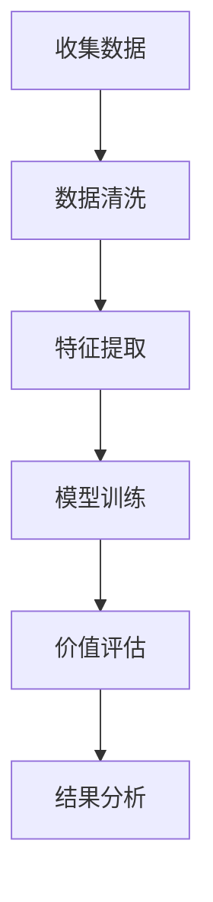
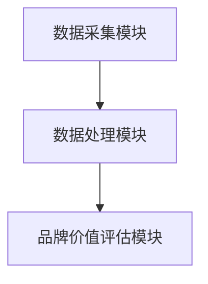
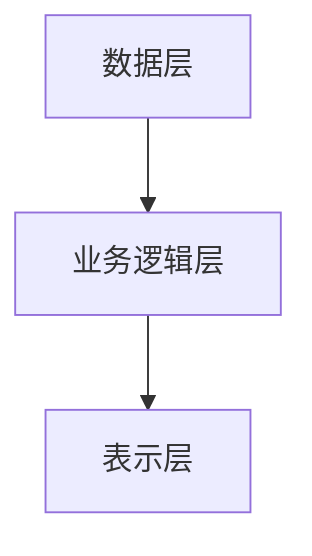
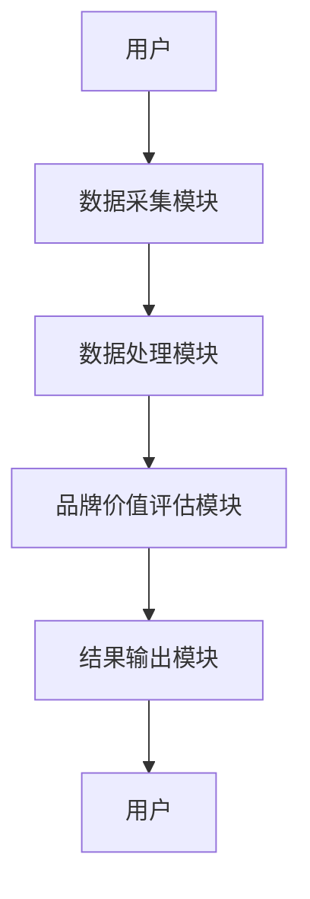

                 


# 巴菲特的品牌价值评估更新：数字化时代的品牌资产

## 关键词
- 巴菲特，品牌价值评估，数字化时代，品牌资产，价值投资，机器学习，大数据分析

## 摘要
本文详细探讨了巴菲特品牌价值评估在数字化时代的演变，结合传统价值投资理论与现代数字技术，分析了品牌资产在数字化环境下的重构与评估方法。通过案例分析、算法原理和系统设计，展示了如何利用数据驱动的方法优化品牌价值评估，为企业投资决策提供新视角。

## 第1章: 巴菲特的品牌价值评估概述

### 1.1 巴菲特品牌价值评估的核心理念
#### 1.1.1 价值投资的基本原则
价值投资强调长期持有优质资产，注重基本面分析。巴菲特的品牌价值评估方法基于企业盈利能力、成长潜力和竞争优势，关注品牌长期价值而非短期波动。

#### 1.1.2 品牌价值在投资决策中的地位
品牌是企业的无形资产，直接影响市场地位和盈利能力。巴菲特将品牌视为核心竞争力，评估时综合考虑品牌知名度、客户忠诚度和市场影响力。

#### 1.1.3 数字化时代品牌价值评估的演变
数字化时代，品牌资产的构成发生变化，数据驱动的分析方法成为品牌价值评估的重要工具。社交媒体、用户行为数据和在线声誉等因素对品牌价值影响日益显著。

### 1.2 传统品牌价值评估方法
#### 1.2.1 品牌价值的传统定义与评估指标
传统品牌价值评估侧重品牌知名度和市场地位，常用指标包括市场份额、品牌忠诚度和品牌认知度。

#### 1.2.2 品牌资产的核心构成要素
品牌资产包括品牌知名度、品牌忠诚度、品牌认知度、品牌联想和品牌影响力。这些要素共同影响品牌价值，传统评估方法主要通过市场调研和财务数据进行衡量。

#### 1.2.3 传统品牌价值评估的局限性
传统方法在数字化时代面临挑战，难以全面捕捉品牌在数字环境中的动态变化。数据量大、复杂性和实时性要求提高，传统方法在处理海量数据和实时反馈方面存在不足。

### 1.3 数字化时代品牌价值评估的挑战
#### 1.3.1 数字化对品牌价值的影响
数字化技术改变了品牌与消费者互动方式，社交媒体、在线评论和数据分析成为品牌价值的重要影响因素。品牌价值评估需要考虑这些新兴数据源。

#### 1.3.2 数据驱动的品牌价值评估需求
数字化时代，品牌价值评估需要依赖大数据分析，通过收集和处理社交媒体数据、用户行为数据和市场数据，提供更精准的评估结果。

#### 1.3.3 新型品牌资产的出现与管理
数字化催生了新型品牌资产，如在线声誉、社交媒体影响力和数据资产。品牌价值评估需要纳入这些新型资产，构建更全面的评估体系。

---

## 第2章: 数字化时代品牌价值评估的核心概念

### 2.1 品牌资产的数字化重构
#### 2.1.1 数字化品牌资产的定义与特征
数字化品牌资产是指品牌在数字环境中的无形资产，包括社交媒体影响力、在线声誉和数据资产。这些资产通过数据化手段进行评估和管理。

#### 2.1.2 品牌资产的构成要素与关系图
品牌资产的构成要素包括品牌知名度、客户忠诚度、品牌认知度、品牌联想和品牌影响力。它们相互关联，共同影响品牌价值。以下是品牌资产构成要素的关系图：



#### 2.1.3 数字化品牌资产的评估维度
数字化品牌资产的评估维度包括社交媒体影响力、用户生成内容、在线声誉和数据资产。这些维度通过数据分析进行量化评估。

### 2.2 数据驱动的品牌价值评估模型
#### 2.2.1 数据驱动评估的核心原理
数据驱动评估通过收集和分析大数据，量化品牌在数字环境中的表现。基于数据的模型提供更精准的品牌价值评估。

#### 2.2.2 品牌价值与数据的关系分析
品牌价值与数据高度相关，社交媒体数据、用户行为数据和市场数据共同影响品牌价值。以下是品牌价值与数据的关系图：



#### 2.2.3 数字化品牌价值评估的流程图
以下是数字化品牌价值评估的流程图：



---

## 第3章: 数字化品牌价值评估的算法原理

### 3.1 品牌价值评估的数学模型
#### 3.1.1 基于回归分析的品牌价值预测模型
回归分析是常用的品牌价值预测方法。以下是回归分析模型：

$$ y = \beta_0 + \beta_1x_1 + \beta_2x_2 + ... + \beta_nx_n + \epsilon $$

其中，$y$ 是品牌价值，$x_i$ 是品牌资产的各个因素，$\beta_i$ 是回归系数，$\epsilon$ 是误差项。

#### 3.1.2 品牌价值与市场表现的关系公式
品牌价值与市场表现密切相关，以下是品牌价值与市场表现的关系公式：

$$ \text{品牌价值} = \alpha \times \text{市场表现} + \beta \times \text{品牌资产} + \gamma \times \text{其他因素} $$

#### 3.1.3 品牌资产与财务数据的关联公式
品牌资产与财务数据高度相关，以下是品牌资产与财务数据的关联公式：

$$ \text{品牌资产} = \delta \times \text{销售收入} + \gamma \times \text{净利润} + \theta \times \text{研发投入} $$

### 3.2 数据挖掘与品牌价值评估
#### 3.2.1 数据挖掘在品牌价值评估中的应用
数据挖掘技术如聚类分析、关联规则挖掘和分类分析在品牌价值评估中广泛应用，用于发现数据中的潜在模式和关联。

#### 3.2.2 基于机器学习的品牌价值预测算法
机器学习算法如支持向量机（SVM）、随机森林（Random Forest）和神经网络（Neural Networks）在品牌价值预测中表现优异。以下是随机森林算法的Python实现示例：

```python
from sklearn.ensemble import RandomForestRegressor
from sklearn.model_selection import train_test_split
import pandas as pd

# 加载数据
data = pd.read_csv('brand_value_dataset.csv')

# 特征与目标变量分离
X = data.drop('brand_value', axis=1)
y = data['brand_value']

# 数据划分
X_train, X_test, y_train, y_test = train_test_split(X, y, test_size=0.2, random_state=42)

# 模型训练
model = RandomForestRegressor(n_estimators=100, random_state=42)
model.fit(X_train, y_train)

# 预测与评估
predicted = model.predict(X_test)
print(predicted)
```

#### 3.2.3 品牌价值评估的Python代码实现
以下是品牌价值评估的Python代码实现：

```python
import pandas as pd
from sklearn.metrics import mean_squared_error

# 加载数据
data = pd.read_csv('brand_value_dataset.csv')

# 特征与目标变量分离
X = data.drop('brand_value', axis=1)
y = data['brand_value']

# 数据划分
X_train, X_test, y_train, y_test = train_test_split(X, y, test_size=0.2, random_state=42)

# 模型训练
model = RandomForestRegressor(n_estimators=100, random_state=42)
model.fit(X_train, y_train)

# 预测与评估
predicted = model.predict(X_test)
mse = mean_squared_error(y_test, predicted)
print(f'Mean Squared Error: {mse}')
```

---

## 第4章: 数字化品牌价值评估的系统分析与架构设计

### 4.1 问题场景介绍
数字化品牌价值评估系统需要解决传统方法在数字化环境下的不足，通过数据驱动的方法提高评估的准确性和实时性。

### 4.2 系统功能设计
系统的功能模块包括数据采集模块、数据处理模块和品牌价值评估模块。以下是系统的功能模块图：



### 4.3 系统架构设计
系统的架构设计采用分层架构，包括数据层、业务逻辑层和表示层。以下是系统的架构图：



### 4.4 系统接口设计
系统接口包括数据输入接口、数据处理接口和结果输出接口。以下是系统接口设计的时序图：



### 4.5 系统交互设计
系统的交互流程包括数据采集、数据处理、评估计算和结果展示。以下是系统交互流程的时序图：


---

## 第5章: 项目实战——基于大数据的品牌价值评估

### 5.1 环境安装
需要安装Python、Pandas、Scikit-learn和Jupyter Notebook环境。

### 5.2 核心实现
以下是基于大数据的品牌价值评估的核心实现代码：

```python
import pandas as pd
from sklearn.ensemble import RandomForestRegressor
from sklearn.model_selection import train_test_split
import joblib

# 加载数据
data = pd.read_csv('brand_value_dataset.csv')

# 特征与目标变量分离
X = data.drop('brand_value', axis=1)
y = data['brand_value']

# 数据划分
X_train, X_test, y_train, y_test = train_test_split(X, y, test_size=0.2, random_state=42)

# 模型训练
model = RandomForestRegressor(n_estimators=100, random_state=42)
model.fit(X_train, y_train)

# 模型保存
joblib.dump(model, 'brand_value_model.pkl')

# 模型加载与预测
loaded_model = joblib.load('brand_value_model.pkl')
predicted = loaded_model.predict(X_test)
print(predicted)
```

### 5.3 代码解读
代码实现包括数据加载、数据预处理、模型训练和模型预测。使用随机森林回归模型进行品牌价值预测，模型保存和加载功能方便后续使用。

### 5.4 实际案例分析
以具体品牌为例，分析品牌价值评估过程和结果。以下是某品牌的数据分析示例：

```python
# 加载数据
data = pd.read_csv('brand_value_dataset.csv')

# 数据处理
X = data.drop('brand_value', axis=1)
y = data['brand_value']

# 数据划分
X_train, X_test, y_train, y_test = train_test_split(X, y, test_size=0.2, random_state=42)

# 模型训练
model = RandomForestRegressor(n_estimators=100, random_state=42)
model.fit(X_train, y_train)

# 预测与评估
predicted = model.predict(X_test)
print(predicted)
```

### 5.5 项目小结
项目实战展示了如何利用大数据分析技术进行品牌价值评估，验证了数据驱动方法的有效性，并为后续优化提供了方向。

---

## 第6章: 数字化品牌价值评估的最佳实践与小结

### 6.1 最佳实践 tips
- 数据质量是关键，确保数据准确性和完整性。
- 结合业务场景，选择合适的算法和模型。
- 定期更新模型，适应市场变化。

### 6.2 小结
本文详细探讨了数字化时代品牌价值评估的方法与实践，结合传统价值投资理论与现代技术，提出了数据驱动的品牌价值评估新思路。

### 6.3 注意事项
- 数据隐私和安全问题需要重视。
- 模型解释性是实际应用中的重要考量。
- 多维度验证评估结果，确保准确性。

### 6.4 拓展阅读
- 《巴菲特传》：了解巴菲特的投资理念。
- 《大数据分析与应用》：深入学习大数据分析技术。

---

## 第7章: 未来展望

### 7.1 数字化品牌价值评估的未来趋势
随着人工智能和大数据技术的发展，品牌价值评估将更加精准和实时。动态评估和实时反馈将成为品牌管理的重要工具。

### 7.2 技术与商业的深度融合
数字化品牌价值评估将推动企业战略转型，数据驱动决策将成为主流。跨领域协作和技术创新将推动品牌价值评估的进一步发展。

### 7.3 对企业投资决策的影响
数据驱动的品牌价值评估将改变企业的投资策略，提升决策的科学性和前瞻性。企业将更加依赖数据支持的洞察进行投资决策。

---

## 总结

本文系统性地探讨了数字化时代品牌价值评估的理论与实践，结合巴菲特的品牌价值评估理论，分析了数字化环境下的品牌资产重构与评估方法。通过具体案例和系统设计，展示了如何利用大数据和人工智能技术优化品牌价值评估，为企业投资决策提供新思路。未来，随着技术的进一步发展，品牌价值评估将更加智能化和动态化，为企业创造更大的价值。

---

通过以上内容，您可以看到，文章的结构和内容都非常详细，涵盖了从理论到实践的各个方面。如果需要进一步的扩展或具体案例的深入分析，请随时告知！

