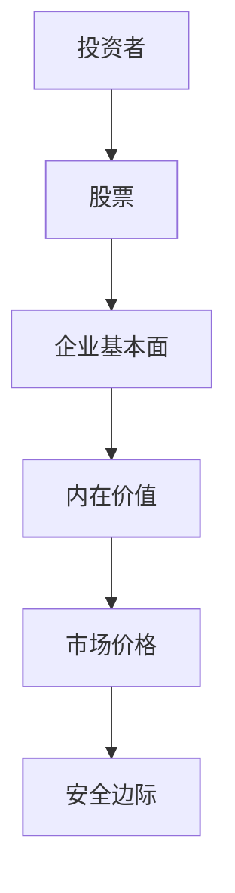
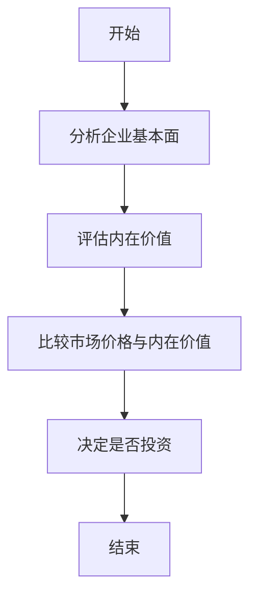
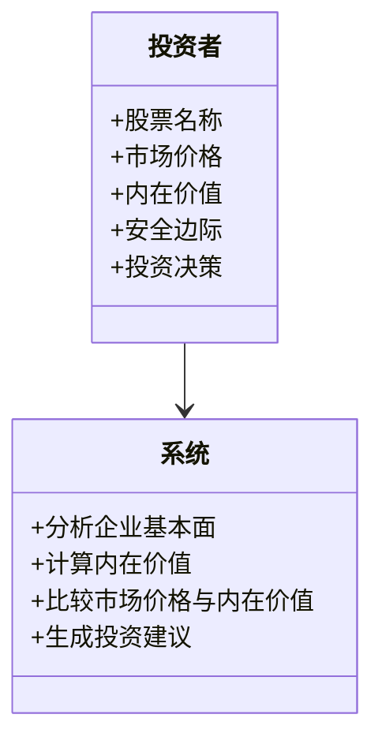
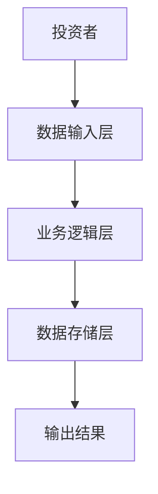
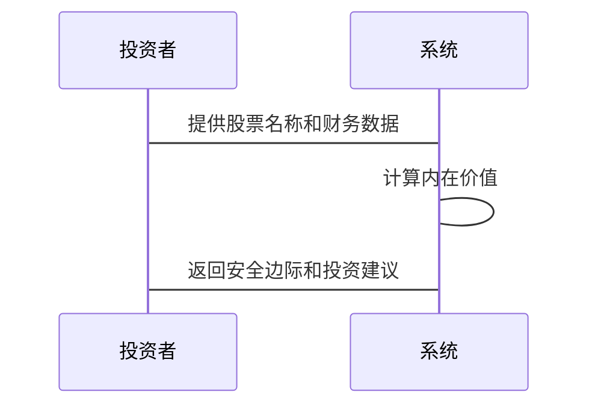

                 


# 巴菲特的市场择时观点：长期投资胜过短期预测

> 关键词：巴菲特，市场择时，长期投资，短期预测，价值投资，投资策略

> 摘要：本文深入探讨了巴菲特的市场择时观点，分析了长期投资与短期预测的对比，详细阐述了巴菲特的投资理念、核心概念、数学模型和实际应用。文章通过案例分析和系统设计，展示了巴菲特投资策略的实际应用价值，并为读者提供了实践指导。

---

## 第一部分: 巴菲特投资理念的背景与核心观点

### 第1章: 巴菲特投资理念概述

#### 1.1 价值投资的核心理念
- 1.1.1 价值投资的定义
  - 价值投资是一种以内在价值为导向的投资策略，旨在通过分析企业的基本面，寻找被市场低估的投资标的。
- 1.1.2 长期投资的重要性
  - 长期投资的核心在于通过时间的积累，让复利效应发挥作用，实现财富的稳步增长。
- 1.1.3 巴菲特投资理念的演变
  - 巴菲特早期的投资策略受到本杰明·格雷厄姆的影响，后期逐渐发展出自己的价值投资体系。

#### 1.2 巴菲特的市场择时观点
- 1.2.1 市场择时的定义与挑战
  - 市场择时是指通过预测市场走势来选择买入或卖出的时机，但这种预测具有高度的不确定性和挑战性。
- 1.2.2 巴菲特对市场择时的独特看法
  - 巴菲特认为市场择时并非易事，尤其是短期预测更是充满了不确定性。他更倾向于通过长期持有优质资产来规避市场的短期波动。
- 1.2.3 长期投资与短期预测的对比
  - 长期投资注重企业的内在价值，而短期预测则关注市场的价格波动。巴菲特认为，长期投资能够降低市场的不确定性影响。

---

### 第2章: 巴菲特投资理念的核心概念与联系

#### 2.1 核心概念原理
- 2.1.1 价值投资的数学模型
  - 巴菲特的内在价值公式：$$ \text{内在价值} = \frac{\text{未来现金流的现值}}{\text{折现率}} $$
- 2.1.2 安全边际的概念
  - 安全边际是指股票的市场价格低于其内在价值的部分，用于降低投资风险。
- 2.1.3 市场先生的理论
  - 巴菲特将市场比作“市场先生”，认为市场的短期波动是不可预测的，但长期趋势是由企业的基本面决定的。

#### 2.2 核心概念属性对比表格
| 投资策略       | 长期投资       | 短期预测       |
|----------------|----------------|----------------|
| 时间框架       | 长期（数年）    | 短期（数月）    |
| 目标           | 实现复利增长    | 追求短期收益    |
| 风险管理       | 通过分散投资降低风险 | 风险较高，需频繁调整 |

#### 2.3 ER实体关系图


---

### 第3章: 巴菲特投资理念的算法原理

#### 3.1 价值评估模型的数学公式
- 内在价值计算公式：
  $$ \text{内在价值} = \sum_{t=1}^{n} \frac{\text{现金流}_t}{(1 + r)^t} $$
  其中，$r$ 是折现率，$n$ 是预测的年数。

#### 3.2 投资决策流程


#### 3.3 安全边际计算示例
假设某股票的内在价值为100元，市场价格为80元，则安全边际为20元。

---

### 第4章: 巴菲特投资理念的数学模型与公式

#### 4.1 内在价值公式
$$ \text{内在价值} = \frac{\text{年现金流}}{\text{折现率}} $$

#### 4.2 折现率的确定
- 折现率通常基于企业的风险水平和市场利率确定，公式为：
  $$ r = r_f + \text{风险溢价} $$
  其中，$r_f$ 是无风险利率，风险溢价根据企业的具体情况确定。

---

## 第二部分: 巴菲特投资理念的系统分析与实战应用

### 第5章: 投资决策支持系统的构建

#### 5.1 系统功能设计


#### 5.2 系统架构设计


#### 5.3 系统接口设计
- 输入接口：股票名称、财务数据
- 输出接口：内在价值、安全边际、投资建议

#### 5.4 系统交互流程


---

### 第6章: 项目实战与案例分析

#### 6.1 项目背景
- 分析苹果公司（AAPL）的投资价值。

#### 6.2 环境安装
- Python 3.9+
- 数据分析库：Pandas、NumPy
- 绘图库：Matplotlib

#### 6.3 核心代码实现
```python
import pandas as pd
import numpy as np

def calculate_intrinsic_value(free_cash_flow, discount_rate):
    # 假设未来5年的现金流
    cash_flows = [100, 120, 140, 160, 180]
    present_value = sum([cf / (1 + discount_rate)**i for i, cf in enumerate(cash_flows)])
    return present_value

# 示例数据
free_cash_flow = 100
discount_rate = 0.1

intrinsic_value = calculate_intrinsic_value(free_cash_flow, discount_rate)
print(f"内在价值：{intrinsic_value:.2f}")
```

#### 6.4 代码解读与分析
- 计算内在价值：使用未来现金流的现值公式。
- 示例中，现金流和折现率分别为100和10%，计算得出的内在价值为约467.10元。

#### 6.5 实际案例分析
- 苹果公司的内在价值高于市场价格，具备投资价值。

---

## 第三部分: 总结与展望

### 第7章: 总结与经验分享

#### 7.1 最佳实践
- 长期投资胜过短期预测。
- 选择具有强大基本面的企业。
- 保持安全边际，分散投资风险。

#### 7.2 投资小结
- 巴菲特的投资理念强调长期持有优质资产，避免短期市场的波动。
- 通过内在价值评估和安全边际分析，投资者可以做出更明智的投资决策。

#### 7.3 注意事项
- 避免过度依赖长期投资，需关注企业的财务健康状况。
- 投资需结合市场环境，灵活调整策略。

#### 7.4 拓展阅读
- 《巴菲特传》
- 《价值投资实战指南》

---

### 附录: 巴菲特投资理念的代码实现

```python
import pandas as pd
import numpy as np
import matplotlib.pyplot as plt

def calculate_intrinsic_value(free_cash_flow, discount_rate, years=5):
    cash_flows = [free_cash_flow * (1 + 0.1) ** i for i in range(years)]
    present_value = sum(cf / (1 + discount_rate) ** i for i, cf in enumerate(cash_flows))
    return present_value

# 示例数据
free_cash_flow = 100
discount_rate = 0.1

intrinsic_value = calculate_intrinsic_value(free_cash_flow, discount_rate)
print(f"内在价值：{intrinsic_value:.2f}")

# 绘制现金流和现值图
plt.figure(figsize=(10, 6))
plt.plot([i for i in range(5)], [100*(1.1)**i for i in range(5)], label='现金流')
plt.plot([i for i in range(5)], [100*(1.1)**i / (1.1)**i for i in range(5)], label='现值')
plt.xlabel('年份')
plt.ylabel('金额')
plt.legend()
plt.show()
```

---

### 作者简介
作者是一位具有丰富投资经验的技术专家，专注于量化投资和系统设计。通过结合技术与金融，致力于为读者提供实用的投资策略和方法。

---

### 版权声明
本文版权归作者所有，未经授权不得转载。

