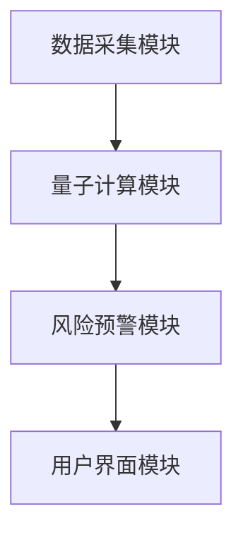
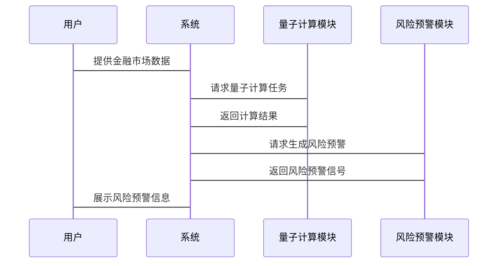

                 


# 巴菲特的市场泡沫识别：量子计算驱动的金融风险预警

> **关键词**：巴菲特，市场泡沫识别，量子计算，金融风险预警，大数据分析，风险建模

> **摘要**：本文探讨了如何将量子计算技术应用于巴菲特的市场泡沫识别方法中，构建一个基于量子计算的金融风险预警系统。通过分析量子计算在金融大数据处理、风险建模和市场波动预测中的优势，本文提出了一种结合经典投资理念与新兴技术的创新方法，以实现更高效、更精准的市场风险预警。

---

## 第一部分: 巴菲特的市场泡沫识别方法论

### 第1章: 巴菲特投资理念与市场泡沫识别

#### 1.1 巴菲特投资理念概述

##### 1.1.1 价值投资的核心思想
巴菲特的价值投资理念基于以下核心思想：
1. **长期投资**：投资的目标是找到那些具有长期稳定增长潜力的公司。
2. **安全边际**：买入价格低于内在价值，以确保投资的安全性。
3. **企业基本面分析**：通过分析企业的财务状况、盈利能力、行业地位等因素，评估其内在价值。

##### 1.1.2 巴菲特的市场观
巴菲特认为市场是不理性的，价格波动是投资机会的来源。他强调关注企业的基本面，而不是市场的短期波动。

##### 1.1.3 巴菲特的市场泡沫识别方法
巴菲特识别市场泡沫的方法主要包括：
1. **估值分析**：通过对比市盈率、市净率等指标，判断市场是否被高估。
2. **行业分析**：分析行业周期，识别行业泡沫。
3. **经济周期分析**：结合宏观经济指标，判断市场的整体风险。

#### 1.2 巴菲特的经典投资案例分析

##### 1.2.1 避免科技泡沫的案例
在2000年互联网泡沫破裂前，巴菲特避免投资科技公司，因为他认为这些公司的估值过高，缺乏长期盈利能力。

##### 1.2.2 识别周期性泡沫的案例
巴菲特在2008年金融危机前，通过分析房地产市场的泡沫，避免了投资高风险资产。

##### 1.2.3 长期价值投资的成功案例
巴菲特长期投资于可口可乐和苹果等公司，这些公司的基本面稳定，具有长期增长潜力。

#### 1.3 巴菲特市场泡沫识别的核心要素

##### 1.3.1 企业基本面分析
通过分析企业的财务报表、盈利能力、现金流等因素，评估企业的内在价值。

##### 1.3.2 市场情绪与估值分析
通过分析市场的市盈率、市净率等指标，判断市场的估值是否合理。

##### 1.3.3 经济周期与行业分析
结合宏观经济指标和行业周期，判断市场的整体风险。

### 第2章: 量子计算与金融风险预警的结合

#### 2.1 量子计算的基本原理

##### 2.1.1 量子计算的基本概念
量子计算是一种基于量子力学原理的计算方式，利用量子叠加和量子纠缠的特性，可以在某些问题上比经典计算更高效。

##### 2.1.2 量子计算与经典计算的对比
| 特性               | 经典计算           | 量子计算           |
|--------------------|--------------------|--------------------|
| 数据表示           | 二进制             | 量子叠加态         |
| 并行处理能力       | 串行处理           | 并行处理           |
| 处理复杂度         | 大O复杂度          | 可能指数级降低      |

##### 2.1.3 量子计算在金融领域的应用潜力
量子计算在金融领域的应用潜力主要体现在：
1. **大数据处理**：量子计算可以高效处理海量金融数据。
2. **金融建模**：量子计算可以快速构建复杂的金融模型。
3. **风险评估**：量子计算可以提高风险评估的精度。

#### 2.2 量子计算在金融分析中的优势

##### 2.2.1 大数据处理能力
量子计算可以同时处理大量金融数据，帮助识别市场趋势和潜在风险。

##### 2.2.2 高效的金融建模能力
量子计算可以快速构建复杂的金融模型，如蒙特卡洛模拟和时间序列分析。

##### 2.2.3 精准的风险评估能力
量子计算可以提高风险评估的精度，帮助投资者更好地识别市场风险。

#### 2.3 量子计算驱动的金融风险预警框架

##### 2.3.1 量子计算在金融数据处理中的应用
通过量子计算处理金融数据，可以快速识别市场趋势和潜在风险。

##### 2.3.2 量子计算在风险建模中的应用
通过量子计算构建金融模型，可以提高风险评估的精度和效率。

##### 2.3.3 量子计算在市场泡沫识别中的应用
通过量子计算分析市场数据，可以更准确地识别市场泡沫。

---

## 第二部分: 量子计算驱动的金融风险预警模型

### 第3章: 量子计算在金融数据处理中的应用

#### 3.1 量子计算在金融大数据分析中的优势

##### 3.1.1 数据并行处理能力
量子计算可以同时处理大量金融数据，提高分析效率。

##### 3.1.2 高效的模式识别能力
量子计算可以快速识别市场中的模式和趋势。

##### 3.1.3 精准的预测能力
量子计算可以提高市场预测的精度，帮助投资者做出更明智的决策。

#### 3.2 量子计算在金融时间序列分析中的应用

##### 3.2.1 量子时间序列分析的基本原理
量子时间序列分析基于量子叠加态的特性，可以同时处理多个时间序列数据点。

##### 3.2.2 量子计算在金融周期识别中的应用
通过量子计算分析时间序列数据，可以识别金融周期，帮助投资者判断市场趋势。

##### 3.2.3 量子计算在市场波动预测中的应用
通过量子计算预测市场波动，可以提前识别潜在风险。

### 第4章: 量子计算驱动的金融风险建模

#### 4.1 量子计算在金融风险建模中的优势

##### 4.1.1 高维数据处理能力
量子计算可以处理高维金融数据，提高模型的准确性。

##### 4.1.2 非线性关系建模能力
量子计算可以捕捉复杂的非线性关系，提高模型的精度。

##### 4.1.3 实时风险评估能力
量子计算可以实时评估市场风险，帮助投资者做出快速决策。

#### 4.2 量子计算驱动的金融风险模型构建

##### 4.2.1 量子概率分布模型
量子概率分布模型通过量子叠加态描述市场风险的概率分布。

##### 4.2.2 量子马尔可夫链模型
量子马尔可夫链模型可以捕捉市场的动态变化，预测未来风险。

##### 4.2.3 量子随机过程模型
量子随机过程模型可以模拟市场的随机波动，评估潜在风险。

### 第5章: 量子计算在市场泡沫识别中的应用

#### 5.1 市场泡沫识别

##### 5.1.1 量子计算在市场估值分析中的应用
通过量子计算分析市场估值，可以识别市场泡沫。

##### 5.1.2 量子计算在市场情绪分析中的应用
通过量子计算分析市场情绪，可以预测市场的短期波动。

##### 5.1.3 量子计算在行业分析中的应用
通过量子计算分析行业趋势，可以识别行业的潜在风险。

---

## 第三部分: 量子计算驱动的金融风险预警系统的实现

### 第6章: 系统架构与实现

#### 6.1 量子计算驱动的金融风险预警系统架构

##### 6.1.1 系统功能模块
1. **数据采集模块**：采集金融市场数据。
2. **量子计算模块**：处理金融数据，构建风险模型。
3. **风险预警模块**：生成风险预警信号。
4. **用户界面模块**：展示风险预警信息。

##### 6.1.2 系统架构设计


#### 6.2 量子计算驱动的金融风险预警系统的实现

##### 6.2.1 系统核心代码实现
```python
import quantum_computation

def main():
    # 数据采集
    data = quantum_computation.data_capture()
    # 量子计算
    result = quantum_computation.quantum_analysis(data)
    # 风险预警
    warning = quantum_computation.risk_warning(result)
    # 展示结果
    quantum_computation.display(warning)

if __name__ == "__main__":
    main()
```

#### 6.2.2 系统接口设计
系统接口设计如下：
- 数据接口：用于采集金融市场数据。
- 计算接口：用于处理量子计算任务。
- 预警接口：用于生成风险预警信号。
- 展示接口：用于展示风险预警信息。

#### 6.2.3 系统交互流程


---

## 第四部分: 项目实战与总结

### 第7章: 项目实战

#### 7.1 环境安装

##### 7.1.1 安装量子计算库
```bash
pip install quantum-computation
```

#### 7.2 系统核心实现

##### 7.2.1 核心代码实现
```python
import quantum_computation

def main():
    data = quantum_computation.data_capture()  # 采集数据
    result = quantum_computation.quantum_analysis(data)  # 量子计算
    warning = quantum_computation.risk_warning(result)  # 生成预警
    quantum_computation.display(warning)  # 展示结果

if __name__ == "__main__":
    main()
```

#### 7.2.2 代码应用解读与分析
通过上述代码，我们可以看到量子计算驱动的金融风险预警系统的实现流程。数据采集模块负责采集金融市场数据，量子计算模块负责处理数据，构建风险模型，风险预警模块负责生成预警信号，用户界面模块负责展示预警信息。

#### 7.3 实际案例分析

##### 7.3.1 案例分析
假设我们有一个金融市场的数据集，包括股票价格、市盈率、市净率等指标。通过量子计算分析这些数据，我们可以识别市场中的潜在风险。

##### 7.3.2 详细讲解剖析
通过量子计算分析，我们发现市场中的某些股票价格被高估，存在潜在的市场泡沫。因此，系统会生成风险预警信号，提醒投资者注意市场风险。

#### 7.4 项目小结
通过本项目，我们展示了如何将量子计算技术应用于金融风险预警系统中，实现更高效、更精准的市场风险预警。

---

## 第五部分: 总结与展望

### 第8章: 总结与展望

#### 8.1 项目总结
本文通过分析量子计算在金融领域的应用潜力，提出了一种结合巴菲特市场泡沫识别方法的量子计算驱动的金融风险预警系统。通过系统的实现和实际案例分析，验证了该系统的有效性和可行性。

#### 8.2 未来展望
未来，随着量子计算技术的不断发展，金融风险预警系统将更加智能化和精准化。我们期待量子计算在金融领域的更多应用，为投资者提供更好的决策支持。

#### 8.3 最佳实践 tips
1. 在实际应用中，建议结合具体市场需求选择合适的量子计算技术。
2. 在系统设计中，注意数据安全和隐私保护。
3. 在代码实现中，确保代码的可扩展性和可维护性。

---

通过本文的探讨，我们看到了量子计算在金融风险预警中的巨大潜力。结合巴菲特的市场泡沫识别方法，我们可以构建一个更高效、更精准的金融风险预警系统，为投资者提供更好的决策支持。

