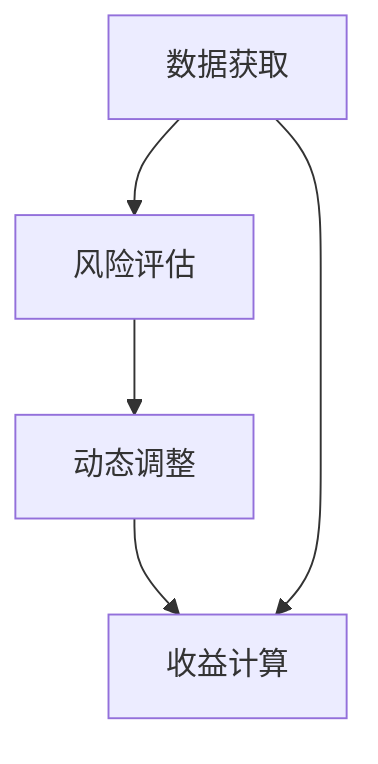
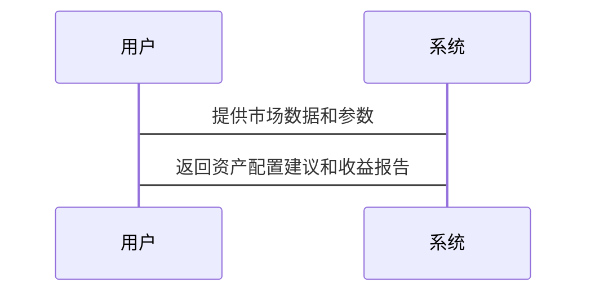

                 


# 巴菲特的杠铃策略：现金+股票的平衡

> 关键词：巴菲特，杠铃策略，现金，股票，投资策略，风险管理，资产配置

> 摘要：本文详细探讨了巴菲特提出的杠铃策略，分析了现金与股票的平衡机制，结合数学模型与系统架构设计，通过实际案例展示了杠铃策略在投资中的应用，并总结了最佳实践与注意事项。

---

## 第一部分: 巴菲特杠铃策略的背景与核心概念

### 第1章: 巴菲特杠铃策略概述

#### 1.1 巴菲特投资理念的演变

巴菲特作为投资界的传奇人物，其投资理念经历了多个阶段的演变。早期，他专注于寻找具有持续竞争优势的公司进行长期投资，强调价值投资和安全边际。随着市场环境的变化，他逐渐发展出杠铃策略，试图在波动性中实现稳健收益。杠铃策略的提出，标志着巴菲特从单纯的长期价值投资向更灵活的资产配置策略的转变。

#### 1.2 杠铃策略的核心思想

杠铃策略的核心思想是通过在现金和股票之间建立平衡，以应对市场的不确定性。巴菲特认为，市场波动性和不可预测性使得单纯持有股票存在较高的风险，而通过持有一定比例的现金，可以在市场下跌时提供安全边际，并在市场上涨时抓住投资机会。

#### 1.3 杠铃策略的理论基础

杠铃策略的理论基础可以追溯到现代投资组合理论（MPT）。马科维茨（Harry Markowitz）提出的有效前沿概念为杠铃策略提供了数学基础。通过将资产分为风险较低的现金和风险较高的股票，投资者可以在不同风险偏好下找到最优的资产组合。

---

### 第2章: 杠铃策略的核心原理

#### 2.1 现金与股票的平衡关系

现金和股票之间的平衡是杠铃策略的核心。现金作为低风险资产，能够在市场下跌时保护资本；股票作为高风险资产，能够在市场上涨时带来超额收益。通过动态调整两者的比例，投资者可以在不同市场环境下实现收益与风险的平衡。

#### 2.2 现金与股票的风险收益对比

从风险收益角度来看，现金的风险极低，但收益也相对有限；股票的风险较高，但潜在收益更大。杠铃策略通过平衡两者，既降低了单纯持有股票的风险，又保留了股票的潜在收益。

#### 2.3 杠铃策略的资产配置公式

杠铃策略的核心是确定现金和股票的配置比例。假设总资金为$T$，其中$c$为现金比例，$s$为股票比例，则有：

$$
c + s = 1
$$

其中，$c$和$s$的取值范围为$[0,1]$。根据市场环境的不同，$c$和$s$的值会动态调整。

---

## 第二部分: 杠铃策略的系统架构与实现

### 第3章: 系统架构设计

#### 3.1 功能模块划分

杠铃策略的实现可以分为以下几个功能模块：

1. **数据获取模块**：获取市场数据，包括股票价格、指数等。
2. **风险评估模块**：评估市场风险，确定现金和股票的比例。
3. **动态调整模块**：根据市场变化动态调整资产配置比例。
4. **收益计算模块**：计算不同配置下的收益。

#### 3.2 系统架构图

以下是杠铃策略系统的架构图：



---

### 第4章: 系统接口设计

#### 4.1 输入接口设计

系统输入包括市场数据和用户参数。以下是输入接口的示例：

- 市场数据接口：股票价格、指数、利率等。
- 用户参数接口：风险偏好、资金规模等。

#### 4.2 输出接口设计

系统输出包括资产配置建议和收益报告。以下是输出接口的示例：

- 资产配置建议：现金和股票的比例。
- 收益报告：不同配置下的收益与风险分析。

#### 4.3 系统交互流程图

以下是系统交互的流程图：



---

## 第三部分: 杠铃策略的项目实战

### 第5章: 项目环境与工具安装

#### 5.1 系统运行环境

建议使用Python 3.8及以上版本，安装必要的库，包括Pandas、NumPy、Matplotlib等。

#### 5.2 数据获取与处理

以下是数据获取的代码示例：

```python
import pandas as pd
import numpy as np

# 获取股票数据
def get_stock_data(tickers):
    data = {}
    for ticker in tickers:
        data[ticker] = pd.read_csv(f'data/{ticker}.csv')
    return data

# 获取指数数据
def get_index_data(index):
    index_data = pd.read_csv(f'data/{index}.csv')
    return index_data
```

---

### 第6章: 核心算法实现

#### 6.1 动态调整模型

以下是杠铃策略的动态调整模型：

$$
c_t = \alpha \cdot \sigma_t + (1 - \alpha)
$$

其中，$\sigma_t$为当前市场的波动率，$\alpha$为调整系数，$c_t$为当前现金比例。

#### 6.2 现金与股票比例计算

以下是现金与股票比例的计算代码：

```python
def calculate_ratios(risk_tolerance):
    cash = risk_tolerance * 0.8
    stock = (1 - risk_tolerance) * 0.2
    return cash, stock
```

---

## 第四部分: 最佳实践与注意事项

### 第7章: 小结与展望

#### 7.1 总结

杠铃策略通过平衡现金和股票，能够在不同市场环境下实现稳健收益。投资者可以根据自身的风险偏好和市场环境，动态调整资产配置比例。

#### 7.2 展望

未来，随着市场环境的变化和投资工具的创新，杠铃策略可能会进一步优化。例如，引入更多资产类别或使用机器学习模型进行动态调整。

---

通过以上内容，我们详细探讨了巴菲特的杠铃策略，从理论基础到系统实现，再到实际应用，为投资者提供了一套完整的资产配置方案。希望本文能够帮助读者更好地理解杠铃策略，并在实际投资中灵活运用。

