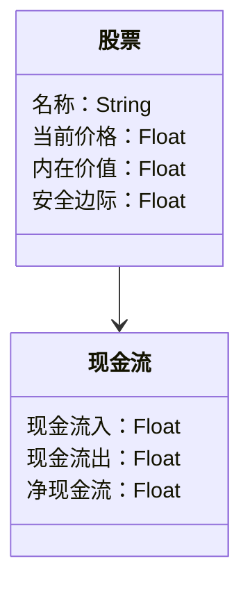

                 


# 巴菲特的现金管理哲学：保持充足的流动性

> 关键词：巴菲特，现金管理，流动性，价值投资，投资哲学，安全边际，资产配置

> 摘要：本文深入探讨了巴菲特的现金管理哲学，分析了其保持充足流动性的核心思想和策略。通过介绍巴菲特的投资哲学、现金管理的核心原则、数学模型与算法、系统架构设计，以及实际案例分析，本文旨在帮助读者理解如何在投资中保持稳健的现金流动性。

---

# 第1章 巴菲特的生平与投资哲学

## 1.1 巴菲特的早年经历
沃伦·巴菲特（Warren Buffett）于1934年8月31日出生在美国奥马哈市。他从小就展现出了对数字和金融的天赋，12岁时开始投资股票。巴菲特的父亲是律师，曾在股市 Crash of 1929中损失了大部分积蓄，这使得他对风险管理有了深刻的认识，并在巴菲特心中种下了对投资的浓厚兴趣。

## 1.2 巴菲特的投资哲学
巴菲特的投资哲学以“价值投资”为核心，强调寻找那些具有持续竞争优势、良好管理和合理估值的公司。他主张长期持有优质资产，并在市场恐慌时买入，而在市场狂热时卖出。

### 1.2.1 价值投资的核心理念
- **内在价值**：巴菲特认为，股票的价值取决于其未来现金流的现值。他通过分析公司的财务报表、行业地位和竞争优势来评估其内在价值。
- **安全边际**：为了避免投资失误，巴菲特强调在买入股票时，价格应显著低于其内在价值，留出足够的安全边际。

## 1.3 现金管理的重要性
巴菲特认为，现金是企业的“氧气”，没有足够的流动性，企业难以在危机中生存。他始终坚持保持充足的现金储备，以应对市场的不确定性。

---

# 第2章 巴菲特的现金管理策略

## 2.1 巴菲特的现金管理原则
### 2.1.1 现金储备的目的
- **应对突发事件**：在市场低迷或经济衰退时，现金可以用于回购股票或投资优质资产。
- **抓住投资机会**：充足的现金储备使巴菲特能够在市场底部买入优质资产，实现长期收益。

### 2.1.2 现金储备的规模
巴菲特通常会保留企业资产的10%至20%作为现金储备，以确保在市场波动时有足够的流动性。

### 2.1.3 现金储备的来源
- **盈利再投资**：通过公司利润积累现金。
- **债务融资**：在必要时，巴菲特也会通过发行债券或贷款来获取额外流动性。

## 2.2 巴菲特的流动性管理
### 2.2.1 流动性管理的核心思想
巴菲特认为，流动性管理的核心是平衡短期流动性需求和长期投资收益。他强调在保持充足流动性的同时，避免过度投资低收益资产。

### 2.2.2 流动性管理的具体策略
- **短期投资**：将部分现金投资于短期国债或高信用评级债券，确保流动性。
- **长期持有**：将大部分现金投资于优质股票，以实现长期收益。

## 2.3 巴菲特的现金分配策略
### 2.3.1 现金分配的基本原则
- **分散投资**：避免将所有资金投入单一资产，以降低风险。
- **长期视角**：注重长期收益，而非短期波动。

### 2.3.2 现金分配的决策流程
1. **评估市场环境**：分析当前市场趋势和经济状况。
2. **评估资产质量**：选择具有长期竞争优势的公司。
3. **确定投资比例**：根据现金流和资产规模，确定投资比例。

---

# 第3章 巴菲特的资产配置与风险管理

## 3.1 资产配置的基本原则
### 3.1.1 资产配置的定义与目的
资产配置是将资金分配到不同资产类别（如股票、债券、现金等）以优化风险和收益的过程。

### 3.1.2 资产配置的类型与比例
- **股票**：占投资组合的大部分，尤其是具有持续竞争优势的公司。
- **债券**：用于降低整体投资组合的风险。
- **现金**：保持一定比例的现金，以应对突发事件和投资机会。

## 3.2 巴菲特的风险管理策略
### 3.2.1 风险管理的核心思想
巴菲特强调通过分散投资和选择优质资产来降低风险。他认为，优质资产的风险较低，而低质量资产的风险较高。

### 3.2.2 风险管理的具体方法
- **分散投资**：将资金分配到不同行业和资产类别，降低行业风险。
- **严格选股**：选择具有强大竞争优势和良好管理的公司。

## 3.3 巴菲特的危机应对策略
### 3.3.1 危机中的现金管理
在经济危机期间，巴菲特通常会增加现金储备，等待市场恢复的机会。

### 3.3.2 危机中的资产调整
他会卖出表现不佳的资产，增加对优质资产的投资。

---

# 第4章 巴菲特现金管理的数学模型与算法

## 4.1 内在价值计算模型
巴菲特的内在价值计算公式为：
$$
\text{内在价值} = \frac{\text{盈利}}{\text{增长率}}
$$

### 4.1.1 算法步骤
1. 收集目标公司的财务数据。
2. 计算公司未来的预期现金流。
3. 将现金流贴现，计算其现值。
4. 比较现值与当前股价，确定是否具备安全边际。

## 4.2 安全边际评估算法
### 4.2.1 安全边际计算公式
$$
\text{安全边际} = \text{内在价值} - \text{市场价格}
$$

### 4.2.2 算法步骤
1. 计算目标公司的内在价值。
2. 比较内在价值与市场价格。
3. 如果内在价值显著高于市场价格，具备安全边际。

---

# 第5章 系统架构设计

## 5.1 问题场景介绍
为了模拟巴菲特的现金管理策略，我们设计一个基于现金流分析的投资系统。

## 5.2 系统功能设计
### 5.2.1 领域模型


## 5.3 系统架构设计


---

# 第6章 项目实战：基于巴菲特哲学的现金管理策略实现

## 6.1 环境安装
安装Python和必要的库（如Pandas、NumPy）。

## 6.2 核心实现代码
```python
import pandas as pd

def calculate_intrinsic_value(revenue, growth_rate):
    return revenue / growth_rate

def calculate_margin_of_safety(intrinsic_value, market_price):
    return intrinsic_value - market_price

# 示例数据
data = {
    '股票名称': ['股票A', '股票B'],
    '营收': [100, 150],
    '增长率': [0.1, 0.15],
    '市场价格': [50, 60]
}

df = pd.DataFrame(data)

df['内在价值'] = df.apply(lambda x: calculate_intrinsic_value(x['营收'], x['增长率']), axis=1)
df['安全边际'] = df.apply(lambda x: calculate_margin_of_safety(x['内在价值'], x['市场价格']), axis=1)

print(df)
```

## 6.3 实际案例分析
以股票A为例，计算其内在价值和安全边际。如果安全边际为正，建议买入；否则建议卖出。

---

# 第7章 最佳实践与小结

## 7.1 最佳实践
- **定期评估投资组合**：确保符合巴菲特的现金管理策略。
- **分散投资**：降低风险。
- **关注优质资产**：选择具有长期竞争优势的公司。

## 7.2 小结
巴菲特的现金管理哲学强调保持充足的流动性，通过价值投资和风险管理实现长期稳健的收益。投资者应灵活应用这些策略，根据市场变化调整投资组合。

## 7.3 注意事项
- 投资有风险，需谨慎评估。
- 市场波动可能导致策略调整。

## 7.4 拓展阅读
推荐阅读巴菲特的《聪明的投资者》和《投资最重要的简单真理》。

---

# 结语

通过本文的详细分析，我们深入探讨了巴菲特的现金管理哲学，从理论到实践，为读者提供了全面的指导。希望读者能够灵活应用这些策略，实现稳健的投资收益。

