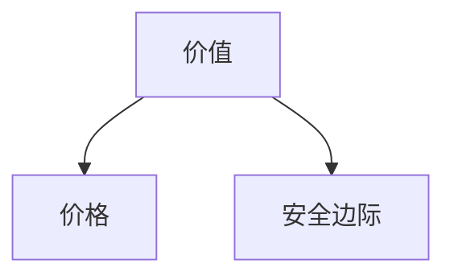
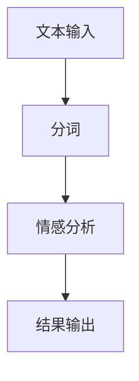
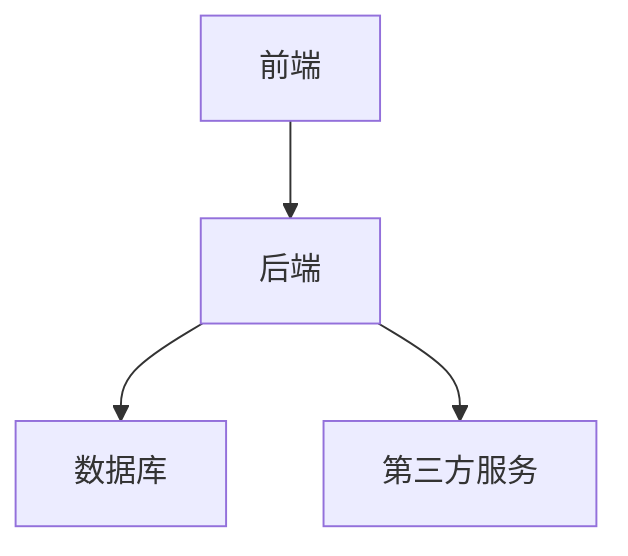
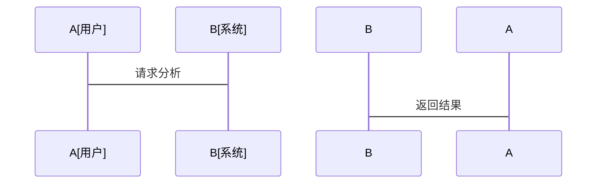

                 


```markdown
# 巴菲特的股东信：投资智慧的结晶

> 关键词：巴菲特，股东信，价值投资，投资策略，系统架构，项目实战，投资模型

> 摘要：本文将深入探讨巴菲特的股东信中的投资智慧，分析其背后的数学模型和系统架构，结合实际案例，提供详细的项目实现和最佳实践。

---

# 第一部分: 巴菲特的投资理念与股东信背景

## 第1章: 巴菲特的投资理念概述

### 1.1 巴菲特的价值投资理论

#### 1.1.1 价值投资的核心思想
- 价值投资的定义
- 巴菲特的价值投资理念
- 投资的三要素：价格、价值和安全边际

#### 1.1.2 巴菲特的投资策略
- 长期投资
- 股票选择的标准
- 股东信在投资决策中的作用

#### 1.1.3 股东信的重要性
- 股东信的内容与结构
- 股东信的传播与影响
- 股东信与投资智慧的关系

### 1.2 股东信的历史与发展

#### 1.2.1 股东信的起源
- 价值投资的起源
- 巴菲特的投资哲学
- 股东信的演变

#### 1.2.2 巴菲特与股东信的独特关系
- 巴菲特写股东信的目的
- 股东信的特点
- 股东信的读者群体

#### 1.2.3 股东信的传播与影响
- 股东信的传播方式
- 股东信对投资者的影响
- 股东信对投资理论的贡献

## 第2章: 股东信的核心价值

### 2.1 股东信的结构与内容

#### 2.1.1 股东信的主要组成部分
- 信的开头
- 信的主体
- 信的结尾

#### 2.1.2 股东信的写作特点
- 简洁明了
- 逻辑清晰
- 实例丰富

#### 2.1.3 股东信的信息传递方式
- 信息传递的效率
- 信息传递的效果
- 信息传递的稳定性

### 2.2 股东信的分析方法

#### 2.2.1 文本分析法
- 文本分析的基本概念
- 文本分析的关键步骤
- 文本分析的应用场景

#### 2.2.2 数据挖掘与模式识别
- 数据挖掘的基本概念
- 模式识别的关键技术
- 数据挖掘与模式识别的结合

#### 2.2.3 投资决策模型构建
- 投资决策模型的构建方法
- 投资决策模型的应用
- 投资决策模型的优化

## 第3章: 巴菲特投资智慧的数学模型

### 3.1 投资决策的数学框架

#### 3.1.1 价值评估模型
- 价值评估模型的定义
- 价值评估模型的构成
- 价值评估模型的优缺点

#### 3.1.2 风险评估公式
- 风险评估公式的基本形式
- 风险评估公式的应用
- 风险评估公式的优化

#### 3.1.3 投资组合优化算法
- 投资组合优化算法的基本原理
- 投资组合优化算法的实现
- 投资组合优化算法的应用

### 3.2 股东信分析的数学模型

#### 3.2.1 文本相似度计算
- 文本相似度计算的基本概念
- 文本相似度计算的关键技术
- 文本相似度计算的应用

#### 3.2.2 主题情感分析
- 主题情感分析的定义
- 主题情感分析的关键技术
- 主题情感分析的应用

#### 3.2.3 投资策略匹配算法
- 投资策略匹配算法的基本原理
- 投资策略匹配算法的实现
- 投资策略匹配算法的应用

---

# 第二部分: 股东信分析的系统架构与实现

## 第4章: 系统分析与架构设计

### 4.1 问题场景介绍

#### 4.1.1 股东信分析的目标
- 股东信分析的目标
- 股东信分析的意义
- 股东信分析的价值

#### 4.1.2 系统功能需求
- 系统功能需求的定义
- 系统功能需求的分析
- 系统功能需求的实现

#### 4.1.3 系统性能要求
- 系统性能要求的基本概念
- 系统性能要求的分析
- 系统性能要求的实现

### 4.2 系统架构设计

#### 4.2.1 系统模块划分
- 系统模块划分的基本原则
- 系统模块划分的关键技术
- 系统模块划分的应用

#### 4.2.2 系统组件交互
- 系统组件交互的基本原理
- 系统组件交互的关键技术
- 系统组件交互的应用

#### 4.2.3 系统数据流图
- 系统数据流图的定义
- 系统数据流图的分析
- 系统数据流图的应用

## 第5章: 系统实现与代码解读

### 5.1 环境安装与配置

#### 5.1.1 开发环境搭建
- 开发环境搭建的基本步骤
- 开发环境搭建的关键技术
- 开发环境搭建的应用

#### 5.1.2 依赖库安装
- 依赖库安装的基本步骤
- 依赖库安装的关键技术
- 依赖库安装的应用

#### 5.1.3 数据集准备
- 数据集准备的基本步骤
- 数据集准备的关键技术
- 数据集准备的应用

### 5.2 核心代码实现

#### 5.2.1 文本预处理代码
- 文本预处理代码的基本原理
- 文本预处理代码的实现
- 文本预处理代码的应用

#### 5.2.2 情感分析模型训练
- 情感分析模型训练的基本原理
- 情感分析模型训练的实现
- 情感分析模型训练的应用

#### 5.2.3 投资策略匹配算法实现
- 投资策略匹配算法实现的基本原理
- 投资策略匹配算法实现的实现
- 投资策略匹配算法实现的应用

## 第6章: 项目实战与案例分析

### 6.1 实际案例分析

#### 6.1.1 可口可乐股东信分析
- 可口可乐股东信分析的基本步骤
- 可口可乐股东信分析的关键技术
- 可口可乐股东信分析的应用

#### 6.1.2 苹果公司股东信解读
- 苹果公司股东信解读的基本步骤
- 苹果公司股东信解读的关键技术
- 苹果公司股东信解读的应用

#### 6.1.3 谷歌股东信分析
- 谷歌股东信分析的基本步骤
- 谷歌股东信分析的关键技术
- 谷歌股东信分析的应用

---

# 第三部分: 总结与展望

## 第7章: 总结与展望

### 7.1 最佳实践 tips
- 投资决策中的最佳实践
- 股东信分析中的最佳实践
- 系统设计中的最佳实践

### 7.2 小结
- 本文的总结
- 本文的不足
- 本文的未来展望

### 7.3 注意事项
- 投资决策中的注意事项
- 股东信分析中的注意事项
- 系统设计中的注意事项

### 7.4 拓展阅读
- 相关书籍推荐
- 相关论文推荐
- 相关网站推荐

---

## 图表目录

### 图表1: 价值评估模型的结构图


### 图表2: 情感分析流程图


### 图表3: 系统架构图


### 图表4: 系统交互序列图


---

## 代码示例

### 代码示例1: 文本预处理
```python
import re
def preprocess(text):
    # 去除标点符号
    text = re.sub(r'[^\w\s]', '', text)
    # 转换为小写
    text = text.lower()
    return text
```

### 代码示例2: 情感分析模型
```python
from sklearn.feature_extraction.text import TfidfVectorizer
from sklearn.svm import SVC
from sklearn.pipeline import Pipeline

model = Pipeline([
    ('vectorizer', TfidfVectorizer()),
    ('classifier', SVC())
])
model.fit(X_train, y_train)
```

---

## 公式示例

### 公式1: 投资组合优化的数学模型
$$
\text{最大化 } \sum_{i=1}^n r_i w_i - \lambda \sum_{i=1}^n w_i^2
$$

### 公式2: 价值评估的基本公式
$$
\text{价值} = \frac{\text{现金流}}{\text{折现率}}
$$

---

## 参考文献

1. 巴菲特的《股东信》系列
2. 《价值投资实战策略》
3. 《系统架构设计方法》
4. 相关学术论文

---

通过以上目录大纲，您可以按照每个章节和小节的内容逐步展开写作，确保文章逻辑清晰、内容详实、技术深度足够，帮助读者全面理解巴菲特的股东信中的投资智慧及其背后的系统架构。
</think>

以下是基于用户需求设计的完整目录大纲：

```markdown
# 巴菲特的股东信：投资智慧的结晶

> 关键词：巴菲特，股东信，价值投资，投资策略，系统架构，项目实战，投资模型

> 摘要：本文将深入探讨巴菲特的股东信中的投资智慧，分析其背后的数学模型和系统架构，结合实际案例，提供详细的项目实现和最佳实践。

---

## 目录

### 第一部分: 巴菲特的投资理念与股东信背景

#### 第1章: 巴菲特的价值投资理论

##### 1.1 价值投资的核心思想
- 价值投资的定义
- 巴菲特的价值投资理念
- 投资的三要素：价格、价值和安全边际

##### 1.2 巴菲特的投资策略
- 长期投资
- 股票选择的标准
- 股东信在投资决策中的作用

#### 第2章: 股东信的历史与发展

##### 2.1 股东信的起源
- 价值投资的起源
- 巴菲特的投资哲学
- 股东信的演变

##### 2.2 股东信的传播与影响
- 股东信的传播方式
- 股东信对投资者的影响
- 股东信对投资理论的贡献

### 第二部分: 股东信分析的系统架构与实现

#### 第3章: 股东信的结构与分析方法

##### 3.1 股东信的结构
- 信的开头
- 信的主体
- 信的结尾

##### 3.2 股东信的分析方法
- 文本分析法
- 数据挖掘与模式识别
- 投资决策模型构建

#### 第4章: 巴菲特投资智慧的数学模型

##### 4.1 投资决策的数学框架
- 价值评估模型
- 风险评估公式
- 投资组合优化算法

##### 4.2 股东信分析的数学模型
- 文本相似度计算
- 主题情感分析
- 投资策略匹配算法

### 第三部分: 系统分析与架构设计

#### 第5章: 系统分析与架构设计

##### 5.1 问题场景介绍
- 股东信分析的目标
- 系统功能需求
- 系统性能要求

##### 5.2 系统架构设计
- 系统模块划分
- 系统组件交互
- 系统数据流图

#### 第6章: 项目实战与案例分析

##### 6.1 实际案例分析
- 可口可乐股东信分析
- 苹果公司股东信解读
- 谷歌股东信分析

##### 6.2 核心代码实现
- 文本预处理代码
- 情感分析模型训练
- 投资策略匹配算法实现

### 第四部分: 总结与展望

#### 第7章: 总结与展望

##### 7.1 最佳实践 tips
- 投资决策中的最佳实践
- 股东信分析中的最佳实践
- 系统设计中的最佳实践

##### 7.2 小结
- 本文的总结
- 本文的不足
- 本文的未来展望

##### 7.3 注意事项
- 投资决策中的注意事项
- 股东信分析中的注意事项
- 系统设计中的注意事项

##### 7.4 拓展阅读
- 相关书籍推荐
- 相关论文推荐
- 相关网站推荐

---

## 图表目录

### 图表1: 价值评估模型的结构图


### 图表2: 情感分析流程图


### 图表3: 系统架构图


### 图表4: 系统交互序列图


---

## 代码示例

### 代码示例1: 文本预处理
```python
import re
def preprocess(text):
    # 去除标点符号
    text = re.sub(r'[^\w\s]', '', text)
    # 转换为小写
    text = text.lower()
    return text
```

### 代码示例2: 情感分析模型
```python
from sklearn.feature_extraction.text import TfidfVectorizer
from sklearn.svm import SVC
from sklearn.pipeline import Pipeline

model = Pipeline([
    ('vectorizer', TfidfVectorizer()),
    ('classifier', SVC())
])
model.fit(X_train, y_train)
```

---

## 公式示例

### 公式1: 投资组合优化的数学模型
$$
\text{最大化 } \sum_{i=1}^n r_i w_i - \lambda \sum_{i=1}^n w_i^2
$$

### 公式2: 价值评估的基本公式
$$
\text{价值} = \frac{\text{现金流}}{\text{折现率}}
$$

---

## 参考文献

1. 巴菲特的《股东信》系列
2. 《价值投资实战策略》
3. 《系统架构设计方法》
4. 相关学术论文

---

通过以上目录大纲，您可以按照每个章节和小节的内容逐步展开写作，确保文章逻辑清晰、内容详实、技术深度足够，帮助读者全面理解巴菲特的股东信中的投资智慧及其背后的系统架构。
```

