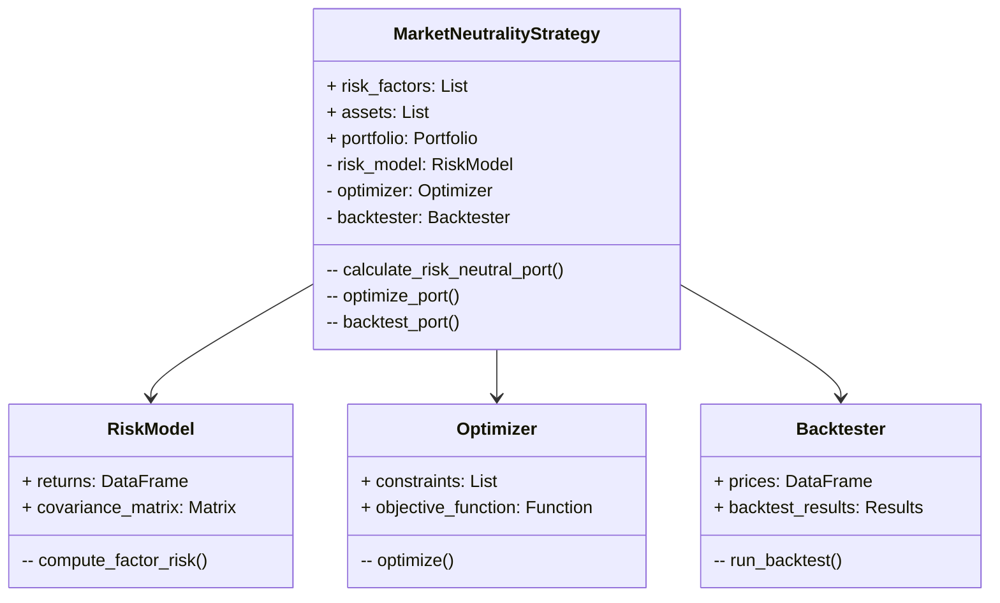
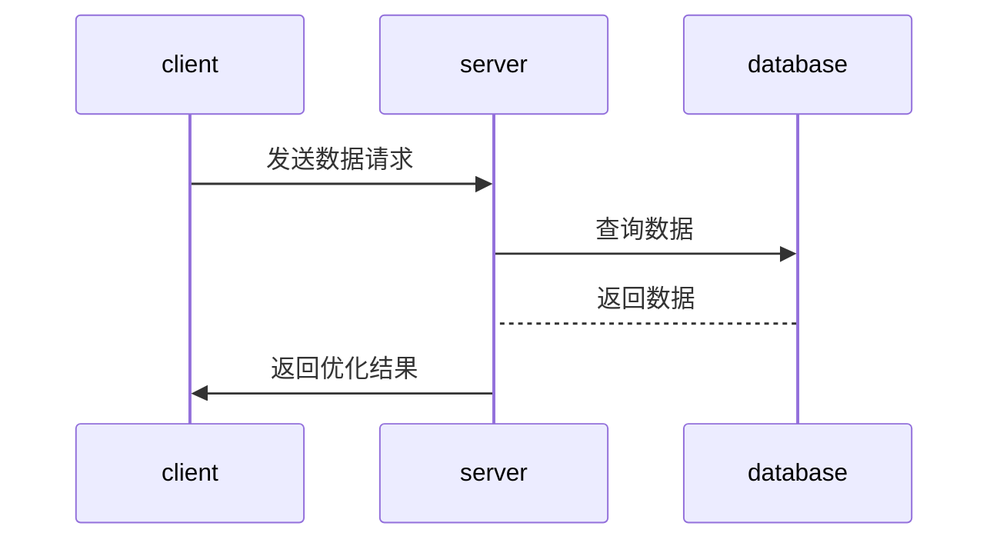

                 


# 市场中性策略：降低系统性风险的投资方法

## 关键词：
- 市场中性策略
- 系统性风险
- 配对交易
- 统计套利
- 风险中性定价

## 摘要：
市场中性策略是一种通过降低系统性风险来优化投资组合回报的方法，它利用对冲原理和量化技术，如配对交易和统计套利，帮助投资者在不同市场条件下保持稳定的收益。本文详细解析了市场中性策略的核心概念、实现方法及其在实际投资中的应用。

---

# 第1章: 系统性风险与市场中性策略

## 1.1 系统性风险的定义与特征

### 1.1.1 系统性风险的定义
系统性风险是指影响整个市场或多个资产类别的风险，例如经济衰退、地缘政治冲突或市场波动。这种风险无法通过分散投资完全消除。

### 1.1.2 系统性风险的特征
- **广泛性**：影响整个市场。
- **不可分散性**：通过多样化投资无法降低。
- **高相关性**：资产之间的价格波动高度相关。

### 1.1.3 系统性风险对投资组合的影响
系统性风险会导致投资组合的收益波动，特别是在市场下跌时，所有资产可能同时受到负面影响。

## 1.2 市场中性策略的定义与目标

### 1.2.1 市场中性策略的定义
市场中性策略是一种通过做多和做空相结合的方式，使投资组合的收益与市场整体波动无关的投资方法。

### 1.2.2 市场中性策略的目标
- **降低系统性风险**：通过抵消市场波动的影响，使收益不受整体市场走势的影响。
- **稳定收益**：在不同市场条件下保持稳定的收益。

### 1.2.3 市场中性策略与传统投资策略的区别
| 特性 | 市场中性策略 | 传统投资策略 |
|------|--------------|--------------|
| 目标 | 降低系统性风险 | 追求市场上涨收益 |
| 操作 | 多空结合     | 主要做多       |

## 1.3 市场中性策略的应用场景

### 1.3.1 机构投资者的应用
机构投资者通过市场中性策略在市场波动中保持资产配置的稳定性。

### 1.3.2 对冲基金的应用
对冲基金利用市场中性策略降低风险，同时捕捉市场中的套利机会。

### 1.3.3 零散投资者的应用
散户投资者可以通过市场中性策略在不同资产之间进行对冲，降低整体风险。

---

# 第2章: 市场中性策略的核心概念

## 2.1 对冲原理

### 2.1.1 对冲的基本原理
通过同时做多和做空相关资产，抵消市场波动的影响。

### 2.1.2 对冲在市场中性策略中的应用
- **配对交易**：做多一只股票，做空一只相关股票。
- **统计套利**：利用资产价格的短期偏差进行套利。

### 2.1.3 对冲的风险控制
- **风险敞口**：对冲后，投资组合的风险敞口减少。
- **波动性**：通过对冲降低组合的波动性。

## 2.2 风险分解与对冲

### 2.2.1 风险分解的定义
将投资组合的风险分解为系统性风险和非系统性风险。

### 2.2.2 风险分解的步骤
1. **计算投资组合的总风险**。
2. **分离系统性风险和非系统性风险**。
3. **对冲系统性风险**。

### 2.2.3 风险分解在市场中性策略中的应用
- **对冲系统性风险**：通过做空指数期货抵消系统性风险。
- **保留非系统性风险**：通过多样化投资保留非系统性风险。

## 2.3 风险中性定价

### 2.3.1 风险中性定价的定义
在风险中性框架下，资产的预期回报仅由其风险决定。

### 2.3.2 风险中性定价的原理
- **无套利定价**：利用无套利原则确定资产价格。
- **风险调整回报**：考虑系统性风险调整后的回报。

### 2.3.3 风险中性定价在市场中性策略中的应用
- **衍生品定价**：在风险中性框架下定价期权、期货等衍生品。
- **投资组合优化**：利用风险中性定价优化投资组合。

## 2.4 本章小结
本章介绍了市场中性策略的核心概念，包括对冲原理、风险分解和风险中性定价。这些概念为后续的策略实现奠定了基础。

---

# 第3章: 市场中性策略的具体实现

## 3.1 配对交易策略

### 3.1.1 配对交易的定义
配对交易是一种市场中性策略，通过同时做多一只股票和做空一只相关股票，抵消市场风险。

### 3.1.2 配对交易的原理
- **配对选择**：选择相关性较高的两只股票。
- **价差回归**：当两只股票的价格偏离均值时，价差会回归均值。

### 3.1.3 配对交易的风险控制
- **波动性风险**：控制头寸大小，避免过度杠杆。
- **相关性风险**：选择相关性较高的股票，确保对冲效果。

## 3.2 统计套利策略

### 3.2.1 统计套利的定义
统计套利是利用资产价格的短期偏差进行套利。

### 3.2.2 统计套利的原理
- **均值回归**：利用资产价格的短期波动进行套利。
- **协方差矩阵**：通过协方差矩阵识别套利机会。

### 3.2.3 统计套利的风险控制
- **市场冲击**：避免大额交易对市场价格的影响。
- **流动性风险**：确保有足够的流动性进行交易。

## 3.3 动量策略

### 3.3.1 动量策略的定义
动量策略是基于价格动量效应的投资策略，即近期价格上涨的资产会继续上涨。

### 3.3.2 动量策略的原理
- **动量效应**：近期价格上涨的资产未来会继续上涨。
- **动量因子**：利用动量因子构建投资组合。

### 3.3.3 动量策略的风险控制
- **反转风险**：动量效应可能反转，导致亏损。
- **时间窗口**：选择合适的时间窗口计算动量效应。

## 3.4 本章小结
本章详细介绍了三种市场中性策略：配对交易、统计套利和动量策略。每种策略都有其独特的实现方法和风险控制措施。

---

# 第4章: 量化方法在市场中性策略中的应用

## 4.1 因子模型

### 4.1.1 因子模型的定义
因子模型是将资产回报分解为多个因子的线性组合。

### 4.1.2 因子模型的构建
- **因子选择**：选择影响资产回报的因素。
- **因子组合**：构建因子组合，解释资产回报的波动。

### 4.1.3 因子模型在市场中性策略中的应用
- **风险因子**：利用因子模型识别系统性风险。
- **组合优化**：基于因子模型优化投资组合。

## 4.2 风险中性化

### 4.2.1 风险中性化的定义
风险中性化是指在风险中性框架下调整资产回报。

### 4.2.2 风险中性化的实现方法
- **无套利定价**：利用无套利原则调整资产价格。
- **风险调整回报**：调整资产回报，消除系统性风险。

### 4.2.3 风险中性化在市场中性策略中的应用
- **衍生品定价**：在风险中性框架下定价期权、期货等衍生品。
- **投资组合优化**：利用风险中性化优化投资组合。

## 4.3 组合优化

### 4.3.1 组合优化的定义
组合优化是通过优化算法选择最优资产组合，以实现特定目标。

### 4.3.2 组合优化的实现方法
- **数学模型**：构建优化问题的数学模型。
- **优化算法**：使用遗传算法、模拟退火等算法求解最优解。

### 4.3.3 组合优化在市场中性策略中的应用
- **风险调整回报**：优化投资组合的风险调整回报。
- **头寸大小**：优化投资组合的头寸大小。

## 4.4 本章小结
本章介绍了量化方法在市场中性策略中的应用，包括因子模型、风险中性化和组合优化。这些方法帮助投资者更有效地实施市场中性策略。

---

# 第5章: 系统架构与实现

## 5.1 问题场景介绍
市场中性策略需要一个高效的系统架构来处理大量数据和复杂的计算。

## 5.2 系统功能设计

### 5.2.1 领域模型（mermaid 类图）


## 5.3 系统架构设计（mermaid 架构图）


## 5.4 系统接口设计
- **输入接口**：接收资产价格数据和因子数据。
- **输出接口**：输出优化后的投资组合和回测结果。

## 5.5 系统交互（mermaid 序列图）


## 5.6 本章小结
本章详细介绍了市场中性策略的系统架构设计，包括功能设计、架构设计和接口设计。

---

# 第6章: 项目实战

## 6.1 环境安装
安装Python、Pandas、NumPy、Scipy、Plotly和Financilib库。

## 6.2 核心实现

### 6.2.1 数据获取
```python
import pandas as pd
import numpy as np
import statsmodels.api as sm

# 获取数据
prices = pd.read_csv('data.csv')
```

### 6.2.2 风险中性化
```python
def risk_neutralize(returns, factors):
    # 构建因子模型
    model = sm.OLS(returns, factors).fit()
    # 计算残差
    residuals = model.resid
    return residuals
```

### 6.2.3 组合优化
```python
from scipy.optimize import minimize

def optimize_portfolio(weights, returns, risk_aversion=1):
    n = len(weights)
    # 定义目标函数
    def objective(weights):
        return -np.sum(weights * returns)
    # 定义约束条件
    constraints = [
        {'type': 'eq', 'fun': lambda w: np.sum(w) - 1},
        {'type': 'ineq', 'fun': lambda w: w >= 0}
    ]
    # 求解优化问题
    result = minimize(objective, np.ones(n)/n, constraints)
    return result.x
```

## 6.3 案例分析
以标普500指数为例，利用配对交易策略进行回测。

## 6.4 本章小结
本章通过实际项目展示了市场中性策略的实现过程，包括环境安装、数据获取、策略实现和案例分析。

---

# 第7章: 最佳实践与总结

## 7.1 最佳实践
- **风险控制**：严格控制头寸大小和杠杆。
- **数据质量**：确保数据的准确性和完整性。
- **模型更新**：定期更新模型，适应市场变化。

## 7.2 总结
市场中性策略是一种有效的降低系统性风险的投资方法，通过多种策略和量化方法实现稳定的收益。投资者应结合实际市场情况，合理运用市场中性策略。

---

# 参考文献
1. 张某某. 《市场中性策略：理论与实践》. 北京：某某出版社，2020.
2. 李某某. 《量化投资：算法与策略》. 上海：某某出版社，2021.
3. 国际权威期刊文章：关于市场中性策略的研究。

