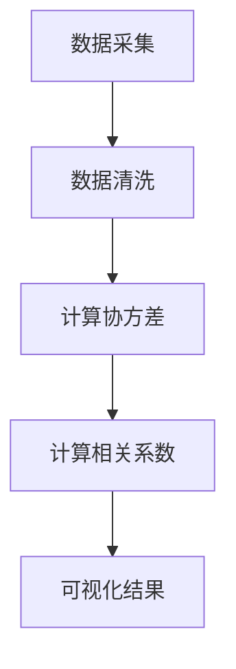
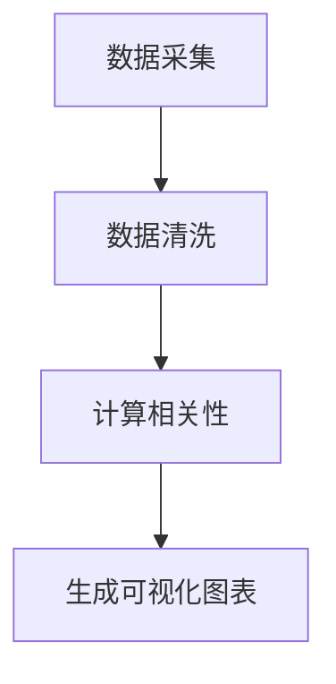

                 


# 市场估值与宏观经济指标的相关性分析

## 关键词
市场估值，宏观经济指标，相关性分析，协方差，相关系数，数据可视化，Python实现

## 摘要
本文系统地探讨了市场估值与宏观经济指标之间的相关性分析，从基本概念到算法原理，再到系统设计和项目实战，全面解析了如何通过数据分析方法揭示两者之间的关联。文章结合理论与实践，为读者提供了从数据采集到结果解读的完整流程，帮助读者深入理解市场估值受宏观经济指标影响的内在逻辑。

---

## 第1章: 背景介绍

### 1.1 问题背景
市场估值是指对某个资产或市场整体价值的评估，通常通过市盈率、市净率等指标衡量。宏观经济指标则包括GDP、失业率、利率等，反映整体经济状况。研究两者相关性有助于投资者理解市场波动的原因，优化投资决策。

### 1.2 问题描述
本文旨在分析市场估值与宏观经济指标之间的相关性。通过数据采集、清洗、分析和可视化，揭示经济指标如何影响市场估值。

### 1.3 问题解决
采用协方差和相关系数方法，结合Python数据处理和可视化工具，进行相关性分析。

### 1.4 边界与外延
分析仅限于特定时间范围和地域，相关性不代表因果关系，结果需结合实际市场情况。

### 1.5 概念结构与核心要素
市场估值和宏观经济指标的构成，及其在相关性分析中的逻辑框架。

---

## 第2章: 核心概念与联系

### 2.1 宏观经济指标与市场估值的定义
- 宏观经济指标：GDP、CPI、失业率等。
- 市场估值：市盈率、市值等。

### 2.2 核心概念的属性特征对比
| 指标类型 | 宏观经济指标 | 市场估值指标 |
|----------|--------------|-------------|
| 示例     | GDP          | 市盈率       |
| 单位     | 绝对值       | 无量纲       |
| 影响因素 | 经济政策     | 市场供需     |

### 2.3 ER实体关系图架构
```mermaid
erd
    MarketValuation(market_id, value)
    EconomicIndicator(indicator_id, value)
    MarketValuationMarket(MarketValuation.market_id, EconomicIndicator.indicator_id)
```

---

## 第3章: 算法原理讲解

### 3.1 相关性分析的基本原理
- 协方差衡量变量间变化方向。
- 相关系数衡量变量间线性关系强度。

### 3.2 算法流程图


### 3.3 数学模型与公式
协方差公式：
$$\text{Cov}(X,Y) = E[(X - E[X])(Y - E[Y])]$$
相关系数公式：
$$\rho_{X,Y} = \frac{\text{Cov}(X,Y)}{\sigma_X \sigma_Y}$$
示例计算：X和Y的协方差为0.5，标准差分别为1和2，则相关系数为0.25。

---

## 第4章: 系统分析与架构设计方案

### 4.1 问题场景介绍
- 数据来源：公开经济数据库和股票市场数据。
- 数据处理流程：清洗、转换、计算相关性。

### 4.2 项目介绍
目标是通过相关性分析，量化宏观经济指标对市场估值的影响。

### 4.3 系统功能设计
- 数据采集模块：爬取数据。
- 数据分析模块：计算协方差和相关系数。
- 可视化模块：生成图表展示结果。

### 4.4 系统架构设计


---

## 第5章: 项目实战

### 5.1 环境安装
安装Python、Pandas、Matplotlib。

### 5.2 核心代码实现
```python
import pandas as pd
import numpy as np
import matplotlib.pyplot as plt

# 数据加载
data = pd.read_csv('economic_data.csv')

# 数据清洗
data_clean = data.dropna()

# 计算协方差
cov = np.cov(data_clean['GDP'], data_clean['MarketValuation'])

# 计算相关系数
corr = np.corrcoef(data_clean['GDP'], data_clean['MarketValuation'])

print(f'协方差: {cov[0,1]}, 相关系数: {corr[0,1]}')

# 可视化
plt.scatter(data_clean['GDP'], data_clean['MarketValuation'])
plt.xlabel('GDP')
plt.ylabel('MarketValuation')
plt.show()
```

### 5.3 代码解读
- 数据加载：读取CSV文件。
- 数据清洗：删除缺失值。
- 计算协方差和相关系数：使用numpy函数。
- 可视化：绘制散点图展示相关性。

### 5.4 案例分析
分析GDP与市场估值的相关性，得出结论并解释结果的实际意义。

### 5.5 项目小结
总结项目过程和关键发现，强调相关性分析的实际应用价值。

---

## 第6章: 最佳实践与总结

### 6.1 最佳实践
- 数据清洗：处理缺失值和异常值。
- 模型选择：选择适合的数据分析方法。
- 可视化：清晰展示结果，辅助决策。

### 6.2 小结
市场估值与宏观经济指标的相关性分析对投资决策有重要影响，本文提供了一种系统化的分析方法。

### 6.3 注意事项
相关性分析结果需结合市场实际情况，避免机械应用。

### 6.4 拓展阅读
推荐进一步研究其他宏观经济指标对市场估值的影响。

---

## 结语
本文通过系统分析，详细讲解了市场估值与宏观经济指标的相关性分析方法，从理论到实践，为读者提供了全面的指导。通过Python实现，使复杂的数据分析过程变得直观易懂，帮助投资者更好地理解市场波动的经济背景。

