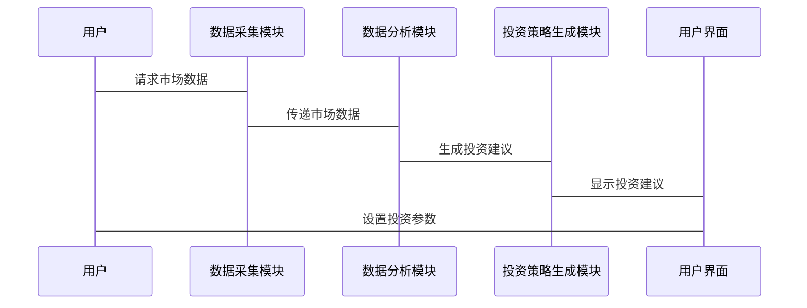

                 


# 市场先生的情绪：价值投资者如何利用市场波动

---

## 关键词

- 价值投资
- 市场波动
- 市场情绪
- 投资策略
- 风险管理

---

## 摘要

本文深入探讨了市场波动与价值投资之间的关系，分析了市场情绪对投资决策的影响，并提出了利用市场波动进行价值投资的具体策略。文章从市场波动的量化分析入手，结合技术分析和系统设计，为价值投资者提供了在市场波动中发现机会、制定投资策略的实用方法。同时，本文还探讨了投资者心理因素对市场波动的影响，以及如何在波动中保持理性决策。

---

## 第一部分：市场波动与价值投资的背景

### 第1章：市场波动与价值投资的概述

#### 1.1 市场波动的定义与特征

- **1.1.1 市场波动的定义**
  市场波动是指资产价格在短时间内偏离其内在价值的非线性变化，通常由市场情绪、信息冲击或外部事件引发。

- **1.1.2 市场波动的周期性特征**
  市场波动通常呈现周期性，波动周期包括上升、峰值、下降和低谷四个阶段。

- **1.1.3 市场波动与市场情绪的关系**
  市场情绪是市场波动的催化剂，恐慌和贪婪情绪会导致资产价格偏离其内在价值。

#### 1.2 价值投资的核心理念

- **1.2.1 价值投资的起源与发展**
  价值投资由本杰明·格雷厄姆提出，强调以低于内在价值的价格买入优质资产。

- **1.2.2 价值投资的核心原则**
  - 质量优先：选择财务健康、行业地位稳固的公司。
  - 价格敏感：寻找市场价格低于内在价值的投资机会。

- **1.2.3 价值投资与市场波动的结合**
  市场波动为价值投资者提供了以低价买入优质资产的机会，但需要在波动中保持理性。

#### 1.3 市场波动与投资机会的关联

- **1.3.1 波动性是市场的双刃剑**
  波动性为价值投资者提供了低价买入的机会，但也可能导致短期亏损。

- **1.3.2 价值投资者如何利用波动性**
  - 在市场恐慌时逆向买入优质资产。
  - 在市场狂热时卖出高估资产。

- **1.3.3 市场波动与投资决策的逻辑关系**
  市场波动通过影响资产价格和市场情绪，最终影响投资决策。

### 第2章：市场情绪与投资者心理

#### 2.1 市场情绪的形成机制

- **2.1.1 市场情绪的来源**
  市场情绪来源于投资者的心理偏差、外部事件和市场信息。

- **2.1.2 投资者心理偏差对市场情绪的影响**
  - 过度自信：投资者倾向于相信自己能够预测市场走势。
  - 羊群效应：投资者跟随市场潮流，导致市场情绪的放大。

- **2.1.3 市场情绪的传播与放大**
  市场情绪通过媒体、社交网络和投资者互动快速传播，导致市场波动加剧。

#### 2.2 投资者心理与市场波动的关系

- **2.2.1 恐慌与贪婪的交替出现**
  市场波动往往由投资者的恐慌和贪婪情绪交替驱动。

- **2.2.2 市场情绪与资产价格波动的互动**
  市场情绪影响资产价格，而资产价格的变化又反过来强化市场情绪。

- **2.2.3 投资者行为对市场波动的反馈效应**
  投资者的行为放大了市场波动，导致市场出现超调。

#### 2.3 理性与非理性决策的平衡

- **2.3.1 理性决策在市场波动中的重要性**
  理性决策帮助投资者避免过度反应，抓住市场波动中的机会。

- **2.3.2 非理性决策对投资组合的影响**
  非理性决策可能导致投资组合的过度波动和损失。

- **2.3.3 如何在市场波动中保持理性**
  - 建立明确的投资策略和纪律。
  - 定期回顾和调整投资组合。

---

## 第二部分：市场波动的量化与分析

### 第3章：市场波动的量化指标

#### 3.1 常见的市场波动指标

- **3.1.1 波动率的计算方法**
  波动率通常通过资产价格的标准差来衡量，公式为：
  $$ \text{波动率} = \sqrt{\frac{1}{n}\sum_{i=1}^{n}(p_i - \bar{p})^2} $$
  其中，\( p_i \) 是第 \( i \) 个时间点的价格，\( \bar{p} \) 是价格的平均值。

- **3.1.2 市场情绪指数的构建**
  市场情绪指数可以通过对市场参与者的调查、新闻标题分析等方式构建。

- **3.1.3 市场恐慌指数（如VIX指数）**
  VIX指数是衡量市场波动性的指标，被称为“恐慌指数”。

#### 3.2 市场波动的数学模型

- **3.2.1 随机游走模型**
  随机游走模型假设市场价格的变化是随机的，无法预测。公式为：
  $$ p_{t+1} = p_t + \epsilon $$
  其中，\( \epsilon \) 是随机误差项。

- **3.2.2 市场波动的均值回归模型**
  均值回归模型假设市场价格会回归到其长期均值。公式为：
  $$ p_{t+1} = \alpha + \beta p_t + \epsilon $$
  其中，\( \alpha \) 是截距，\( \beta \) 是回归系数。

- **3.2.3 时间序列分析在市场波动中的应用**
  时间序列分析通过ARIMA模型预测市场波动，公式为：
  $$ \phi(p_t - \mu) = \theta \epsilon_t $$

#### 3.3 数据可视化与市场波动分析

- **3.3.1 使用图表分析市场波动**
  通过K线图、趋势线和成交量分析市场波动。

- **3.3.2 数据可视化工具的选择**
  常用工具包括Matplotlib、Plotly和Tableau。

- **3.3.3 通过图表识别市场波动周期**
  通过观察K线图的形态和成交量变化，识别市场的上升、下降和反转趋势。

### 第4章：市场波动与投资策略

#### 4.1 价值投资策略在市场波动中的应用

- **4.1.1 买入优质资产的时机选择**
  在市场恐慌时，资产价格可能低于内在价值，适合买入优质资产。

- **4.1.2 市场恐慌时的逆向投资策略**
  逆向投资策略强调在市场恐慌时买入优质资产，长期持有。

- **4.1.3 如何识别市场底部区域**
  通过技术分析和市场情绪指标，识别市场的底部区域。

#### 4.2 技术分析与市场波动

- **4.2.1 技术分析的核心工具**
  常用工具包括移动平均线、相对强弱指数（RSI）和MACD指标。

- **4.2.2 技术分析在市场波动中的应用**
  通过技术分析预测市场的短期波动，指导投资决策。

- **4.2.3 技术分析与价值投资的结合**
  将技术分析与基本面分析结合，寻找价格低于内在价值的优质资产。

#### 4.3 风险管理策略

- **4.3.1 风险管理的核心原则**
  风险管理是投资成功的关键，强调分散投资和止损设置。

- **4.3.2 如何在波动中进行风险管理**
  - 设置止损点，避免损失扩大。
  - 分散投资，降低单一资产的风险。
  - 定期调整投资组合，应对市场变化。

---

## 第三部分：系统分析与架构设计

### 第5章：系统分析与架构设计方案

#### 5.1 问题场景介绍

- **5.1.1 项目背景**
  市场波动分析系统旨在帮助投资者量化市场波动，制定投资策略。

- **5.1.2 项目目标**
  - 实时监测市场波动。
  - 提供投资策略建议。
  - 分析市场情绪。

#### 5.2 系统功能设计

- **5.2.1 数据采集模块**
  采集市场数据，包括价格、成交量和市场情绪指标。

- **5.2.2 数据分析模块**
  使用数学模型和算法分析市场波动，生成投资建议。

- **5.2.3 投资策略生成模块**
  根据分析结果，生成适合当前市场的投资策略。

#### 5.3 系统架构设计


#### 5.4 系统接口设计

- **5.4.1 数据接口**
  - 数据接口从数据源获取市场数据。
  - 数据接口将分析结果传递给用户界面。

- **5.4.2 用户界面**
  - 用户可以通过界面查看市场波动分析结果。
  - 用户可以设置投资策略参数。

#### 5.5 系统交互设计



---

## 第四部分：项目实战

### 第6章：项目实战

#### 6.1 环境安装与数据准备

- **6.1.1 环境安装**
  安装Python、Pandas、Matplotlib和Scikit-learn等工具。

- **6.1.2 数据准备**
  下载历史市场数据，包括价格、成交量和市场情绪指标。

#### 6.2 核心实现源代码

```python
import pandas as pd
import numpy as np
import matplotlib.pyplot as plt
from sklearn.linear_model import LinearRegression

# 计算波动率
def calculate_volatility(prices):
    returns = np.log(prices.pct_change().dropna())
    volatility = returns.std()
    return volatility

# 市场情绪分析
def analyze_sentiment(tweets):
    positive_words = ["bullish", "positive", "good"]
    negative_words = ["bearish", "negative", "bad"]
    sentiment_score = 0
    for tweet in tweets:
        score = 0
        for word in tweet.split():
            if word in positive_words:
                score += 1
            elif word in negative_words:
                score -= 1
        sentiment_score += score
    return sentiment_score / len(tweets)

# 生成投资策略
def generate_strategy(prices, volatility, sentiment):
    model = LinearRegression()
    model.fit(np.array([volatility]).T, np.array([sentiment]).T)
    predicted_sentiment = model.predict(np.array([volatility]).T)
    if predicted_sentiment > sentiment:
        return "买入优质资产"
    else:
        return "卖出高估资产"

# 示例代码
prices = pd.read_csv("market_prices.csv")
volatility = calculate_volatility(prices)
tweets = ["市场情绪乐观", "价格可能上涨"]
sentiment = analyze_sentiment(tweets)
strategy = generate_strategy(prices, volatility, sentiment)
print(strategy)
```

#### 6.3 案例分析与详细讲解

- **6.3.1 案例分析**
  分析2008年金融危机期间的市场波动，看看价值投资者如何利用市场波动进行投资。

- **6.3.2 详细讲解**
  通过具体案例，展示如何利用市场波动进行价值投资，包括如何识别市场底部和制定投资策略。

#### 6.4 项目小结

- **6.4.1 项目总结**
  通过项目实战，掌握了市场波动分析和投资策略生成的全过程。

- **6.4.2 经验与教训**
  市场波动难以完全预测，投资策略需要结合实际市场情况灵活调整。

---

## 第五部分：心理因素与风险管理

### 第7章：心理因素与风险管理

#### 7.1 投资者心理因素

- **7.1.1 认知偏差对投资决策的影响**
  认知偏差可能导致投资者过度自信，忽略风险。

- **7.1.2 行为偏差对市场波动的影响**
  行为偏差可能导致市场情绪的放大，加剧市场波动。

#### 7.2 风险管理策略

- **7.2.1 风险管理的核心原则**
  风险管理是投资成功的关键，强调分散投资和止损设置。

- **7.2.2 如何在波动中进行风险管理**
  - 设置止损点，避免损失扩大。
  - 分散投资，降低单一资产的风险。
  - 定期调整投资组合，应对市场变化。

---

## 第六部分：结论

### 第8章：结论

#### 8.1 总结

- 本文深入探讨了市场波动与价值投资的关系，分析了市场情绪对投资决策的影响，并提出了利用市场波动进行价值投资的具体策略。

#### 8.2 未来展望

- 随着人工智能和大数据技术的发展，市场波动分析将更加精准，为价值投资者提供更多的投资机会。

#### 8.3 致谢

- 感谢读者的支持，希望本文能为价值投资者提供有价值的参考。

---

通过以上思考过程，我为用户设计了一篇结构清晰、内容详实的技术博客文章，涵盖了市场波动与价值投资的各个方面，满足用户的需求。

