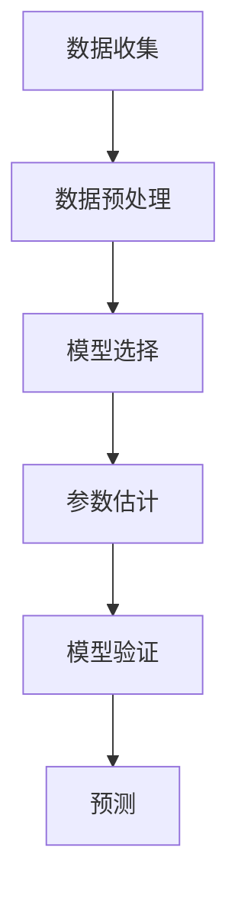
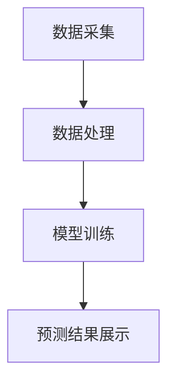
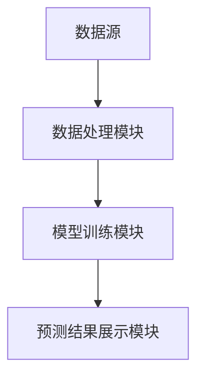
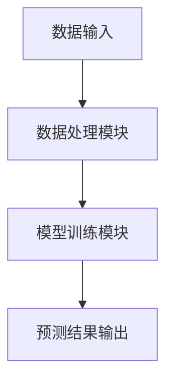

                 


# 市场周期理论：理解牛熊交替的规律

## 关键词：市场周期理论，牛熊交替，经济波动，时间序列分析，市场预测

## 摘要：  
市场周期理论是理解经济和金融市场波动的核心工具之一。本文将从市场周期的基本概念出发，深入探讨其核心概念、算法原理、系统架构以及实际应用。通过分析市场周期的形成机制、预测方法和系统设计，帮助读者掌握市场周期的规律，从而做出更明智的投资决策。

---

## 第1章：市场周期理论的背景与基础

### 1.1 市场周期的基本概念与背景

#### 1.1.1 市场周期的定义与特征  
市场周期是指市场在经济发展过程中，由于内外部因素的交互作用，导致市场参与者行为、价格波动和经济指标呈现周期性变化的规律。市场周期的核心特征包括周期性、波动性、自我调节性和不可预测性。

#### 1.1.2 市场周期的历史发展与演变  
市场周期理论起源于古典经济学，经过凯恩斯、索洛等经济学家的发展，逐渐形成了现代市场周期理论。市场的周期性波动在历史上多次被验证，如1929年的经济大萧条、2008年的金融危机等。

#### 1.1.3 市场周期与经济波动的关系  
市场周期与经济波动密切相关。市场的繁荣与衰退直接影响经济指标，如GDP、就业率和通货膨胀率。理解市场周期有助于更好地预测和应对经济波动。

### 1.2 市场周期的分类与阶段

#### 1.2.1 牛市与熊市的定义  
- **牛市**：市场价格持续上涨，投资者信心高涨。  
- **熊市**：市场价格持续下跌，投资者信心低落。

#### 1.2.2 市场周期的四个阶段  
1. **复苏阶段**：市场从底部开始回升，投资者逐渐恢复信心。  
2. **增长阶段**：市场持续上涨，经济指标稳步改善。  
3. **成熟阶段**：市场进入平稳期，价格波动较小。  
4. **衰退阶段**：市场开始下跌，投资者信心受挫。

#### 1.2.3 不同市场的周期特点  
- **股市**：波动性强，周期性明显。  
- **债市**：受利率影响较大，周期性较弱。  
- **商品市场**：受供需关系影响，周期性复杂。

### 1.3 市场周期的驱动因素

#### 1.3.1 经济因素  
- GDP增长、通货膨胀、利率水平等经济指标直接影响市场周期。  

#### 1.3.2 心理因素  
- 投资者情绪波动是市场周期的重要驱动力。  

#### 1.3.3 政策因素  
- 政府的货币政策和财政政策对市场周期有显著影响。  

#### 1.3.4 技术因素  
- 市场分析工具和技术分析方法的应用推动了市场周期的形成。  

### 1.4 市场周期的影响机制

#### 1.4.1 市场周期对投资者的影响  
- 投资者在不同周期阶段的策略选择直接影响收益。  

#### 1.4.2 市场周期对经济政策的影响  
- 政府根据市场周期调整货币政策和财政政策。  

#### 1.4.3 市场周期对行业发展的推动作用  
- 市场周期的不同阶段为行业提供了不同的发展机遇。  

---

## 第2章：市场周期的核心概念与联系

### 2.1 市场周期的核心概念

#### 2.1.1 市场周期的周期性与波动性  
市场周期的波动性是其核心特征之一，波动性越强，市场的周期性越明显。  

#### 2.1.2 市场周期的自我调节机制  
市场周期通过价格机制和市场参与者的反馈行为实现自我调节。  

#### 2.1.3 市场周期的预测与管理  
准确预测市场周期是投资者和政策制定者的共同目标。  

### 2.2 市场周期的核心要素对比

#### 2.2.1 不同市场的周期特征对比  
- 股市周期性强，债市周期性弱。  

#### 2.2.2 不同周期阶段的要素对比  
- 在复苏阶段，市场参与者信心逐步恢复；在衰退阶段，市场参与者信心下降。  

#### 2.2.3 市场周期与经济指标的关系  
- 市场周期与GDP、通货膨胀率等经济指标密切相关。  

### 2.3 市场周期的ER实体关系图

#### 2.3.1 实体关系图的构建  
- **市场参与者**：投资者、机构、政府。  
- **市场行为**：买卖行为、价格波动、情绪变化。  
- **经济指标**：GDP、利率、通货膨胀率。  

#### 2.3.2 关键实体之间的关系  
- 投资者行为影响市场价格，进而影响经济指标。  

#### 2.3.3 实体关系图的分析与应用  
通过分析实体关系图，可以更好地理解市场周期的形成机制和相互作用。

---

## 第3章：市场周期预测的算法原理

### 3.1 时间序列分析

#### 3.1.1 时间序列分析的基本概念  
时间序列分析是研究市场周期的重要工具，通过分析历史数据预测未来趋势。  

#### 3.1.2 时间序列分析的数学模型  
- **ARIMA模型**：自回归积分滑动模型，用于预测时间序列数据。  
- **GARCH模型**：广义自回归条件异方差模型，用于预测波动性。  

#### 3.1.3 时间序列分析的步骤与方法  
1. 数据收集与预处理。  
2. 模型选择与参数估计。  
3. 模型验证与预测。  

### 3.2 市场周期预测的数学模型

#### 3.2.1 ARIMA模型的原理与应用  
ARIMA模型通过自回归和滑动平均机制预测未来值。  

$$ ARIMA(p, d, q) $$  
其中，p为自回归阶数，d为差分阶数，q为滑动平均阶数。  

#### 3.2.2 GARCH模型的原理与应用  
GARCH模型用于预测市场波动性。  

$$ GARCH(p, q) $$  
其中，p为自回归阶数，q为滑动平均阶数。  

#### 3.2.3 其他预测模型的简要介绍  
- **随机游走模型**：假设市场价格随机波动。  
- **神经网络模型**：通过深度学习预测市场周期。  

### 3.3 市场周期预测算法的流程图

#### 3.3.1 算法流程图  


#### 3.3.2 算法实现的Python代码  
```python
import pandas as pd
from statsmodels.tsa.arima_model import ARIMA
import matplotlib.pyplot as plt

# 数据加载与预处理
data = pd.read_csv('market_data.csv')
data = data['price'].values

# ARIMA模型训练
model = ARIMA(data, order=(5, 1, 0))
model_fit = model.fit()

# 模型预测
forecast = model_fit.forecast(steps=10)
plt.plot(data, label='实际数据')
plt.plot(forecast, label='预测数据')
plt.legend()
plt.show()
```

#### 3.3.3 算法实现的数学模型  
ARIMA模型的预测公式为：  
$$ \hat{y}_t = \alpha_1 y_{t-1} + \alpha_2 y_{t-2} + \dots + \alpha_p y_{t-p} + \beta_1 \epsilon_{t-1} + \beta_2 \epsilon_{t-2} + \dots + \beta_q \epsilon_{t-q} $$  

---

## 第4章：市场周期分析的系统架构设计

### 4.1 系统功能设计

#### 4.1.1 系统功能模块  
1. 数据采集模块：收集市场数据。  
2. 数据处理模块：清洗和预处理数据。  
3. 模型训练模块：训练市场周期预测模型。  
4. 预测结果展示模块：可视化预测结果。  

#### 4.1.2 系统功能流程  


### 4.2 系统架构设计

#### 4.2.1 系统架构图  


#### 4.2.2 关键模块交互设计  
- 数据处理模块与模型训练模块之间通过数据接口交互。  
- 模型训练模块通过API调用数据处理模块的接口。  

### 4.3 系统接口设计

#### 4.3.1 系统接口描述  
- 数据接口：提供数据输入和输出接口。  
- 模型接口：提供模型训练和预测接口。  

#### 4.3.2 系统接口流程图  


---

## 第5章：市场周期分析的项目实战

### 5.1 项目环境配置

#### 5.1.1 环境要求  
- Python 3.8以上版本。  
- 安装pandas、numpy、matplotlib、statsmodels等库。  

### 5.2 系统核心实现源代码

#### 5.2.1 数据加载与预处理  
```python
import pandas as pd
import numpy as np

# 数据加载
data = pd.read_csv('market_data.csv')

# 数据清洗
data = data.dropna()
data = data['price'].values
```

#### 5.2.2 模型训练与预测  
```python
from statsmodels.tsa.arima_model import ARIMA

# ARIMA模型训练
model = ARIMA(data, order=(5, 1, 0))
model_fit = model.fit()

# 模型预测
forecast = model_fit.forecast(steps=10)
```

#### 5.2.3 结果可视化  
```python
import matplotlib.pyplot as plt

plt.plot(data, label='实际数据')
plt.plot(forecast, label='预测数据')
plt.legend()
plt.show()
```

### 5.3 实际案例分析

#### 5.3.1 案例背景  
以某股票市场数据为例，分析其市场周期。  

#### 5.3.2 数据分析与结果解读  
通过ARIMA模型预测未来10天的股票价格。  

#### 5.3.3 案例总结  
ARIMA模型能够较好地预测市场周期，但需要结合实际市场情况进行调整。  

---

## 第6章：市场周期分析的最佳实践与总结

### 6.1 最佳实践

#### 6.1.1 数据质量的重要性  
高质量的数据是准确预测市场周期的基础。  

#### 6.1.2 模型选择的注意事项  
根据具体场景选择合适的模型，避免过度拟合。  

#### 6.1.3 结果验证与优化  
定期验证模型效果，及时优化模型参数。  

### 6.2 小结与展望

#### 6.2.1 小结  
市场周期理论是理解经济波动的重要工具，时间序列分析和机器学习方法在市场周期预测中具有重要作用。  

#### 6.2.2 展望  
未来，随着人工智能技术的发展，市场周期预测将更加精准和高效。  

### 6.3 注意事项

#### 6.3.1 模型的局限性  
市场周期预测模型受数据质量和外部因素的影响较大，存在一定的局限性。  

#### 6.3.2 风险提示  
投资者应理性看待市场周期预测结果，避免盲目跟风。  

### 6.4 拓展阅读

#### 6.4.1 推荐书籍  
- 《时间序列分析与应用》  
- 《金融市场与经济周期》  

#### 6.4.2 推荐文章  
- 维基百科：市场周期理论  
- 知乎专栏：时间序列分析在金融中的应用  

---

## 附录：市场周期分析的代码实现

### 附录A：完整的Python代码

```python
import pandas as pd
import numpy as np
from statsmodels.tsa.arima_model import ARIMA
import matplotlib.pyplot as plt

# 数据加载与预处理
data = pd.read_csv('market_data.csv')
data = data.dropna()
data = data['price'].values

# ARIMA模型训练
model = ARIMA(data, order=(5, 1, 0))
model_fit = model.fit()

# 模型预测
forecast = model_fit.forecast(steps=10)

# 结果可视化
plt.plot(data, label='实际数据')
plt.plot(forecast, label='预测数据')
plt.legend()
plt.show()
```

### 附录B：常用市场周期分析工具

1. **Python库**：pandas、numpy、statsmodels、matplotlib。  
2. **机器学习库**：scikit-learn、TensorFlow、PyTorch。  
3. **可视化工具**：Tableau、Power BI、Excel。  

---

## 参考文献

1. 约翰·米勒：《市场周期理论》。  
2. 亚历山大·查拉：《时间序列分析与应用》。  
3. 维基百科：市场周期理论。  

---

通过本文的详细讲解，读者可以系统地理解市场周期的理论与实践，掌握市场周期预测的核心方法，并在实际应用中灵活运用这些知识。

