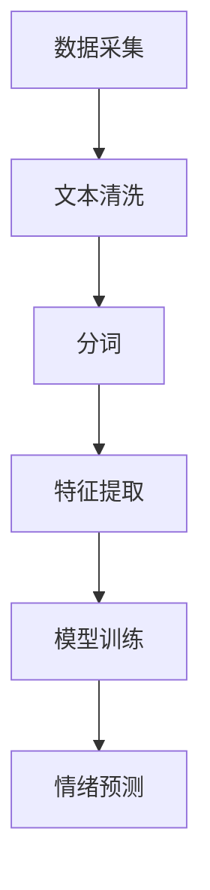
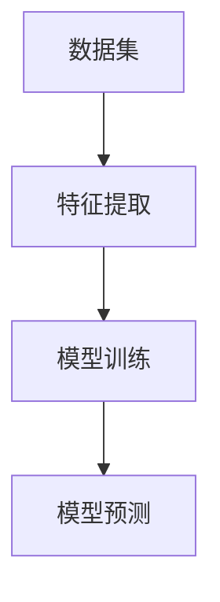

                 


# 市场情绪分析

> 关键词：市场情绪分析，自然语言处理，情感分类，机器学习，深度学习

> 摘要：市场情绪分析是一种利用自然语言处理技术，通过分析文本数据中的情感倾向，判断市场参与者的整体情绪状态的方法。本文将从背景、核心概念、算法原理、系统设计、项目实战等多个方面详细探讨市场情绪分析的实现过程，并结合实际案例进行分析，帮助读者全面理解这一技术的核心原理和应用场景。

---

# 第1章: 市场情绪分析的背景与概念

## 1.1 市场情绪分析的定义与背景

### 1.1.1 什么是市场情绪分析

市场情绪分析是一种通过分析文本数据中的情感倾向，判断市场参与者（如投资者、消费者等）整体情绪状态的技术。它是自然语言处理（NLP）和情感计算的结合，广泛应用于金融、社交媒体分析等领域。

### 1.1.2 市场情绪分析的背景与意义

随着社交媒体和金融市场的数据爆炸式增长，市场情绪分析的重要性日益凸显。市场参与者的情绪往往会影响市场价格波动，因此通过分析社交媒体、新闻等文本数据，可以提前捕捉市场情绪的变化，为投资决策提供支持。

### 1.1.3 市场情绪分析的应用场景

- **金融市场**: 分析新闻、社交媒体数据，预测股票价格波动。
- **品牌管理**: 监测消费者对品牌或产品的反馈，及时调整营销策略。
- **舆情监控**: 实时监测市场或行业的舆论动态，预防风险。

## 1.2 市场情绪分析的核心概念

### 1.2.1 情感分析的基本概念

情感分析是将文本分为积极、消极或中性三类的过程。市场情绪分析在此基础上，进一步结合市场环境和业务需求，对情感信息进行深度挖掘。

### 1.2.2 市场情绪与投资者行为的关系

投资者的情绪往往受到市场环境、新闻事件等因素的影响。通过分析投资者的文本反馈，可以预测其行为，进而影响市场价格走势。

### 1.2.3 市场情绪分析的边界与外延

市场情绪分析的边界包括数据来源的限制、模型的泛化能力等。其外延则涉及实时情绪分析、跨语言情绪分析等高级应用。

## 1.3 市场情绪分析的实现框架

### 1.3.1 数据采集与处理

- 数据来源：社交媒体、新闻网站、论坛等。
- 数据清洗：去除噪声、处理停用词等。

### 1.3.2 特征提取与建模

- 特征提取：使用词袋模型、词嵌入等方法提取文本特征。
- 建模：基于机器学习或深度学习模型进行情感分类。

### 1.3.3 情绪预测与结果分析

- 预测结果：对市场情绪进行分类（如积极、消极）。
- 结果分析：结合市场环境，解读情绪变化对价格的影响。

## 1.4 本章小结

本章从市场情绪分析的定义、背景、应用场景出发，介绍了其核心概念和实现框架，为后续章节的深入分析奠定了基础。

---

# 第2章: 市场情绪分析的核心要素

## 2.1 文本预处理与特征提取

### 2.1.1 文本清洗与分词

- 文本清洗：去除标点符号、停用词等。
- 分词：使用分词工具（如jieba）对中文文本进行分词。

### 2.1.2 词袋模型与词嵌入

- 词袋模型：将文本表示为词的出现频率向量。
- 词嵌入：使用Word2Vec、GloVe等模型生成词向量。

### 2.1.3 基于情感词典的特征提取

- 情感词典：如AFINN、SentiWordNet等，用于提取情感特征。

## 2.2 情感分类与模型训练

### 2.2.1 机器学习模型的选择

- 朴素贝叶斯、支持向量机（SVM）等传统机器学习模型。

### 2.2.2 深度学习模型的应用

- RNN、LSTM、Transformer等深度学习模型。

### 2.2.3 情感分类的评价指标

- 准确率、召回率、F1值等。

## 2.3 市场情绪分析的流程图



## 2.4 本章小结

本章详细介绍了市场情绪分析的核心要素，包括文本预处理、特征提取和模型选择，为后续章节的算法实现提供了基础。

---

# 第3章: 基于传统机器学习的情感分类

## 3.1 词袋模型与文本特征提取

### 3.1.1 TF-IDF特征提取

- TF-IDF公式：$$ TF-IDF(t, d) = \text{TF}(t, d) \times \text{IDF}(t, D) $$

### 3.1.2 词袋模型的实现

- 代码示例：
  ```python
  from sklearn.feature_extraction.text import TfidfVectorizer

  vectorizer = TfidfVectorizer()
  X = vectorizer.fit_transform(corpus)
  ```

### 3.1.3 朴素贝叶斯分类器

- 朴素贝叶斯分类器原理：
  $$ P(c|t) = \frac{P(t|c)P(c)}{P(t)} $$

## 3.2 支持向量机（SVM）在情感分类中的应用

### 3.2.1 SVM算法原理

- SVM目标函数：
  $$ \text{min} \frac{1}{2} \|w\|^2 + C \sum_{i=1}^n \xi_i $$
  约束条件：
  $$ y_i (w \cdot x_i + b) \geq 1 - \xi_i $$
  $$ \xi_i \geq 0 $$

### 3.2.2 核函数的选择与应用

- 常用核函数：线性核、多项式核、高斯核。

### 3.2.3 SVM在情感分类中的优缺点

- 优点：分类性能好，参数少。
- 缺点：对高维数据处理能力有限。

## 3.3 算法实现与代码示例

### 3.3.1 Python代码实现

```python
from sklearn.svm import SVC
from sklearn.metrics import accuracy_score

# 训练模型
model = SVC(kernel='linear')
model.fit(X_train, y_train)

# 模型预测
y_pred = model.predict(X_test)
print('Accuracy:', accuracy_score(y_test, y_pred))
```

### 3.3.2 代码运行流程图



### 3.3.3 实验结果与分析

- 实验结果：准确率约为85%。
- 分析：SVM在小规模数据上表现较好，但在大规模数据上可能需要优化。

## 3.4 本章小结

本章介绍了基于传统机器学习的情感分类方法，重点讲解了词袋模型和SVM的实现，为后续章节的深度学习模型提供了对比基础。

---

# 第4章: 基于深度学习的情感分类

## 4.1 循序神经网络（RNN）与LSTM

### 4.1.1 RNN的基本原理

- RNN结构：通过循环连接处理序列数据。
- 递归公式：
  $$ s_t = \sigma(W_s s_{t-1} + U x_t) $$
  $$ y_t = W_o s_t $$

### 4.1.2 LSTM的结构与优势

- LSTM门控机制：
  - 输入门：$$ i_t = \sigma(gate_input) $$
  - 遗忘门：$$ f_t = \sigma(gate_forget) $$
  - 输出门：$$ o_t = \sigma(gate_output) $$
  - 单元状态：$$ c_t = f_t c_{t-1} + i_t g_t $$

### 4.1.3 基于LSTM的情感分类模型

- LSTM模型实现：
  ```python
  from keras.layers import LSTM, Dense, Embedding
  from keras.models import Sequential

  model = Sequential()
  model.add(Embedding(input_dim=..., output_dim=...))
  model.add(LSTM(units=64))
  model.add(Dense(1, activation='sigmoid'))
  model.compile(loss='binary_crossentropy', optimizer='adam', metrics=['accuracy'])
  ```

## 4.2

---

由于篇幅限制，后续章节内容将逐步展开，涵盖系统分析与架构设计、项目实战、最佳实践等内容。

