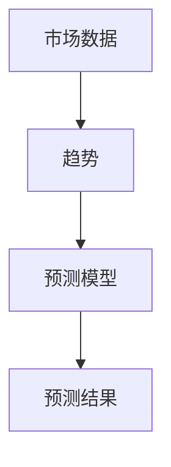
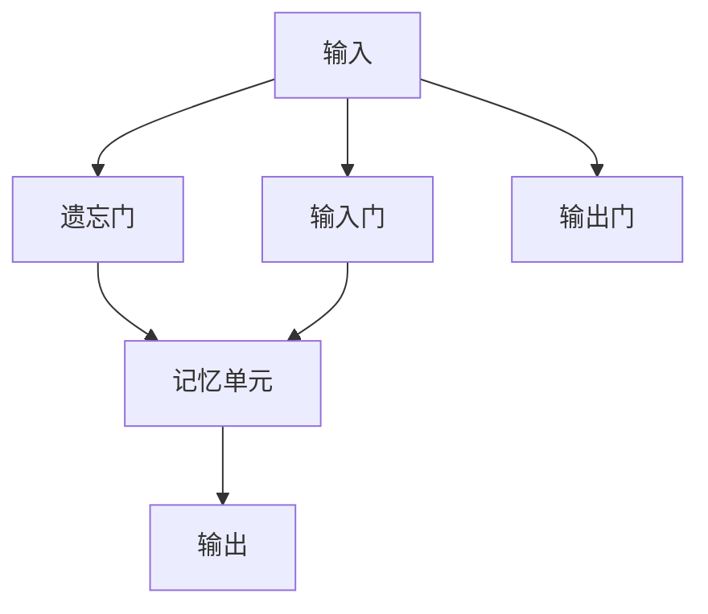
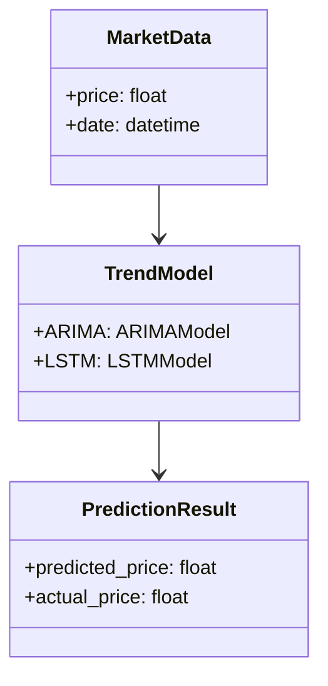
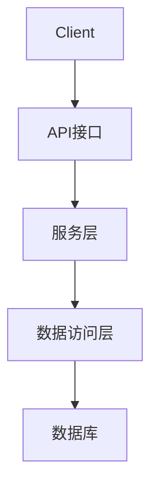

                 


# 市场趋势预测模型

## 关键词
市场趋势预测模型、时间序列分析、机器学习、LSTM、ARIMA、预测算法

## 摘要
市场趋势预测模型是利用数据分析和机器学习技术，通过对历史数据的分析，预测未来市场趋势的一种方法。本文从背景、核心概念、算法原理、系统设计、项目实战等多个方面详细探讨市场趋势预测模型的构建与应用，旨在帮助读者理解如何利用这些模型在实际业务中进行趋势预测。

---

# 第一部分：市场趋势预测模型概述

## 第1章：市场趋势预测模型的背景与意义

### 1.1 市场趋势预测的背景
#### 1.1.1 经济市场中的趋势分析需求
在现代经济中，市场趋势预测是企业制定战略决策的重要依据。无论是金融、零售还是供应链管理，准确预测市场趋势都能帮助企业提前做好准备，抓住机遇，规避风险。

#### 1.1.2 技术进步对趋势预测的影响
随着大数据和人工智能技术的快速发展，市场趋势预测的方法和工具也在不断进步。传统的统计方法逐渐被更复杂的机器学习算法所取代，预测的准确性和效率都有了显著提升。

#### 1.1.3 市场趋势预测的现实意义
准确的市场趋势预测可以帮助企业优化资源配置、降低运营成本，并在竞争激烈的市场中占据优势。特别是在金融领域，趋势预测直接关系到投资决策的成败。

### 1.2 市场趋势预测的核心问题
#### 1.2.1 数据驱动的预测方法
数据驱动的预测方法依赖于大量历史数据，通过分析数据中的模式和趋势，生成预测结果。这种方法的优势在于能够捕捉数据中的复杂关系，但对数据质量和数量的要求较高。

#### 1.2.2 统计与机器学习的结合
传统的统计方法（如回归分析）和现代的机器学习算法（如神经网络）各有优劣。将两者结合使用，可以充分利用统计方法的可解释性和机器学习算法的非线性建模能力。

#### 1.2.3 预测模型的可解释性与稳定性
在实际应用中，预测模型的可解释性和稳定性同样重要。一个复杂的模型可能预测准确，但如果无法解释其工作原理，可能会影响用户对模型的信任和应用。

### 1.3 市场趋势预测模型的应用场景
#### 1.3.1 金融市场的趋势预测
在金融市场中，趋势预测主要用于股票价格预测、汇率波动分析等领域。通过预测模型，投资者可以做出更明智的投资决策。

#### 1.3.2 零售行业的销售预测
零售行业可以通过预测模型预测不同产品或时间段的销售量，从而优化库存管理和销售策略。

#### 1.3.3 供应链管理中的需求预测
在供应链管理中，需求预测是优化生产和物流的关键。准确的需求预测可以减少库存积压和运输成本。

### 1.4 本章小结
本章介绍了市场趋势预测模型的背景、核心问题以及应用场景，为后续内容奠定了基础。

---

# 第二部分：市场趋势预测模型的核心概念与联系

## 第2章：市场趋势预测模型的核心概念

### 2.1 数据驱动的预测方法
#### 2.1.1 时间序列分析
时间序列分析是通过分析数据随时间的变化规律，预测未来趋势的一种方法。常用的方法包括ARIMA、LSTM等。

#### 2.1.2 统计回归分析
统计回归分析通过建立变量之间的线性关系，预测目标变量的值。回归分析简单易用，但适用于线性关系较强的数据。

#### 2.1.3 机器学习算法
机器学习算法（如随机森林、支持向量机）能够捕捉数据中的非线性关系，适合处理复杂的市场数据。

### 2.2 市场趋势预测模型的属性特征对比
#### 2.2.1 不同模型的特征对比表格
以下是一个对比表格：

| 模型类型 | 优点 | 缺点 | 适用场景 |
|----------|------|------|----------|
| ARIMA    | 易解释，适合线性趋势 | 对非线性趋势预测效果较差 | 时间序列数据 |
| LSTM     | 能捕捉长期依赖关系 | 训练时间较长，参数多 | 复杂时间序列数据 |
| 随机森林 | 抗过拟合能力强 | 可解释性较差 | 多变量数据 |

#### 2.2.2 模型的优缺点分析
- **ARIMA**：优点是简单易用，缺点是对非线性趋势预测效果较差。
- **LSTM**：优点是能够捕捉长期依赖关系，缺点是训练时间较长。

#### 2.2.3 模型适用场景的对比
ARIMA适合处理线性时间序列数据，而LSTM更适合处理复杂的时间序列数据。

### 2.3 市场趋势预测模型的ER实体关系图
以下是一个简单的ER实体关系图：


---

# 第三部分：市场趋势预测模型的算法原理

## 第3章：时间序列分析算法

### 3.1 ARIMA模型
#### 3.1.1 ARIMA模型的基本原理
ARIMA（自回归积分滑动平均模型）是一种常用的时间序列预测模型，由自回归（AR）和滑动平均（MA）两部分组成。

#### 3.1.2 ARIMA模型的数学公式
$$ ARIMA(p, d, q) $$
其中，p为自回归阶数，d为差分阶数，q为滑动平均阶数。

#### 3.1.3 ARIMA模型的实现步骤
1. 数据预处理：对原始数据进行差分，使其平稳。
2. 参数选择：通过网格搜索选择最佳的p、d、q。
3. 模型训练：使用训练数据训练ARIMA模型。
4. 模型预测：利用训练好的模型进行未来趋势预测。

#### 3.1.4 ARIMA模型的优缺点
- 优点：简单易用，适合线性时间序列数据。
- 缺点：对非线性趋势预测效果较差。

### 3.2 LSTM模型
#### 3.2.1 LSTM模型的基本原理
LSTM（长短期记忆网络）是一种特殊的RNN，通过门控机制来解决梯度消失问题，能够捕捉长期依赖关系。

#### 3.2.2 LSTM模型的结构图


#### 3.2.3 LSTM模型的数学公式
$$ f(t) = \sigma(W_f x_t + U_f h_{t-1} + b_f) $$
其中，$f$ 为遗忘门的激活函数，$x_t$ 为输入，$h_{t-1}$ 为前一时刻的隐藏状态。

#### 3.2.4 LSTM模型的实现步骤
1. 数据预处理：将时间序列数据转换为适合LSTM输入的格式。
2. 模型构建：定义LSTM模型的结构，包括遗忘门、输入门和输出门。
3. 模型训练：使用训练数据训练LSTM模型。
4. 模型预测：利用训练好的模型进行未来趋势预测。

#### 3.2.5 LSTM模型的优缺点
- 优点：能够捕捉长期依赖关系，适合复杂的时间序列数据。
- 缺点：训练时间较长，参数较多。

---

## 第4章：系统分析与架构设计

### 4.1 问题场景介绍
在本章中，我们将介绍一个具体的市场趋势预测项目，例如股票价格预测。

### 4.2 系统功能设计
#### 4.2.1 领域模型（类图）


#### 4.2.2 系统架构设计


#### 4.2.3 系统交互设计
```mermaid
sequenceDiagram
    Client -> API: 发送预测请求
    API -> Service: 调用预测服务
    Service -> DAO: 获取市场数据
    DAO -> DB: 查询数据
    DAO <- DB: 返回数据
    Service -> TrendModel: 训练模型
    TrendModel -> DAO: 保存预测结果
    DAO <- TrendModel: 返回预测结果
    Service -> Client: 返回预测结果
```

---

## 第5章：项目实战

### 5.1 环境安装
#### 5.1.1 安装Python和必要的库
安装Python和以下库：
- `numpy`
- `pandas`
- `sklearn`
- `keras`
- `tensorflow`

#### 5.1.2 安装Jupyter Notebook
```bash
pip install jupyter
```

### 5.2 系统核心实现源代码
#### 5.2.1 ARIMA模型实现
```python
from statsmodels.tsa.arima_model import ARIMA
import numpy as np

# 生成模拟数据
data = np.random.rand(100)

# 训练ARIMA模型
model = ARIMA(data, order=(1, 1, 1))
model_fit = model.fit()

# 预测未来10个点
forecast = model_fit.forecast(10)
print(forecast)
```

#### 5.2.2 LSTM模型实现
```python
from keras.models import Sequential
from keras.layers import LSTM, Dense
import numpy as np

# 生成模拟数据
X = np.random.rand(100, 1, 1)
y = np.random.rand(100, 1)

# 构建LSTM模型
model = Sequential()
model.add(LSTM(50, input_shape=(1, 1)))
model.add(Dense(1))
model.compile(loss='mean_squared_error', optimizer='adam')

# 训练模型
model.fit(X, y, epochs=50, batch_size=1)

# 预测未来10个点
X_pred = np.random.rand(10, 1, 1)
y_pred = model.predict(X_pred)
print(y_pred)
```

#### 5.2.3 模型结果分析
通过对模拟数据的预测结果进行分析，可以验证模型的预测效果。例如，ARIMA模型的预测结果可以通过比较预测值和实际值来评估模型的准确性。

### 5.3 项目小结
本章通过具体的案例分析，详细讲解了ARIMA和LSTM模型的实现过程，并通过代码示例展示了如何将这些模型应用于实际项目中。

---

## 第6章：总结与展望

### 6.1 总结
本文详细探讨了市场趋势预测模型的构建与应用，从背景、核心概念、算法原理到系统设计和项目实战，为读者提供了一个全面的视角。

### 6.2 当前研究的不足
尽管市场趋势预测模型在实际应用中取得了显著成效，但仍存在一些不足之处，例如模型的可解释性问题和预测结果的稳定性问题。

### 6.3 未来的发展方向
未来的研究可以集中在以下几个方面：
1. 提高模型的可解释性。
2. 结合多模态数据（如文本、图像）进行预测。
3. 研究模型的鲁棒性，使其能够适应复杂多变的市场环境。

### 6.4 最佳实践 tips
- 在实际应用中，建议结合多种模型进行预测，以提高预测的准确性和稳定性。
- 数据预处理是模型训练的关键步骤，建议花更多时间进行数据清洗和特征工程。
- 定期更新模型，以适应市场环境的变化。

---

通过本文的探讨，相信读者能够对市场趋势预测模型有一个全面的理解，并能够将其应用到实际业务中，为企业创造更大的价值。

