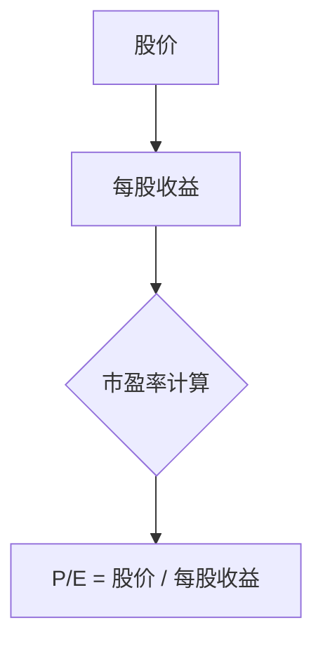

                 

# 市盈率（P/E）在全球股市估值中的应用

## 关键词：市盈率, 股市估值, 投资策略, 股票分析, 金融市场

## 摘要：市盈率（P/E）是评估股票价值的重要指标，它通过比较股票价格与每股收益，帮助投资者判断股票是否被高估或低估。本文从市盈率的基本概念、计算方法、理论基础、算法原理、在不同市场环境下的表现，以及在投资策略中的应用等方面进行详细分析。结合实际案例和数据，探讨市盈率在全球股市估值中的实际应用，帮助投资者更好地理解和应用这一指标。

---

## 第1章: 市盈率（P/E）的基本概念与理论基础

### 1.1 市盈率的定义与计算方法

#### 1.1.1 市盈率的定义
市盈率（P/E，Price-to-Earnings Ratio）是衡量股票价值的重要指标，定义为股票的市场价格除以每股收益（EPS）。公式如下：
$$ P/E = \frac{\text{股价}}{\text{每股收益}} $$

市盈率反映了市场对公司未来盈利能力的预期，是评估股票是否被高估或低估的重要工具。

#### 1.1.2 市盈率的计算公式与应用场景
市盈率的计算公式为：
$$ P/E = \frac{\text{股价}}{\text{每股收益}} $$

其中，股价是公司当前的市场价，每股收益（EPS）是公司净利润除以总股本。市盈率的应用场景包括：
- 评估股票的相对价值
- 比较不同股票的投资吸引力
- 判断市场对公司未来盈利的预期

#### 1.1.3 市盈率与股价的关系
市盈率与股价呈正相关关系，即市盈率越高，股价相对越高。然而，市盈率过高可能意味着股价被高估，存在投资风险。

### 1.2 市盈率的分类与特点

#### 1.2.1 静态市盈率与动态市盈率
静态市盈率基于过去一年的净利润计算，而动态市盈率则基于对未来一年净利润的预测。两者在计算时使用不同的数据，动态市盈率更能反映市场对未来盈利的预期。

#### 1.2.2 市盈率的优缺点分析
- 优点：计算简单，易于比较；反映市场对公司的预期。
- 缺点：受公司盈利能力波动影响较大；不适用于亏损公司。

#### 1.2.3 市盈率与其他估值指标的对比
市盈率与市净率（P/B）、股息率等指标相比，市盈率更关注公司的盈利能力，而市净率关注资产价值，股息率关注分红能力。

### 1.3 市盈率在股市中的意义

#### 1.3.1 市盈率反映市场对公司的预期
市盈率高表明市场对公司未来盈利有较高预期，市盈率低则可能表明市场对公司前景持谨慎态度。

#### 1.3.2 市盈率与公司盈利能力的关系
市盈率与公司盈利能力呈正相关，但高市盈率并不一定意味着公司盈利能力强，可能只是市场预期较高。

#### 1.3.3 市盈率在投资决策中的作用
市盈率帮助投资者判断股票的估值水平，是制定买入、卖出决策的重要参考。

---

## 第2章: 市盈率的核心概念与理论基础

### 2.1 市盈率的理论基础

#### 2.1.1 股票估值的基本原理
股票估值基于公司未来现金流的现值，市盈率是其中一种常用的简化估值方法。

#### 2.1.2 市盈率与企业价值的关系
市盈率反映了企业价值与盈利之间的关系，高市盈率可能意味着企业价值被市场高估。

#### 2.1.3 市盈率与市场情绪的影响
市盈率受市场情绪影响较大，牛市中市盈率通常偏高，熊市中则可能偏低。

### 2.2 市盈率的核心要素分析

#### 2.2.1 每股收益（EPS）的计算与影响
每股收益是市盈率计算的关键因素，EPS越高，市盈率越低，股票估值相对越低。

#### 2.2.2 市盈率与股价波动的关系
市盈率与股价波动呈正相关，市盈率高波动性可能较大，市盈率低波动性可能较小。

#### 2.2.3 市盈率与公司成长性的结合
市盈率与公司成长性密切相关，高成长公司通常具有较高的市盈率。

### 2.3 市盈率的数学模型与公式

#### 2.3.1 市盈率的基本公式
$$ P/E = \frac{\text{股价}}{\text{每股收益}} $$

#### 2.3.2 市盈率与股票收益率的关系
市盈率与股票收益率呈负相关，高市盈率可能意味着较低的预期收益率。

#### 2.3.3 市盈率与股票风险的数学模型
市盈率高可能意味着高风险，市盈率低可能意味着低风险。

---

## 第3章: 市盈率的算法原理与数学模型

### 3.1 市盈率的计算公式与流程图

#### 3.1.1 市盈率计算流程图

#### 3.1.2 市盈率计算的数学公式
$$ P/E = \frac{\text{股价}}{\text{每股收益}} $$

#### 3.1.3 市盈率计算的注意事项
- 确保使用相同的会计期间数据
- 考虑公司是否盈利
- 考虑市盈率的静态与动态差异

### 3.2 市盈率与股票估值的关系

#### 3.2.1 市盈率与股票内在价值的对比
市盈率反映市场对股票价值的评估，内在价值基于公司未来现金流的现值。

#### 3.2.2 市盈率与股票市场价格的互动关系
市盈率高可能表明股价被高估，市盈率低可能表明股价被低估。

#### 3.2.3 市盈率在股票估值中的应用
市盈率帮助投资者判断股票是否具有投资价值，是估值的重要参考指标。

### 3.3 市盈率的数学模型与公式

#### 3.3.1 市盈率的基本公式
$$ P/E = \frac{\text{股价}}{\text{每股收益}} $$

#### 3.3.2 市盈率与股票收益率的关系公式
$$ \text{收益率} = \frac{\text{股价变化}}{\text{初始股价}} \times 100\% $$

#### 3.3.3 市盈率与股票风险的数学模型
市盈率高可能意味着高风险，市盈率低可能意味着低风险。

---

## 第4章: 市盈率在不同市场环境下的表现

### 4.1 不同市场环境下市盈率的变化

#### 4.1.1 牛市中市盈率的高估现象
牛市中市场情绪高涨，市盈率通常偏高，可能超过行业平均水平。

#### 4.1.2 熊市中市盈率的低估现象
熊市中市场情绪低迷，市盈率通常偏低，可能低于行业平均水平。

#### 4.1.3 经济周期对市盈率的影响
经济繁荣时市盈率高，经济衰退时市盈率低。

### 4.2 不同行业市盈率的差异

#### 4.2.1 高增长行业市盈率的特点
高增长行业通常具有较高的市盈率，因为市场预期未来盈利能力强。

#### 4.2.2 低增长行业市盈率的特点
低增长行业市盈率通常较低，因为市场预期未来盈利能力有限。

#### 4.2.3 周期性行业市盈率的波动
周期性行业市盈率波动较大，受经济周期影响显著。

### 4.3 不同国家股市市盈率的比较

#### 4.3.1 美国股市市盈率的分析
美国股市市盈率通常较高，反映了市场的高预期和高增长。

#### 4.3.2 中国股市市盈率的分析
中国股市市盈率波动较大，受政策和经济环境影响显著。

#### 4.3.3 其他主要股市市盈率的对比
不同国家股市市盈率差异较大，反映了各自市场的特点和经济状况。

---

## 第5章: 市盈率在投资策略中的应用

### 5.1 市盈率与投资策略的关系

#### 5.1.1 市盈率在价值投资中的应用
价值投资者通常寻找市盈率低于行业平均水平的股票，寻找被低估的投资机会。

#### 5.1.2 市盈率在成长投资中的应用
成长投资者通常关注高市盈率的股票，寻找具有高增长潜力的公司。

#### 5.1.3 市盈率在趋势投资中的应用
趋势投资者可能关注市盈率的变化趋势，寻找市盈率即将变化的股票。

### 5.2 市盈率与投资组合的构建

#### 5.2.1 市盈率在投资组合中的作用
市盈率帮助投资者评估股票的估值水平，是构建投资组合的重要参考。

#### 5.2.2 市盈率与风险控制的关系
高市盈率股票风险较大，低市盈率股票风险较小，市盈率是风险控制的重要指标。

#### 5.2.3 市盈率在资产配置中的应用
市盈率帮助投资者进行资产配置，平衡成长型和价值型资产的比例。

### 5.3 市盈率与投资决策的结合

#### 5.3.1 市盈率在买入决策中的应用
市盈率低于行业平均水平时，可能是买入的好时机。

#### 5.3.2 市盈率在卖出决策中的应用
市盈率远高于行业平均水平时，可能是卖出的信号。

#### 5.3.3 市盈率与投资策略的结合
市盈率是投资策略的重要组成部分，结合其他指标（如市净率、股息率）可以更全面地评估股票价值。

---

## 第6章: 结论与展望

### 6.1 市盈率在全球股市估值中的重要性
市盈率是评估股票价值的重要指标，反映了市场对公司未来盈利的预期。

### 6.2 未来研究方向
- 市盈率与公司治理的关系
- 市盈率与企业社会责任的关系
- 市盈率与可持续发展投资的关系

### 6.3 最佳实践 tips
- 结合市盈率与市净率等其他指标进行综合分析
- 注意市盈率的动态变化，及时调整投资策略
- 高市盈率股票风险较大，需谨慎投资

---

通过以上结构，我们可以全面了解市盈率在全球股市估值中的应用，从基础概念到实际应用，帮助投资者更好地理解和应用这一指标。

