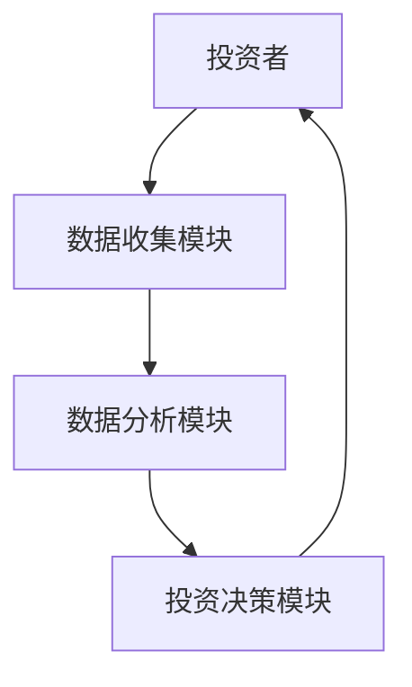

                 


# 市盈率低于15的重要性

---

## 关键词

市盈率，投资，价值投资，低市盈率股票，股票估值，投资策略

---

## 摘要

市盈率是衡量股票价值的重要指标之一，市盈率低于15通常被视为投资机会的信号。本文将深入探讨市盈率的定义、计算方法及其在投资决策中的应用，分析市盈率低于15的含义和重要性，结合实际案例和投资策略，帮助投资者更好地理解和应用这一指标。

---

## 第一部分：市盈率的定义与重要性

### 第1章：市盈率的基本概念

#### 1.1 市盈率的定义与计算

**1.1.1 市盈率的定义**

市盈率（Price-to-Earnings Ratio，简称P/E）是衡量股票价格与每股收益（EPS）之间关系的重要指标。它反映了投资者为每股净利润愿意支付的价格，是评估股票价值的重要工具。

市盈率的计算公式如下：

$$\text{市盈率} = \frac{\text{股票价格}}{\text{每股收益}}$$

**1.1.2 市盈率的计算公式**

假设某公司股票价格为 $P$，每股收益为 $EPS$，则市盈率为：

$$\text{P/E} = \frac{P}{EPS}$$

**1.1.3 市盈率的分类与特点**

市盈率可以分为静态市盈率和动态市盈率。静态市盈率使用过去的每股收益（通常是上一财年的数据）进行计算，而动态市盈率则使用预期的每股收益（通常是未来一年的预测数据）。

**1.2 市盈率与其他估值指标的对比**

以下表格对比了市盈率（P/E）、市净率（P/B）和股息率（Dividend Yield）的主要区别：

| 指标 | 定义 | 适用场景 | 优点 | 缺点 |
|------|------|----------|------|------|
| P/E | 股票价格/每股收益 | 评估盈利能力 | 简单易用 | 受会计政策影响 |
| P/B | 股票价格/每股净资产 | 评估资产价值 | 考虑资产质量 | 忽略了盈利能力 |
| Dividend Yield | 每股股息/股票价格 | 评估分红能力 | 考虑现金流 | 受分红政策影响 |

**1.3 市盈率的行业差异**

不同行业的市盈率差异显著。例如，科技行业的市盈率通常较高，而传统制造业的市盈率较低。市盈率与行业生命周期密切相关，例如，成长期行业的市盈率通常较高，而衰退期行业的市盈率较低。

---

## 第二部分：市盈率低于15的含义与投资价值

### 第2章：市盈率低于15的意义

#### 2.1 市盈率低于15的定义

市盈率低于15意味着股票价格相对于每股收益较低，通常被视为价值投资的机会。

#### 2.2 市盈率低于15的行业分析

低市盈率行业通常集中在传统制造业、公用事业等领域，这些行业具有稳定的收益和较低的成长性。

#### 2.3 市盈率低于15的公司特征

低市盈率的公司通常具有稳定的盈利能力、较低的成长性和较高的股息支付率。

---

## 第三部分：市盈率低于15的投资策略

### 第3章：市盈率低于15的投资价值

#### 3.1 低市盈率股票的投资机会

低市盈率股票通常具有较高的安全边际，适合价值投资者长期持有。

#### 3.2 低市盈率股票的筛选标准

- 公司市盈率低于15
- 公司具有稳定的盈利能力
- 公司财务状况健康

#### 3.3 低市盈率股票的投资风险

- 市场波动风险
- 公司业绩下滑风险
- 行业政策风险

---

## 第四部分：算法与计算

### 第4章：市盈率的计算方法

#### 4.1 市盈率的计算步骤

1. 收集股票价格和每股收益数据
2. 使用公式计算市盈率
3. 对比行业平均市盈率

#### 4.2 市盈率计算的Python代码实现

```python
import pandas as pd

# 假设我们有一个包含股票数据的DataFrame df
# 包含'Price'和'EPS'两列

# 计算市盈率
df['P/E'] = df['Price'] / df['EPS']

# 打印结果
print(df.head())
```

---

## 第五部分：系统分析与架构设计

### 第5章：投资决策系统的构建

#### 5.1 问题场景介绍

投资者需要一个系统来筛选市盈率低于15的股票，并进行深入分析。

#### 5.2 系统功能设计

- 数据收集模块
- 数据分析模块
- 投资决策模块

#### 5.3 系统架构设计

以下为系统的架构图：



---

## 第六部分：项目实战

### 第6章：市盈率低于15的股票筛选与分析

#### 6.1 环境安装

安装必要的Python库：

```bash
pip install pandas numpy matplotlib
```

#### 6.2 核心代码实现

```python
import pandas as pd
import matplotlib.pyplot as plt

# 假设我们有一个包含股票数据的DataFrame df
# 包含'Price'和'EPS'两列

# 计算市盈率
df['P/E'] = df['Price'] / df['EPS']

# 筛选市盈率低于15的股票
low_pe_stocks = df[df['P/E'] < 15]

# 绘制市盈率分布图
plt.hist(df['P/E'], bins=20, alpha=0.7)
plt.xlabel('P/E Ratio')
plt.ylabel('Frequency')
plt.title('Distribution of P/E Ratios')
plt.show()
```

#### 6.3 实际案例分析

以某行业为例，筛选市盈率低于15的股票，并分析其投资价值。

---

## 第七部分：最佳实践与小结

### 第7章：投资策略与注意事项

#### 7.1 最佳实践

- 定期审视投资组合
- 分散投资以降低风险
- 结合其他估值指标进行综合分析

#### 7.2 投资注意事项

- 市盈率低并不意味着没有风险
- 需要考虑公司的财务状况和行业前景
- 市场波动可能影响市盈率的短期表现

#### 7.3 项目小结

通过系统化的分析和实际案例的分析，我们可以更好地理解市盈率低于15的重要性，并在实际投资中加以应用。

---

## 第八部分：拓展阅读与深入思考

### 第8章：市盈率与投资策略的进一步探讨

#### 8.1 深入思考

市盈率是投资决策中的重要工具，但需结合其他因素进行综合分析。

#### 8.2 拓展阅读

建议进一步阅读以下书籍和文章：

- 《价值投资实战策略》
- 《投资学基础》
- 《股票估值指标全解析》

---

## 结语

市盈率低于15的股票通常被视为价值投资的机会，但投资者需综合考虑公司财务状况、行业前景和市场环境，制定合理的投资策略。通过系统化的分析和实际案例的分析，我们可以更好地理解市盈率的重要性，并在实际投资中加以应用。

