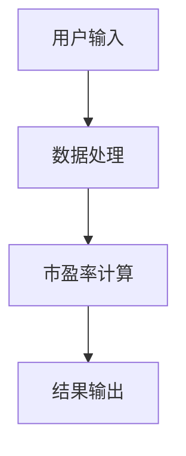
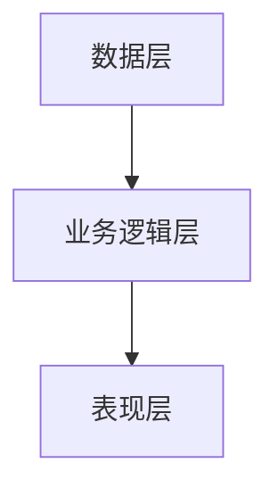

                 


# 市盈率法在企业估值中的应用

## 关键词：市盈率法、企业估值、投资分析、财务指标、估值模型

## 摘要：市盈率法是一种广泛应用于企业估值的方法，通过分析市盈率与企业盈利情况的关系，帮助投资者评估企业的内在价值。本文详细探讨了市盈率法的背景、核心原理、数学模型、系统架构设计以及实际项目案例，旨在为投资者和分析人员提供深入的理论支持和实践指导。

---

# 第1章：市盈率法的背景与概念

## 1.1 市盈率法的起源与发展

市盈率法起源于20世纪初，随着股票市场的发展，投资者开始寻求更有效的估值方法。市盈率法通过比较企业的市场价与盈利情况，帮助投资者评估股票的合理价格。随着金融理论的发展，市盈率法逐渐成为企业估值的重要工具之一。

## 1.2 市盈率法的核心概念

市盈率法的核心在于将企业的市场价与每股收益（EPS）进行比较，公式为：

$$ P/E = \frac{Market\ Price}{Earnings\ Per\ Share} $$

市盈率反映了市场对公司未来盈利能力的预期，低市盈率可能意味着低估，高市盈率则可能表示高估或高增长预期。

## 1.3 市盈率法与其他估值方法的对比

与其他方法如市净率法和现金流折现法相比，市盈率法的优势在于简单易用，适用于盈利稳定的企业，但其局限性在于对非盈利企业的适用性较差。

---

# 第2章：市盈率法的核心原理与应用

## 2.1 市盈率法的数学模型与公式

市盈率法的核心公式为：

$$ Target\ Price = P/E \times Earnings\ Per\ Share $$

通过计算目标股价，投资者可以评估股票的合理价值。例如，若某公司每股收益为2元，行业平均市盈率为15倍，则目标股价为30元。

## 2.2 市盈率法的优缺点

- **优点**：简单易用，适用于盈利稳定的企业。
- **缺点**：不适用于亏损企业，受市场情绪影响较大。

---

# 第3章：系统分析与架构设计

## 3.1 系统功能设计

构建一个市盈率估值系统，包括数据输入、计算模块和结果输出。系统架构图如下：



## 3.2 系统架构设计

系统架构采用分层设计，包括数据层、业务逻辑层和表现层。架构图如下：



---

# 第4章：项目实战

## 4.1 环境安装

安装Python和相关库，如pandas和numpy。

## 4.2 核心代码实现

```python
import pandas as pd

def calculate_pe(stock_price, eps):
    pe = stock_price / eps
    return pe

# 示例数据
stock_price = 100
eps = 5
pe = calculate_pe(stock_price, eps)
print(f"市盈率：{pe}")
```

## 4.3 案例分析

以某公司为例，计算其目标股价并分析投资价值。

---

# 第5章：总结与展望

## 5.1 总结

市盈率法是一种简单有效的估值工具，但需结合企业基本面和市场环境进行分析。

## 5.2 展望

未来，市盈率法可能与人工智能技术结合，提高估值的准确性和效率。

---

# 结语

市盈率法在企业估值中的应用为企业价值评估提供了重要工具。通过本文的详细分析，读者可以更好地理解和应用市盈率法，做出更明智的投资决策。

