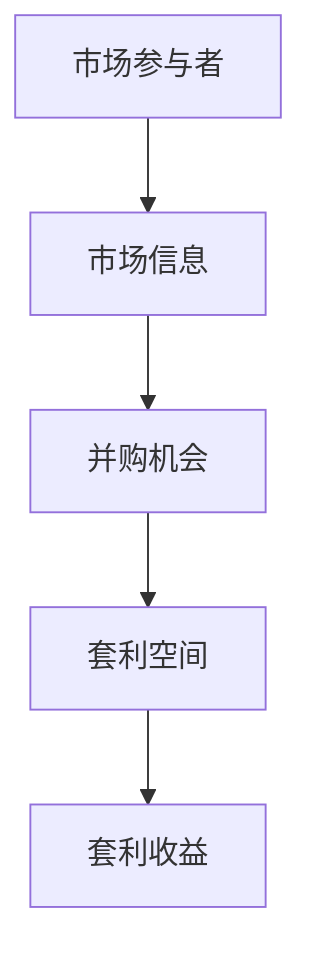
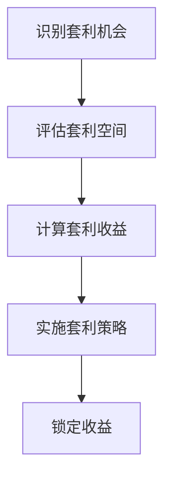
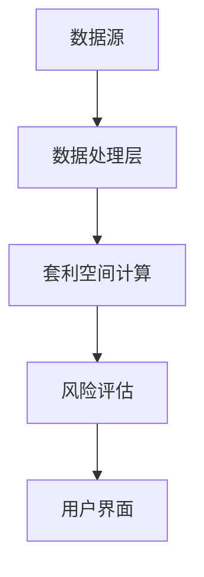
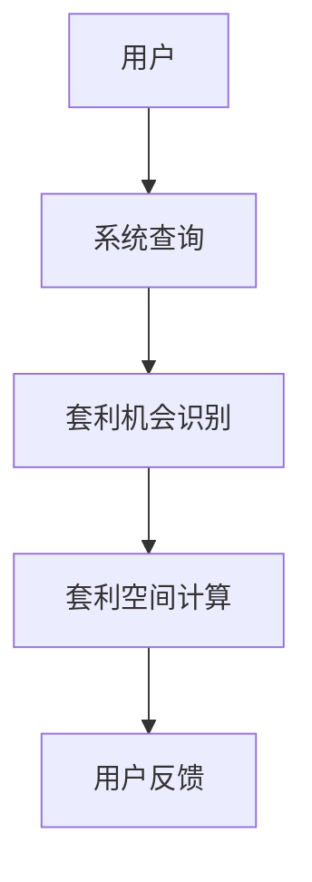

                 


# 并购套利策略：从企业重组中获利

## 关键词：
并购套利、企业重组、投资策略、财务套利、风险管理

## 摘要：
并购套利是一种通过识别和利用企业重组中的价格差异来获利的投资策略。本文详细探讨了并购套利的核心概念、算法原理、系统设计和实际案例，帮助读者掌握如何在企业重组中识别套利机会，计算套利空间，并实施套利策略，同时强调风险管理的重要性。

---

# 第一部分: 并购套利的背景与基础

## 第1章: 并购套利的基本概念

### 1.1 并购套利的定义与特点
#### 1.1.1 什么是并购套利
并购套利是指利用市场中的价格差异，通过在并购交易中买入低估资产并卖出高估资产，从而在市场重新定价时获利的一种投资策略。

#### 1.1.2 并购套利的核心特点
- **套利空间**：市场中存在价格差异，套利者通过 exploiting 这些差异获利。
- **短期性**：套利机会通常短暂，需快速识别和执行。
- **低风险**：套利基于市场 arbitrage，风险相对可控。

#### 1.1.3 并购套利的分类与边界
- **市场套利**：利用不同市场间的价格差异。
- **价格套利**：利用同一资产在不同时间或地点的价格差异。
- **信息套利**：利用信息不对称进行套利。

### 1.2 并购套利的历史与发展
#### 1.2.1 并购套利的起源
套利概念最早出现在古代贸易中，现代并购套利起源于20世纪60年代的并购浪潮。

#### 1.2.2 并购套利的发展历程
- 20世纪60年代：套利定价理论的提出。
- 20世纪80年代：并购套利在杠杆收购中的应用。
- 21世纪：套利策略结合大数据和算法交易。

#### 1.2.3 当前并购套利的现状与趋势
当前，并购套利结合金融科技，套利机会更加多样，但监管趋严。

### 1.3 并购套利的理论基础
#### 1.3.1 资本资产定价模型（CAPM）
$$ E(r_i) = r_f + \beta_i (E(r_m) - r_f) $$

#### 1.3.2 套利定价理论（APT）
$$ E(r_i) = \sum \lambda_j \beta_{ij} $$

#### 1.3.3 市场不完美与套利机会
套利机会源于市场不完美，如信息不对称、交易成本。

### 1.4 并购套利与企业重组的关系
#### 1.4.1 企业重组的定义与类型
- 企业重组：调整资本结构、资产组合和股权结构。
- 类型：合并、分拆、收购、出售。

#### 1.4.2 并购套利在企业重组中的作用
套利者通过企业重组中的价格差异获利，推动市场效率。

#### 1.4.3 并购套利与企业价值最大化
套利策略帮助企业在重组中实现价值最大化。

---

## 第2章: 并购套利的核心概念与联系

### 2.1 并购套利的核心概念
#### 2.1.1 市场套利机会
套利者利用市场定价差异，通过买入低价资产卖出高价资产获利。

#### 2.1.2 套利空间的计算
套利空间 = max(买入价 - 卖出价, 0)

#### 2.1.3 套利收益的实现
套利收益 = 套利空间 × 交易量

### 2.2 并购套利的核心要素
- 市场效率：市场是否存在套利机会。
- 信息不对称：信息优势影响套利空间。
- 交易成本：交易费用影响套利收益。

### 2.3 并购套利的ER实体关系图


---

## 第3章: 并购套利的算法原理

### 3.1 并购套利的数学模型
#### 3.1.1 市场均衡模型
$$ P = \sum_{i=1}^{n} w_i r_i $$

#### 3.1.2 套利收益计算
$$ \text{套利收益} = \sum (P_i - P_j) $$

### 3.2 并购套利的算法流程


### 3.3 并购套利的Python实现
```python
def calculate_arbitrage(price_high, price_low):
    arbitrage_space = price_high - price_low
    return arbitrage_space * quantity
```

---

## 第4章: 并购套利的系统分析与架构设计

### 4.1 问题场景介绍
市场中存在并购价格差异，套利者需要识别和利用这些机会。

### 4.2 系统功能设计
- 数据采集：收集市场数据。
- 套利空间计算：分析价格差异。
- 风险评估：评估套利风险。

### 4.3 系统架构设计


### 4.4 系统交互设计


---

## 第5章: 并购套利的项目实战

### 5.1 环境安装
- 安装Python和相关库（Pandas, NumPy）。

### 5.2 核心实现
```python
import pandas as pd
import numpy as np

def calculate_arbitrage():
    # 数据采集
    data = pd.read_csv('market_data.csv')
    # 套利机会识别
    price_diff = data['high'] - data['low']
    arbitrage_space = price_diff[price_diff > 0]
    return arbitrage_space
```

### 5.3 案例分析
案例：A公司收购B公司，市场价差为5%，套利空间为10%。

### 5.4 项目总结
套利策略需结合市场环境和风险管理。

---

## 第6章: 并购套利的风险管理与最佳实践

### 6.1 风险管理
- 市场风险：价格波动影响套利收益。
- 法律风险：监管政策变化。
- 流动性风险：资产变现能力。

### 6.2 最佳实践
- 保持信息敏感性。
- 控制交易成本。
- 建立风险管理机制。

---

## 第7章: 总结与展望

### 7.1 总结
并购套利通过识别价格差异获利，需结合市场环境和风险管理。

### 7.2 展望
未来，套利策略将结合大数据和人工智能，提高效率和准确性。

### 7.3 注意事项
- 注意市场变化。
- 遵守法律法规。
- 保持道德规范。

---

## 第8章: 拓展阅读
推荐书籍和资源，帮助读者深入学习并购套利。

---

# 结语
并购套利是一种高回报、低风险的投资策略，通过识别和利用企业重组中的价格差异，投资者可以在市场中获利。本文详细探讨了并购套利的理论基础、算法原理和实际应用，为读者提供了全面的指导。

