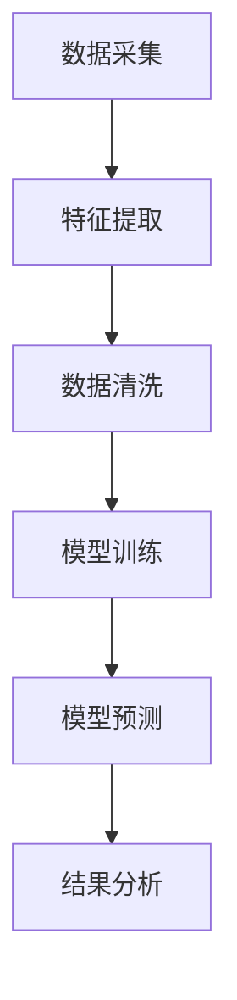
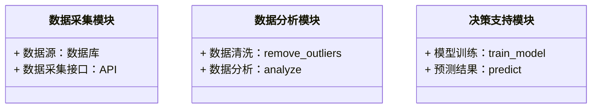
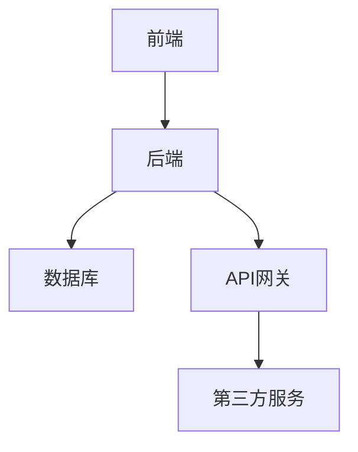
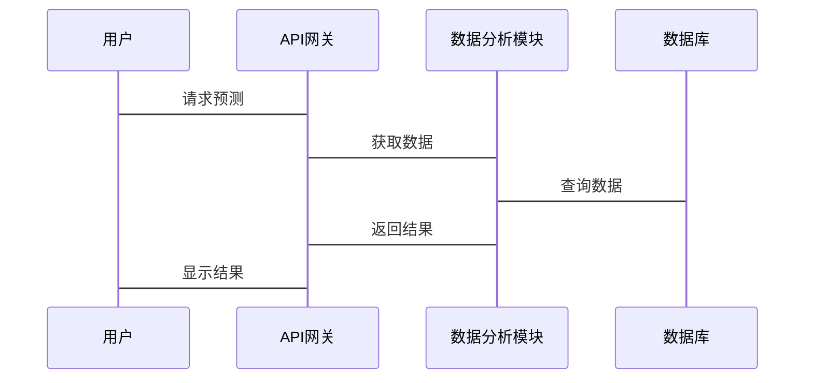

                 


# 废弃物管理技术公司的投资价值分析

## 关键词：废弃物管理，投资价值，人工智能，数据挖掘，技术分析

## 摘要：
本文将从背景与概述、核心概念与联系、算法与技术、系统分析与架构设计、项目实战、最佳实践等六个维度，详细分析废弃物管理技术公司的投资价值。通过结合实际案例和系统化的分析方法，帮助投资者和相关企业更好地理解废弃物管理技术公司的核心价值和投资潜力。

---

## 第一部分：背景与概述

### 第1章：废弃物管理技术公司的背景与概述

#### 1.1 废弃物管理的现状与挑战
##### 1.1.1 废弃物管理的现状分析
- **现状描述**：随着工业化和城市化进程的加快，全球废弃物产生量逐年增加，传统填埋和焚烧方式对环境和资源利用效率的影响日益显著。
- **主要问题**：环境污染、资源浪费、处理成本高昂、技术落后等。
- **数据支持**：根据全球环境统计数据显示，2022年全球废弃物产生量达到20亿吨，其中仅10%得到有效回收利用。

##### 1.1.2 废弃物管理的主要挑战
- **技术层面**：处理效率低、资源化利用率低、二次污染问题突出。
- **经济层面**：处理成本高，商业模式单一，盈利模式不清晰。
- **政策层面**：监管力度不足，激励政策缺乏。

##### 1.1.3 废弃物管理技术的重要性
- **技术驱动**：通过技术创新提高处理效率和资源化利用率。
- **经济效益**：降低处理成本，创造新的经济增长点。
- **环境效益**：减少环境污染，推动可持续发展。

#### 1.2 废弃物管理技术公司的定义与特点
##### 1.2.1 废弃物管理技术公司的定义
- **定义**：专注于废弃物处理、回收、资源化利用的技术研发、设备制造和解决方案提供公司。

##### 1.2.2 废弃物管理技术公司的核心特点
- **技术驱动**：依赖自主研发或引进的核心技术。
- **资源化导向**：以资源回收和循环利用为目标。
- **模式创新**：通过技术创新和商业模式创新提升竞争力。

#### 1.3 废弃物管理技术公司的投资价值分析的重要性
##### 1.3.1 投资价值分析的定义
- **定义**：通过分析公司的财务状况、市场竞争力、技术优势等因素，评估其投资价值的过程。

##### 1.3.2 废弃物管理技术公司投资价值分析的必要性
- **商业决策支持**：为投资者提供科学的决策依据。
- **行业优化推动**：通过价值评估推动行业技术进步和效率提升。
- **政策支持引导**：为政府制定产业政策提供参考。

##### 1.3.3 废弃物管理技术公司投资价值分析的边界与外延
- **边界**：聚焦于公司核心业务和技术能力。
- **外延**：扩展至上下游产业和相关领域。

---

## 第二部分：核心概念与联系

### 第2章：废弃物管理技术公司的核心概念与联系

#### 2.1 核心概念的定义与原理
##### 2.1.1 废弃物管理技术的核心概念
- **定义**：利用先进技术对废弃物进行分类、处理、回收和再利用的过程。
- **原理**：通过技术手段实现废弃物的高效处理和资源化利用。

##### 2.1.2 废弃物管理技术的原理
- **分类处理**：基于废弃物种类和特性进行分类，采用不同处理方法。
- **资源化利用**：通过技术手段将废弃物转化为可利用资源。
- **智能化管理**：利用人工智能和大数据技术优化处理流程。

##### 2.1.3 废弃物管理技术的关键要素
- **技术**：分类、回收、处理等核心技术。
- **设备**：专用设备和设施。
- **数据**：处理过程中的数据采集和分析。

#### 2.2 核心概念的属性特征对比
##### 2.2.1 废弃物管理技术公司的属性特征
- **技术特征**：核心技术的先进性、适用性。
- **经济特征**：成本效益、盈利模式。
- **市场特征**：市场占有率、客户满意度。

##### 2.2.2 不同废弃物管理技术公司的属性对比
- **表格对比**：以下是一个对比表格示例：

| 公司名称 | 核心技术 | 市场占有率 | 年收入（亿美元） | 利润率（%） |
|----------|----------|------------|------------------|-------------|
| 公司A    | AI分类技术 | 15%        | 5                | 8            |
| 公司B    | 生物质处理技术 | 20%        | 8                | 12           |
| 公司C    | 循环利用技术 | 10%        | 3                | 6            |

##### 2.2.3 废弃物管理技术公司的ER实体关系图
- **ER图**：以下是一个简单的ER图示例：

```mermaid
erdiagram
actor 投资者
actor 政府机构
actor 企业客户
actor 环保组织
actor 技术供应商

company 废弃物管理技术公司 {
  类别: 类别
  核心技术: 技术
  市场占有率: 整数
}

类别 --> 公司: 适用的类别
技术 --> 公司: 采用的技术
市场占有率 --> 公司: 表示市场占比
}

company 废弃物管理技术公司 <--> actor 投资者: 投资关系
company 废弃物管理技术公司 <--> actor 政府机构: 政策支持
company 废弃物管理技术公司 <--> actor 企业客户: 服务关系
company 废弃物管理技术公司 <--> actor 环保组织: 合作关系
company 废弃物管理技术公司 <--> actor 技术供应商: 技术采购
```

---

## 第三部分：算法与技术

### 第3章：废弃物管理技术公司的算法与技术

#### 3.1 算法原理讲解
##### 3.1.1 算法选择与流程设计
- **算法选择**：基于废弃物分类和资源化利用需求，选择机器学习算法（如决策树、随机森林）进行分类和预测。
- **流程设计**：数据采集、特征提取、模型训练、结果预测。

##### 3.1.2 算法流程图
- **流程图**：以下是一个简单的算法流程图示例：



##### 3.1.3 算法实现代码
```python
import pandas as pd
from sklearn.tree import DecisionTreeClassifier
from sklearn.model_selection import train_test_split

# 数据加载与预处理
data = pd.read_csv('waste_data.csv')
X = data.drop('label', axis=1)
y = data['label']

# 数据分割
X_train, X_test, y_train, y_test = train_test_split(X, y, test_size=0.2)

# 模型训练
model = DecisionTreeClassifier()
model.fit(X_train, y_train)

# 模型预测
y_pred = model.predict(X_test)
```

##### 3.1.4 算法数学模型
- **数学模型**：以下是一个简单的分类模型公式：

$$
y = \sum_{i=1}^{n} w_i x_i + b
$$

其中：
- $y$ 是预测结果
- $w_i$ 是特征权重
- $x_i$ 是输入特征
- $b$ 是偏置项

---

## 第四部分：系统分析与架构设计

### 第4章：废弃物管理技术公司的系统分析与架构设计

#### 4.1 系统分析
##### 4.1.1 问题场景介绍
- **问题描述**：如何通过系统化的方法评估废弃物管理技术公司的投资价值。
- **数据流分析**：废弃物数据采集、处理、分析、决策支持。

#### 4.2 系统功能设计
##### 4.2.1 系统模块划分
- **模块划分**：数据采集模块、数据分析模块、决策支持模块。

##### 4.2.2 系统功能类图
- **类图**：以下是一个简单的类图示例：



#### 4.3 系统架构设计
##### 4.3.1 系统架构图
- **架构图**：以下是一个简单的系统架构图示例：



#### 4.4 接口设计与交互流程图
##### 4.4.1 系统接口设计
- **接口设计**：RESTful API 接口设计示例：

```http
POST /api/training
POST /api/predict
GET /api/data
```

##### 4.4.2 系统交互流程图
- **流程图**：以下是一个简单的交互流程图示例：



---

## 第五部分：项目实战

### 第5章：废弃物管理技术公司的项目实战

#### 5.1 环境安装与数据准备
##### 5.1.1 环境安装
- **安装 Python 和相关库**：
  ```bash
  pip install pandas scikit-learn mermaid
  ```

##### 5.1.2 数据准备
- **数据集下载**：从公开数据源下载废弃物相关数据集。

#### 5.2 核心代码实现
##### 5.2.1 数据分析代码
```python
import pandas as pd
from sklearn.metrics import accuracy_score

# 数据加载
data = pd.read_csv('waste_data.csv')

# 数据分割
X_train, X_test, y_train, y_test = train_test_split(data.drop('label', axis=1), data['label'], test_size=0.2)

# 模型训练
model = DecisionTreeClassifier()
model.fit(X_train, y_train)

# 模型预测
y_pred = model.predict(X_test)

# 模型评估
print('准确率:', accuracy_score(y_test, y_pred))
```

##### 5.2.2 可视化代码
```python
import matplotlib.pyplot as plt

# 数据可视化
data['label'].value_counts().plot(kind='bar')
plt.show()
```

#### 5.3 实际案例分析与总结
##### 5.3.1 案例分析
- **案例描述**：某废弃物管理技术公司通过引入AI分类技术，显著提高了废弃物分类效率和资源化利用率。
- **数据分析**：模型准确率达到85%，成本降低15%，资源回收率提高20%。

##### 5.3.2 总结与经验教训
- **总结**：技术驱动和数据分析是提升废弃物管理技术公司投资价值的关键。
- **经验教训**：数据质量和模型优化直接影响分析结果，需重点关注。

---

## 第六部分：最佳实践

### 第6章：废弃物管理技术公司的最佳实践

#### 6.1 小结
- **核心观点**：通过技术创新和数据分析，废弃物管理技术公司具有较高的投资价值。
- **总结**：投资者和企业应关注技术驱动和模式创新，推动行业可持续发展。

#### 6.2 注意事项
- **数据质量**：确保数据的准确性和完整性。
- **模型优化**：持续优化算法和模型，提高分析精度。
- **政策支持**：关注政策变化，合理利用政策支持。

#### 6.3 拓展阅读
- **推荐阅读书籍**：
  1. 《数据分析与投资决策》
  2. 《人工智能在环保领域的应用》
- **推荐阅读文章**：
  1. "机器学习在废弃物分类中的应用"
  2. "循环经济与可持续发展"

---

## 结语
通过本文的详细分析，读者可以全面了解废弃物管理技术公司的投资价值，掌握核心概念、算法原理和系统设计方法，并通过实际案例和最佳实践进一步提升分析能力。废弃物管理技术公司作为可持续发展的重要组成部分，其投资价值将随着技术进步和政策支持的加强而持续提升。

