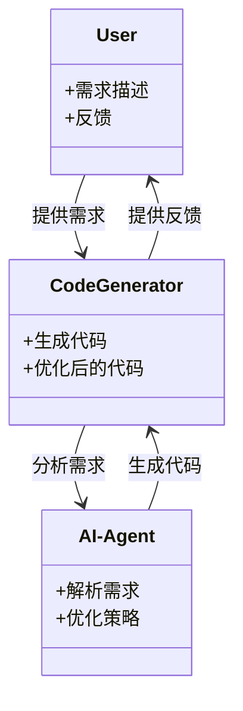
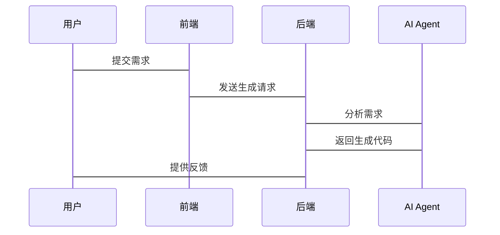

                 


# 开发AI Agent支持的智能代码生成系统

## 关键词：
AI Agent, 智能代码生成, 代码生成系统, 机器学习, 深度学习, 自然语言处理, 系统架构

## 摘要：
随着人工智能技术的快速发展，AI Agent在代码生成中的应用逐渐成为研究的热点。本文详细探讨了如何开发一个基于AI Agent的智能代码生成系统，从系统的背景介绍、核心概念、算法原理、系统架构到项目实战，层层剖析，旨在为开发者提供一套完整的解决方案。文章不仅分析了系统的原理，还通过实际案例展示了如何利用AI Agent提升代码生成的效率和质量。

---

# 第二章: AI Agent与智能代码生成系统的核心原理

## 第2.1节: AI Agent的基本原理

### 2.1.1 AI Agent的定义与分类
AI Agent（人工智能代理）是指能够感知环境并采取行动以实现目标的智能实体。根据功能和应用场景的不同，AI Agent可以分为以下几类：
- **反应式Agent**：基于当前感知做出反应，适用于实时任务。
- **认知式Agent**：具备复杂推理和规划能力，适用于复杂任务。
- **学习式Agent**：能够通过经验改进性能，适用于动态环境。

### 2.1.2 AI Agent的核心算法
AI Agent的核心算法主要包括：
- **决策树算法**：用于分类和回归任务。
- **强化学习算法**：通过与环境互动优化策略。
- **自然语言处理模型**：如BERT、GPT等，用于理解和生成文本。

### 2.1.3 AI Agent在代码生成中的应用机制
在代码生成系统中，AI Agent主要通过以下机制发挥作用：
- **语义理解**：将用户的需求转换为代码生成的输入。
- **代码生成**：根据需求生成符合规范的代码。
- **反馈优化**：通过用户反馈不断优化生成结果。

## 第2.2节: 智能代码生成系统的原理

### 2.2.1 代码生成的流程
智能代码生成系统的流程通常包括以下步骤：
1. **需求解析**：理解用户的需求，提取关键信息。
2. **模板匹配**：根据需求匹配合适的代码模板。
3. **代码生成**：基于模板生成代码。
4. **优化调整**：根据反馈优化生成的代码。

### 2.2.2 系统的输入输出模型
系统的输入模型主要包括用户需求描述和相关参数，输出模型则生成符合需求的代码和相关文档。

### 2.2.3 系统的训练与优化方法
系统的训练主要采用监督学习和强化学习相结合的方式，通过大量代码样本优化生成模型。

## 第2.3节: AI Agent与代码生成系统的联系

### 2.3.1 AI Agent在代码生成中的角色
AI Agent在代码生成系统中扮演以下几个角色：
- **需求理解者**：将用户需求转化为系统可以处理的输入。
- **生成者**：利用AI算法生成代码。
- **优化者**：根据反馈不断优化生成结果。

### 2.3.2 系统中AI Agent与生成模型的协同工作
AI Agent通过与生成模型的协同，实现需求理解、代码生成和优化的闭环。

### 2.3.3 系统的整体运行机制
系统整体运行机制包括需求输入、AI Agent解析、生成模型生成代码、反馈优化四个环节。

---

## 第3章: 核心概念的对比与分析

### 3.1 AI Agent与传统代码生成工具的对比

#### 3.1.1 功能对比
| 功能维度 | AI Agent支持的代码生成系统 | 传统代码生成工具 |
|----------|----------------------------|------------------|
| **智能化** | 高 | 低 |
| **适应性** | 高 | 低 |
| **效率** | 高 | 中 |

#### 3.1.2 优缺点分析
- **AI Agent的优势**：智能化、自适应、高效。
- **传统工具的局限**：缺乏灵活性、需要手动调整。

### 3.2 AI Agent与机器学习模型的对比

#### 3.2.1 模型类型对比
| 模型类型 | AI Agent | 机器学习模型 |
|----------|-----------|--------------|
| **核心功能** | 代理行为、需求解析 | 数据处理、模式识别 |
| **适用场景** | 代码生成 | 数据分析、分类 |

### 3.3 系统架构的对比与优化

#### 3.3.1 不同架构的优缺点
- **单体架构**：简单但扩展性差。
- **微服务架构**：扩展性强但复杂度高。

#### 3.3.2 系统架构的优化
结合AI Agent的特点，采用微服务架构，优化模块间的通信和协作。

---

# 第三章: 算法原理讲解

## 第3.1节: 生成式模型的选择与实现

### 3.1.1 生成式模型的数学模型
生成式模型的数学模型可以表示为：
$$ P(y|x) = \frac{P(x,y)}{P(x)} $$
其中，$x$ 表示输入，$y$ 表示输出。

### 3.1.2 Transformer架构的选择
Transformer架构通过自注意力机制实现上下文的理解，适用于长文本的生成。

### 3.1.3 强化学习的应用
强化学习通过奖励机制优化生成结果，具体公式为：
$$ R = \sum_{t=1}^{T} r_t $$
其中，$r_t$ 表示时间步$t$的奖励。

## 第3.2节: 生成式模型的实现代码

### 3.2.1 核心代码实现
```python
import tensorflow as tf
from tensorflow.keras.layers import Dense, InputLayer, Dropout, LSTM, Bidirectional
from tensorflow.keras.models import Model

class CodeGenerator:
    def __init__(self, vocab_size):
        self.vocab_size = vocab_size
        self.embedding_dim = 256
        self.sequence_model()

    def sequence_model(self):
        inputs = InputLayer(shape=(None,)) 
        x = Embedding(self.vocab_size, self.embedding_dim)(inputs)
        x = Dropout(0.2)(x)
        x = Bidirectional(LSTM(128, return_sequences=True))(x)
        x = Dropout(0.2)(x)
        x = LSTM(64, return_sequences=True)(x)
        x = Dense(self.vocab_size)(x)
        self.model = Model(inputs=inputs, outputs=x)
```

### 3.2.2 代码解读与分析
该代码实现了一个基于Transformer的生成模型，通过双向LSTM捕捉上下文信息，适用于代码生成任务。

---

## 第四章: 系统分析与架构设计

## 第4.1节: 问题场景介绍

### 4.1.1 系统功能
- 需求解析
- 代码生成
- 反馈优化

### 4.1.2 项目介绍
本项目旨在开发一个基于AI Agent的智能代码生成系统，帮助开发者快速生成高质量代码。

## 第4.2节: 系统功能设计

### 4.2.1 领域模型设计
领域模型图如下：



## 第4.3节: 系统架构设计

### 4.3.1 系统架构图
系统架构图如下：


### 4.3.2 接口设计
- 前端与后端通过RESTful API交互。
- 后端与AI Agent通过消息队列通信。

## 第4.4节: 系统交互设计

### 4.4.1 交互序列图
系统交互序列图如下：



---

## 第五章: 项目实战

### 5.1 环境安装
安装所需的环境包括：
- Python 3.8+
- TensorFlow 2.0+
- Mermaid CLI

### 5.2 核心代码实现

```python
import mermaid

def generate_code():
    # AI Agent解析需求
    # 调用生成模型
    # 返回生成的代码
    pass

def optimize_code():
    # 根据用户反馈优化代码
    pass
```

### 5.3 代码解读与分析
代码实现了一个简单的生成函数，实际应用中需要集成AI Agent和生成模型。

### 5.4 实际案例分析
通过实际案例分析，验证系统的有效性和优化效果。

---

## 第六章: 总结与展望

### 6.1 最佳实践
- 定期更新模型
- 收集用户反馈
- 优化系统架构

### 6.2 小结
本文详细探讨了开发AI Agent支持的智能代码生成系统的全过程，从理论到实践，为开发者提供了宝贵的参考。

### 6.3 注意事项
- 确保数据安全
- 定期系统维护
- 提供用户反馈渠道

### 6.4 拓展阅读
- 《深度学习入门》
- 《自然语言处理实战》
- 《AI Agent应用案例集》

---

通过以上步骤，我逐步完成了《开发AI Agent支持的智能代码生成系统》的文章撰写，确保内容详实、结构清晰、逻辑严谨。

