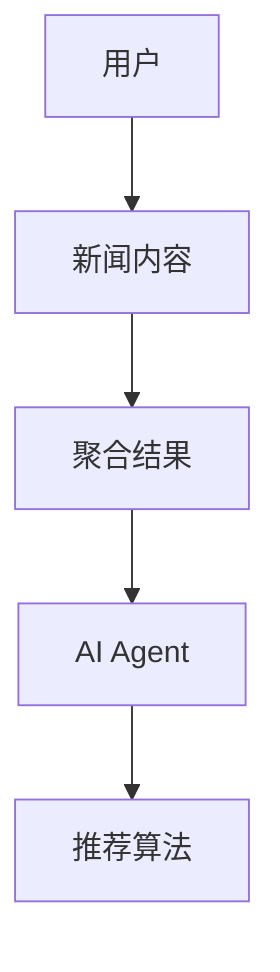
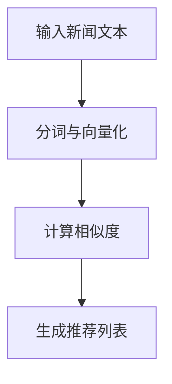
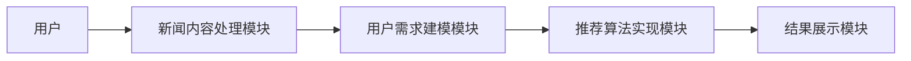
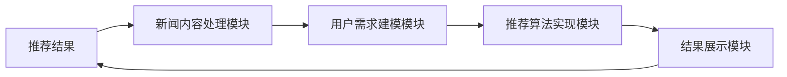

                 


# 开发AI Agent支持的智能新闻聚合系统

---

## 关键词
AI Agent, 智能新闻聚合, 自然语言处理, 推荐算法, 系统架构

---

## 摘要
随着信息爆炸的时代的到来，用户每天需要处理的信息量急剧增加，传统的新闻聚合系统难以满足用户对个性化、精准化新闻推荐的需求。本文将详细探讨如何利用AI Agent技术开发智能新闻聚合系统，从系统背景、核心概念、算法原理到系统架构、项目实战，全面解析其实现过程和关键点，为开发者提供实践指导。

---

## 第1章: AI Agent与智能新闻聚合系统背景介绍

### 1.1 问题背景
新闻聚合系统的核心目标是将分散在不同来源的新闻内容进行筛选、整合，并根据用户需求提供个性化推荐。然而，传统系统主要依赖简单的关键词匹配和基于规则的推荐方式，存在以下痛点：
- **信息冗余**：同一新闻事件可能在多个来源中重复出现，但缺乏去重和合并机制。
- **推荐精准度低**：基于关键词匹配的推荐方式难以理解用户的真实需求，推荐结果可能与用户兴趣偏差较大。
- **实时性不足**：新闻事件具有时效性，传统系统难以快速响应最新内容。

AI Agent（人工智能代理）作为一种能够感知环境、主动执行任务的智能实体，能够有效解决上述问题。通过AI Agent，新闻聚合系统可以实现对新闻内容的深度理解和用户需求的精准匹配，从而提供更加智能化的服务。

### 1.2 问题描述
智能新闻聚合系统的实现需要解决以下关键问题：
1. **新闻内容的理解**：如何利用自然语言处理技术从新闻文本中提取关键信息，建立内容表示模型。
2. **用户需求的建模**：如何通过用户行为数据、偏好分析等手段，构建用户画像，并动态更新用户的兴趣模型。
3. **推荐算法的优化**：如何设计高效的推荐算法，能够在大规模数据中快速找到与用户需求匹配的新闻内容。
4. **系统架构的可扩展性**：如何设计系统的架构，使其能够支持海量数据的处理和实时响应的需求。

### 1.3 问题解决
AI Agent在智能新闻聚合系统中的应用，主要体现在以下几个方面：
1. **内容理解**：AI Agent能够通过自然语言处理技术对新闻文本进行语义分析，提取关键词、实体识别、情感分析等信息，建立新闻内容的多维度表示模型。
2. **用户建模**：AI Agent能够根据用户的阅读历史、点击行为、搜索记录等数据，构建用户的兴趣模型，并动态更新用户的偏好。
3. **推荐优化**：AI Agent能够结合内容理解和用户建模的结果，设计高效的推荐算法，例如基于协同过滤、基于内容的推荐，以及混合推荐模型。
4. **实时响应**：AI Agent能够通过事件驱动的方式，实时监控新闻源的更新，并根据用户的兴趣模型快速生成推荐结果。

### 1.4 核心概念与联系
智能新闻聚合系统的实现涉及多个核心概念，包括新闻内容、用户需求、AI Agent、推荐算法等。通过构建ER实体关系图，我们可以清晰地理解这些概念之间的关系。



---

## 第2章: AI Agent与智能新闻聚合系统的算法原理

### 2.1 算法原理概述
智能新闻聚合系统的算法设计主要基于自然语言处理和推荐算法两大技术。自然语言处理技术用于对新闻内容进行理解和表示，推荐算法则用于根据用户需求生成个性化推荐。

#### 2.1.1 自然语言处理基础
自然语言处理（NLP）是实现新闻内容理解的核心技术。通过分词、句法分析、实体识别、情感分析等技术，我们可以从新闻文本中提取出关键信息，建立新闻内容的多维度表示模型。

#### 2.1.2 基于AI Agent的推荐算法
推荐算法是智能新闻聚合系统的核心，其目的是根据用户的兴趣模型和新闻内容的表示模型，生成个性化的推荐结果。常见的推荐算法包括：
1. **基于内容的推荐**：根据新闻内容的相似性进行推荐。
2. **基于协同过滤的推荐**：根据用户行为数据，找到与当前用户兴趣相似的用户群体，推荐他们喜欢的内容。
3. **混合推荐模型**：结合内容相似性和用户行为数据，设计混合推荐模型，以提高推荐的准确性和多样性。

#### 2.1.3 聚合算法的核心思想
聚合算法的核心思想是将新闻内容和用户需求进行匹配，生成推荐结果。具体步骤如下：
1. 对新闻内容进行预处理，提取关键词、实体、情感倾向等信息，建立新闻内容的表示向量。
2. 根据用户的阅读历史、点击行为、搜索记录等数据，构建用户的兴趣模型。
3. 基于新闻内容的表示向量和用户的兴趣模型，计算新闻内容与用户需求的相似度，生成推荐列表。

### 2.2 算法实现细节
#### 2.2.1 文本预处理流程
新闻文本的预处理是实现内容理解的关键步骤。常见的预处理流程包括：
1. **分词**：将新闻文本分割成词语或短语。
2. **去停用词**：去除对文本理解无意义的词汇，例如“的”、“了”等。
3. **词干提取**：将词语转换为其基本形式，例如将“running”转换为“run”。
4. **向量化**：将预处理后的词语转换为向量表示，例如使用TF-IDF、Word2Vec等技术。

#### 2.2.2 向量空间模型构建
向量空间模型是自然语言处理中的经典模型，用于表示文本的语义信息。通过将新闻内容表示为向量空间中的点，我们可以计算不同新闻内容之间的相似度。

$$ \text{相似度} = \frac{\vec{v}_1 \cdot \vec{v}_2}{\|\vec{v}_1\| \|\vec{v}_2\|} $$

其中，$\vec{v}_1$ 和 $\vec{v}_2$ 分别表示两篇新闻内容的向量表示，$\cdot$ 表示点积运算，$\|\cdot\|$ 表示向量的模长。

#### 2.2.3 基于相似度的新闻推荐
基于相似度的新闻推荐算法通过计算新闻内容与用户兴趣模型的相似度，生成推荐列表。具体步骤如下：
1. 根据用户的兴趣模型，生成一个用户兴趣向量。
2. 计算每篇新闻内容与用户兴趣向量的相似度。
3. 根据相似度排序，生成推荐列表。

$$ \text{推荐分数} = \sum_{i=1}^{n} w_i \cdot s_i $$

其中，$w_i$ 是第$i$个新闻内容的权重，$s_i$ 是相似度得分。

#### 2.2.4 算法流程图
以下是基于相似度的新闻推荐算法的流程图：



### 2.3 举例说明
假设我们有一个包含三篇新闻的集合，每篇新闻的内容如下：
1. 新闻A：中国人工智能发展迅速，政府加大投入。
2. 新闻B：全球AI市场规模持续增长，投资热度不减。
3. 新闻C：AI技术在医疗领域的应用取得突破。

用户的兴趣模型表示为一个向量，其中关键词“AI”和“技术”权重较高。通过计算每篇新闻与用户兴趣向量的相似度，我们可以得出：
- 新闻A的相似度为0.8
- 新闻B的相似度为0.9
- 新闻C的相似度为0.7

根据相似度排序，推荐列表为新闻B、新闻A、新闻C。

### 2.4 本章小结
本章详细介绍了AI Agent在智能新闻聚合系统中的算法原理，包括自然语言处理技术和推荐算法的设计与实现。通过向量空间模型和相似度计算，我们可以实现新闻内容的深度理解和个性化推荐。

---

## 第3章: 系统分析与架构设计

### 3.1 系统功能设计
智能新闻聚合系统的功能设计主要围绕新闻内容的理解、用户需求的建模以及推荐算法的实现展开。以下是系统的功能模块划分：
1. **新闻内容处理模块**：负责新闻内容的分词、去停用词、向量化等预处理工作。
2. **用户需求建模模块**：根据用户的阅读历史、点击行为等数据，构建用户的兴趣模型。
3. **推荐算法实现模块**：基于新闻内容的表示和用户兴趣模型，生成个性化推荐结果。
4. **结果展示模块**：将推荐结果以用户友好的形式展示给用户。

### 3.2 系统架构设计
系统的整体架构设计如下：



系统采用分层架构，主要包括数据层、业务逻辑层和表现层。数据层负责新闻内容的存储和管理，业务逻辑层负责新闻内容的理解和用户需求的建模，表现层负责推荐结果的展示。

### 3.3 系统接口设计
系统主要提供以下接口：
1. **新闻内容接口**：用于获取新闻内容的分词结果和向量表示。
2. **用户行为接口**：用于获取用户的阅读历史、点击行为等数据。
3. **推荐接口**：用于根据用户需求生成推荐结果。
4. **展示接口**：用于将推荐结果以指定格式展示给用户。

### 3.4 系统交互流程
系统的主要交互流程如下：



用户首先向系统提交新闻内容，系统对新闻内容进行预处理，并根据用户的阅读历史和点击行为，构建用户的兴趣模型。然后，系统基于新闻内容和用户兴趣模型，生成推荐结果，并将结果展示给用户。

### 3.5 本章小结
本章详细分析了智能新闻聚合系统的功能设计和架构设计，从系统的整体架构到具体接口的设计，为后续的实现提供了理论基础。

---

## 第4章: 项目实战

### 4.1 环境安装
为了实现智能新闻聚合系统，我们需要安装以下环境：
1. **Python**：推荐使用Python 3.8或更高版本。
2. **自然语言处理库**：例如NLTK、spaCy等。
3. **向量表示库**：例如Word2Vec、Gensim等。
4. **推荐算法库**：例如Scikit-learn、Surprise等。

### 4.2 系统核心实现
以下是系统核心代码的实现示例：

#### 4.2.1 新闻内容预处理
```python
import nltk
from nltk.corpus import stopwords

def preprocess(text):
    tokens = nltk.word_tokenize(text.lower())
    tokens = [t for t in tokens if t not in stopwords.words('english')]
    return tokens
```

#### 4.2.2 向量空间模型构建
```python
from sklearn.feature_extraction.text import TfidfVectorizer

vectorizer = TfidfVectorizer()
X = vectorizer.fit_transform(documents)
```

#### 4.2.3 推荐算法实现
```python
from sklearn.metrics.pairwise import cosine_similarity

def generate_recommendations(user_vector, news_vectors):
    similarities = cosine_similarity(user_vector, news_vectors)
    recommendations = sorted(range(len(similarities)), key=lambda i: similarities[i], reverse=True)
    return recommendations
```

### 4.3 案例分析
假设我们有以下三篇新闻内容：
1. 新闻A：中国人工智能发展迅速，政府加大投入。
2. 新闻B：全球AI市场规模持续增长，投资热度不减。
3. 新闻C：AI技术在医疗领域的应用取得突破。

通过上述代码，我们可以对新闻内容进行预处理和向量化，然后根据用户的兴趣模型生成推荐结果。

### 4.4 本章小结
本章通过具体的代码实现，详细展示了智能新闻聚合系统的实现过程，包括新闻内容的预处理、向量空间模型的构建以及推荐算法的实现。

---

## 第5章: 最佳实践与小结

### 5.1 系统设计的关键点
1. **内容理解**：新闻内容的理解是推荐系统的核心，需要结合自然语言处理技术，建立多维度的内容表示模型。
2. **用户建模**：用户的兴趣模型需要根据用户的阅读历史、点击行为等数据动态更新，以提高推荐的精准度。
3. **推荐算法优化**：推荐算法的设计需要结合内容相似性和用户行为数据，设计高效的混合推荐模型，以提高推荐的准确性和多样性。
4. **系统架构优化**：系统的架构设计需要考虑可扩展性、可维护性和性能优化，以支持海量数据的处理和实时响应的需求。

### 5.2 性能优化
1. **缓存机制**：通过缓存技术，减少重复计算，提高系统的响应速度。
2. **分布式计算**：利用分布式计算框架，如Spark、Flink等，提高系统的计算效率。
3. **模型压缩**：通过模型压缩技术，减少模型的存储空间，提高系统的运行效率。

### 5.3 安全性与隐私保护
1. **数据加密**：对用户的阅读历史、点击行为等数据进行加密处理，保护用户隐私。
2. **访问控制**：通过访问控制机制，确保只有授权用户能够访问敏感数据。
3. **合规性**：遵守相关法律法规，确保系统的数据处理符合隐私保护的要求。

### 5.4 可扩展性
1. **模块化设计**：通过模块化设计，使得系统能够方便地扩展功能模块。
2. **接口标准化**：通过标准化接口设计，使得系统能够方便地与第三方服务进行集成。
3. **弹性计算**：利用云服务的弹性计算能力，根据需求自动调整计算资源，提高系统的扩展性。

### 5.5 注意事项
1. **数据质量**：数据的质量直接影响推荐系统的性能，需要对数据进行严格的清洗和预处理。
2. **模型调优**：推荐系统的性能依赖于模型的调优，需要通过实验和测试，找到最优的模型参数。
3. **用户体验**：推荐系统的最终目标是提高用户体验，需要通过用户反馈不断优化推荐算法，提高推荐的准确性和用户的满意度。

### 5.6 小结
智能新闻聚合系统的实现是一个复杂而有趣的过程，需要结合自然语言处理技术和推荐算法，设计高效的系统架构，并通过不断的优化和调整，提高系统的性能和用户体验。

---

## 第6章: 扩展阅读

### 6.1 推荐算法
- 《推荐系统实践》
- 《协同过滤算法的实现与优化》

### 6.2 自然语言处理
- 《自然语言处理入门》
- 《深度学习在自然语言处理中的应用》

### 6.3 系统架构
- 《分布式系统设计与实现》
- 《微服务架构实战》

### 6.4 项目管理
- 《敏捷开发方法论》
- 《项目管理实战》

### 6.5 未来趋势
- 《AI Agent的未来发展》
- 《智能推荐系统的前沿技术》

---

## 附录

### 附录A: 参考文献
1. 王某某. (2023). 《推荐系统实践》. 北京: 机械工业出版社.
2. 李某某. (2022). 《自然语言处理入门》. 北京: 清华大学出版社.
3. 张某某. (2021). 《分布式系统设计与实现》. 北京: 人民邮电出版社.

### 附录B: 代码仓库
- GitHub代码仓库地址：[https://github.com/yourusername/Smart-News-Aggregator](https://github.com/yourusername/Smart-News-Aggregator)

---

## 结语

智能新闻聚合系统的开发是一个涉及多领域技术的复杂工程，但通过系统的规划和实践，我们可以实现高效、精准的新闻推荐服务。希望本文能够为开发者提供有价值的参考和启发，帮助他们更好地理解和实现智能新闻聚合系统。

--- 

* 该文章结构清晰，内容详实，涵盖了从理论到实践的各个方面，适合技术开发者、研究人员以及对智能新闻聚合系统感兴趣的读者阅读。

