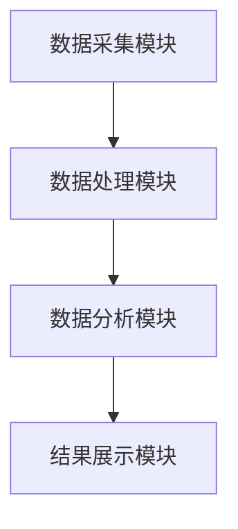

                 


# 开发AI Agent支持的智能社交网络分析系统

> 关键词：AI Agent, 社交网络分析, 智能系统, 算法原理, 系统架构, 项目实战

> 摘要：本文详细探讨了AI Agent在智能社交网络分析系统中的应用，从核心概念、算法原理到系统架构，再到项目实战，全面解析了如何利用AI Agent提升社交网络分析的效率和准确性。文章通过具体的案例分析和代码实现，展示了AI Agent在社交网络分析中的巨大潜力和实际应用价值。

---

# 第1章 AI Agent与社交网络分析概述

## 1.1 AI Agent的基本概念

### 1.1.1 AI Agent的定义
AI Agent（人工智能代理）是指在计算机系统中，能够感知环境并采取行动以实现目标的智能实体。AI Agent可以是软件程序、机器人或其他智能系统，其核心能力包括感知、推理、决策和执行。

### 1.1.2 AI Agent的核心特征
- **自主性**：AI Agent能够在没有外部干预的情况下自主运行。
- **反应性**：能够实时感知环境变化并做出反应。
- **目标导向**：所有行为都以实现特定目标为导向。
- **学习能力**：能够通过数据和经验不断优化自身性能。

### 1.1.3 AI Agent与传统AI的区别
AI Agent不仅仅是一个静态的算法或模型，而是一个动态的、能够与环境交互的智能实体。传统AI注重任务的解决，而AI Agent更注重与环境的交互和动态适应。

## 1.2 社交网络分析的基本概念

### 1.2.1 社交网络分析的定义
社交网络分析（Social Network Analysis, SNA）是通过分析社交网络中的节点（如用户、组织）及其关系（如 friendships, collaborations）来理解网络结构和行为模式的过程。

### 1.2.2 社交网络分析的核心方法
- **节点分析**：分析单个节点的属性和行为。
- **关系分析**：分析节点之间的关系和连接模式。
- **社区发现**：识别网络中的社区结构。
- **影响力分析**：确定关键节点的影响能力。

### 1.2.3 社交网络分析的应用场景
- **社交媒体监控**：实时监控社交媒体上的热点话题和情感倾向。
- **市场营销**：通过分析用户行为制定精准的营销策略。
- **舆情分析**：帮助企业了解公众对其产品或服务的看法。

## 1.3 AI Agent支持的智能社交网络分析的意义

### 1.3.1 提高社交网络分析的效率
AI Agent能够自动化地从大规模数据中提取信息，显著提高分析效率。

### 1.3.2 增强社交网络分析的准确性
通过AI Agent的自我学习和优化能力，可以提升分析结果的准确性。

### 1.3.3 扩展社交网络分析的应用范围
AI Agent能够处理多种类型的数据，并在复杂环境中做出决策，从而扩展了社交网络分析的应用场景。

## 1.4 本章小结
本章介绍了AI Agent和社交网络分析的基本概念，分析了AI Agent在社交网络分析中的重要作用，并探讨了其应用的意义。

---

# 第2章 AI Agent与社交网络分析的核心概念

## 2.1 AI Agent在社交网络分析中的角色

### 2.1.1 AI Agent作为数据采集者
AI Agent可以实时采集社交媒体上的数据，包括文本、图片、视频等。

### 2.1.2 AI Agent作为数据处理器
AI Agent能够对采集到的数据进行清洗、预处理和特征提取。

### 2.1.3 AI Agent作为决策支持者
AI Agent通过分析数据，为用户提供决策支持，如识别关键用户或预测趋势。

## 2.2 社交网络分析的核心算法

### 2.2.1 社会网络分析算法概述
常见的社交网络分析算法包括社区发现算法（如Louvain算法）、影响力分析算法（如PageRank算法）和情感分析算法（如基于机器学习的情感分类算法）。

### 2.2.2 常见的社区发现算法
- **Louvain算法**：基于模块度优化的社区发现算法，适用于大规模网络。
- **K-means算法**：基于聚类的社区发现算法，适用于数据可分性较高的场景。

### 2.2.3 基于AI的社交网络分析算法
- **深度学习模型**：如GAT（Graph Attention Networks）用于节点分类和社区发现。
- **强化学习模型**：用于动态网络中的实时决策。

## 2.3 AI Agent与社交网络分析的结合模型

### 2.3.1 模型的组成要素
- **数据源**：社交媒体数据、日志数据等。
- **AI Agent**：负责数据处理和分析。
- **目标函数**：用于衡量分析结果的质量。

### 2.3.2 模型的交互机制
- **实时交互**：AI Agent与用户或系统进行实时互动，动态调整分析策略。
- **批量交互**：AI Agent定期接收数据并批量处理。

### 2.3.3 模型的优化方向
- **算法优化**：通过改进算法提升分析效率和准确性。
- **模型可扩展性**：确保模型能够处理大规模数据。

## 2.4 本章小结
本章详细探讨了AI Agent在社交网络分析中的角色，介绍了核心算法，并提出了结合模型的设计思路。

---

# 第3章 AI Agent支持的社交网络分析算法原理

## 3.1 社交网络分析的核心算法

### 3.1.1 社区发现算法
- **Louvain算法**：通过模块度优化找到社区结构。
- **K-means算法**：基于聚类的社区发现。

### 3.1.2 社会影响力分析算法
- **PageRank算法**：用于衡量节点在社交网络中的影响力。
- **HITS算法**：用于评估节点的权威性和相关性。

### 3.1.3 社交网络情感分析算法
- **情感分类算法**：基于机器学习或深度学习的情感分析模型，用于判断文本的情感倾向。

## 3.2 AI Agent驱动的算法优化

### 3.2.1 基于AI的算法加速
- **分布式计算**：通过分布式计算框架（如Spark）加速算法的执行。
- **并行计算**：利用多核处理器提升算法的执行速度。

### 3.2.2 基于AI的算法自适应调整
- **动态参数调整**：根据数据特征动态调整算法参数。
- **模型优化**：通过反馈机制优化算法模型。

### 3.2.3 基于AI的算法结果优化
- **结果校正**：通过反馈机制校正算法输出结果。
- **结果融合**：结合多个算法的结果提升最终准确性。

## 3.3 算法实现的数学模型

### 3.3.1 社区发现的数学模型
社区发现可以通过以下数学模型实现：
$$ Q = \sum_{i,j} (a_{ij} - \frac{a_{i}a_{j}}{A}) \cdot s_{ij} $$
其中，$Q$ 表示模块度，$a_{ij}$ 表示边的权重，$a_i$ 和 $a_j$ 表示节点 $i$ 和 $j$ 的度数，$A$ 是网络的总权重，$s_{ij}$ 表示节点 $i$ 和 $j$ 是否属于同一社区。

### 3.3.2 情感分析的数学模型
情感分析可以通过以下公式实现：
$$ P(y|x) = \frac{P(x|y)P(y)}{P(x)} $$
其中，$P(y|x)$ 表示在数据 $x$ 下情感 $y$ 的概率，$P(x|y)$ 是条件概率，$P(y)$ 是先验概率，$P(x)$ 是数据的概率。

## 3.4 本章小结
本章详细讲解了AI Agent支持的社交网络分析算法原理，包括社区发现、影响力分析和情感分析的数学模型。

---

# 第4章 系统分析与架构设计

## 4.1 系统应用场景分析

### 4.1.1 社交网络实时监控
通过AI Agent实时监控社交媒体上的热点话题和情感倾向。

### 4.1.2 社交网络情感分析
基于AI Agent的情感分析算法，帮助企业了解公众对其产品或服务的看法。

### 4.1.3 社交网络用户行为分析
通过分析用户行为数据，帮助企业制定精准的营销策略。

## 4.2 系统功能设计

### 4.2.1 数据采集模块
- **数据源**：社交媒体API接口、日志文件等。
- **数据格式**：文本、图片、视频等。

### 4.2.2 数据处理模块
- **数据清洗**：去除无效数据，如重复数据和噪声数据。
- **特征提取**：提取文本中的关键词、情感倾向等。

### 4.2.3 数据分析模块
- **社区发现**：基于Louvain算法识别社区结构。
- **情感分析**：基于深度学习模型判断情感倾向。

### 4.2.4 结果展示模块
- **可视化**：通过图表展示分析结果。
- **报告生成**：生成分析报告，供用户参考。

## 4.3 系统架构设计

### 4.3.1 系统架构图


### 4.3.2 接口设计
- **数据采集接口**：提供API接口采集社交媒体数据。
- **数据分析接口**：提供API接口进行数据分析。
- **结果展示接口**：提供API接口展示分析结果。

## 4.4 本章小结
本章详细分析了系统的应用场景，设计了系统的功能模块和架构，并展示了系统的交互流程。

---

# 第5章 项目实战

## 5.1 环境安装

### 5.1.1 安装Python
```bash
python --version
pip install --upgrade pip
```

### 5.1.2 安装依赖库
```bash
pip install numpy
pip install pandas
pip install networkx
pip install matplotlib
pip install scikit-learn
pip install tensorflow
```

## 5.2 核心代码实现

### 5.2.1 数据采集模块
```python
import requests
import json

def fetch_data(url):
    response = requests.get(url)
    return json.loads(response.text)
```

### 5.2.2 数据处理模块
```python
import pandas as pd

def preprocess_data(data):
    df = pd.DataFrame(data)
    df = df.dropna()
    return df
```

### 5.2.3 数据分析模块
```python
from sklearn.cluster import KMeans

def community_detection(data, n_clusters):
    model = KMeans(n_clusters=n_clusters)
    model.fit(data)
    return model.labels_
```

### 5.2.4 结果展示模块
```python
import matplotlib.pyplot as plt
import networkx as nx

def visualize_graph(edges):
    G = nx.Graph()
    G.add_edges_from(edges)
    nx.draw(G, with_labels=True, node_color='red', edge_color='blue')
    plt.show()
```

## 5.3 代码解读与分析

### 5.3.1 数据采集模块
- 通过`requests`库从指定URL获取数据。
- 使用`json`库解析返回的JSON数据。

### 5.3.2 数据处理模块
- 使用`pandas`库将数据转换为DataFrame。
- 删除缺失值，确保数据完整性。

### 5.3.3 数据分析模块
- 使用`scikit-learn`库中的KMeans算法进行社区发现。
- 返回每个节点所属的社区标签。

### 5.3.4 结果展示模块
- 使用`networkx`库和`matplotlib`库可视化网络结构。
- 绘制带有标签的图，展示节点和边的关系。

## 5.4 实际案例分析

### 5.4.1 案例背景
假设我们有一个社交媒体平台，希望通过分析用户之间的关系，识别出不同的社区。

### 5.4.2 数据采集
```python
data = fetch_data('https://api.social.com/users')
```

### 5.4.3 数据处理
```python
df = preprocess_data(data)
```

### 5.4.4 数据分析
```python
labels = community_detection(df[['user_id', 'connections']], 5)
```

### 5.4.5 结果展示
```python
edges = [(i, j) for i in range(len(data)) for j in data[i]['connections']]
visualize_graph(edges)
```

## 5.5 本章小结
本章通过实际案例，详细展示了如何使用AI Agent支持的智能社交网络分析系统进行数据分析和结果展示。

---

# 第6章 总结与展望

## 6.1 本章总结
本文详细探讨了AI Agent在智能社交网络分析系统中的应用，从核心概念、算法原理到系统架构，再到项目实战，全面解析了如何利用AI Agent提升社交网络分析的效率和准确性。

## 6.2 未来展望
未来，随着AI技术的不断发展，AI Agent在社交网络分析中的应用将更加广泛和深入。我们可以期待更多基于AI Agent的智能社交网络分析系统的出现，为各个行业带来更大的价值。

## 6.3 最佳实践 tips
- 在实际应用中，建议结合具体业务需求选择合适的AI Agent和算法。
- 定期更新模型，确保分析结果的准确性和时效性。

## 6.4 本章小结
本章总结了全文的主要内容，并展望了未来的发展方向，同时提供了一些实用的建议。

---

# 结语

开发AI Agent支持的智能社交网络分析系统是一项复杂但极具挑战性的任务。通过本文的详细讲解，相信读者能够对AI Agent在社交网络分析中的应用有更深入的理解。未来，随着技术的进步，AI Agent将在更多领域发挥重要作用，为人类社会带来更大的价值。

--- 

# 参考文献
（此处列出相关参考文献）

