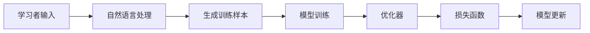
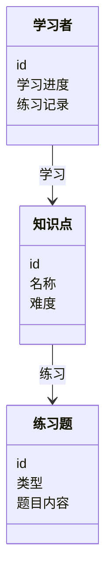

                 


```markdown
# 第三部分: AI Agent支持的智能语言学习系统算法原理

## 第3章: 强化学习算法原理

### 3.1 强化学习基本原理
#### 3.1.1 强化学习定义与核心概念
#### 3.1.2 状态、动作、奖励机制
#### 3.1.3 Q-learning算法简介

### 3.2 基于强化学习的对话生成算法
#### 3.2.1 状态空间定义
#### 3.2.2 动作空间设计
#### 3.2.3 奖励函数设计
#### 3.2.4 算法实现步骤
#### 3.2.5 Python代码实现

### 3.3 算法优化与实现
#### 3.3.1 离线数据训练与在线更新
#### 3.3.2 神经网络模型训练
#### 3.3.3 模型评估与调优

## 第4章: 监督学习算法原理

### 4.1 监督学习基本原理
#### 4.1.1 监督学习定义与核心概念
#### 4.1.2 分类与回归任务
#### 4.1.3 常见算法概述

### 4.2 基于监督学习的错误分析
#### 4.2.1 训练数据准备
#### 4.2.2 模型训练与评估
#### 4.2.3 错误分析与优化

### 4.3 算法实现与优化
#### 4.3.1 数据预处理与特征工程
#### 4.3.2 模型选择与超参数调优
#### 4.3.3 模型部署与应用

### 4.4 算法原理图


### 4.5 Python代码实现
```python
import torch
import torch.nn as nn
import torch.optim as optim

class SimpleNet(nn.Module):
    def __init__(self, input_dim, output_dim):
        super(SimpleNet, self).__init__()
        self.fc1 = nn.Linear(input_dim, 64)
        self.fc2 = nn.Linear(64, output_dim)
    
    def forward(self, x):
        x = torch.relu(self.fc1(x))
        x = torch.sigmoid(self.fc2(x))
        return x

model = SimpleNet(input_dim=100, output_dim=10)
criterion = nn.CrossEntropyLoss()
optimizer = optim.Adam(model.parameters(), lr=0.001)
```

### 4.6 数学模型与公式
$$\text{损失函数} = -\sum_{i=1}^{n} y_i \log(p_i) + (1 - y_i)\log(1 - p_i)$$
$$\text{优化目标} = \min_{\theta} \mathbb{E}_{(x,y)}[\text{损失函数}]$$

# 第四部分: 系统分析与架构设计方案

## 第5章: 问题场景与系统分析

### 5.1 问题场景描述
#### 5.1.1 学习者需求分析
#### 5.1.2 教师与机构的需求
#### 5.1.3 系统边界与假设

### 5.2 系统功能设计
#### 5.2.1 用户界面设计
#### 5.2.2 系统功能模块划分
#### 5.2.3 系统交互流程

## 第6章: 系统架构设计

### 6.1 系统架构概述
#### 6.1.1 分层架构设计
#### 6.1.2 模块化设计原则
#### 6.1.3 可扩展性设计

### 6.2 领域模型设计


### 6.3 系统架构图
```mermaid
arch
    节点1: 前端
    节点2: 后端
    节点3: 数据库
    节点4: AI Agent
    节点1 --> 节点2: 请求
    节点2 --> 节点3: 数据查询
    节点2 --> 节点4: AI推理
    节点4 --> 节点3: 更新数据
```

### 6.4 接口设计与交互流程
```mermaid
sequence
    学习者 --> 前端: 请求学习计划
    前端 --> 后端: 发送请求
    后端 --> 数据库: 查询知识点
    数据库 --> 后端: 返回知识点
    后端 --> AI Agent: 请求个性化建议
    AI Agent --> 后端: 返回建议
    后端 --> 前端: 返回结果
    前端 --> 学习者: 显示计划
```

# 第五部分: 项目实战

## 第7章: 环境安装与配置

### 7.1 开发环境搭建
#### 7.1.1 安装Python与虚拟环境
#### 7.1.2 安装必要的库与工具
#### 7.1.3 安装AI框架（如TensorFlow、PyTorch）

### 7.2 项目初始化
#### 7.2.1 创建项目目录结构
#### 7.2.2 初始化配置文件
#### 7.2.3 安装依赖项

## 第8章: 核心功能实现

### 8.1 AI Agent实现
#### 8.1.1 定义状态空间
#### 8.1.2 定义动作空间
#### 8.1.3 实现奖励机制
#### 8.1.4 训练模型并部署

### 8.2 语言学习系统实现
#### 8.2.1 用户认证与授权
#### 8.2.2 学习计划生成
#### 8.2.3 练习与评估
#### 8.2.4 个性化推荐

## 第9章: 代码实现与解读

### 9.1 AI Agent代码实现
```python
class AIAssistant:
    def __init__(self):
        self.model = SimpleNet(...)
        self.dataset = Dataset(...)
    
    def process_input(self, input_text):
        # 处理输入并生成响应
        pass
```

### 9.2 系统核心代码实现
```python
def generate_study_plan(user_id):
    # 根据用户数据生成学习计划
    pass
```

### 9.3 代码解读与分析
#### 9.3.1 代码结构分析
#### 9.3.2 关键函数解读
#### 9.3.3 代码优化建议

## 第10章: 项目案例分析

### 10.1 案例背景介绍
#### 10.1.1 案例目标
#### 10.1.2 案例数据准备
#### 10.1.3 案例实施过程

### 10.2 实施步骤与分析
#### 10.2.1 数据预处理
#### 10.2.2 模型训练与调优
#### 10.2.3 系统测试与评估

### 10.3 案例结果与总结
#### 10.3.1 实验结果展示
#### 10.3.2 成功经验总结
#### 10.3.3 问题与不足分析

## 第11章: 项目总结

### 11.1 项目成果
#### 11.1.1 系统功能实现
#### 11.1.2 系统性能指标
#### 11.1.3 用户反馈与评价

### 11.2 项目经验总结
#### 11.2.1 开发经验
#### 11.2.2 技术难点与解决方案
#### 11.2.3 未来改进方向

# 第六部分: 最佳实践与小结

## 第12章: 最佳实践

### 12.1 开发注意事项
#### 12.1.1 代码规范与文档管理
#### 12.1.2 数据安全与隐私保护
#### 12.1.3 系统性能优化建议

### 12.2 项目维护与升级
#### 12.2.1 代码版本控制
#### 12.2.2 系统监控与维护
#### 12.2.3 功能扩展与升级策略

## 第13章: 项目小结

### 13.1 项目整体回顾
#### 13.1.1 项目目标达成情况
#### 13.1.2 项目成果与影响
#### 13.1.3 项目实施过程中的收获

### 13.2 未来展望
#### 13.2.1 技术发展趋势
#### 13.2.2 项目可持续发展
#### 13.2.3 个人职业发展

## 第14章: 注意事项

### 14.1 开发中的常见问题
#### 14.1.1 数据质量问题
#### 14.1.2 模型泛化能力不足
#### 14.1.3 系统性能瓶颈

### 14.2 解决方案与建议
#### 14.2.1 数据清洗与增强
#### 14.2.2 模型调优与集成
#### 14.2.3 系统优化与扩展

## 第15章: 拓展阅读

### 15.1 相关技术领域
#### 15.1.1 最新AI研究成果
#### 15.1.2 教育技术发展动态
#### 15.1.3 语言学习研究进展

### 15.2 推荐书籍与资源
#### 15.2.1 经典技术书籍
#### 15.2.2 在线课程与教程
#### 15.2.3 专业期刊与论文

### 15.3 未来研究方向
#### 15.3.1 AI Agent的智能化提升
#### 15.3.2 多模态学习系统的构建
#### 15.3.3 个性化教育的深化研究

# 结语

通过本文的详细讲解，我们系统地探讨了AI Agent支持的智能语言学习系统的开发过程，从背景分析到算法实现，从系统架构设计到项目实战，再到最佳实践与总结，为读者提供了全面的技术指导和实践参考。希望本文能够为相关领域的技术人员和研究者提供有价值的见解和启发，助力智能教育技术的发展与创新。
```

# 关键词：AI Agent, 智能语言学习系统, 强化学习, 监督学习, 系统架构设计

# 摘要：本文详细探讨了AI Agent在智能语言学习系统中的应用，从问题背景到算法实现，从系统设计到项目实战，系统性地介绍了如何开发一个高效、个性化的语言学习系统。通过强化学习和监督学习算法的应用，结合先进的系统架构设计，本文为语言学习领域提供了创新的解决方案和实践指导。
```

