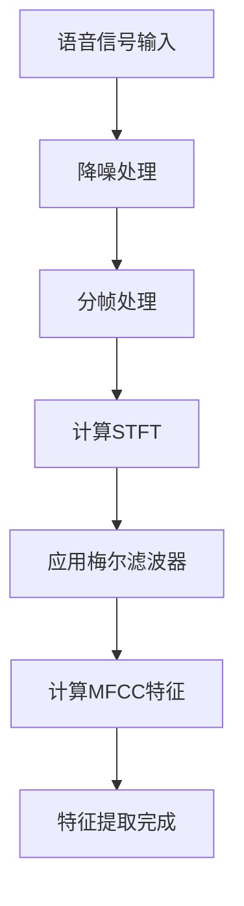

                 


# 第3章: 智能语音助手的核心技术

## 3.3 语音信号处理

### 3.3.1 声学特征提取

#### 声音的预处理
在进行声学特征提取之前，通常需要对原始语音信号进行预处理，以去除噪声和干扰，提高特征提取的准确性。预处理步骤包括：

1. **降噪处理**：使用滤波器或算法（如高通滤波器、陷波滤波器或基于深度学习的降噪模型）去除环境噪声。
2. **归一化处理**：对语音信号进行归一化处理，使其具有相似的动态范围，便于后续处理。

#### 特征提取方法
常用的语音特征提取方法包括：

1. **MFCC（Mel-Frequency Cepstral Coefficients）**：
   - **预加重**：为了增强高频成分，对语音信号进行预加重处理。
   - **分帧处理**：将语音信号分割成小的帧，通常长度为20-25ms，帧间隔为50-100ms。
   - **计算STFT（Short-Time Fourier Transform）**：计算每一帧的频谱。
   - **应用梅尔滤波器**：将频谱转换到梅尔域，提取频带能量。
   - **计算DCT（离散余弦变换）**：将梅尔频谱转换为线性分量，得到MFCC特征。

2. **梅尔频谱（Mel Spectrogram）**：
   - 将语音信号转换为梅尔频谱，直接用于模型训练。

3. **倒谱（Cepstrum）**：
   - 通过对信号进行离散傅里叶变换和倒谱变换，提取语音的特征。

#### 特征选择
选择合适的特征对于语音识别和合成至关重要。通常需要根据任务需求选择适合的特征，如MFCC适用于语音识别，梅尔频谱适用于语音合成。

### 3.3.2 声音的特征分析

#### 基频、周期、振幅、音调和响度
- **基频**：语音的基频决定了音调的高低，通常在100Hz到几千Hz之间。
- **周期**：声音的周期决定了音调的高低，周期越短，音调越高。
- **振幅**：声音的振幅决定了音量的大小，振幅越大，音量越高。
- **音调**：音调是声音的高低，与基频密切相关。
- **响度**：响度是声音的强度，与振幅和周期有关。

这些特征在语音信号处理中起着关键作用，可以通过时频分析、自相关分析等方法提取。

### 3.3.3 声音的数字化处理

#### 采样
- **采样率**：根据奈奎斯特采样定理，采样率应至少为信号最高频率的两倍。通常人声的最高频率为4kHz，因此采样率为8kHz或16kHz。
- **量化位数**：通常采用16位或32位量化，确保足够的动态范围。
- **声道数**：通常为单声道或双声道。

#### 量化和编码
- **脉冲编码调制（PCM）**：将模拟信号转换为数字信号的过程，包括采样、量化和编码。
- **压缩编码**：如MP3、AAC等，用于减少数据量，同时保持较好的音质。

### 3.3.4 声音的特征提取流程图



### 3.3.5 声音的特征提取代码示例

```python
import librosa
import numpy as np

# 加载语音信号
audio_path = "audio.wav"
signal, sample_rate = librosa.load(audio_path, sr=None, duration=3)

# 预加重处理
def preemphasis(signal, preemph=0.97):
    emphasized_signal = np.zeros_like(signal)
    emphasized_signal[0] = signal[0]
    for i in range(1, len(signal)):
        emphasized_signal[i] = signal[i] - preemph * signal[i-1]
    return emphasized_signal

emphasized_signal = preemphasis(signal)

# 分帧处理
frame_length = 20  # ms
frame_overlap = 10  # ms
n_fft = int(1000 * frame_length / 1000)
hop_length = int(1000 * frame_overlap / 1000)

# 计算STFT和MFCC
stft = librosa.stft(emphasized_signal, n_fft=n_fft, hop_length=hop_length)
mfcc = librosa.feature.mfcc(S=librosa.amplitude_to_db(np.abs(stft), ref=np.max), n_mfcc=13)

print("MFCC特征的维度：", mfcc.shape[1])
```

### 3.3.6 本节小结
语音信号处理是智能语音助手的核心技术之一，通过声学特征提取、特征分析和数字化处理，可以有效地提取语音信号中的有用信息，为后续的语音识别和合成提供高质量的特征向量。

