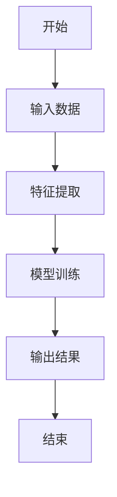

                 


# 开发AI Agent支持的智能财务分析系统

> 关键词：AI Agent、智能财务分析、系统架构、算法原理、项目实战

> 摘要：本文详细探讨了开发AI Agent支持的智能财务分析系统的背景、核心概念、算法原理、系统架构、项目实战及最佳实践。通过系统分析和实际案例，帮助读者全面理解AI Agent在财务分析中的应用及其技术实现。

---

## 目录

### 第1章：背景介绍

#### 1.1 AI Agent的基本概念
- 1.1.1 什么是AI Agent
- 1.1.2 AI Agent的核心特征
- 1.1.3 AI Agent与传统AI的区别

#### 1.2 智能财务分析的背景
- 1.2.1 财务分析的传统方法
- 1.2.2 传统方法的局限性
- 1.2.3 AI Agent在财务分析中的优势

#### 1.3 系统开发背景
- 1.3.1 当前财务分析技术的挑战
- 1.3.2 AI Agent技术的发展现状
- 1.3.3 开发智能财务分析系统的必要性

### 第2章：核心概念与联系

#### 2.1 AI Agent的原理
- 2.1.1 知识表示
- 2.1.2 推理机制
- 2.1.3 学习机制

#### 2.2 智能财务分析系统的结构
- 2.2.1 数据源
- 2.2.2 分析模块
- 2.2.3 决策模块

#### 2.3 核心概念对比表
- 2.3.1 AI Agent与传统软件的对比
- 2.3.2 智能分析与传统分析的对比

#### 2.4 ER实体关系图（Mermaid）
```mermaid
er
  actor: 用户
  system: 智能财务分析系统
  database: 财务数据库
  actor --> system: 提交财务数据
  system --> database: 存储分析结果
  database --> system: 提供历史数据
  system --> actor: 返回分析报告
```

### 第3章：算法原理

#### 3.1 自然语言处理算法
- 3.1.1 分词算法
- 3.1.2 语义分析
- 3.1.3 情感分析

#### 3.2 强化学习算法
- 3.2.1 Q-learning算法
- 3.2.2 Deep Q-Network算法
- 3.2.3 策略梯度算法

#### 3.3 算法流程图（Mermaid）


#### 3.4 Python代码实现
```python
import numpy as np
from sklearn.feature_extraction.text import TfidfVectorizer

# 示例代码：文本特征提取
text = "公司第四季度利润增长显著，但研发投入增加"
vectorizer = TfidfVectorizer()
X = vectorizer.fit_transform([text])
print(X.toarray())
```

### 第4章：系统分析与架构设计

#### 4.1 项目背景
- 4.1.1 项目目标
- 4.1.2 项目范围
- 4.1.3 项目约束

#### 4.2 系统功能设计
- 4.2.1 数据采集模块
- 4.2.2 数据处理模块
- 4.2.3 模型训练模块
- 4.2.4 结果展示模块

#### 4.3 系统架构设计（Mermaid）


#### 4.4 接口设计
- 4.4.1 REST API设计
- 4.4.2 数据格式规范
- 4.4.3 接口测试

#### 4.5 交互设计（Mermaid）
```mermaid
sequenceDiagram
    actor 用户
    system 系统
    用户 -> 系统: 提交财务报表
    系统 -> 用户: 请求补充数据
    用户 -> 系统: 提供补充数据
    系统 -> 用户: 返回分析结果
```

### 第5章：项目实战

#### 5.1 环境安装
- 5.1.1 安装Python
- 5.1.2 安装相关库（如TensorFlow、Scikit-learn）
- 5.1.3 安装Jupyter Notebook

#### 5.2 核心代码实现
- 5.2.1 数据预处理
- 5.2.2 模型训练
- 5.2.3 结果可视化

#### 5.3 案例分析
- 5.3.1 数据采集与清洗
- 5.3.2 模型训练与优化
- 5.3.3 结果展示与解读

#### 5.4 项目总结
- 5.4.1 项目成果
- 5.4.2 项目经验
- 5.4.3 项目改进建议

### 第6章：最佳实践

#### 6.1 小结
- 6.1.1 AI Agent的优势
- 6.1.2 智能财务分析系统的潜力

#### 6.2 注意事项
- 6.2.1 数据隐私与安全
- 6.2.2 算法选择与优化
- 6.2.3 系统维护与更新

#### 6.3 拓展阅读
- 6.3.1 推荐书籍
- 6.3.2 相关论文
- 6.3.3 在线资源

---

## 附录

#### A. 常见问题解答
#### B. 进一步学习资源
#### C. 参考文献

---

通过以上目录结构，文章内容将详细讲解AI Agent支持的智能财务分析系统的各个方面，确保读者能够系统地理解并掌握相关技术。

