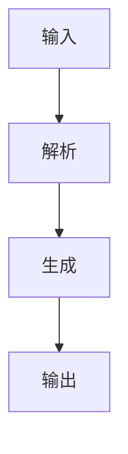
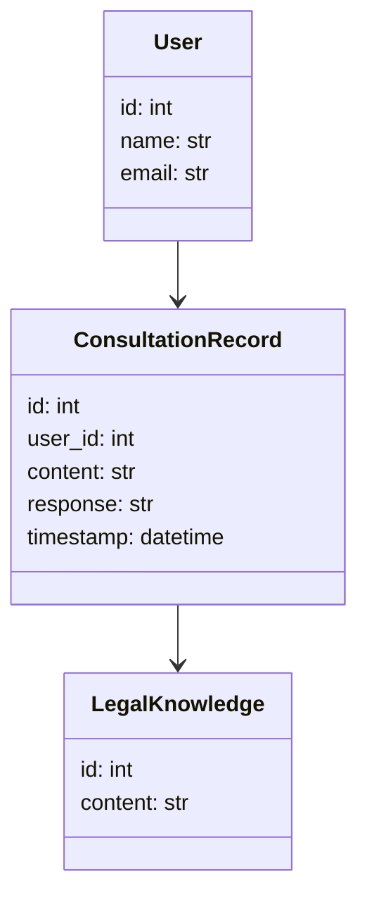
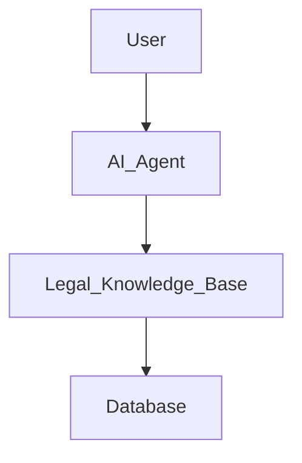
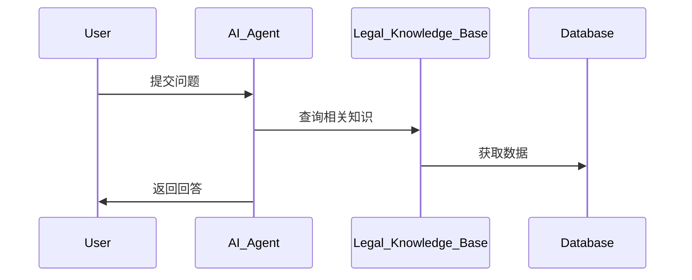

                 


# 开发AI Agent支持的法律咨询系统

> **关键词**：AI Agent，法律咨询系统，生成式模型，系统架构设计，算法原理，法律知识库，对话生成

> **摘要**：  
本文详细探讨了如何开发一个基于AI Agent的法律咨询系统，从系统背景、核心概念、算法原理、系统架构设计到实际项目实现，逐步展开分析。文章首先介绍了传统法律咨询的痛点及AI技术的应用潜力，接着详细阐述了AI Agent在法律咨询中的核心原理和功能模块，随后从算法实现、系统架构设计、接口设计等多个维度深入探讨了系统开发的关键技术。最后，通过实际项目案例展示了系统实现的过程，并提出了开发中的注意事项及未来的研究方向。

---

## 第1章: AI Agent与法律咨询系统背景介绍

### 1.1 问题背景

#### 1.1.1 传统法律咨询的痛点
传统法律咨询系统存在以下主要问题：
- **效率低下**：人工咨询需要排队，用户等待时间长。
- **资源不足**：律师数量有限，难以满足大规模需求。
- **成本高昂**：法律咨询费用昂贵，普通用户难以负担。
- **信息不对称**：用户对法律知识了解不足，难以准确表达需求。

#### 1.1.2 AI技术在法律咨询中的应用潜力
AI技术，尤其是自然语言处理（NLP）和生成式模型，为法律咨询系统带来了革命性的变化：
- **24/7可用性**：AI系统可以随时为用户提供服务。
- **快速响应**：通过算法快速生成法律建议。
- **降低成本**：降低用户获取法律帮助的成本。
- **个性化服务**：根据用户需求提供定制化建议。

#### 1.1.3 系统的需求分析
系统需要满足以下核心需求：
- **准确性**：生成的法律建议必须准确无误。
- **可解释性**：用户需要理解AI生成建议的依据。
- **隐私保护**：确保用户数据的安全性。

### 1.2 问题描述

#### 1.2.1 系统的核心功能
AI Agent支持的法律咨询系统应具备以下功能：
- **用户咨询**：用户输入法律问题，系统生成回答。
- **知识检索**：从法律知识库中快速检索相关法规和案例。
- **智能推荐**：根据用户需求推荐相关法律信息。

#### 1.2.2 AI Agent在法律咨询中的角色定位
AI Agent在系统中扮演以下角色：
- **信息处理**：接收用户输入，解析需求。
- **知识检索**：从知识库中提取相关信息。
- **对话生成**：基于检索结果生成自然语言回答。

#### 1.2.3 系统的目标与预期效果
系统的目标是：
- 提供高效、准确的法律咨询服务。
- 降低用户获取法律帮助的成本。
- 提高法律服务的普及性。

### 1.3 问题解决

#### 1.3.1 AI Agent的解决方案
AI Agent通过以下方式实现法律咨询：
- **自然语言理解**：解析用户的法律问题。
- **知识库查询**：快速检索相关法律条文。
- **生成式回答**：基于查询结果生成回答。

#### 1.3.2 技术实现路径
系统开发的实现路径包括：
1. **法律知识库构建**：整理和存储相关法律条文。
2. **AI模型训练**：使用生成式模型进行训练。
3. **系统集成**：将AI Agent与法律知识库集成。

#### 1.3.3 系统架构设计的初步思考
初步架构设计包括：
- **前端**：用户交互界面。
- **后端**：AI Agent和知识库服务。
- **数据库**：存储法律知识和用户数据。

### 1.4 系统的边界与外延

#### 1.4.1 系统的功能边界
系统功能包括：
- 用户咨询模块：接收用户输入。
- 知识检索模块：查询法律知识库。
- 对话生成模块：生成回答。

#### 1.4.2 系统的适用范围
系统适用于：
- 个人用户：提供法律建议。
- 企业用户：合规咨询。

#### 1.4.3 系统与其他系统的交互关系
系统可能与以下系统交互：
- **司法数据库**：获取最新法律条文。
- **用户管理系统**：管理用户信息。

### 1.5 核心概念与组成

#### 1.5.1 系统的核心要素
系统由以下核心要素组成：
- AI Agent：负责信息处理和对话生成。
- 法律知识库：存储法律条文和案例。
- 用户界面：与用户交互。

#### 1.5.2 AI Agent的组成与功能
AI Agent包括：
- **自然语言理解模块**：解析用户输入。
- **知识检索模块**：查询法律知识库。
- **对话生成模块**：生成回答。

#### 1.5.3 法律知识库的构建与管理
法律知识库的构建步骤：
1. 收集法律条文。
2. 标注和分类。
3. 数据存储和管理。

---

## 第2章: AI Agent与法律咨询系统的核心概念

### 2.1 AI Agent的定义与原理

#### 2.1.1 AI Agent的基本定义
AI Agent是一种能够感知环境并采取行动以实现目标的智能体。

#### 2.1.2 AI Agent的核心原理
AI Agent通过以下步骤实现功能：
1. **感知环境**：接收输入。
2. **决策制定**：基于知识库生成回答。
3. **执行行动**：输出回答。

#### 2.1.3 AI Agent与传统软件的区别
AI Agent的特点包括：
- **智能性**：能够理解和生成自然语言。
- **学习能力**：通过训练不断优化。

### 2.2 法律咨询系统的功能模块

#### 2.2.1 用户咨询模块
用户咨询模块负责接收用户输入，包括：
- 文本输入：用户输入法律问题。
- 语音输入：用户通过语音提问。

#### 2.2.2 知识检索模块
知识检索模块包括：
- 法律条文检索：查询相关法规。
- 案例检索：查询类似案例。

#### 2.2.3 智能推荐模块
智能推荐模块提供：
- 相关法规推荐。
- 相似案例推荐。

### 2.3 AI Agent与法律咨询系统的联系

#### 2.3.1 AI Agent在法律咨询中的应用场景
应用场景包括：
- 个人法律咨询：解答合同、婚姻等问题。
- 企业合规咨询：提供法律意见。

#### 2.3.2 系统的模块化设计
模块化设计包括：
- 用户界面模块：与用户交互。
- AI Agent模块：处理用户请求。
- 知识库模块：存储和检索信息。

#### 2.3.3 AI Agent与法律知识库的交互
AI Agent与知识库的交互过程：
1. 接收用户请求。
2. 检索相关知识。
3. 生成回答。

### 2.4 核心概念对比表

#### 2.4.1 AI Agent与传统法律咨询工具的对比
| 特性          | AI Agent                | 传统工具          |
|---------------|-------------------------|-------------------|
| 可用性         | 24/7可用                | 工作时间有限       |
| 响应速度       | 快速生成回答            | 需要人工处理       |
| 成本           | 低                     | 高                 |

#### 2.4.2 不同AI Agent模型的性能对比
| 模型           | GPT-3                  | ChatGPT          |
|----------------|------------------------|------------------|
| 性能           | 高                    | 更优化            |
| 成本           | 较高                  | 较低              |

#### 2.4.3 法律知识库与其他知识库的对比
| 类型           | 法律知识库              | 其他知识库        |
|----------------|------------------------|------------------|
| 内容           | 法律法规                | 通用知识          |
| 专业性         | 高                    | 低               |

### 2.5 ER实体关系图

#### 2.5.1 用户与咨询记录的关系
```mermaid
er
  user (id, name, email)
  consultation_record (id, user_id, content, response, timestamp)
  user --> consultation_record
```

#### 2.5.2 咨询记录与法律知识的关系
```mermaid
er
  consultation_record (id, content, response)
  legal_knowledge (id, content)
  consultation_record --> legal_knowledge
```

#### 2.5.3 AI Agent与知识库的关系
```mermaid
er
  ai_agent (id, model_type)
  legal_knowledge (id, content)
  ai_agent --> legal_knowledge
```

### 2.6 本章小结

---

## 第3章: AI Agent支持的法律咨询系统算法原理

### 3.1 算法原理概述

#### 3.1.1 生成式模型的基本原理
生成式模型通过概率分布生成文本，常见的模型包括GPT系列。

#### 3.1.2 对话生成算法的实现流程
对话生成流程包括：
1. 接收输入。
2. 解析输入。
3. 生成回答。

#### 3.1.3 算法的优化与改进
优化方向包括：
- 提升回答准确性。
- 增强可解释性。

### 3.2 生成式模型的数学模型

#### 3.2.1 概率模型的定义与公式
概率模型定义为：
$$ P(y|x) = \frac{P(x,y)}{P(x)} $$

#### 3.2.2 损失函数的计算公式
常用损失函数为交叉熵损失：
$$ \mathcal{L} = -\sum_{i=1}^{n} \log P(y_i|x_i) $$

#### 3.2.3 模型训练的数学推导
训练过程通过反向传播优化参数。

### 3.3 对话生成算法的实现

#### 3.3.1 算法流程图


#### 3.3.2 算法的代码实现
```python
def generate_response(prompt):
    response = model.generate(prompts=prompt, max_tokens=500)
    return response.choices[0].message.content
```

#### 3.3.3 算法的优化与改进
- 使用更精细的模型。
- 增加上下文理解能力。

### 3.4 本章小结

---

## 第4章: 系统分析与架构设计

### 4.1 系统分析

#### 4.1.1 问题场景介绍
问题场景包括：
- 用户咨询法律问题。
- 系统生成回答。

#### 4.1.2 项目介绍
项目目标是开发一个AI Agent支持的法律咨询系统。

### 4.2 系统功能设计

#### 4.2.1 领域模型类图


### 4.3 系统架构设计

#### 4.3.1 系统架构图


#### 4.3.2 接口设计
- **输入接口**：接收用户输入。
- **输出接口**：返回回答。

#### 4.3.3 交互序列图


### 4.4 本章小结

---

## 第5章: 项目实战

### 5.1 环境安装

#### 5.1.1 安装Python和必要的库
安装以下库：
- `python`
- `transformers`
- `torch`

#### 5.1.2 安装法律知识库
获取法律知识库数据集。

### 5.2 核心代码实现

#### 5.2.1 法律知识库的构建代码
```python
import json

def save_knowledge_base(data, filename):
    with open(filename, 'w') as f:
        json.dump(data, f)

knowledge = [
    {"content": "合同法第10条", "description": "合同的成立条件"},
    {"content": "民法典第100条", "description": "民事权利"}
]

save_knowledge_base(knowledge, 'legal_knowledge.json')
```

#### 5.2.2 AI Agent的训练代码
```python
from transformers import AutoModelForCausalLM, AutoTokenizer

model_name = 'gpt2'
tokenizer = AutoTokenizer.from_pretrained(model_name)
model = AutoModelForCausalLM.from_pretrained(model_name)
```

#### 5.2.3 对话生成的代码
```python
def generate_response(prompt):
    inputs = tokenizer.encode(prompt, return_tensors='pt')
    outputs = model.generate(inputs, max_length=500)
    response = tokenizer.decode(outputs[0], skip_special_tokens=True)
    return response
```

### 5.3 案例分析

#### 5.3.1 案例1: 合同纠纷
用户输入：“我在工作中遇到了合同纠纷，该怎么办？”
系统回答：“您可以先与对方协商解决，若无法达成一致，可以考虑提起诉讼。”

#### 5.3.2 案例2: 婚姻问题
用户输入：“我想了解离婚的相关法律程序。”
系统回答：“根据《民法典》，您需要准备相关文件并提交至当地法院。”

### 5.4 项目小结

---

## 第6章: 小结、注意事项与拓展阅读

### 6.1 小结
本文详细介绍了AI Agent支持的法律咨询系统的开发过程，包括系统背景、核心概念、算法原理、系统架构设计和项目实战。

### 6.2 注意事项
- **数据隐私**：确保用户数据的安全性。
- **模型准确性**：定期更新和优化模型。
- **用户体验**：设计友好的用户界面。

### 6.3 拓展阅读
- 推荐书籍：《AI for Lawyers》。
- 推荐论文：《Applying AI in Legal Consultation Systems》。

### 6.4 本章小结

---

## 第7章: 未来展望与总结

### 7.1 未来展望
- **模型优化**：提升生成式模型的准确性。
- **多语言支持**：扩展系统支持多种语言。
- **法律领域深化**：深化特定法律领域的应用。

### 7.2 总结
本文全面探讨了AI Agent支持的法律咨询系统的开发，为未来的法律服务智能化提供了参考。

---

**摘要**  
本文系统地探讨了AI Agent支持的法律咨询系统的开发过程，涵盖了从背景分析到实际实现的各个方面。通过详细的技术分析和案例展示，展示了AI技术在法律咨询中的巨大潜力和实际应用价值。

