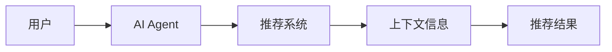
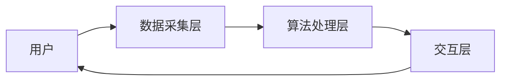

                 


# 开发AI Agent的上下文感知推荐系统

## 关键词：AI Agent、上下文感知、推荐系统、算法原理、系统架构

## 摘要：  
本文详细探讨了如何开发一个基于AI Agent的上下文感知推荐系统。通过分析当前推荐系统的局限性，提出了一种结合AI Agent和上下文感知技术的解决方案。文章从背景、核心概念、算法原理、系统架构到项目实战，全面阐述了该系统的开发过程，为读者提供了理论基础和实践指导。

---

# 第一部分: 背景介绍

## 第1章: 背景介绍

### 1.1 问题背景

#### 1.1.1 当前推荐系统面临的挑战
传统的推荐系统基于用户的历史行为数据，但在动态变化的环境中难以捕捉实时的用户需求。例如，在电商平台上，用户的行为可能受到时间、地点、心情等多种因素的影响，传统推荐系统难以有效应对这些变化。

#### 1.1.2 上下文感知推荐的必要性
上下文感知推荐能够通过实时收集和分析用户的行为、环境等信息，提供更精准的推荐。例如，在音乐流媒体平台上，用户在早晨和晚上可能有不同的听歌偏好，系统需要根据时间上下文进行推荐。

#### 1.1.3 AI Agent在推荐系统中的作用
AI Agent（智能代理）能够主动感知用户需求，动态调整推荐策略。例如，在购物平台上，AI Agent可以根据用户的实时浏览行为和历史偏好，实时调整推荐结果。

### 1.2 问题描述

#### 1.2.1 推荐系统的定义与目标
推荐系统是一种基于用户行为数据和物品属性的算法，旨在为用户提供个性化的内容或商品推荐。

#### 1.2.2 上下文感知推荐的定义
上下文感知推荐是一种能够利用实时上下文信息（如时间、地点、设备状态等）进行推荐的技术。

#### 1.2.3 AI Agent在推荐系统中的角色
AI Agent作为推荐系统的执行者，负责感知用户需求、收集上下文信息并动态调整推荐策略。

### 1.3 问题解决

#### 1.3.1 上下文感知推荐的核心思想
通过整合实时上下文信息和用户历史数据，提供更精准的推荐。

#### 1.3.2 AI Agent如何实现上下文感知
AI Agent通过实时收集和分析用户的多维度信息，结合上下文信息生成推荐结果。

#### 1.3.3 系统设计的关键点
系统需要具备实时数据采集能力、高效的上下文分析算法以及动态调整推荐策略的能力。

### 1.4 边界与外延

#### 1.4.1 系统的边界
系统仅关注用户的实时行为和上下文信息，不涉及用户的隐私数据。

#### 1.4.2 相关领域的外延
系统与自然语言处理、计算机视觉等领域相关，但不涉及核心算法的实现。

#### 1.4.3 系统的适用范围与限制
适用于需要实时推荐的应用场景，如电商、音乐、视频等领域，但对实时性要求极高的场景可能存在性能瓶颈。

### 1.5 核心概念组成

#### 1.5.1 AI Agent的定义与特征
- **定义**：AI Agent是一种能够感知环境并主动执行任务的智能实体。
- **特征**：自主性、反应性、主动性、目标导向性。

#### 1.5.2 上下文感知推荐的核心要素
- **上下文信息**：时间、地点、设备、用户行为等。
- **推荐算法**：协同过滤、深度学习模型等。

#### 1.5.3 系统整体架构的组成
- **数据采集层**：收集用户行为和上下文信息。
- **算法处理层**：分析上下文信息并生成推荐结果。
- **交互层**：用户与系统进行交互，获取推荐结果。

---

# 第二部分: 核心概念与联系

## 第2章: 核心概念与联系

### 2.1 AI Agent的核心原理

#### 2.1.1 AI Agent的基本原理
AI Agent通过感知环境、分析任务需求并执行任务，以实现目标。

#### 2.1.2 AI Agent的分类与特点
- **简单反射型**：基于规则的反应式代理。
- **基于模型的反射型**：基于知识库的代理。
- **目标驱动型**：基于目标的代理。

#### 2.1.3 AI Agent与推荐系统的联系
AI Agent作为推荐系统的执行者，能够动态调整推荐策略。

### 2.2 上下文感知推荐的原理

#### 2.2.1 上下文感知推荐的基本原理
通过分析用户的实时行为和上下文信息，生成个性化推荐。

#### 2.2.2 上下文感知推荐的核心算法
- **协同过滤**：基于用户相似性生成推荐。
- **深度学习模型**：如BERT模型用于上下文分析。

#### 2.2.3 上下文感知推荐与传统推荐的区别
- **实时性**：上下文感知推荐更注重实时性。
- **动态性**：上下文感知推荐能够动态调整推荐结果。

### 2.3 核心概念对比

#### 2.3.1 AI Agent与传统推荐系统的对比
| 特性         | AI Agent推荐系统 | 传统推荐系统 |
|--------------|------------------|--------------|
| 自主性       | 高               | 低           |
| 实时性       | 高               | 低           |
| 适应性       | 高               | 中           |

#### 2.3.2 上下文感知推荐与传统推荐的对比
| 特性         | 上下文感知推荐 | 传统推荐 |
|--------------|----------------|----------|
| 是否考虑上下文 | 是             | 否        |
| 实时性       | 高             | 低        |

#### 2.3.3 AI Agent在上下文感知推荐中的作用
AI Agent能够主动感知用户需求，动态调整推荐策略。

### 2.4 实体关系图



---

# 第三部分: 算法原理

## 第3章: 算法原理

### 3.1 协同过滤算法

#### 3.1.1 基于用户的协同过滤
- **原理**：通过计算用户相似度，找到相似用户的偏好，进行推荐。
- **公式**：$$相似度 = \frac{\sum (r_{ui} - \bar{r_u})(r_{vi} - \bar{r_v})}{\sqrt{\sum (r_{ui} - \bar{r_u})^2} \cdot \sqrt{\sum (r_{vi} - \bar{r_v})^2}}$$

#### 3.1.2 基于物品的协同过滤
- **原理**：通过计算物品相似度，推荐用户可能感兴趣的物品。
- **公式**：$$相似度 = \frac{\sum r_{ui} \cdot r_{uj}}{\sqrt{\sum r_{ui}^2} \cdot \sqrt{\sum r_{uj}^2}}$$

### 3.2 深度学习模型

#### 3.2.1 BERT模型在上下文分析中的应用
- **原理**：通过预训练的BERT模型分析上下文信息，生成推荐结果。

#### 3.2.2 推荐模型的数学表示
- **输入**：用户行为、上下文信息。
- **输出**：推荐结果。
- **公式**：$$P(y|x) = \text{softmax}(Wx + b)$$

### 3.3 上下文表示与推荐模型

#### 3.3.1 上下文表示的数学模型
- **表示方法**：使用向量表示上下文信息。
- **公式**：$$v_c = \text{concat}(v_t, v_l, v_d)$$
  其中，$$v_t$$ 表示时间向量，$$v_l$$ 表示地点向量，$$v_d$$ 表示设备向量。

#### 3.3.2 推荐模型的算法流程
1. 收集用户行为和上下文信息。
2. 分析上下文信息，生成上下文向量。
3. 结合用户历史行为和上下文向量，生成推荐结果。

---

## 第4章: 系统分析与架构设计

### 4.1 系统功能设计

#### 4.1.1 系统功能模块
- **数据采集模块**：收集用户行为和上下文信息。
- **算法处理模块**：分析上下文信息并生成推荐结果。
- **交互模块**：用户与系统进行交互，获取推荐结果。

#### 4.1.2 系统功能流程
1. 用户发起请求，系统收集用户行为和上下文信息。
2. 算法处理模块分析上下文信息，生成推荐结果。
3. 交互模块将推荐结果返回给用户。

### 4.2 系统架构设计

#### 4.2.1 系统架构图


#### 4.2.2 系统接口设计
- **输入接口**：用户行为、上下文信息。
- **输出接口**：推荐结果。

#### 4.2.3 系统交互流程
1. 用户发起请求，系统收集用户行为和上下文信息。
2. 算法处理层分析信息，生成推荐结果。
3. 交互层将推荐结果返回给用户。

---

## 第5章: 项目实战

### 5.1 环境安装

#### 5.1.1 环境要求
- Python 3.8+
- PyTorch 1.9+
- transformers库

#### 5.1.2 安装依赖
```bash
pip install torch transformers
```

### 5.2 系统核心实现

#### 5.2.1 数据采集模块
```python
class DataCollector:
    def collect_context(self):
        # 收集上下文信息
        return {"time": current_time, "location": current_location}
```

#### 5.2.2 算法处理模块
```python
class Recommender:
    def __init__(self, model):
        self.model = model
    
    def generate_recommendation(self, user_id, context):
        # 调用模型生成推荐结果
        return self.model.predict(user_id, context)
```

### 5.3 代码解读与分析

#### 5.3.1 数据采集模块解读
数据采集模块负责收集用户的实时行为和上下文信息，如时间、地点等。

#### 5.3.2 算法处理模块解读
算法处理模块基于用户历史行为和上下文信息，调用推荐模型生成推荐结果。

### 5.4 案例分析

#### 5.4.1 案例场景
在音乐流媒体平台上，用户在早晨和晚上有不同的听歌偏好。

#### 5.4.2 案例实现
```python
def main():
    collector = DataCollector()
    recommender = Recommender(model)
    context = collector.collect_context()
    recommendations = recommender.generate_recommendation(user_id, context)
    print(recommendations)
```

### 5.5 项目小结

#### 5.5.1 项目总结
通过项目实战，我们掌握了AI Agent在上下文感知推荐系统中的应用。

#### 5.5.2 经验分享
- 确保数据采集的实时性。
- 选择合适的推荐算法。

---

## 第6章: 最佳实践

### 6.1 开发中的注意事项

#### 6.1.1 数据质量
确保数据的实时性和准确性。

#### 6.1.2 模型选择
根据实际需求选择合适的推荐算法。

#### 6.1.3 性能优化
优化系统的响应速度和推荐精度。

### 6.2 小结

#### 6.2.1 核心要点回顾
- AI Agent在推荐系统中的作用。
- 上下文感知推荐的核心思想。
- 系统架构设计的关键点。

### 6.3 注意事项

#### 6.3.1 系统的局限性
- 对实时性要求高的场景可能存在性能瓶颈。

### 6.4 拓展阅读

#### 6.4.1 相关领域
- 多模态推荐系统。
- 动态上下文理解。

#### 6.4.2 未来研究方向
- 基于多模态数据的上下文分析。
- 实时推荐系统的优化。

---

通过本文的系统介绍和实践分析，读者可以深入了解如何开发一个基于AI Agent的上下文感知推荐系统，并将其应用于实际场景中。

