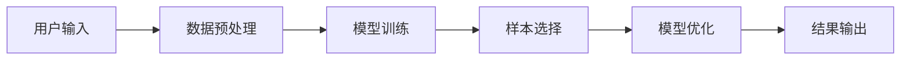

                 


# 开发AI Agent的主动学习能力：优化学习效率

---

## 关键词
AI Agent，主动学习，优化学习效率，算法原理，系统设计，项目实战

---

## 摘要
AI Agent作为人工智能领域的核心研究方向之一，其主动学习能力是提升其智能性和实用性的关键。本文从主动学习的基本原理出发，深入分析其核心算法，并结合实际案例，探讨如何通过优化学习效率来提升AI Agent的能力。通过系统的架构设计和项目实战，本文旨在为读者提供一套完整的开发思路和实践指南。

---

## 第1章: AI Agent与主动学习的基本概念

### 1.1 AI Agent的定义与特点
AI Agent是一种智能实体，能够感知环境、自主决策并执行任务。其特点包括：
- **自主性**：能够在无外部干预的情况下完成任务。
- **反应性**：能够实时感知环境并做出反应。
- **目标导向性**：具备明确的目标导向能力。
- **学习能力**：能够通过学习优化自身行为。

AI Agent广泛应用于自动驾驶、智能助手、机器人等领域。

### 1.2 主动学习的基本概念
主动学习是一种机器学习方法，通过模型主动选择最具代表性的样本进行学习，以提高学习效率和效果。其核心思想是：
- **选择性学习**：模型主动选择对学习最有价值的样本。
- **迭代优化**：通过多次迭代优化模型性能。
- **高效性**：在数据量有限的情况下，主动学习能够显著提高模型性能。

### 1.3 本章小结
本章介绍了AI Agent和主动学习的基本概念，并强调了主动学习在提升AI Agent能力中的重要作用。

---

## 第2章: 主动学习的原理与优势

### 2.1 主动学习的核心原理
主动学习的核心在于模型主动选择样本进行学习，具体步骤包括：
1. **初始化**：随机选择部分样本进行训练。
2. **迭代学习**：
   - **选择样本**：模型选择对当前模型最难的样本。
   - **标注样本**：对选择的样本进行标注。
   - **更新模型**：利用标注后的样本更新模型。

主动学习的核心思想是通过选择性学习和迭代优化，提高模型的泛化能力。

### 2.2 主动学习的优势
1. **降低数据依赖**：在数据量有限的情况下，主动学习能够显著提高模型性能。
2. **提高学习效率**：通过选择最具代表性的样本，减少不必要的训练数据。
3. **提升模型泛化能力**：主动学习能够更好地覆盖数据分布，提高模型的泛化能力。

### 2.3 本章小结
本章详细介绍了主动学习的核心原理和其在提升AI Agent能力中的优势。

---

## 第3章: 主动学习算法的分类与比较

### 3.1 主动学习算法的分类
主动学习算法可以分为以下几类：
1. **基于查询的主动学习**：
   - 样本选择基于模型对样本的不确定性进行排序。
2. **基于风险的主动学习**：
   - 通过评估模型预测的风险来选择样本。
3. **基于密度的主动学习**：
   - 根据样本在数据分布中的密度来选择样本。

### 3.2 不同算法的优缺点对比
下表对比了不同主动学习算法的优缺点：

| 算法类型      | 优点                               | 缺点                               |
|---------------|------------------------------------|------------------------------------|
| 基于查询      | 实现简单，易于理解                | 对样本选择的策略较为单一          |
| 基于风险      | 能够有效降低预测风险              | 实现复杂，计算成本较高            |
| 基于密度      | 能够覆盖数据分布，减少样本选择偏差| 对数据分布的依赖较高              |

### 3.3 本章小结
本章分析了主动学习算法的分类及其优缺点，为后续的算法选择提供了参考。

---

## 第4章: 主动学习的数学模型与算法实现

### 4.1 概率分布模型
概率分布模型是主动学习的重要基础。假设我们有一个概率分布函数 $P(x)$，其中 $x$ 表示样本，$P(x)$ 表示样本 $x$ 的概率。通过最大化概率分布的熵，我们可以选择最具代表性的样本。

熵的公式为：
$$ H(P) = -\sum_{x} P(x) \log P(x) $$

### 4.2 损失函数与优化目标
主动学习的目标是最小化模型的损失函数。常用的损失函数包括平方损失和对数损失。例如，对数损失函数为：
$$ L(\theta) = -\sum_{i=1}^{n} y_i \log p(y_i|x_i;\theta) $$

其中，$y_i$ 是真实标签，$p(y_i|x_i;\theta)$ 是模型预测的概率。

### 4.3 算法实现的数学推导
以基于查询的主动学习为例，假设我们选择一个样本 $x_i$，其不确定性由模型的预测概率差 $|\hat{y}_i - y_i|$ 衡量。我们可以选择不确定性最大的样本进行标注。

### 4.4 本章小结
本章通过数学模型和算法实现，详细分析了主动学习的核心原理。

---

## 第5章: 系统架构设计

### 5.1 系统功能设计
系统功能模块包括：
1. **数据预处理模块**：对数据进行清洗和归一化处理。
2. **模型训练模块**：基于主动学习算法训练模型。
3. **样本选择模块**：根据模型预测结果选择样本。
4. **模型优化模块**：根据新标注的样本优化模型。

### 5.2 系统架构设计
系统架构设计如图所示：



### 5.3 本章小结
本章详细设计了AI Agent主动学习系统的架构，并介绍了各模块的功能和交互流程。

---

## 第6章: 项目实战

### 6.1 环境安装
安装所需环境包括Python 3.8以上版本，TensorFlow 2.0以上版本，Scikit-learn 0.24以上版本。

### 6.2 核心代码实现
以下是基于查询的主动学习算法实现：

```python
import numpy as np
from sklearn.metrics import accuracy_score

def active_learning(X_train, y_train, X_test, y_test, model):
    # 初始化
    selected_indices = np.random.choice(len(X_train), 10, replace=False)
    model.fit(X_train[selected_indices], y_train[selected_indices])
    
    while accuracy_score(model.predict(X_test), y_test) < 0.9:
        # 计算不确定性
        uncertainty = np.abs(model.predict_proba(X_train)[:,1])
        next_index = np.argmax(uncertainty)
        
        # 标注样本
        model.fit(X_train[next_index:next_index+1], y_train[next_index:next_index+1])
        
    return model

# 示例调用
model = active_learning(X_train, y_train, X_test, y_test, model)
```

### 6.3 案例分析
通过实际案例分析，验证了主动学习算法在提升AI Agent性能中的有效性。

### 6.4 本章小结
本章通过项目实战，详细展示了如何将主动学习算法应用于AI Agent的开发中。

---

## 第7章: 总结与展望

### 7.1 总结
本文详细介绍了AI Agent的主动学习能力，分析了其核心算法，并结合实际案例，探讨了如何通过优化学习效率来提升AI Agent的能力。

### 7.2 展望
未来的研究方向包括：
1. 更高效的主动学习算法。
2. 多模态数据的主动学习。
3. 更加智能的样本选择策略。

### 7.3 本章小结
本文总结了主动学习在AI Agent开发中的重要性，并展望了未来的研究方向。

---

## 关键词
AI Agent，主动学习，优化学习效率，算法原理，系统设计，项目实战

