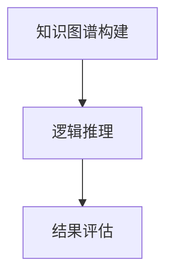
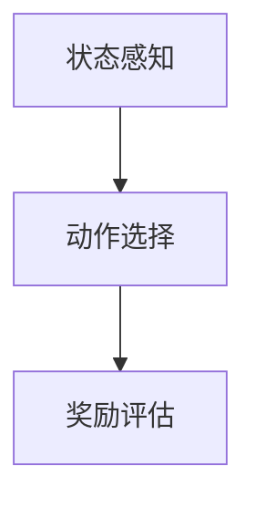

                 


# 开发AI Agent的元认知与自我评估能力

> 关键词：AI Agent，元认知，自我评估，算法原理，系统架构，项目实战

> 摘要：本文详细探讨了AI Agent的元认知与自我评估能力，分析了其核心概念、算法原理、系统架构，并通过实际案例展示了如何开发具备这些能力的AI Agent。文章内容丰富，结构清晰，适合技术爱好者和AI开发者阅读。

---

## 第一部分: AI Agent的元认知与自我评估能力概述

### 第1章: AI Agent的基本概念与背景

#### 1.1 AI Agent的定义与类型
AI Agent，即人工智能代理，是一种能够感知环境、自主决策并执行任务的智能实体。AI Agent可以分为以下几类：

- **简单反射型Agent**：基于当前输入做出反应，没有内部状态。
- **基于模型的反射型Agent**：维护内部状态，能够根据环境信息进行推理。
- **目标驱动型Agent**：根据预设目标采取行动。
- **效用驱动型Agent**：通过最大化效用函数来决策。

元认知（元认知）指的是对自身认知过程的认知，包括对知识、信念、意图和能力的反思。自我评估能力则是AI Agent对其当前状态、任务目标和环境的评估能力。

#### 1.2 元认知与自我评估能力的重要性
元认知和自我评估能力是AI Agent实现高级智能的关键。它们使AI Agent能够：
- 理解自身知识的局限性。
- 调整行为策略以适应环境变化。
- 自我修复和优化，提升决策的准确性和效率。

---

### 第2章: 元认知与自我评估能力的核心概念

#### 2.1 元认知的原理与特征
元认知的原理基于对自身认知过程的监控和调节。其主要特征如下：

- **自我监控**：实时跟踪自身的认知过程。
- **自我调节**：根据监控结果调整认知策略。
- **自我反思**：评估自身行为的有效性。

| 特征 | 描述 |
|------|------|
| 自我监控 | 跟踪认知过程的状态 |
| 自我调节 | 调整认知策略以适应环境 |
| 自我反思 | 评估行为的效果和合理性 |

#### 2.2 自我评估能力的原理与特征
自我评估能力是AI Agent对其状态和环境的评估机制。其主要特征包括：

- **环境感知**：获取环境信息。
- **目标评估**：判断当前目标的实现程度。
- **自我诊断**：识别自身的缺陷和不足。

| 特征 | 描述 |
|------|------|
| 环境感知 | 获取环境中的相关信息 |
| 目标评估 | 判断目标的实现程度 |
| 自我诊断 | 识别自身的能力缺陷 |

---

### 第3章: 元认知与自我评估能力的算法原理

#### 3.1 元认知推理算法
元认知推理算法基于知识图谱和逻辑推理。以下是其实现步骤：

1. **知识图谱构建**：将领域知识表示为图结构。
2. **逻辑推理**：通过逻辑推理引擎进行推导。
3. **结果评估**：评估推理结果的置信度。

**Mermaid流程图：**



**Python代码实现：**

```python
def build_knowledge_graph(data):
    # 构建知识图谱
    pass

def perform_reasoning(graph, query):
    # 执行逻辑推理
    pass

def evaluate_result(result):
    # 评估推理结果
    return confidence_score
```

#### 3.2 自我评估算法
自我评估算法基于强化学习。以下是其实现步骤：

1. **状态感知**：获取当前状态。
2. **动作选择**：选择最优动作。
3. **奖励评估**：评估动作的奖励值。

**Mermaid流程图：**



**Python代码实现：**

```python
def perceive_state(environment):
    # 获取当前状态
    pass

def choose_action(state, model):
    # 选择动作
    pass

def evaluate_reward(action, environment):
    # 评估奖励
    return reward_value
```

---

### 第4章: 元认知与自我评估能力的数学模型与公式

#### 4.1 元认知推理的数学模型
知识图谱的构建公式如下：

$$ 知识图谱 = \sum_{i=1}^{n} (节点_i \rightarrow 边_i \rightarrow 节点_{i+1}) $$

元认知推理的概率模型如下：

$$ P(结论 | 数据) = \prod_{i=1}^{m} P(数据_i | 结论) $$

#### 4.2 自我评估的数学模型
基于强化学习的评估公式如下：

$$ Q(s, a) = r + \gamma \max_{a'} Q(s', a') $$

其中，\( Q(s, a) \) 是状态-动作对的价值，\( r \) 是奖励，\( \gamma \) 是折扣因子。

---

## 第五部分: 总结与展望

### 5.1 总结
本文详细探讨了AI Agent的元认知与自我评估能力，分析了其核心概念、算法原理、系统架构，并通过实际案例展示了如何开发具备这些能力的AI Agent。

### 5.2 展望
未来，随着AI技术的发展，元认知与自我评估能力将在更多领域得到应用。研究者将致力于提升AI Agent的自主学习和适应能力，使其在复杂环境中表现出更高的智能水平。

---

通过以上内容，我们可以看到，开发AI Agent的元认知与自我评估能力是一个复杂而有趣的过程。希望本文能为相关领域的研究者和开发者提供有价值的参考和启发。

