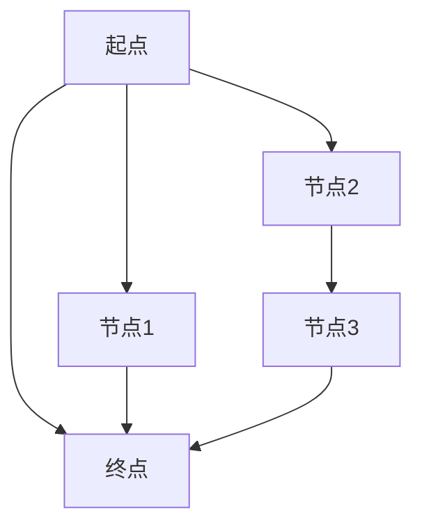

                 


# 第三章: 创造性问题解决的数学模型与公式

## 3.1 数学模型的建立

创造性问题解决的过程可以被建模为一个系统，其中问题被转化为数学表达式，并通过算法求解。我们以一个简单的路径规划问题为例，说明如何建立数学模型。

### 3.1.1 问题分析
假设我们有一个迷宫，起点为A，终点为B。迷宫中有障碍物，AI Agent需要找到一条从A到B的最短路径。

### 3.1.2 建立数学模型
路径规划问题可以用图论中的最短路径问题来建模。节点表示迷宫中的位置，边表示可以移动的路径。目标是最小化路径长度。

$$ \text{最短路径长度} = \sum_{i=1}^{n} (x_{i+1} - x_i)^2 + (y_{i+1} - y_i)^2 $$

其中，$(x_i, y_i)$是路径上的第i个点的坐标。

### 3.1.3 解决方案生成
使用A*算法生成可能的路径，评估每个路径的代价，并选择最优解。

## 3.2 关键算法的数学公式

### 3.2.1 启发式搜索算法的公式

A*算法的启发函数用于评估从当前节点到目标节点的剩余代价：

$$ h(n) = \text{曼哈顿距离}(n, B) = |x_n - x_B| + |y_n - y_B| $$

总代价为：

$$ f(n) = g(n) + h(n) $$

其中，$g(n)$是已走的代价，$h(n)$是剩余的代价。

### 3.2.2 创造性生成模型的公式

遗传算法用于生成多样化的解决方案：

$$ \text{适应度} = \sum_{i=1}^{m} f(x_i) $$

其中，$m$是种群的大小，$f(x_i)$是每个个体的适应度函数。

## 3.3 算法流程图

以下是一个A*算法的mermaid流程图：



## 3.4 代码示例

以下是一个A*算法的Python实现：

```python
import heapq

def a_star(start, end, grid):
    open_set = {start}
    came_from = {}
    g_score = {start: 0}
    f_score = {start: heuristic(start, end)}
    
    while open_set:
        current = heapq.heappop(open_set)
        if current == end:
            break
        neighbors = get_neighbors(current, grid)
        for neighbor in neighbors:
            tentative_g_score = g_score[current] + distance(current, neighbor)
            if neighbor not in g_score or tentative_g_score < g_score[neighbor]:
                came_from[neighbor] = current
                g_score[neighbor] = tentative_g_score
                f_score[neighbor] = g_score[neighbor] + heuristic(neighbor, end)
                heapq.heappush(open_set, neighbor)
    return came_from, g_score
```

其中，`heuristic`是启发函数，`get_neighbors`获取邻居节点，`distance`计算距离。

## 3.5 本章小结

本章通过数学模型和算法公式，详细讲解了创造性问题解决的实现过程。通过A*算法和遗传算法的实例，展示了如何将问题转化为数学模型，并通过算法求解。

接下来，第四章将讨论系统分析与架构设计，详细介绍AI Agent在实际应用中的系统结构和实现方法。

