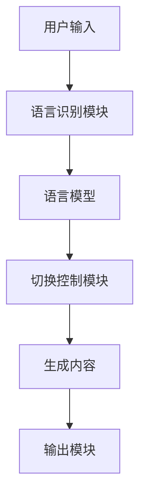

                 


# 开发AI Agent的多语言切换能力：无缝国际化

## 关键词：AI Agent, 多语言切换, 无缝国际化, 机器学习, 自然语言处理, 跨语言技术

## 摘要

随着全球化进程的加速，AI Agent在多个语言环境中的广泛应用成为必然趋势。本文将深入探讨如何开发具备多语言切换能力的AI Agent，以实现无缝国际化。从理论基础到实际应用，文章将详细分析多语言切换的核心算法、系统架构、项目实现及最佳实践，帮助读者全面理解并掌握相关技术。

---

# 第一部分：AI Agent多语言切换能力的背景与概念

## 第1章：多语言切换的背景与意义

### 1.1 多语言切换的背景

#### 1.1.1 全球化背景下AI Agent的需求

在当今的全球化时代，AI Agent（智能代理）的应用场景日益广泛，涵盖客服、教育、医疗、金融等多个领域。随着用户群体的全球化扩展，支持多语言切换成为AI Agent的一项核心需求。无论是企业级应用还是个人用户，都需要AI Agent能够理解并生成多种语言，以满足不同用户群体的需求。

#### 1.1.2 多语言切换的核心问题

AI Agent的多语言切换能力主要涉及以下问题：
- **语言模型的适应性**：如何训练模型使其支持多种语言。
- **切换机制的流畅性**：如何在上下文中无缝切换语言。
- **用户体验的连贯性**：如何保证用户在多语言切换过程中感受到自然流畅的交互。

#### 1.1.3 多语言切换的挑战与机遇

- **挑战**：
  - 多语言数据的稀缺性。
  - 语言间的语义差异。
  - 跨语言模型训练的复杂性。
- **机遇**：
  - 支持更广泛的用户群体。
  - 提升产品的市场竞争力。
  - 开拓国际市场。

### 1.2 AI Agent的基本概念

#### 1.2.1 AI Agent的定义

AI Agent是一种智能实体，能够感知环境、理解用户需求并执行相应的任务。它通过自然语言处理（NLP）技术与用户进行交互，能够理解用户意图并提供相应的反馈。

#### 1.2.2 AI Agent的核心功能

- 自然语言理解（NLU）：理解用户的输入内容。
- 生成式对话：根据理解生成相应的回复。
- 上下文记忆：记录对话历史，保持连贯性。
- 多语言支持：理解并生成多种语言。

#### 1.2.3 AI Agent的分类与应用场景

- **按功能分类**：
  - 任务型AI Agent：专注于完成特定任务，如订单处理、信息查询。
  - 交互型AI Agent：提供持续的对话服务，如客服、教育辅助。
- **应用场景**：
  - 客服系统：提供多语言支持的客户支持服务。
  - 教育领域：为不同语言的学习者提供教育内容。
  - 金融服务：为全球用户提供多语言的金融咨询服务。

### 1.3 多语言切换的意义

#### 1.3.1 提升用户体验的重要性

- **用户便利性**：用户可以根据自己的语言偏好选择交互语言。
- **降低沟通障碍**：减少因语言不通导致的误解。
- **提升用户满意度**：提供更贴心的服务体验。

#### 1.3.2 支持国际化业务的价值

- **市场扩展**：通过多语言支持，企业可以进入更多国际市场。
- **增强品牌形象**：国际化服务展示企业的专业性和全球化能力。

#### 1.3.3 多语言切换的技术挑战

- **模型训练成本高**：多语言模型需要大量的多语言数据进行训练。
- **语言间的语义差异**：某些语言在语法、词汇上有显著差异，导致模型训练难度增加。
- **实时切换的流畅性**：在动态切换语言时，需要保证模型的快速适应和响应。

---

## 第2章：多语言切换能力的核心概念

### 2.1 多语言切换能力的定义

#### 2.1.1 多语言切换能力的内涵

AI Agent的多语言切换能力是指其能够理解和生成多种语言，并在需要时根据用户需求或上下文切换语言的能力。这种能力依赖于先进的自然语言处理技术和跨语言模型。

#### 2.1.2 多语言切换能力的外延

- **支持的语言种类**：AI Agent能够支持多少种语言。
- **切换的灵活性**：是否支持动态切换语言，以及切换的频率和速度。
- **语言理解的准确性**：在多语言环境下，模型对用户输入的理解准确率。

#### 2.1.3 多语言切换能力的关键要素

- **语言模型**：负责理解和生成语言。
- **切换机制**：根据上下文决定何时切换语言。
- **跨语言适配**：处理不同语言之间的语义转换。

### 2.2 多语言切换能力的实现原理

#### 2.2.1 语言模型的基本原理

语言模型通过概率分布来预测下一个词的概率，从而生成连贯的文本。常见的语言模型包括基于n-gram的模型和基于Transformer的模型（如BERT、GPT）。

#### 2.2.2 多语言模型的构建方法

- **联合训练**：同时训练多种语言的数据，共享语言间的特征。
- **迁移学习**：在一种语言上预训练，然后在其他语言上进行微调。
- **多语言架构**：设计模型结构，使其天然支持多种语言。

#### 2.2.3 多语言切换的实现机制

- **语言标识符**：通过用户输入或上下文确定当前语言。
- **动态切换**：根据用户需求或反馈实时切换语言。
- **语言记忆**：记录用户最近使用的语言，优化切换体验。

### 2.3 多语言切换能力的系统架构

#### 2.3.1 系统整体架构设计

AI Agent的多语言切换系统通常包括以下几个部分：
- **用户输入模块**：接收用户的输入，识别语言。
- **语言模型模块**：负责理解和生成语言。
- **切换控制模块**：根据上下文决定是否切换语言。
- **输出模块**：生成并发送切换后语言的响应。

#### 2.3.2 关键模块的功能说明

- **用户输入模块**：解析用户的输入内容，识别语言标识。
- **语言模型模块**：基于识别的语言进行理解和生成。
- **切换控制模块**：根据用户需求或反馈，触发语言切换。
- **输出模块**：将生成的内容转换为指定语言的输出。

#### 2.3.3 系统组件之间的关系

通过Mermaid图展示系统组件之间的关系：



---

# 第三部分：多语言切换能力的算法与数学模型

## 第3章：多语言切换的算法原理

### 3.1 语言模型的训练方法

#### 3.1.1 单语言模型的训练

单语言模型的训练过程包括以下步骤：

1. 数据准备：收集和整理目标语言的文本数据。
2. 词汇表构建：建立词汇表和词表映射。
3. 模型训练：使用训练数据训练语言模型，如使用Transformer架构。
4. 模型优化：通过调整超参数和优化算法提升模型性能。

#### 3.1.2 多语言模型的联合训练

多语言模型的联合训练方法：

1. 数据准备：收集多种语言的平行文本数据。
2. 模型构建：设计多语言模型架构，如使用共享参数。
3. 联合优化：在多语言数据上同时训练模型，优化共享参数。
4. 微调：在特定语言上进行微调，提升性能。

#### 3.1.3 跨语言迁移学习的策略

- **预训练-微调模式**：在源语言上预训练模型，然后在目标语言上微调。
- **多任务学习**：在预训练过程中同时学习多种任务，提升跨语言能力。

### 3.2 多语言切换的算法实现

#### 3.2.1 基于语言标识符的切换机制

- **语言标识符**：通过用户输入或上下文确定当前语言。
- **动态切换**：根据用户反馈或特定条件触发语言切换。
- **语言记忆**：记录用户最近使用的语言，优化切换体验。

#### 3.2.2 基于上下文理解的自动切换

- **上下文分析**：分析对话历史，理解用户的语言偏好。
- **意图识别**：识别用户的意图，判断是否需要切换语言。
- **自动切换**：根据意图自动切换语言，提升用户体验。

### 3.3 数学模型和公式

#### 3.3.1 语言模型的概率分布

语言模型的目标是计算给定文本的概率：

$$P(w_1, w_2, ..., w_n) = \prod_{i=1}^{n} P(w_i | w_1, ..., w_{i-1})$$

其中，$w_i$表示第$i$个词，$P(w_i | w_1, ..., w_{i-1})$是条件概率。

#### 3.3.2 跨语言迁移学习的损失函数

跨语言迁移学习的目标是最小化以下损失函数：

$$\mathcal{L} = \sum_{i=1}^{N} \sum_{j=1}^{M} \text{CrossEntropy}(y_i, y_j)$$

其中，$N$是源语言的数量，$M$是目标语言的数量，$\text{CrossEntropy}$是交叉熵损失。

#### 3.3.3 多语言模型的参数共享机制

多语言模型的参数共享可以通过以下方式实现：

$$\theta = \{ \theta_1, \theta_2, ..., \theta_k \}$$

其中，$\theta$是共享参数，$\theta_i$表示第$i$个语言的特定参数。

---

## 第4章：数学模型和公式

### 4.1 语言模型的概率论基础

- **条件概率公式**：
  
  $$P(w_i | w_{i-1}) = \frac{P(w_{i-1}, w_i)}{P(w_{i-1})}$$

- **联合概率公式**：
  
  $$P(w_1, w_2, ..., w_n) = \prod_{i=1}^{n} P(w_i | w_1, ..., w_{i-1})$$

### 4.2 多语言模型的损失函数

- **多语言分类损失**：
  
  $$\mathcal{L}_{\text{cls}} = -\sum_{i=1}^{N} \sum_{j=1}^{M} y_{ij} \log p_{ij}$$

  其中，$y_{ij}$是标签，$p_{ij}$是预测概率。

- **语言生成损失**：
  
  $$\mathcal{L}_{\text{gen}} = -\sum_{i=1}^{N} \sum_{j=1}^{M} \sum_{k=1}^{L} y_{ijk} \log q_{ijk}$$

  其中，$L$是生成的文本长度。

### 4.3 跨语言模型的数学表达

- **跨语言注意力机制**：
  
  $$\text{Attention}(Q, K, V) = \text{softmax}\left(\frac{QK^T}{\sqrt{d_k}}\right)V$$

  其中，$Q$是查询向量，$K$是键向量，$V$是值向量，$d_k$是向量维度。

- **语言嵌入共享**：
  
  $$E_{\text{shared}} = \{ e_1, e_2, ..., e_N \}$$

  其中，$e_i$是第$i$个语言的嵌入向量。

---

## 第5章：系统分析与架构设计方案

### 5.1 系统功能设计

- **用户输入模块**：接收用户的输入，解析语言标识。
- **语言模型模块**：负责理解和生成语言。
- **切换控制模块**：根据上下文决定是否切换语言。
- **输出模块**：生成并发送切换后语言的响应。

### 5.2 系统架构设计

- **整体架构**：模块化设计，便于扩展和维护。
- **组件关系**：通过Mermaid图展示组件之间的关系。
- **数据流**：展示数据在系统中的流动过程。

---

## 第6章：项目实战

### 6.1 环境搭建

- **安装必要的库和工具**：
  - Python
  - TensorFlow/PyTorch
  - Hugging Face的Transformers库
- **配置开发环境**：安装Jupyter Notebook或IDE。

### 6.2 核心代码实现

#### 6.2.1 语言识别模块

```python
import langdetect

def detect_language(text):
    return langdetect.detect(text)
```

#### 6.2.2 多语言模型加载

```python
from transformers import AutoTokenizer, AutoModelForMaskedLM

tokenizer = AutoTokenizer.from_pretrained("bert-base-multilingual")
model = AutoModelForMaskedLM.from_pretrained("bert-base-multilingual")
```

#### 6.2.3 多语言切换实现

```python
def switch_language(text, target_lang):
    detected_lang = detect_language(text)
    if detected_lang != target_lang:
        # 转换为目标语言
        translated = translate(text, target_lang)
        return translated
    else:
        return text
```

### 6.3 代码解读与分析

- **语言识别**：使用`langdetect`库检测输入文本的语言。
- **多语言模型加载**：使用Hugging Face的Transformers库加载预训练的多语言模型。
- **语言切换**：根据检测到的语言与目标语言进行比较，决定是否需要切换。

### 6.4 实际案例分析

- **案例1**：用户输入中文，目标语言为英文。
- **案例2**：用户输入西班牙语，目标语言为中文。

### 6.5 项目总结

- **总结**：实现一个多语言切换的AI Agent需要考虑语言识别、模型选择和切换机制等多个方面。
- **优化方向**：优化语言识别的准确率，提升多语言模型的生成能力。

---

## 第7章：最佳实践与小结

### 7.1 最佳实践

- **数据质量**：确保多语言数据的多样性和平衡性。
- **模型选择**：根据需求选择合适的多语言模型。
- **用户体验**：优化语言切换的流畅性和连贯性。

### 7.2 小结

本文详细探讨了AI Agent多语言切换能力的开发过程，从背景与概念、算法与数学模型、系统架构到项目实战，全面分析了实现多语言切换的关键技术。通过实际案例的分析和代码实现，帮助读者更好地理解和掌握相关技术。

### 7.3 注意事项

- **数据隐私**：确保多语言数据的处理符合隐私保护法规。
- **性能优化**：优化模型的推理速度和资源消耗。
- **错误处理**：增加错误处理机制，提升系统的健壮性。

### 7.4 拓展阅读

- **推荐阅读书籍**：
  - 《Deep Learning》
  - 《Natural Language Processing with PyTorch》
- **推荐阅读博客**：
  - Hugging Face的Transformers库官方文档。
  - 多语言NLP相关的技术博客。

---

# 结语

开发AI Agent的多语言切换能力是一项复杂但极具挑战性的任务。通过本文的分析和探讨，我们了解了实现多语言切换的核心技术、算法原理和系统架构。希望本文能够为读者提供有价值的指导和启发，帮助他们在实际项目中更好地开发和应用多语言切换的AI Agent。

