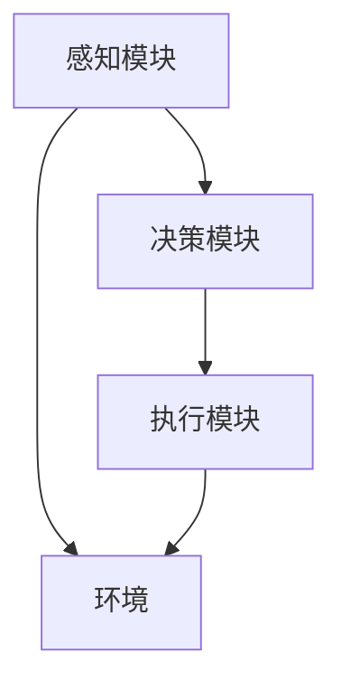

                 


# 开发AI Agent的学习与适应能力

> 关键词：AI Agent，学习能力，适应能力，机器学习，强化学习，系统架构

> 摘要：AI Agent作为人工智能的核心组成部分，具备学习与适应能力是其智能化的关键。本文从AI Agent的基本概念出发，详细探讨了其学习与适应机制，并通过机器学习和强化学习的算法原理，结合系统架构设计和项目实战，深入剖析了开发AI Agent的学习与适应能力的方法与实践。文章内容涵盖背景介绍、算法原理、系统设计和项目实现，旨在为开发者提供全面的技术指导。

---

## 第一部分: AI Agent 的背景与概念

### 第1章: AI Agent 的基本概念

#### 1.1 AI Agent 的定义与特点

AI Agent（人工智能代理）是指能够感知环境、自主决策并执行任务的智能实体。它具备以下核心特点：

- **自主性**：能够在没有外部干预的情况下独立运作。
- **反应性**：能够实时感知环境变化并做出响应。
- **学习能力**：通过数据和经验提升自身的任务执行能力。
- **适应性**：能够在动态环境中调整策略以应对变化。

AI Agent的应用场景广泛，包括智能助手、自动驾驶、机器人控制等领域。

#### 1.2 学习与适应能力的定义

- **学习能力**：AI Agent通过数据和经验不断优化自身的知识库和决策模型。
- **适应能力**：AI Agent能够在动态环境中动态调整策略，以适应环境的变化。
- **重要性**：学习与适应能力是AI Agent实现智能化和实用化的关键。

---

### 第2章: AI Agent 的学习机制

#### 2.1 监督学习与无监督学习

- **监督学习**：通过标记数据进行训练，AI Agent能够学习输入与输出之间的映射关系。
  - 算法示例：线性回归。
  - 代码实现：
    ```python
    import numpy as np
    def linear_regression(X, y):
        # 计算权重
        weights = np.linalg.inv(X.T.dot(X)).dot(X.T.dot(y))
        return weights
    ```

- **无监督学习**：通过未标记数据进行聚类或关联分析。
  - 算法示例：K-means聚类。
  - 代码实现：
    ```python
    from sklearn.cluster import KMeans
    def kmeans_clustering(X, num_clusters):
        model = KMeans(n_clusters=num_clusters)
        model.fit(X)
        return model.labels_
    ```

#### 2.2 强化学习与自适应学习

- **强化学习**：通过与环境交互，AI Agent通过试错学习，获得最大化的累积奖励。
  - 算法示例：Q-learning。
  - 代码实现：
    ```python
    import numpy as np
    def q_learning(env, num_episodes=1000):
        Q = np.zeros((env.observation_space, env.action_space))
        for episode in range(num_episodes):
            state = env.reset()
            while not done:
                action = np.argmax(Q[state])
                next_state, reward, done, _ = env.step(action)
                Q[state][action] += reward + np.max(Q[next_state])
        return Q
    ```

- **自适应学习**：通过动态调整参数和模型结构，实现持续优化。
  - 示例：在线学习模型的更新公式：
    $$ w_{new} = w_{old} + \alpha (y - \hat{y})x $$

---

### 第3章: AI Agent 的适应方法

#### 3.1 在线学习与实时适应

- **在线学习**：AI Agent在实时环境中不断更新模型，适应新的数据。
  - 算法示例：在线线性回归。
  - 代码实现：
    ```python
    def online_linear_regression(X, y):
        weights = np.zeros(X.shape[1])
        for i in range(len(X)):
            x = X[i]
            y_pred = weights.dot(x)
            error = y[i] - y_pred
            weights += learning_rate * error * x
        return weights
    ```

#### 3.2 自适应优化与动态调整

- **动态调整**：根据环境反馈，动态优化策略。
  - 算法示例：自适应增强学习。
  - 代码实现：
    ```python
    def adaptive_reinforcement_learning(env):
        policy = np.zeros(env.observation_space)
        for episode in range(num_episodes):
            state = env.reset()
            done = False
            while not done:
                action = np.argmax(policy[state])
                next_state, reward, done, _ = env.step(action)
                policy[state][action] += reward
        return policy
    ```

---

## 第二部分: AI Agent 的技术基础

### 第4章: 机器学习基础

#### 4.1 机器学习的核心算法

- **线性回归**：预测连续值。
  - 代码实现：
    ```python
    def linear_regression_train(X, y):
        X_b = np.c_[np.ones(X.shape[0]), X]
        theta = np.linalg.inv(X_b.T.dot(X_b)).dot(X_b.T.dot(y))
        return theta
    ```

- **决策树**：分类与回归。
  - 代码实现：
    ```python
    from sklearn.tree import DecisionTreeClassifier
    def decision_tree_classifier(X, y):
        model = DecisionTreeClassifier()
        model.fit(X, y)
        return model
    ```

#### 4.2 神经网络与深度学习

- **神经网络结构**：感知机、多层感知机（MLP）。
  - 代码实现：
    ```python
    import keras
    def simple_neural_network():
        model = keras.Sequential([
            keras.layers.Dense(64, activation='relu'),
            keras.layers.Dense(10, activation='softmax')
        ])
        model.compile(optimizer='adam', loss='sparse_categorical_crossentropy', metrics=['accuracy'])
        return model
    ```

---

### 第5章: 强化学习基础

#### 5.1 强化学习的原理

- **Q-learning算法**：通过状态-动作-奖励的机制更新Q表。
  - 代码实现：
    ```python
    def q_learning_update(Q, state, action, reward, next_state, alpha=0.1):
        Q[state][action] = Q[state][action] + alpha * (reward + max(Q[next_state]) - Q[state][action])
        return Q
    ```

- **策略梯度方法**：通过优化策略参数，最大化期望奖励。
  - 代码实现：
    ```python
    import torch
    def policy_gradient_optimization(policy, optimizer, env):
        for _ in range(num_episodes):
            state = env.reset()
            log_probs = []
            rewards = []
            while True:
                action, log_prob = policy.act(state)
                next_state, reward, done, _ = env.step(action)
                log_probs.append(log_prob)
                rewards.append(reward)
                if done:
                    break
            loss = -torch.mean(torch.stack(log_probs) * torch.tensor(rewards))
            optimizer.zero_grad()
            loss.backward()
            optimizer.step()
        return policy
    ```

---

## 第三部分: AI Agent 的系统架构与实现

### 第6章: AI Agent 的系统架构设计

#### 6.1 系统模块划分

- **感知模块**：负责环境数据的采集与处理。
- **决策模块**：基于感知数据，进行策略选择。
- **执行模块**：根据决策结果，执行具体操作。

#### 6.2 模块之间的交互关系

- **感知与决策的交互**：感知模块将数据传递给决策模块，决策模块返回动作指令。
- **决策与执行的交互**：决策模块将动作指令传递给执行模块，执行模块反馈执行结果。

#### 6.3 系统架构图



---

### 第7章: AI Agent 的系统实现

#### 7.1 项目实战：开发一个多领域对话AI Agent

##### 7.1.1 环境安装

```bash
pip install numpy scikit-learn keras tensorflow
```

##### 7.1.2 核心实现

```python
class AIAssistant:
    def __init__(self):
        self.nlp_model = initialize_NLP_model()
        self.q_learning_model = QLearningAgent()

    def process_query(self, query):
        intent = self.nlp_model.predict(query)
        response = self.q_learning_model.act(intent)
        return response
```

##### 7.1.3 应用解读

- **NLP模型**：负责理解用户意图，使用预训练的词嵌入模型（如Word2Vec或BERT）。
- **Q-learning模型**：根据意图选择最优响应，实现多领域的对话管理。

##### 7.1.4 实际案例分析

- **场景1**：用户查询“最近的咖啡店在哪里？”
  - 感知模块：解析用户意图，提取地理位置信息。
  - 决策模块：调用API获取附近咖啡店数据。
  - 执行模块：生成响应并输出结果。

---

### 第8章: 总结与展望

#### 8.1 小结

- AI Agent的学习与适应能力是实现智能化系统的核心。
- 通过机器学习和强化学习，结合系统架构设计，能够开发出具备动态调整和持续优化能力的AI Agent。

#### 8.2 注意事项

- **数据质量**：确保训练数据的多样性和代表性。
- **算法选择**：根据具体场景选择合适的算法。
- **系统优化**：注重模块之间的高效交互和资源管理。

#### 8.3 拓展阅读

- 推荐阅读《强化学习入门》、《深度学习实战》等书籍，深入理解AI Agent的实现细节。

---

以上是《开发AI Agent的学习与适应能力》的技术博客的完整内容，涵盖了从理论到实践的各个方面，为开发者提供了全面的技术指导。

