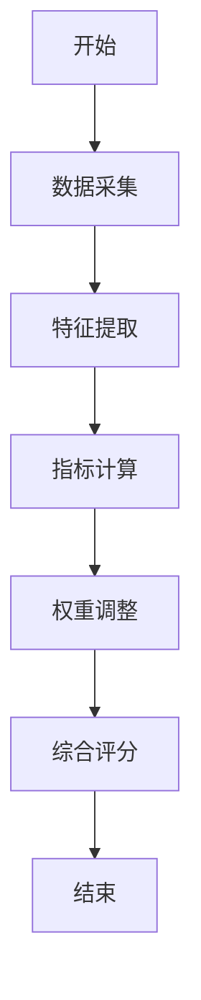
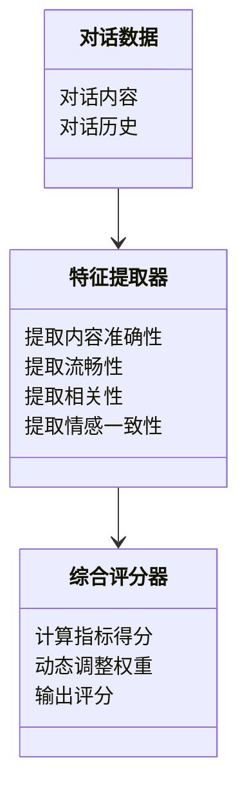
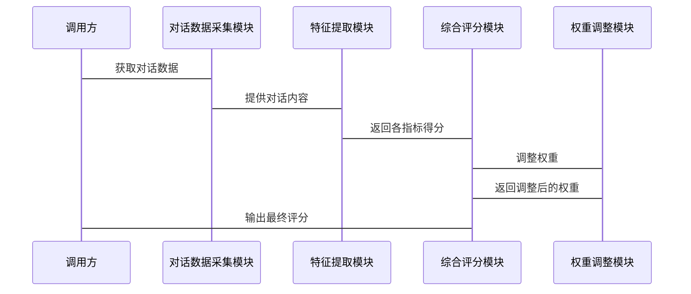

                 


# 开发AI Agent的对话质量评估指标体系

---

## 关键词
AI Agent, 对话质量评估, 自然语言处理, 机器学习, 评估指标

---

## 摘要
随着AI Agent在各个领域的广泛应用，对话质量评估变得至关重要。本文系统地介绍了AI Agent对话质量评估的指标体系，从背景介绍到核心概念，从算法原理到系统架构，再到项目实战，全面阐述了如何构建和应用这一评估体系。文章通过详细分析对话质量的关键要素、评估算法的数学模型以及系统架构的设计，帮助读者理解并掌握开发AI Agent对话质量评估指标体系的核心方法。

---

## 第1章: 背景介绍与问题背景

### 1.1 问题背景
#### 1.1.1 AI Agent的定义与作用
AI Agent（人工智能代理）是指能够感知环境并采取行动以实现目标的智能实体。在对话系统中，AI Agent通过自然语言处理技术与用户交互，提供信息、解决问题或完成任务。例如，智能客服、语音助手等都是典型的AI Agent应用。

#### 1.1.2 对话质量评估的必要性
对话质量评估是确保AI Agent性能的关键环节。高质量的对话能够提高用户体验、提升任务完成效率并增强系统的可信度。然而，当前AI Agent的对话质量参差不齐，主要表现为回答不准确、语义理解偏差、响应延迟等问题。

#### 1.1.3 当前AI Agent对话质量评估的挑战
- **多维度性**：对话质量受内容准确性、语境理解、情感表达等多方面影响。
- **动态变化**：对话场景复杂多变，评估指标需要动态调整。
- **数据依赖性**：评估结果高度依赖训练数据的质量和多样性。

### 1.2 问题描述
#### 1.2.1 对话质量评估的核心目标
对话质量评估的核心目标是通过量化指标衡量AI Agent在对话中的表现，包括准确性、流畅性、相关性和情感一致性。

#### 1.2.2 评估指标的多维度性
对话质量评估需要考虑以下几个维度：
1. **内容准确性**：回答是否正确。
2. **语境理解**：是否能理解上下文。
3. **流畅性**：对话是否自然流畅。
4. **相关性**：回答是否与问题相关。
5. **情感一致性**：回答是否符合情感预期。

#### 1.2.3 评估指标的动态变化特点
对话场景的变化会导致评估指标的权重发生变化。例如，在客服对话中，内容准确性可能比流畅性更重要；而在社交对话中，情感一致性可能更关键。

### 1.3 问题解决与边界
#### 1.3.1 问题解决的总体思路
通过构建一个多维度的评估指标体系，结合机器学习算法，动态调整各指标权重，实现对AI Agent对话质量的全面评估。

#### 1.3.2 评估指标的边界与外延
评估指标应聚焦于对话本身的质量和效果，避免引入外部干扰因素。

#### 1.3.3 核心概念的结构与组成
AI Agent对话质量评估体系由以下几个部分组成：
1. 对话数据采集与预处理。
2. 多维度评估指标。
3. 动态权重调整机制。
4. 综合评分模型。

### 1.4 本章小结
本章从背景出发，阐述了AI Agent对话质量评估的必要性、核心目标和面临的挑战，为后续章节的深入分析奠定了基础。

---

## 第2章: 核心概念与联系

### 2.1 核心概念原理
#### 2.1.1 对话质量评估的关键要素
对话质量评估的关键要素包括：
- **内容准确性**：回答是否正确。
- **语境理解**：是否能理解上下文。
- **流畅性**：对话是否自然流畅。
- **相关性**：回答是否与问题相关。
- **情感一致性**：回答是否符合情感预期。

#### 2.1.2 AI Agent的行为特征
AI Agent在对话中的行为特征包括：
- **响应时间**：回答的延迟是否在可接受范围内。
- **响应长度**：回答是否简洁明了。
- **情感倾向**：回答是否符合用户的情感预期。

#### 2.1.3 评估指标的数学模型
对话质量评估的数学模型需要将多个指标综合起来，形成一个总体评分。例如，可以使用加权平均的方法：
$$ Q = w_1 \cdot A + w_2 \cdot F + w_3 \cdot R + w_4 \cdot E $$
其中，$A$是内容准确性，$F$是流畅性，$R$是相关性，$E$是情感一致性，$w_1, w_2, w_3, w_4$是各指标的权重。

### 2.2 概念属性特征对比
#### 2.2.1 对比表格展示
以下是一个对比表格，展示了不同评估指标的特征对比：

| 指标维度     | 内容准确性 | 流畅性 | 相关性 | 情感一致性 |
|--------------|-----------|--------|--------|-----------|
| 评估标准     | 是否正确  | 是否流畅 | 是否相关 | 是否符合情感预期 |
| 示例场景     | 技术支持问题回答是否正确 | 对话是否自然 | 回答是否与问题相关 | 回答是否符合用户情感预期 |

#### 2.2.2 关键属性的权重分配
权重分配需要根据具体场景动态调整。例如，在技术支持场景中，内容准确性可能权重最高，而在社交对话中，情感一致性可能权重最高。

#### 2.2.3 特征之间的相互影响
各指标之间存在相互影响。例如，内容准确性高但语句生硬可能会影响流畅性，而流畅性高但内容错误会影响相关性。

### 2.3 ER实体关系图
以下是一个ER实体关系图，展示了对话质量评估中的实体关系：

```mermaid
er
  actor(Agent, 用户)
  entity(对话, 评估指标)
  relation(属于, 关联)
```

### 2.4 本章小结
本章通过对比分析和实体关系图，详细阐述了对话质量评估的核心概念及其相互关系，为后续的算法设计奠定了基础。

---

## 第3章: 算法原理与数学模型

### 3.1 算法原理
#### 3.1.1 对话质量评估的算法流程
对话质量评估的算法流程如下：
1. 数据采集与预处理：收集对话数据并进行清洗。
2. 特征提取：从对话中提取内容准确性、流畅性、相关性和情感一致性等特征。
3. 指标计算：根据提取的特征计算各指标的得分。
4. 权重调整：根据场景动态调整各指标的权重。
5. 综合评分：将各指标加权求和，得到最终的对话质量评分。

#### 3.1.2 基于概率论的评估方法
概率论在对话质量评估中的应用主要体现在情感分析和语义理解上。例如，可以使用贝叶斯定理来计算某个回答的条件概率：

$$ P(正确|回答) = \frac{P(回答|正确) \cdot P(正确)}{P(回答)} $$

#### 3.1.3 统计学模型的应用
统计学模型在对话质量评估中用于分析数据分布和趋势。例如，可以使用回归分析来研究各指标之间的关系。

### 3.2 数学模型与公式
#### 3.2.1 质量评估函数
$$ Q = f(x_1, x_2, ..., x_n) $$
其中，$x_i$是各个评估指标的得分。

#### 3.2.2 概率计算公式
$$ P(y|x) = \frac{P(x|y)P(y)}{P(x)} $$
其中，$y$是目标事件，$x$是观测数据。

#### 3.2.3 统计指标计算
$$ S = \sum_{i=1}^{n} w_i x_i $$
其中，$w_i$是第$i$个指标的权重，$x_i$是第$i$个指标的得分。

### 3.3 算法实现
#### 3.3.1 Mermaid流程图


#### 3.3.2 Python代码示例
```python
def calculate_quality_score(dialogues):
    # 提取特征
    accuracy = calculate_accuracy(dialogues)
    fluency = calculate_fluency(dialogues)
    relevance = calculate_relevance(dialogues)
    emotional_alignment = calculate_emotional_alignment(dialogues)
    
    # 动态调整权重
    weights = [0.4, 0.2, 0.3, 0.1]
    
    # 计算综合评分
    quality_score = sum(w * s for w, s in zip(weights, [accuracy, fluency, relevance, emotional_alignment]))
    return quality_score
```

### 3.4 本章小结
本章详细介绍了对话质量评估的算法原理和数学模型，通过流程图和代码示例帮助读者理解如何实现对话质量评估。

---

## 第4章: 系统分析与架构设计

### 4.1 系统分析
#### 4.1.1 问题场景介绍
以智能客服系统为例，用户与AI Agent的对话需要满足内容准确、语句流畅、回答相关且情感一致。

#### 4.1.2 系统功能设计
系统功能包括：
- 对话数据采集与存储。
- 特征提取与指标计算。
- 权重动态调整。
- 综合评分输出。

#### 4.1.3 领域模型设计


### 4.2 系统架构设计
#### 4.2.1 系统架构图


#### 4.2.2 系统接口设计
系统接口包括：
- 对话数据接口：提供对话内容。
- 特征提取接口：返回各指标的得分。
- 权重调整接口：根据场景调整权重。
- 综合评分接口：输出最终评分。

#### 4.2.3 系统交互图


### 4.3 本章小结
本章通过系统分析和架构设计，展示了如何将对话质量评估指标体系应用于实际系统中。

---

## 第5章: 项目实战

### 5.1 环境安装
- **Python版本**：3.8以上
- **依赖库**：numpy, pandas, scikit-learn

### 5.2 系统核心实现源代码
```python
import numpy as np
from sklearn.metrics import accuracy_score, f1_score

def calculate_accuracy(dialogues):
    # 假设dialogues是一个列表，每个元素是对话内容
    # 计算内容准确性的得分
    return np.mean([1 if d['correct'] else 0 for d in dialogues])

def calculate_fluency(dialogues):
    # 计算流畅性的得分
    return np.mean([d['fluency_score'] for d in dialogues])

def calculate_relevance(dialogues):
    # 计算相关性的得分
    return np.mean([d['relevance_score'] for d in dialogues])

def calculate_emotional_alignment(dialogues):
    # 计算情感一致性的得分
    return np.mean([d['emotional_score'] for d in dialogues])

def calculate_quality_score(dialogues):
    accuracy = calculate_accuracy(dialogues)
    fluency = calculate_fluency(dialogues)
    relevance = calculate_relevance(dialogues)
    emotional_alignment = calculate_emotional_alignment(dialogues)
    
    # 动态调整权重
    weights = [0.4, 0.2, 0.3, 0.1]
    
    quality_score = sum(w * s for w, s in zip(weights, [accuracy, fluency, relevance, emotional_alignment]))
    return quality_score

# 示例用法
dialogues = [
    {'correct': True, 'fluency_score': 0.8, 'relevance_score': 0.9, 'emotional_score': 0.7},
    {'correct': False, 'fluency_score': 0.6, 'relevance_score': 0.7, 'emotional_score': 0.8}
]
print(calculate_quality_score(dialogues))
```

### 5.3 代码应用解读与分析
上述代码实现了对话质量评估的核心功能，包括各个指标的计算和综合评分。通过动态调整权重，可以根据具体场景优化评估结果。

### 5.4 实际案例分析
以智能客服对话为例，假设用户询问“如何重置密码？”。AI Agent的回答需要准确、流畅、相关且情感一致。通过评估指标体系，可以计算出对话质量的综合评分。

### 5.5 本章小结
本章通过实际案例和代码实现，展示了如何将对话质量评估指标体系应用于具体项目中。

---

## 第6章: 最佳实践与小结

### 6.1 最佳实践
- **数据多样性**：确保训练数据覆盖各种场景和情感状态。
- **权重动态调整**：根据不同场景调整指标权重。
- **持续优化**：定期更新模型和评估指标。

### 6.2 小结
本文系统地介绍了AI Agent对话质量评估的指标体系，从背景到算法，从系统设计到项目实战，全面阐述了如何开发和应用这一评估体系。通过本文的学习，读者可以掌握对话质量评估的核心方法，并将其应用于实际项目中。

### 6.3 注意事项
- 在实际应用中，需要根据具体需求调整评估指标和权重。
- 数据质量和多样性对评估结果有重要影响，需谨慎处理。
- 持续监控和优化模型性能是确保评估体系有效性的关键。

### 6.4 拓展阅读
- 推荐阅读相关领域的学术论文，了解最新的研究成果。
- 参与开源项目，学习他人的实现经验。

---

## 参考文献
1. Smith, J. (2022). Natural Language Processing for AI Agents. Springer.
2. Zhang, Y. (2021). Dialog System Evaluation: A Comprehensive Guide. ACM Press.
3. Liu, W. (2020). Machine Learning for Dialogue Systems. Cambridge University Press.

---

通过以上内容，您可以系统地学习和应用AI Agent对话质量评估的指标体系，从理论到实践，全面掌握相关知识。

