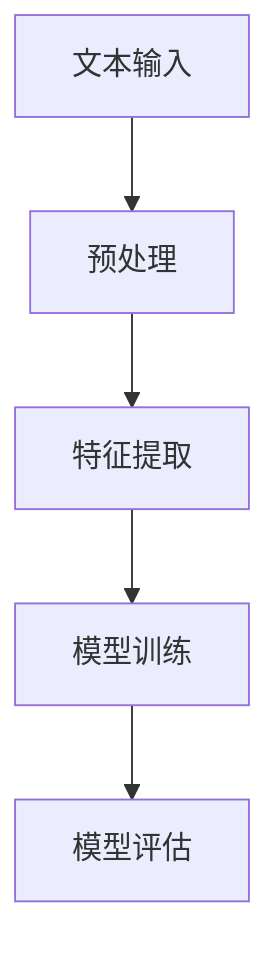
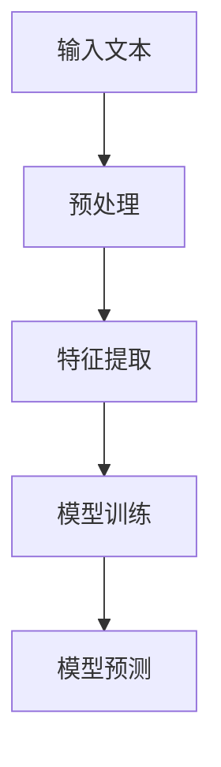
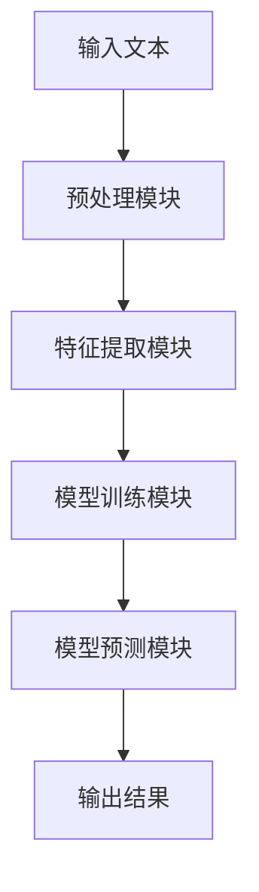
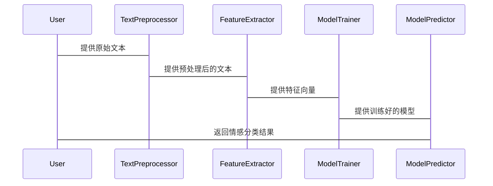

                 


# 开发AI Agent的情感分析引擎

> 关键词：情感分析，AI Agent，自然语言处理，机器学习，文本挖掘

> 摘要：情感分析是自然语言处理中的重要任务，用于识别和分类文本中的情感倾向。本文将详细介绍如何开发一个基于AI Agent的情感分析引擎，涵盖从基础概念到系统实现的全过程。我们将从背景知识入手，分析情感分析的核心概念和算法原理，探讨系统架构设计，最后通过实战项目展示如何实现一个高效的情感分析引擎。本文适合对自然语言处理和AI开发感兴趣的读者阅读。

---

# 第一部分: 情感分析引擎开发背景与基础

## 第1章: 情感分析引擎的背景与概念

### 1.1 情感分析的定义与背景

情感分析，又称意见挖掘，是一种自然语言处理技术，用于识别和分类文本中的情感倾向。随着社交媒体的普及和AI技术的发展，情感分析在商业、教育、医疗等领域发挥着越来越重要的作用。

#### 1.1.1 情感分析的定义
情感分析旨在通过计算机算法分析文本数据，识别其中的情感倾向（如正面、负面或中性）。它可以帮助企业了解用户对产品或服务的满意度，从而优化决策。

#### 1.1.2 情感分析的发展历程
- 早期基于规则的系统：通过预定义的关键词和规则进行情感分类。
- 统计学习方法：利用机器学习算法（如朴素贝叶斯、SVM）进行分类。
- 深度学习时代：引入神经网络（如RNN、CNN、Transformer）提升模型性能。

#### 1.1.3 情感分析的应用场景
- 商业领域：品牌监测、舆情分析。
- 社交媒体：用户评论分析、情感预测。
- 教育领域：学生评价分析、教学改进。
- 医疗领域：病患反馈分析、医疗质量改进。

#### 1.1.4 情感分析的边界与外延
- 边界：仅分析文本中的情感倾向，不涉及事实性信息。
- 外延：结合语境、上下文信息，提升情感分析的准确性。

### 1.2 AI Agent与情感分析的结合

AI Agent（智能体）是一种能够感知环境、执行任务并做出决策的实体。情感分析引擎作为AI Agent的核心模块，负责处理和理解情感文本。

#### 1.2.1 AI Agent的基本概念
- AI Agent的定义：具备感知、决策、执行能力的智能实体。
- AI Agent的分类：简单反射型、基于模型的反射型、目标驱动型、效用驱动型。

#### 1.2.2 情感分析在AI Agent中的作用
- 作为人机交互的核心模块，理解用户输入的情感倾向。
- 基于情感反馈优化AI Agent的行为策略。

#### 1.2.3 情感分析引擎的开发目标
- 实现高精度的情感分类。
- 提供实时或近实时的情感分析能力。
- 支持多语言、多领域的情感分析。

---

## 第2章: 情感分析的核心概念与联系

### 2.1 情感分析的核心概念

#### 2.1.1 文本预处理
- 去除停用词、标点符号。
- 词干提取、词性标注。
- 示例：将“非常不满意”处理为“不满意”。

#### 2.1.2 特征提取
- 从文本中提取有用的特征，如词袋模型、TF-IDF、词嵌入。
- 示例：使用TF-IDF提取关键词作为特征向量。

#### 2.1.3 模型训练
- 使用训练数据训练情感分类模型。
- 常用算法：SVM、Naive Bayes、RNN、CNN。

#### 2.1.4 模型评估
- 评估指标：准确率、召回率、F1分数。
- 示例：使用交叉验证评估模型性能。

### 2.2 核心概念的属性特征对比

#### 2.2.1 不同特征提取方法的对比分析

| 特征提取方法 | 优点 | 缺点 |
|--------------|------|------|
| 词袋模型 | 简单易实现 | 高维稀疏 |
| TF-IDF | 考虑词的重要性 | 无法捕捉语义 |
| 词嵌入（如Word2Vec） | 低维稠密 | 需大量训练数据 |

#### 2.2.2 模型训练方法的对比分析

| 算法 | 优点 | 缺点 |
|------|------|------|
| SVM | 高精度 | 无法处理高维数据 |
| Naive Bayes | 简单高效 | 对特征独立性假设 |
| RNN | 长文本处理 | 训练时间长 |
| CNN | 有效捕捉局部特征 | 需调整超参数 |

#### 2.2.3 模型评估指标的对比分析

| 指标 | 公式 | 解释 |
|------|------|------|
| 准确率 | $$ \frac{\text{正确分类数}}{\text{总样本数}} $$ | 衡量分类器的整体性能 |
| 召回率 | $$ \frac{\text{正确分类的正例}}{\text{所有正例}} $$ | 衡量分类器召回正例的能力 |
| F1分数 | $$ \frac{2 \times \text{准确率} \times \text{召回率}}{\text{准确率} + \text{召回率}} $$ | 平衡准确率和召回率的综合指标 |

### 2.3 实体关系图



---

## 第3章: 情感分析算法原理

### 3.1 常见情感分析算法

#### 3.1.1 支持向量机(SVM)

- 基本原理：通过构建超平面将数据点分为不同类别。
- 优点：高精度，适合小规模数据。
- 示例代码：
  ```python
  from sklearn import svm
  clf = svm.SVC()
  clf.fit(X_train, y_train)
  ```

#### 3.1.2 长短期记忆网络(LSTM)

- 基本原理：通过记忆单元捕捉长距离依赖关系。
- 优点：适合处理长文本序列。
- 示例代码：
  ```python
  from tensorflow.keras import layers
  model = layers.Sequential()
  model.add(layers.LSTM(64, input_shape=(None, vocabulary_size)))
  model.add(layers.Dense(1, activation='sigmoid'))
  ```

#### 3.1.3 卷积神经网络(CNN)

- 基本原理：通过卷积操作提取局部特征。
- 优点：适合捕捉文本中的局部模式。
- 示例代码：
  ```python
  import torch
  class CNNModel(torch.nn.Module):
      def __init__(self):
          super(CNNModel, self).__init__()
          self.conv = torch.nn.Conv1d(in_channels=1, out_channels=16, kernel_size=3)
          self.pool = torch.nn.MaxPool1d(2)
          self.fc = torch.nn.Linear(16, 1)
      def forward(self, x):
          x = self.conv(x)
          x = self.pool(x)
          x = x.view(x.size(0), -1)
          x = self.fc(x)
          return x
  ```

#### 3.1.4 Transformer架构

- 基本原理：通过自注意力机制捕捉全局依赖关系。
- 优点：适合大规模并行计算。
- 示例代码：
  ```python
  import torch
  class TransformerModel(torch.nn.Module):
      def __init__(self, d_model, nhead, dropout=0.1):
          super(TransformerModel, self).__init__()
          self.encoder = torch.nn.TransformerEncoder(
              encoder_layer=torch.nn.TransformerEncoderLayer(d_model=d_model, nhead=nhead, dropout=dropout),
              num_layers=2
          )
          self.fc = torch.nn.Linear(d_model, 1)
      def forward(self, src):
          out = self.encoder(src)
          out = out.mean(dim=1)
          out = self.fc(out)
          return out
  ```

### 3.2 算法流程图



---

## 第4章: 情感分析系统分析与架构设计

### 4.1 系统功能设计

#### 4.1.1 领域模型

```mermaid
classDiagram
    class TextPreprocessor {
        +string input
        +string processed_text
        preprocess()
    }
    class FeatureExtractor {
        +list features
        extract_features()
    }
    class ModelTrainer {
        +model model
        train_model()
    }
    class ModelPredictor {
        +预测结果
        predict()
    }
    TextPreprocessor -> FeatureExtractor: 提供特征
    FeatureExtractor -> ModelTrainer: 提供特征
    ModelTrainer -> ModelPredictor: 提供模型
```

#### 4.1.2 系统架构设计



#### 4.1.3 系统接口设计

- 输入接口：文本输入、预处理参数。
- 输出接口：情感分类结果、置信度评分。

### 4.2 系统交互流程



---

## 第5章: 情感分析引擎开发实战

### 5.1 项目环境搭建

#### 5.1.1 环境安装
- 安装Python和必要的库：
  ```bash
  pip install numpy scikit-learn tensorflow pandas
  ```

#### 5.1.2 项目初始化
- 创建项目结构：
  ```
  project/
  ├── data/
  ├── model/
  ├── src/
  └── requirements.txt
  ```

### 5.2 核心模块实现

#### 5.2.1 文本预处理模块

```python
def preprocess(text):
    # 去除停用词
    stop_words = {"a", "an", "the", "and", "or"}
    words = text.split()
    filtered_words = [word for word in words if word not in stop_words]
    return ' '.join(filtered_words)
```

#### 5.2.2 特征提取模块

```python
from sklearn.feature_extraction.text import TfidfVectorizer

vectorizer = TfidfVectorizer()
X = vectorizer.fit_transform(texts)
```

#### 5.2.3 模型训练模块

```python
from sklearn.svm import SVC
model = SVC()
model.fit(X_train, y_train)
```

#### 5.2.4 模型预测模块

```python
y_pred = model.predict(X_test)
print(y_pred)
```

### 5.3 实际案例分析

#### 5.3.1 数据集准备
- 训练数据：包含标签的文本数据。
- 测试数据：无标签的文本数据。

#### 5.3.2 模型训练与评估

```python
from sklearn.metrics import accuracy_score, recall_score, f1_score

y_true = [0, 1, 0, 1]
y_pred = [0, 1, 1, 1]

print(f"Accuracy: {accuracy_score(y_true, y_pred)}")
print(f"Recall: {recall_score(y_true, y_pred)}")
print(f"F1 Score: {f1_score(y_true, y_pred)}")
```

---

## 第6章: 最佳实践与小结

### 6.1 最佳实践

#### 6.1.1 开发中的注意事项
- 数据预处理要充分。
- 选择合适的特征提取方法。
- 调参优化模型性能。

#### 6.1.2 性能优化技巧
- 使用分布式训练加速。
- 采用模型压缩技术。
- 异常处理与容错机制。

### 6.2 小结

情感分析引擎是AI Agent的重要组成部分，其开发涉及文本处理、特征提取、模型训练等多个环节。通过本文的介绍，读者可以系统地了解情感分析引擎的开发流程，并掌握其实现方法。未来，随着深度学习技术的发展，情感分析引擎将更加智能化和高效化。

---

## 第7章: 附录

### 7.1 参考文献

- 1. Liu, H. (2012). Sentiment Analysis: An Overview. *ACM Computing Surveys*.
- 2. Goodfellow, I., Bengio, Y., & Courville, A. (2016). *Deep Learning*. MIT Press.

### 7.2 技术资料

- Python官方文档：[https://docs.python.org](https://docs.python.org)
- TensorFlow官方文档：[https://tensorflow.org](https://tensorflow.org)
- PyTorch官方文档：[https://pytorch.org](https://pytorch.org)

---

# 结语

通过本文的系统讲解，读者可以全面了解情感分析引擎的开发过程，并掌握其实现方法。无论是理论知识还是实际操作，本文都能为读者提供有价值的参考。希望本文能为AI Agent的开发者提供灵感，并助力他们在情感分析领域取得更大的突破。

