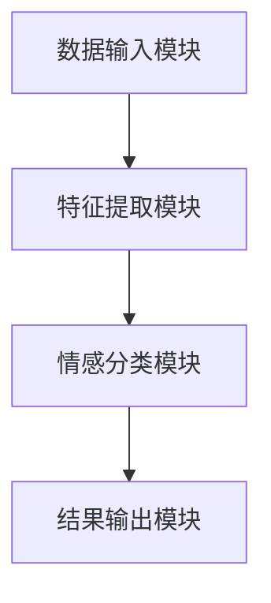

                 


# 开发AI Agent的情感计算模块

> 关键词：AI Agent, 情感计算, 情感分析, 深度学习, 机器学习, 系统架构设计

> 摘要：本文详细探讨了在AI Agent中开发情感计算模块的关键技术，包括情感计算的背景、核心概念、数学模型、系统架构设计以及项目实战。通过理论与实践相结合的方式，帮助开发者深入了解情感计算模块的设计与实现，为AI Agent赋予情感理解和交互能力。

---

# 第一部分: AI Agent与情感计算模块开发背景

## 第1章: AI Agent与情感计算概述

### 1.1 AI Agent的基本概念

#### 1.1.1 AI Agent的定义与特点
AI Agent（人工智能代理）是指能够感知环境、自主决策并执行任务的智能实体。其特点包括：
- **自主性**：能够在没有外部干预的情况下自主运行。
- **反应性**：能够根据环境变化实时调整行为。
- **社会性**：能够与其他Agent或人类进行交互和协作。
- **学习能力**：能够通过数据和经验不断优化自身行为。

#### 1.1.2 AI Agent的核心功能与类型
AI Agent的核心功能包括信息处理、决策制定和任务执行。根据应用场景的不同，AI Agent可以分为以下几类：
- **简单反射型Agent**：基于预定义规则执行任务。
- **基于模型的反射型Agent**：通过内部模型理解和决策。
- **目标驱动型Agent**：根据目标进行规划和执行。
- **实用驱动型Agent**：通过效用函数优化决策。

#### 1.1.3 情感计算在AI Agent中的重要性
情感计算（Affective Computing）是指对人类情感进行识别、理解和响应的计算过程。在AI Agent中，情感计算模块能够帮助其理解人类的情感状态，从而实现更自然和高效的交互。

---

### 1.2 情感计算的背景与应用

#### 1.2.1 情感计算的定义与研究现状
情感计算通过分析面部表情、语调、语义等信息，识别人类的情感状态。近年来，随着深度学习技术的发展，情感计算在多个领域取得了显著进展。

#### 1.2.2 情感计算的主要应用场景
- **人机交互**：提升用户体验，例如智能音箱、聊天机器人。
- **心理健康支持**：通过情感分析为用户提供心理疏导。
- **教育技术**：根据学生情感状态调整教学策略。
- **市场分析**：通过社交媒体情感分析评估产品口碑。

#### 1.2.3 情感计算在AI Agent中的潜在价值
AI Agent通过情感计算模块能够更好地理解用户需求，提供个性化的服务。例如，在智能客服系统中，Agent可以根据用户的情感状态调整响应策略，提高客户满意度。

---

### 1.3 情感计算模块开发的必要性

#### 1.3.1 AI Agent中情感计算的核心作用
情感计算模块是AI Agent实现情感交互的关键部分，能够增强Agent的智能化和用户体验。

#### 1.3.2 情感计算模块的功能需求
- **情感识别**：识别人类的情感状态，例如愤怒、快乐、悲伤等。
- **情感分类**：将输入文本或语音分类为特定的情感类别。
- **情感反馈**：根据情感状态生成相应的反馈信息。

#### 1.3.3 情感计算模块开发的挑战与解决方案
- **数据多样性**：情感数据具有多样性和复杂性，需要设计高效的特征提取方法。
- **模型泛化能力**：情感计算模型需要在不同场景下保持较高的准确率。
- **实时性要求**：在实时交互场景中，情感计算模块需要快速响应。

---

### 1.4 本章小结
本章介绍了AI Agent的基本概念、情感计算的背景与应用，以及情感计算模块在AI Agent中的重要性。情感计算模块作为AI Agent的核心组件，能够显著提升其智能化水平和用户体验。

---

# 第二部分: 情感计算的核心概念与原理

## 第2章: 情感计算的核心概念

### 2.1 情感计算的基本原理

#### 2.1.1 情感计算的输入与输出
- **输入**：文本、语音、面部表情等。
- **输出**：情感类别（如正面、负面、中性）或情感强度（如情感得分）。

#### 2.1.2 情感计算的主要过程
1. **特征提取**：从输入数据中提取情感相关特征。
2. **情感分类**：基于特征进行情感类别预测。
3. **情感反馈**：根据分类结果生成相应的反馈信息。

#### 2.1.3 情感计算的评价指标
- **准确率**：分类正确的样本数占总样本数的比例。
- **召回率**：实际为正类的样本中被正确分类的比例。
- **F1分数**：准确率和召回率的调和平均数。

---

### 2.2 情感计算的主要模型与算法

#### 2.2.1 基于规则的情感分析模型
- **规则定义**：通过预定义的规则（如关键词匹配）进行情感分类。
- **优缺点**：
  - 优点：简单易实现，适合特定场景。
  - 缺点：泛化能力差，难以应对复杂场景。

#### 2.2.2 基于机器学习的情感分析模型
- **常用算法**：支持向量机（SVM）、随机森林（Random Forest）。
- **优缺点**：
  - 优点：泛化能力强，适合中小规模数据。
  - 缺点：需要大量特征工程，对数据预处理要求较高。

#### 2.2.3 基于深度学习的情感分析模型
- **常用模型**：卷积神经网络（CNN）、循环神经网络（RNN）、长短期记忆网络（LSTM）。
- **优缺点**：
  - 优点：能够自动提取特征，适合大规模数据。
  - 缺点：计算资源需求高，模型训练时间长。

---

### 2.3 情感计算的核心要素

#### 2.3.1 情感计算的情感特征提取
- **文本特征**：词袋模型、词嵌入（如Word2Vec、GloVe）。
- **语音特征**：音调、语速、停顿等。
- **面部特征**：面部表情分析。

#### 2.3.2 情感计算的情感分类器设计
- **分类器选择**：根据数据规模和场景选择合适的分类器。
- **模型优化**：通过交叉验证、网格搜索等方法优化模型参数。

#### 2.3.3 情感计算的情感反馈机制
- **反馈生成**：根据情感分类结果生成相应的反馈信息。
- **反馈优化**：通过用户反馈不断优化情感计算模块。

---

### 2.4 本章小结
本章详细介绍了情感计算的核心概念，包括基本原理、主要模型与算法、以及核心要素。情感计算模块的设计需要综合考虑特征提取、模型选择和反馈机制。

---

# 第三部分: 情感计算的数学模型与算法原理

## 第3章: 情感计算的数学模型

### 3.1 情感计算的特征表示

#### 3.1.1 文本特征提取方法
- **词袋模型**：将文本表示为词频向量。
- **词嵌入**：通过神经网络学习词向量表示（如Word2Vec、GloVe）。

#### 3.1.2 基于词袋模型的特征表示
- **优缺点**：
  - 优点：简单易实现，适合小规模数据。
  - 缺点：无法捕捉词序信息，对停用词敏感。

#### 3.1.3 基于词嵌入的特征表示
- **优缺点**：
  - 优点：能够捕捉语义信息，适合大规模数据。
  - 缺点：计算资源需求较高。

---

### 3.2 情感分类的数学模型

#### 3.2.1 线性回归模型
- **模型公式**：
  $$y = \beta_0 + \beta_1x_1 + \beta_2x_2 + \dots + \beta_nx_n$$
  其中，$y$为预测的情感类别，$x_i$为输入特征，$\beta_i$为模型参数。

#### 3.2.2 支持向量机模型
- **模型公式**：
  $$y = \text{sign}(\beta_0 + \beta_1x_1 + \beta_2x_2 + \dots + \beta_nx_n)$$
  其中，$\beta_0$为偏置项，$\beta_i$为模型参数，$x_i$为输入特征。

#### 3.2.3 神经网络模型
- **模型公式**：
  $$y = \sigma(Wx + b)$$
  其中，$W$为权重矩阵，$x$为输入向量，$b$为偏置向量，$\sigma$为激活函数。

---

### 3.3 情感计算的优化算法

#### 3.3.1 基于梯度下降的优化算法
- **梯度下降公式**：
  $$\theta_{t+1} = \theta_t - \eta \nabla J(\theta_t)$$
  其中，$\theta$为模型参数，$\eta$为学习率，$J$为损失函数。

#### 3.3.2 基于随机梯度下降的优化算法
- **随机梯度下降公式**：
  $$\theta_{t+1} = \theta_t - \eta \nabla J(\theta_t, x_t, y_t)$$
  其中，$(x_t, y_t)$为当前批次的数据。

#### 3.3.3 基于Adam优化器的优化算法
- **Adam优化器公式**：
  $$m_t = \beta_1 m_{t-1} + (1 - \beta_1)g_t$$
  $$n_t = \beta_2 n_{t-1} + (1 - \beta_2)g_t^2$$
  $$\theta_{t+1} = \theta_t - \eta \frac{m_t}{\sqrt{n_t + \epsilon}}$$
  其中，$m_t$为梯度的一阶矩估计，$n_t$为梯度的二阶矩估计，$\epsilon$为防止除零的小量。

---

### 3.4 情感计算的评价指标与公式

#### 3.4.1 准确率公式
$$准确率 = \frac{正确分类的样本数}{总样本数}$$

#### 3.4.2 召回率公式
$$召回率 = \frac{正确识别的正类样本数}{实际正类样本数}$$

#### 3.4.3 F1分数公式
$$F1分数 = \frac{2 \times 准确率 \times 召回率}{准确率 + 召回率}$$

---

### 3.5 本章小结
本章详细介绍了情感计算的数学模型与优化算法，包括特征表示、分类模型和优化算法。情感计算模块的设计需要结合具体的场景和数据特点，选择合适的数学模型和优化算法。

---

# 第四部分: 情感计算模块的系统架构设计

## 第4章: 情感计算模块的系统架构

### 4.1 系统功能模块划分

#### 4.1.1 数据输入模块
- **功能描述**：接收输入数据（如文本、语音、面部表情）。
- **实现方式**：通过API接口接收数据，或从本地文件读取数据。

#### 4.1.2 特征提取模块
- **功能描述**：从输入数据中提取情感相关特征。
- **实现方式**：使用预训练的词嵌入模型（如GloVe）提取文本特征，或通过图像处理技术提取面部表情特征。

#### 4.1.3 情感分类模块
- **功能描述**：基于提取的特征进行情感分类。
- **实现方式**：使用深度学习模型（如LSTM）进行情感分类。

#### 4.1.4 结果输出模块
- **功能描述**：输出情感分类结果或情感反馈信息。
- **实现方式**：将分类结果返回给调用方，或生成相应的反馈信息。

---

### 4.2 系统架构设计

#### 4.2.1 模块之间关系


#### 4.2.2 系统架构图


---

### 4.3 系统接口设计

#### 4.3.1 数据输入接口
- **输入接口**：`POST /api/v1/input`
- **输入格式**：JSON格式，包含输入数据和数据类型。
- **输出接口**：返回特征提取结果。

#### 4.3.2 情感分类接口
- **输入接口**：`POST /api/v1/classify`
- **输入格式**：JSON格式，包含特征向量。
- **输出接口**：返回情感分类结果。

---

### 4.4 本章小结
本章详细介绍了情感计算模块的系统架构设计，包括功能模块划分、系统架构图和系统接口设计。情感计算模块的设计需要考虑模块之间的协作关系和接口的规范性。

---

# 第五部分: 情感计算模块的项目实战

## 第5章: 情感计算模块的项目实战

### 5.1 环境安装

#### 5.1.1 安装Python环境
```bash
python --version
pip install --upgrade pip
```

#### 5.1.2 安装深度学习框架
```bash
pip install tensorflow
pip install keras
pip install numpy
pip install matplotlib
pip install scikit-learn
```

---

### 5.2 系统核心实现源代码

#### 5.2.1 特征提取模块
```python
import numpy as np
from sklearn.feature_extraction.text import TfidfVectorizer

class FeatureExtractor:
    def __init__(self):
        self.vectorizer = TfidfVectorizer()

    def extract_features(self, texts):
        return self.vectorizer.fit_transform(texts).toarray()
```

#### 5.2.2 情感分类模块
```python
from tensorflow.keras.models import Sequential
from tensorflow.keras.layers import Dense, LSTM, Embedding, Input

def build_model(vocab_size):
    model = Sequential()
    model.add(Embedding(vocab_size, 64, input_length=50))
    model.add(LSTM(32))
    model.add(Dense(3, activation='softmax'))
    model.compile(optimizer='adam', loss='sparse_categorical_crossentropy', metrics=['accuracy'])
    return model
```

---

### 5.3 代码应用解读与分析

#### 5.3.1 特征提取模块解读
- **功能**：将输入文本转换为TF-IDF特征向量。
- **实现细节**：使用TfidfVectorizer提取特征，适用于中小型文本数据。

#### 5.3.2 情感分类模块解读
- **功能**：基于LSTM网络进行情感分类。
- **实现细节**：使用预训练的词嵌入层提取词向量，通过LSTM进行序列建模，最后通过全连接层输出情感类别。

---

### 5.4 实际案例分析

#### 5.4.1 数据集准备
- **训练数据**：包含正面、负面、中性三类情感的文本数据。
- **测试数据**：用于模型验证和评估。

#### 5.4.2 模型训练与评估
```python
model = build_model(vocab_size)
model.fit(X_train, y_train, epochs=10, batch_size=32)
loss, accuracy = model.evaluate(X_test, y_test)
print(f"损失: {loss}, 准确率: {accuracy}")
```

---

### 5.5 本章小结
本章通过实际案例展示了情感计算模块的开发过程，包括环境搭建、代码实现和模型评估。通过项目实战，读者可以更好地理解情感计算模块的设计与实现。

---

# 第六部分: 总结与展望

## 第6章: 总结与展望

### 6.1 项目小结
情感计算模块是AI Agent实现情感交互的核心部分，通过本文的探讨，我们深入了解了情感计算的背景、核心概念、数学模型和系统架构设计。通过项目实战，我们掌握了情感计算模块的开发方法。

### 6.2 最佳实践Tips
- **数据预处理**：确保数据的多样性和质量。
- **模型选择**：根据数据规模和场景选择合适的模型。
- **模型优化**：通过交叉验证和超参数调优提高模型性能。

### 6.3 未来展望
随着深度学习技术的不断发展，情感计算模块将更加智能化和高效化。未来的研究方向包括：
- **多模态情感计算**：结合文本、语音、图像等多种模态信息。
- **实时情感计算**：优化算法和硬件，提升实时性。
- **个性化情感计算**：根据用户个性化需求定制情感计算模型。

---

# 结语
通过本文的探讨，我们深入理解了情感计算模块在AI Agent中的重要性，以及其实现的关键技术。希望本文能够为开发者提供有价值的参考，帮助他们更好地开发情感计算模块，为AI Agent赋予情感理解和交互能力。

---

