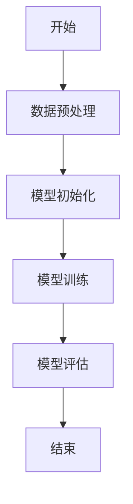
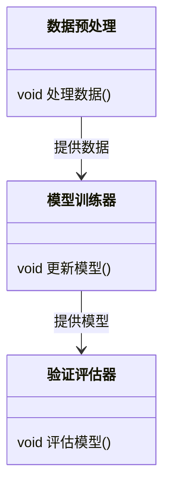
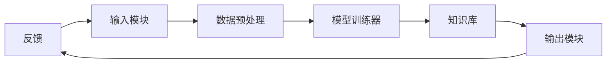
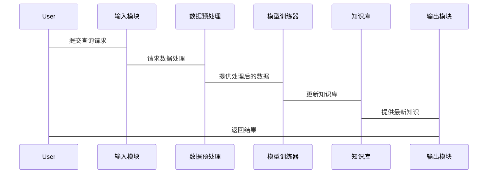

                 


# 开发AI Agent的自学习能力：持续学习机制

> 关键词：AI Agent、持续学习机制、自适应学习、增量学习、机器学习算法、系统架构设计

> 摘要：本文详细探讨了AI Agent的自学习能力，重点分析了持续学习机制的核心原理、算法实现、系统架构设计以及实际应用案例。通过理论分析和实践指导，帮助读者理解如何构建具备持续学习能力的AI Agent系统，提升其适应性和智能性。

---

## 第一部分: AI Agent与持续学习机制概述

### 第1章: AI Agent的自学习能力与持续学习机制

#### 1.1 AI Agent的基本概念

##### 1.1.1 AI Agent的定义与分类
- **定义**：AI Agent（人工智能代理）是指在环境中能够感知并自主行动以实现目标的智能实体。
- **分类**：
  1. **简单反射型代理**：基于当前输入做出反应，无内部状态。
  2. **基于模型的反射型代理**：维护环境模型，根据模型推理行动。
  3. **目标驱动型代理**：根据目标选择行动。
  4. **效用驱动型代理**：通过最大化效用函数进行决策。

##### 1.1.2 AI Agent的核心特征
- 感知能力：通过传感器感知环境状态。
- 决策能力：基于感知信息做出决策。
- 行动能力：通过执行器与环境交互。
- 学习能力：通过经验改进性能。

#### 1.2 持续学习机制的背景与意义

##### 1.2.1 传统机器学习的局限性
- **监督学习**：需要大量标注数据，难以应对动态变化的环境。
- **强化学习**：依赖大量试错，收敛速度慢，且难以处理复杂任务。
- **半监督学习**：混合数据来源，但难以实时更新模型。

##### 1.2.2 持续学习机制的定义与特点
- **定义**：持续学习机制是指AI Agent在动态环境中，通过持续接收新数据，逐步优化模型参数，提升任务性能的能力。
- **特点**：
  1. **在线性**：数据逐步到达，模型实时更新。
  2. **增量性**：每次仅更新部分模型参数。
  3. **适应性**：能够适应环境变化和新任务。

#### 1.3 持续学习机制在AI Agent中的应用

##### 1.3.1 提高AI Agent的适应能力
- 在动态环境中实时调整行为策略。
- 通过在线学习快速适应新任务。

##### 1.3.2 增强AI Agent的自主决策能力
- 基于最新知识做出更优决策。
- 自主选择学习内容和学习策略。

##### 1.3.3 优化AI Agent的长期性能
- 避免模型过时，保持性能稳定。
- 提高模型鲁棒性，增强抗干扰能力。

---

## 第二部分: 持续学习机制的核心原理

### 第2章: 持续学习机制的核心概念与联系

#### 2.1 持续学习机制的核心概念

##### 2.1.1 持续学习的三要素
- **数据流**：输入数据的流动方式和处理流程。
- **知识表示**：知识的存储和表达方式。
- **学习策略**：模型更新和优化的策略。

##### 2.1.2 持续学习机制的三要素对比表

| **要素**    | **描述**                                                                 |
|-------------|--------------------------------------------------------------------------|
| 数据流       | 数据逐步到达，模型实时更新。                                             |
| 知识表示     | 知识以某种形式存储，支持在线更新和扩展。                                 |
| 学习策略     | 确定模型更新的频率和方式，如批量更新或在线更新。                         |

#### 2.2 持续学习机制的ER实体关系图

```mermaid
erDiagram
    actor 学习者 {
        <属性> 历史数据
        <属性> 新数据
        <属性> 知识库
    }
    actor 环境 {
        <操作> 提供新数据
    }
    actor 策略选择器 {
        <操作> 选择学习策略
    }
    actor 模型更新器 {
        <操作> 更新模型
    }
    学习者 --> 环境: 获取新数据
    学习者 --> 策略选择器: 选择学习策略
    学习者 --> 模型更新器: 更新模型
```

---

## 第三部分: 持续学习机制的算法原理

### 第3章: 持续学习机制的算法实现

#### 3.1 持续学习算法的分类与选择

##### 3.1.1 增量学习算法
- **定义**：增量学习是一种在线学习方法，模型在接收每条新数据后逐步更新。
- **优缺点**：
  - 优点：节省存储空间，实时性强。
  - 缺点：收敛速度慢，可能遗忘旧知识。

#### 3.2 持续学习算法的实现流程

##### 3.2.1 算法实现步骤



##### 3.2.2 数据预处理
- 数据清洗：去除噪声，处理缺失值。
- 数据转换：归一化或标准化处理。

##### 3.2.3 模型初始化
- 初始化模型参数，设置学习率和优化器。

##### 3.2.4 模型训练
- 使用新数据训练模型，更新参数。
- 采用随机梯度下降（SGD）或Adam优化器。

##### 3.2.5 模型评估
- 使用验证集评估模型性能。
- 记录损失函数值，判断是否收敛。

#### 3.3 持续学习算法的数学模型

##### 3.3.1 损失函数
$$ L = \frac{1}{n}\sum_{i=1}^{n}(y_i - \hat{y_i})^2 $$

##### 3.3.2 优化器
$$ \theta_{t+1} = \theta_t - \eta \cdot \nabla L $$

##### 3.3.3 模型更新
$$ \theta_{t+1} = \theta_t + \eta \cdot \nabla L $$

---

## 第四部分: 系统分析与架构设计

### 第4章: 系统分析与架构设计方案

#### 4.1 项目场景介绍
- **项目背景**：开发一个具备持续学习能力的智能客服AI Agent。
- **项目目标**：实现AI Agent能够实时更新知识库，快速响应客户需求。

#### 4.2 系统功能设计

##### 4.2.1 领域模型类图



#### 4.3 系统架构设计

##### 4.3.1 系统架构图



#### 4.4 系统交互设计

##### 4.4.1 系统交互序列图



---

## 第五部分: 项目实战

### 第5章: 项目实战

#### 5.1 环境安装

```bash
pip install numpy pandas scikit-learn
```

#### 5.2 核心代码实现

##### 5.2.1 数据预处理代码

```python
import numpy as np
import pandas as pd

def preprocess_data(data):
    # 去除缺失值
    data = data.dropna()
    # 归一化处理
    from sklearn.preprocessing import MinMaxScaler
    scaler = MinMaxScaler()
    data_scaled = scaler.fit_transform(data)
    return data_scaled
```

##### 5.2.2 模型训练代码

```python
from sklearn.linear_model import SGDRegressor
from sklearn.metrics import mean_squared_error

def train_model(X, y):
    model = SGDRegressor(learning_rate=0.01, max_iter=100)
    model.fit(X, y)
    return model

# 示例数据
X = np.array([[1], [2], [3], [4]])
y = np.array([2, 4, 6, 8])

model = train_model(X, y)
print("模型训练完成")
```

##### 5.2.3 模型评估代码

```python
def evaluate_model(model, X, y):
    y_pred = model.predict(X)
    mse = mean_squared_error(y, y_pred)
    print(f"均方误差: {mse}")

evaluate_model(model, X, y)
```

#### 5.3 实际案例分析
- **案例背景**：智能客服系统需要实时更新产品知识库。
- **实现步骤**：
  1. 用户提交查询请求。
  2. 系统预处理数据。
  3. 模型训练并更新知识库。
  4. 系统返回最新结果。

---

## 第六部分: 总结与展望

### 第6章: 总结与展望

#### 6.1 本章小结
- 本文详细介绍了AI Agent的自学习能力，重点分析了持续学习机制的核心原理、算法实现、系统架构设计以及实际应用案例。

#### 6.2 未来展望
- 结合迁移学习和元学习，进一步提升持续学习能力。
- 研究更高效的模型更新策略，优化计算效率。

#### 6.3 注意事项
- 数据预处理阶段要确保数据质量和一致性。
- 模型更新过程中要注意参数调优，避免过拟合。

#### 6.4 拓展阅读
- 《Neural Networks and Deep Learning》
- 《Hands-On Machine Learning with Scikit-Learn, Keras, and TensorFlow》

---

通过以上步骤，我们可以系统地开发具备持续学习能力的AI Agent，不断提升其智能性和适应性，为实际应用提供强有力的支持。

