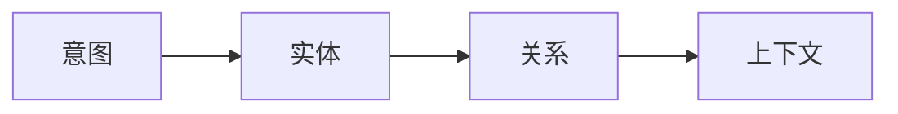
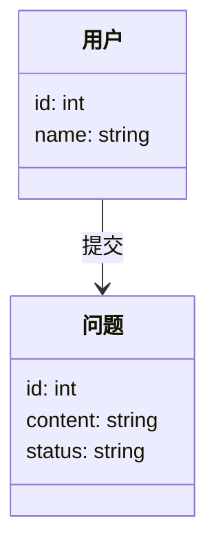
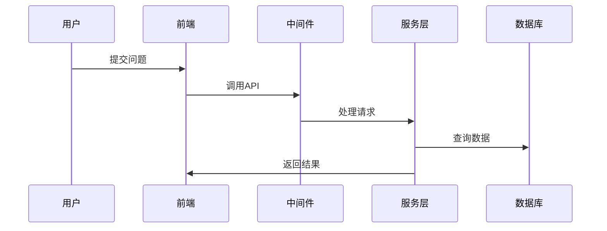

                 


# 开发AI Agent的自然语言接口设计

## 关键词
AI Agent，自然语言接口，意图识别，实体抽取，对话系统，上下文理解

## 摘要
开发AI Agent的自然语言接口设计是一项复杂而重要的任务，涉及自然语言处理的核心技术，如意图识别、实体抽取、对话管理和上下文理解。本文从AI Agent的基本概念出发，详细探讨自然语言接口设计的核心概念与算法原理，通过实际案例分析和系统架构设计，为读者提供全面的指导。文章最后总结了最佳实践和注意事项，帮助开发者高效地设计和实现自然语言接口。

---

# 正文

## 第1章 AI Agent与自然语言接口概述

### 1.1 AI Agent的基本概念

#### 1.1.1 AI Agent的定义与特点
AI Agent（人工智能代理）是指能够感知环境、自主决策并执行任务的智能实体。它通过与用户交互，帮助解决复杂问题或提供服务。AI Agent的特点包括自主性、反应性、目标导向和社会能力。

#### 1.1.2 自然语言处理在AI Agent中的作用
自然语言处理（NLP）使AI Agent能够理解和生成人类语言，从而实现与用户的自然对话。NLP技术包括词法分析、句法解析、语义理解等，是AI Agent交互能力的核心。

#### 1.1.3 AI Agent的分类与应用场景
AI Agent可以根据功能分为信息检索、对话系统、任务执行等类型。应用场景包括智能助手、客服系统、智能家居等。

### 1.2 自然语言接口的核心问题

#### 1.2.1 自然语言理解的基本问题
自然语言理解（NLU）旨在将输入的自然语言转化为计算机可处理的结构。核心问题包括意图识别和实体抽取。

#### 1.2.2 自然语言生成的关键挑战
自然语言生成（NLG）涉及将结构化数据转化为自然语言。挑战包括生成多样性、语境适应性和生成效率。

#### 1.2.3 对话系统中的交互设计
对话系统需要设计流畅的交互流程，确保用户体验良好。关键点包括对话状态管理、上下文理解和用户反馈机制。

## 第2章 自然语言接口设计的核心概念分析

### 2.1 意图识别与实体抽取

#### 2.1.1 意图识别的定义与实现
意图识别是通过分析用户输入，推断其意图的过程。常用方法包括基于规则的分类和深度学习模型。

#### 2.1.2 实体抽取的关键技术
实体抽取是从文本中提取命名实体（如人名、地名）的技术。常用技术包括基于规则的方法和统计模型。

#### 2.1.3 意图与实体的关系分析
意图和实体之间存在关联，例如“预订酒店”是意图，而“日期”和“地点”是实体。理解这种关系有助于提高NLU的准确性。

#### 对比分析表格
| 概念 | 特性 | 示例 |
|------|------|------|
| 意图识别 | 需求驱动 | “我要订机票” |
| 实体抽取 | 信息提取 | “北京”、“明天” |

### 2.2 对话管理与上下文理解

#### 2.2.1 对话管理的策略选择
对话管理涉及规划对话流程，常用策略包括基于规则和基于模型的方法。

#### 2.2.2 上下文理解的重要性
上下文理解是指系统根据历史对话内容，推断当前输入的含义。它是实现流畅对话的关键。

#### 2.2.3 对话状态表示与更新
对话状态表示通常包括用户需求和系统状态。常用方法是使用状态机或向量表示。

### 2.3 实体关系图的Mermaid流程图



## 第3章 自然语言接口设计的算法原理

### 3.1 意图识别算法原理

#### 3.1.1 基于统计的分类算法
常用算法包括朴素贝叶斯和决策树。这些方法通过统计特征进行分类。

#### 3.1.2 基于深度学习的模型
深度学习模型如LSTM和Transformer在意图识别中表现优异。它们能够捕捉复杂的语言模式。

#### 3.1.3 混合模型的优势
混合模型结合了统计和深度学习的优势，通常在性能上优于单一模型。

### 3.2 意图识别的数学模型

#### 3.2.1 朴素贝叶斯分类器
概率公式：
$$ P(y|x) = \frac{P(x|y)P(y)}{P(x)} $$

#### 3.2.2 LSTM网络的结构
LSTM由记忆单元和门控结构组成，能够处理序列数据。

#### 3.2.3 模型损失函数的计算
常用损失函数是交叉熵损失：
$$ L = -\sum_{i=1}^{n} \log(p_i) $$

### 3.3 算法实现与代码示例

#### 3.3.1 环境安装与配置
安装Python和相关库：
```bash
pip install numpy scikit-learn tensorflow
```

#### 3.3.2 意图识别的Python代码

```python
import numpy as np
from sklearn.naive_bayes import MultinomialNB

# 示例数据
X = np.array([[1, 0, 2], [0, 3, 1], [2, 2, 0]])
y = np.array([0, 1, 2])

# 训练模型
model = MultinomialNB()
model.fit(X, y)

# 预测
test = np.array([[1, 1, 1]])
print(model.predict(test))
```

---

## 第4章 自然语言接口设计的数学模型

### 4.1 概率论基础

#### 4.1.1 条件概率公式
$$ P(A|B) = \frac{P(B|A)P(A)}{P(B)} $$

#### 4.1.2 贝叶斯定理的应用
贝叶斯定理常用于垃圾邮件分类等任务。

### 4.2 优化算法

#### 4.2.1 梯度下降的数学表达
$$ \theta := \theta - \eta \frac{\partial L}{\partial \theta} $$

#### 4.2.2 线性回归与逻辑回归对比
线性回归用于回归任务，而逻辑回归适用于分类任务。

---

## 第5章 自然语言接口设计的系统架构

### 5.1 问题场景介绍
设计一个智能客服系统，用户通过自然语言与系统交互，完成问题咨询。

### 5.2 系统功能设计

#### 5.2.1 领域模型设计


### 5.3 系统架构设计

#### 5.3.1 分层架构


#### 5.3.2 接口设计
API接口包括用户鉴权、问题提交和状态查询。

### 5.4 交互流程设计



---

## 第6章 项目实战

### 6.1 环境安装与配置

```bash
pip install flask
```

### 6.2 系统核心实现源代码

```python
from flask import Flask, request, jsonify

app = Flask(__name__)

@app.route('/api/submit', methods=['POST'])
def submit():
    data = request.json
    # 处理数据
    return jsonify({'status': 'success', 'message': '问题已提交'})

if __name__ == '__main__':
    app.run(debug=True)
```

### 6.3 代码应用解读与分析
上述代码实现了一个简单的API接口，用于接收用户的问题并返回处理结果。实际应用中需要增加NLU和对话管理模块。

### 6.4 实际案例分析
通过分析客服系统的实际案例，展示如何设计和实现自然语言接口。

---

## 第7章 最佳实践与注意事项

### 7.1 小结
本文详细介绍了AI Agent自然语言接口设计的核心概念和算法原理，通过实际案例分析和系统架构设计，为读者提供了全面的指导。

### 7.2 注意事项
在实际开发中，需注意数据质量和模型训练，同时确保系统的可扩展性和维护性。

### 7.3 拓展阅读
建议阅读《自然语言处理实战》和《对话系统设计与实现》等书籍，以深入理解相关技术。

---

# 结语

通过本文的学习，读者可以系统地掌握AI Agent自然语言接口设计的关键技术，为后续的开发工作打下坚实基础。

