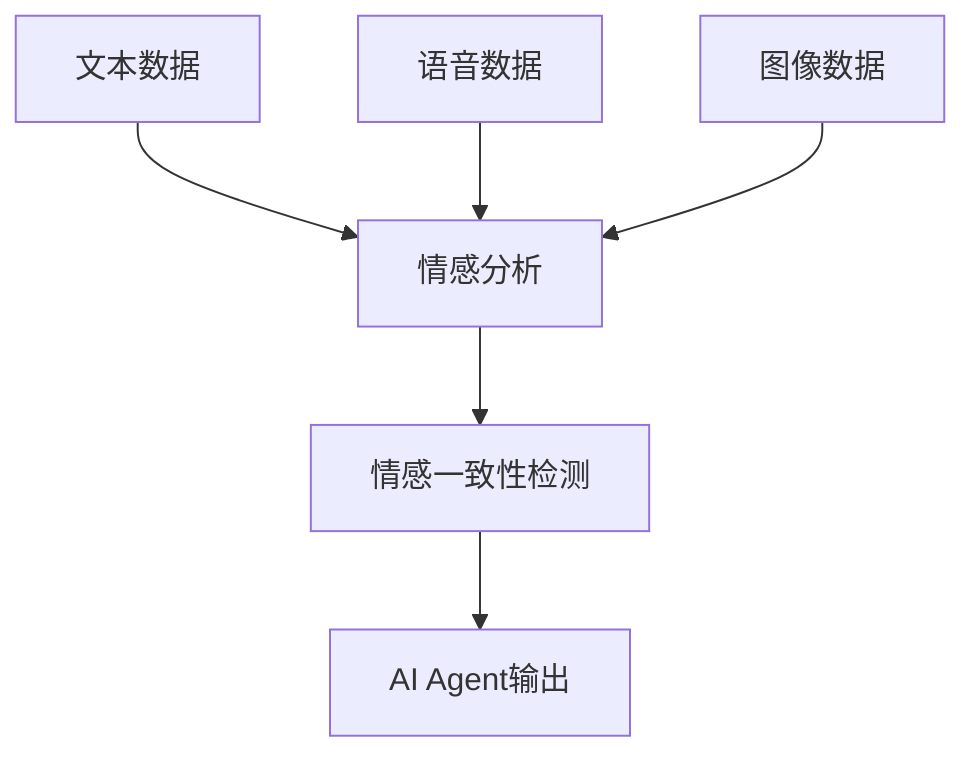
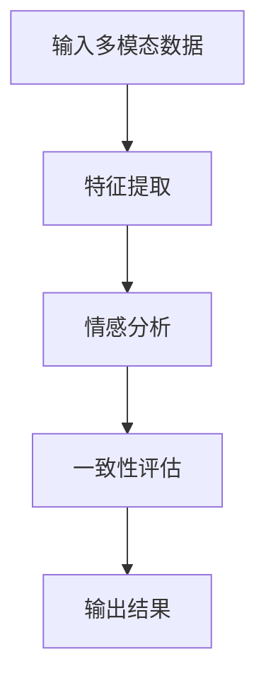
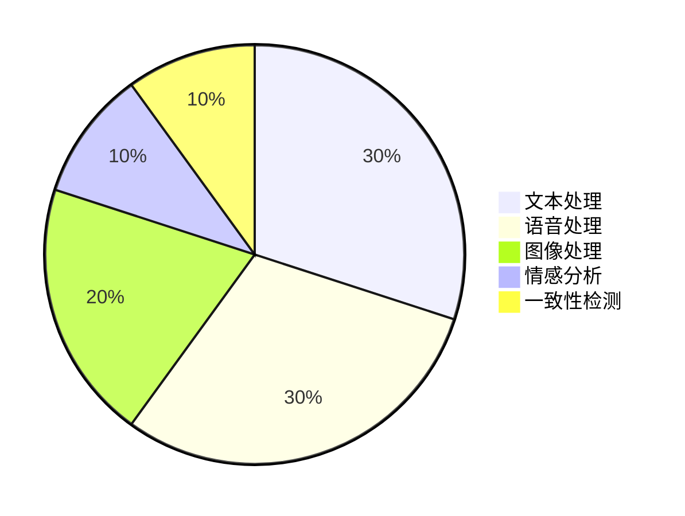
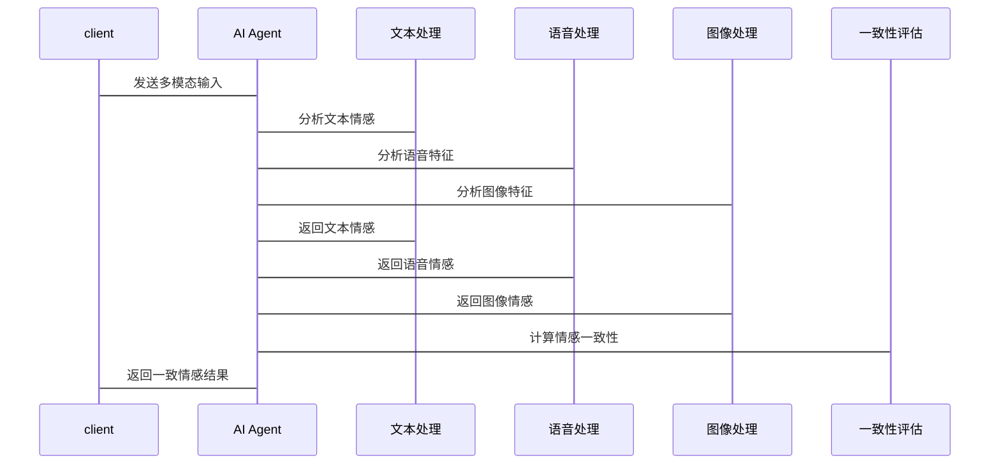

                 


# 开发AI Agent的跨模态情感一致性检测

## 关键词：跨模态情感一致性检测、AI Agent、多模态数据、情感分析、一致性评估

## 摘要

本文探讨了开发AI Agent的跨模态情感一致性检测技术，分析了多模态数据融合、情感分析模型以及一致性评估机制的原理和实现方法。文章详细讲解了算法原理，提供了系统架构设计，并通过实际案例展示了项目实战。最后，总结了关键点和最佳实践，为读者提供了全面的技术指导。

---

## 目录

### 第1章 背景介绍

#### 1.1 问题背景

- **1.1.1 多模态数据的定义与特点**
  - 多模态数据包括文本、语音、图像等多种形式，具有多样性和复杂性。
  - 不同模态的数据能够互补，提供更全面的信息。

- **1.1.2 情感一致性检测的必要性**
  - AI Agent需要在不同模态输入下保持一致的情感理解，以提供连贯的服务。
  - 情感一致性检测能够提高用户体验，避免混淆和误解。

- **1.1.3 AI Agent在跨模态数据处理中的角色**
  - AI Agent作为中间桥梁，负责整合和分析多模态数据，确保情感一致性。

#### 1.2 问题描述

- **1.2.1 跨模态数据的挑战**
  - 数据类型多样，处理难度大。
  - 各模态数据之间的关联性复杂，难以统一处理。

- **1.2.2 情感一致性检测的核心问题**
  - 确保不同模态的数据表达相同的情感。
  - 解决情感偏差和冲突，提高检测准确性。

- **1.2.3 AI Agent在情感一致性检测中的目标**
  - 统一处理多模态数据，确保情感一致。
  - 提供实时反馈和调整，优化用户体验。

#### 1.3 问题解决

- **1.3.1 跨模态数据融合方法**
  - 基于特征的方法：提取各模态特征，进行融合。
  - 基于模型的方法：构建跨模态模型，统一处理数据。

- **1.3.2 情感一致性检测的算法选择**
  - 使用深度学习模型，如Transformer，进行多模态特征提取和情感分析。
  - 通过对比学习，优化情感一致性。

- **1.3.3 AI Agent的实现策略**
  - 采用模块化设计，分别处理各模态数据。
  - 融合情感分析结果，确保一致性。

#### 1.4 边界与外延

- **1.4.1 跨模态数据的边界条件**
  - 数据类型限制在文本、语音、图像等常见类型。
  - 数据量和质量需满足模型训练要求。

- **1.4.2 情感一致性检测的适用范围**
  - 适用于客服、教育、医疗等领域，需情感一致性的场景。
  - 不适用于非情感类任务，如事实推理。

- **1.4.3 AI Agent的局限性与扩展方向**
  - 当前主要处理常见模态，未来可扩展至更多类型。
  - 提高模型鲁棒性，适应复杂场景。

#### 1.5 概念结构与核心要素

- **1.5.1 跨模态数据的组成要素**
  - 文本：如用户输入的句子。
  - 语音：如用户的语调和语速。
  - 图像：如用户发送的表情图片。

- **1.5.2 情感一致性检测的核心要素**
  - 情感分析模型：准确识别情感。
  - 数据融合方法：有效整合多模态数据。
  - 一致性评估机制：量化情感一致性。

- **1.5.3 AI Agent的功能模块**
  - 数据采集模块：获取多模态输入。
  - 数据处理模块：预处理和特征提取。
  - 情感分析模块：识别情感并进行一致性检测。
  - 反馈模块：调整输出以确保一致性。

---

### 第2章 核心概念与联系

#### 2.1 跨模态情感一致性检测的原理

- **2.1.1 多模态数据融合**
  - 使用注意力机制，整合不同模态的特征。
  - 通过对比学习，增强模态间关联性。

- **2.1.2 情感分析模型**
  - 基于Transformer的编码器，提取上下文信息。
  - 使用情感标签，分类情感极性。

- **2.1.3 一致性评估**
  - 计算各模态情感预测的相似度。
  - 通过损失函数，优化一致性。

#### 2.2 概念属性特征对比分析

以下表格展示了不同模态数据在情感一致性检测中的属性对比：

| 模态类型 | 特征提取 | 情感表达 | 一致性评估 |
|----------|----------|----------|------------|
| 文本      | 词袋模型/词嵌入 | 情感词分析 | 余弦相似度   |
| 语音      | MFCC特征 | 音调、语速 | 皮尔逊相关系数 |
| 图像      | CNN特征 | 颜色、表情 | 欧氏距离     |

#### 2.3 实体关系图

Mermaid实体关系图：



---

### 第3章 算法原理

#### 3.1 跨模态情感一致性检测算法

Mermaid流程图：



#### 3.2 情感一致性检测的数学模型

余弦相似度公式：

$$\cos \theta = \frac{\mathbf{a} \cdot \mathbf{b}}{|\mathbf{a}| |\mathbf{b}|}$$

其中，$\mathbf{a}$和$\mathbf{b}$分别表示两种模态的情感特征向量。

损失函数定义：

$$L = \sum_{i=1}^{n} (y_i - \hat{y}_i)^2$$

其中，$y_i$是真实一致性标签，$\hat{y}_i$是模型预测值。

---

### 第4章 系统分析与架构设计

#### 4.1 系统架构设计

Mermaid架构图：



#### 4.2 系统交互设计

Mermaid序列图：



---

### 第5章 项目实战

#### 5.1 环境安装

安装Python和必要的库：

```bash
pip install numpy tensorflow pandas scikit-learn
```

#### 5.2 核心代码实现

示例代码：

```python
import numpy as np
from tensorflow import keras

# 数据预处理
def preprocess_data(data):
    # 处理文本、语音、图像数据
    pass

# 情感分析模型
def emotion_classifier():
    model = keras.Sequential([
        keras.layers.Embedding(input_dim=10000, output_dim=16),
        keras.layers.GlobalAveragePooling1D(),
        keras.layers.Dense(1, activation='sigmoid')
    ])
    model.compile(optimizer='adam', loss='binary_crossentropy', metrics=['accuracy'])
    return model

# 一致性评估
def consistency_check(text_emotion, voice_emotion, image_emotion):
    # 使用余弦相似度计算一致性
    pass

# 训练模型
def train_model():
    model = emotion_classifier()
    # 加载数据
    data = preprocess_data(...)
    model.fit(...)
    return model

if __name__ == '__main__':
    trained_model = train_model()
    # 使用模型进行一致性检测
    consistency_check(...)
```

---

### 第6章 总结与扩展

#### 6.1 总结

- 跨模态情感一致性检测是AI Agent的重要技术，能够提升用户体验。
- 通过多模态数据融合和深度学习模型，可以实现高效的情感一致性检测。

#### 6.2 最佳实践

- 数据预处理：确保数据质量和一致性。
- 模型调参：优化超参数，提高检测精度。
- 交叉验证：验证模型的泛化能力。

#### 6.3 未来展望

- 扩展至更多模态，如视频和手势识别。
- 提高模型的实时性和响应速度。
- 研究情感一致性检测的动态调整机制。

#### 6.4 拓展阅读

- 《Deep Learning for Multi-modal Data》
- 《Cross-modal Similarity Learning》
- 《Neural Networks for NLP》

---

以上是文章的详细目录和内容框架，涵盖了从背景到实现的各个方面，确保内容全面且易于理解。

