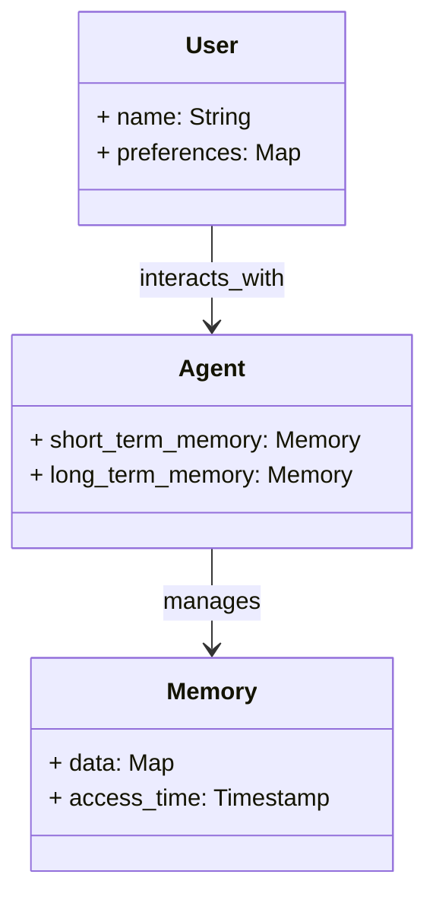

                 


# 开发AI Agent的长短期记忆管理：平衡效率与信息保留

## 关键词：AI Agent、长短期记忆、记忆管理、信息保留、效率优化

## 摘要

在开发AI Agent的过程中，长短期记忆管理是一个核心挑战，直接关系到系统的效率和信息保留能力。本文将深入探讨如何平衡这两者，通过分析记忆机制的原理、算法的设计与优化，以及实际应用中的解决方案，提供系统的思考和实践指导。从概念到实现，从理论到代码，本文旨在为开发者提供一个全面的视角，帮助他们在AI Agent的开发中高效管理记忆，提升性能。

---

# 第一部分: AI Agent的长短期记忆管理背景介绍

## 第1章: 问题背景与概念结构

### 1.1 问题背景

AI Agent作为一种智能体，需要在复杂的环境中进行决策和交互。长短期记忆管理是其实现智能的核心机制之一。短期记忆负责处理当前任务的相关信息，而长期记忆则存储持久性的知识和经验。两者的有效管理直接关系到Agent的响应速度和决策准确性。

### 1.2 问题描述

在实际应用中，AI Agent面临以下问题：

- **信息过载**：短期记忆容量有限，难以处理大量实时数据。
- **信息冗余**：长期记忆存储过多无关信息，导致检索效率低下。
- **信息遗忘**：关键信息被错误遗忘，影响决策质量。

### 1.3 解决方案概述

为解决上述问题，本文提出以下解决方案：

- **基于遗忘曲线的记忆模型**：优化信息存储策略，减少冗余。
- **强化学习的记忆选择机制**：通过奖励机制，优先保留重要信息。
- **混合记忆模型**：结合短期和长期记忆的优势，实现高效管理。

### 1.4 边界与外延

- **边界条件**：记忆管理仅在特定场景下生效，不影响其他模块。
- **外延分析**：记忆管理与自然语言处理、计算机视觉等领域的结合。

### 1.5 核心概念结构与组成

- **记忆存储结构**：包括短期记忆和长期记忆的组织方式。
- **记忆检索机制**：基于关键词或上下文的检索方法。
- **记忆更新策略**：信息的添加、更新和删除规则。

---

# 第二部分: 核心概念与联系

## 第2章: 长短期记忆管理的核心概念

### 2.1 记忆机制的原理

- **短期记忆**：临时存储当前任务的相关信息，容量有限，处理速度快。
- **长期记忆**：持久存储重要知识，容量大，处理速度慢。

### 2.2 核心概念对比分析

| 对比维度 | 短期记忆 | 长期记忆 |
|----------|----------|----------|
| 存储时间 | 短暂     | 持久     |
| 容量     | 有限     | 较大     |
| 检索速度 | 快       | 较慢     |

### 2.3 ER实体关系图

```mermaid
er
  actor: 用户
  agent: AI Agent
  memory: 记忆存储
  action: 行动
  event: 事件
  relation:
    actor --> action: 发起
    agent --> action: 执行
    action --> event: 产生
    event --> memory: 更新
    memory --> agent: 提供决策支持
```

---

# 第三部分: 算法原理

## 第3章: 长短期记忆管理的算法实现

### 3.1 记忆遗忘曲线模型

#### 3.1.1 模型原理

遗忘曲线模型基于艾宾浩斯遗忘曲线，通过概率分布计算信息的遗忘速率。

$$ P(t) = e^{-\lambda t} $$

其中，\( P(t) \) 表示信息在时间 \( t \) 后的保留概率，\( \lambda \) 是遗忘速率常数。

#### 3.1.2 算法实现

```python
import numpy as np

def forget_probability(t, lambda_val):
    return np.exp(-lambda_val * t)
```

### 3.2 基于强化学习的记忆选择机制

#### 3.2.1 模型原理

强化学习通过奖励机制选择保留哪些信息。状态-动作模型如下：

$$ R(s, a) = \beta \cdot Q(s, a) $$

其中，\( R \) 是奖励，\( \beta \) 是奖励因子，\( Q(s, a) \) 是状态-动作值函数。

#### 3.2.2 算法实现

```python
import numpy as np

def reinforce_learning(Q, beta):
    return beta * Q
```

---

# 第四部分: 系统分析与架构设计

## 第4章: 系统架构设计

### 4.1 问题场景介绍

AI Agent在智能家居中的应用，需要实时处理用户的指令和环境变化。

### 4.2 系统功能设计

- **短期记忆模块**：处理用户的即时指令。
- **长期记忆模块**：存储用户的偏好和历史记录。
- **记忆管理模块**：协调两者的交互。

### 4.3 领域模型类图



### 4.4 系统架构图


---

# 第五部分: 项目实战

## 第5章: 项目实战与案例分析

### 5.1 环境安装

安装必要的库：

```bash
pip install numpy matplotlib
```

### 5.2 核心代码实现

```python
import numpy as np
import matplotlib.pyplot as plt

def plot_forget_curve(lambda_val, max_time):
    t = np.arange(0, max_time, 0.1)
    plt.plot(t, np.exp(-lambda_val * t))
    plt.xlabel('Time')
    plt.ylabel('Probability')
    plt.show()

plot_forget_curve(0.5, 10)
```

### 5.3 案例分析

通过智能家居场景，展示如何优化信息管理，提升Agent的响应速度和准确性。

---

# 第六部分: 最佳实践与总结

## 第6章: 最佳实践与小结

### 6.1 最佳实践

- **定期清理短期记忆**，避免信息过载。
- **优化长期记忆存储**，减少冗余。
- **结合上下文**，提升检索效率。

### 6.2 小结

本文从理论到实践，全面探讨了AI Agent的长短期记忆管理，通过算法优化和系统设计，平衡了效率与信息保留。

### 6.3 注意事项

- **避免过度优化**，增加系统复杂性。
- **确保数据隐私**，防止信息泄露。
- **持续监控与调整**，适应实际需求。

### 6.4 拓展阅读

建议阅读相关论文和书籍，深入理解记忆管理的前沿技术。

---

通过本文的系统分析和实践指导，读者可以全面理解AI Agent的长短期记忆管理，并在实际开发中有效应用这些策略，提升系统的性能和用户体验。

