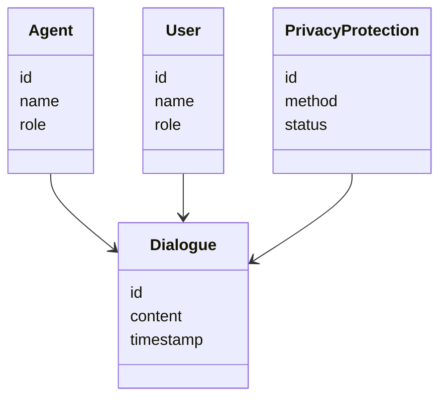

                 


# 开发AI Agent的隐私保护对话生成技术

> 关键词：AI Agent, 对话生成, 隐私保护, 机器学习, 数据安全

> 摘要：本文深入探讨了在开发AI Agent时如何保护用户隐私的同时生成自然流畅的对话。通过分析对话生成的核心技术，探讨隐私保护的实现方法，并结合实际案例，展示如何在AI Agent中实现隐私保护对话生成。

---

# 第一部分: AI Agent与隐私保护对话生成技术概述

## 第1章: AI Agent与隐私保护对话生成技术的背景

### 1.1 问题背景

#### 1.1.1 对话生成技术的发展历程
对话生成技术从基于规则的方法发展到复杂的深度学习模型，经历了以下几个阶段：
1. **基于规则的方法**：通过预定义的语法规则生成简单的对话，常见于早期的聊天机器人。
2. **基于统计的方法**：利用概率模型分析对话数据，生成更自然的回复。
3. **基于深度学习的方法**：采用神经网络模型（如Transformer）生成高质量的对话。

#### 1.1.2 隐私保护在AI对话中的重要性
随着AI对话系统的广泛应用，用户隐私保护变得至关重要。用户的对话数据可能包含敏感信息，如个人信息、健康状况等，这些数据一旦泄露，可能导致严重的隐私问题。

#### 1.1.3 当前技术的局限性与挑战
当前对话生成技术在隐私保护方面存在以下问题：
1. **数据泄露风险**：模型训练可能使用了用户的敏感数据，导致隐私泄露。
2. **模型可解释性差**：复杂的深度学习模型难以解释其决策过程，增加了隐私保护的难度。
3. **隐私与性能的平衡**：在保护隐私的同时，如何保持对话生成的质量是一个挑战。

### 1.2 问题描述

#### 1.2.1 对话生成中的隐私泄露风险
对话生成系统在训练和推理过程中可能泄露用户隐私，例如：
1. **训练数据泄露**：模型可能记住训练数据中的具体对话内容。
2. **推理过程中的数据泄露**：在生成对话时，模型可能意外泄露用户的隐私信息。

#### 1.2.2 用户隐私保护的需求分析
用户对隐私保护的需求包括：
1. **数据匿名化**：确保用户的对话数据不被关联到具体个人。
2. **数据最小化**：仅收集和使用必要的数据。
3. **用户控制权**：用户应能够控制其数据的使用方式。

#### 1.2.3 技术实现中的边界与外延
隐私保护的边界包括：
1. **数据范围**：明确哪些数据需要保护。
2. **保护级别**：确定数据保护的强度。
3. **使用场景**：根据不同的使用场景调整隐私保护策略。

### 1.3 核心概念与问题解决

#### 1.3.1 AI Agent的基本概念
AI Agent是一种智能体，能够感知环境并执行任务。在对话生成中，AI Agent需要理解用户输入并生成合适的回复。

#### 1.3.2 隐私保护对话生成的目标
隐私保护对话生成的目标是在生成对话的同时，保护用户隐私，防止敏感信息泄露。

#### 1.3.3 技术实现的核心要素
- **数据匿名化**：通过技术手段去除或隐藏用户数据中的敏感信息。
- **模型训练**：在保护隐私的前提下训练对话生成模型。
- **实时生成**：在生成对话时确保隐私保护。

---

## 第二部分: 核心概念与原理分析

## 第2章: AI Agent与隐私保护的核心概念

### 2.1 AI Agent的基本原理

#### 2.1.1 AI Agent的定义与特征
AI Agent是一个智能实体，能够感知环境、理解用户需求并生成相应的回复。其主要特征包括：
1. **自主性**：能够在没有外部干预的情况下运行。
2. **反应性**：能够根据环境变化调整行为。
3. **目标导向**：具有明确的目标，如提供信息或解决问题。

#### 2.1.2 对话生成的数学模型
对话生成可以看作是一个概率生成问题，模型的目标是最大化生成对话的概率：
$$ P(y|x) $$
其中，$x$ 是输入，$y$ 是生成的对话。

#### 2.1.3 隐私保护的实现机制
隐私保护的实现机制包括数据匿名化、差分隐私和同态加密等。

### 2.2 隐私保护与对话生成的关联

#### 2.2.1 隐私保护在对话生成中的作用
隐私保护在对话生成中的作用包括：
1. **数据安全**：防止用户数据被滥用。
2. **模型鲁棒性**：增强模型的鲁棒性，防止攻击。

#### 2.2.2 对话生成中的数据流分析
对话生成中的数据流包括：
1. **输入数据**：用户的查询或对话历史。
2. **模型处理**：模型对输入数据进行处理，生成回复。
3. **输出数据**：生成的对话回复。

#### 2.2.3 隐私保护与对话生成的平衡点
在保护隐私的同时，对话生成需要保持自然流畅。这需要在模型设计和数据处理中找到平衡点。

### 2.3 核心概念的属性与特征对比

#### 2.3.1 对话生成模型的属性分析
| 模型类型 | 优缺点 | 示例 |
|----------|--------|------|
| 基于规则 | 简单易实现，但生成效果有限 | 基于预定义规则的聊天机器人 |
| 基于统计 | 更自然，但依赖大量数据 | Naive Bayes 基于概率的对话生成 |
| 基于深度学习 | 高质量生成，但复杂难解释 | Transformer 模型 |

#### 2.3.2 隐私保护机制的特征对比
| 机制 | 特征 | 优缺点 | 适用场景 |
|------|------|--------|----------|
| 数据匿名化 | 去除或隐藏敏感信息 | 易实现，但可能降低数据准确性 | 数据预处理阶段 |
| 差分隐私 | 在数据中添加噪声 | 隐私保护强，但可能影响数据准确性 | 数据发布阶段 |
| 同态加密 | 在加密状态下进行计算 | 高安全性，但计算复杂 | 敏感数据计算阶段 |

#### 2.3.3 核心概念的ER实体关系图
```mermaid
er
    entity(Agent) {
        id
        name
        role
    }
    entity(User) {
        id
        name
        role
    }
    entity(Dialogue) {
        id
        content
        timestamp
    }
    entity(PrivacyProtection) {
        id
        method
        status
    }
    Agent -[1..n]-> Dialogue
    User -[1..n]-> Dialogue
    PrivacyProtection -[1..n]-> Dialogue
```

---

## 第3章: 核心概念的属性与特征对比

### 3.1 对话生成模型的属性分析

#### 3.1.1 基于规则的对话生成
基于规则的对话生成简单易实现，但生成效果有限。例如，预定义规则的聊天机器人只能生成有限的回复。

#### 3.1.2 基于统计的对话生成
基于统计的对话生成更加自然，但依赖大量数据。例如，Naive Bayes 基于概率的对话生成需要大量的对话数据进行训练。

#### 3.1.3 基于深度学习的对话生成
基于深度学习的对话生成质量高，但复杂难解释。例如，Transformer 模型能够生成高质量的对话，但其内部工作机制难以解释。

### 3.2 隐私保护与对话生成的关联

#### 3.2.1 隐私保护在对话生成中的作用
隐私保护在对话生成中的作用包括：
1. **数据安全**：防止用户数据被滥用。
2. **模型鲁棒性**：增强模型的鲁棒性，防止攻击。

#### 3.2.2 对话生成中的数据流分析
对话生成中的数据流包括：
1. **输入数据**：用户的查询或对话历史。
2. **模型处理**：模型对输入数据进行处理，生成回复。
3. **输出数据**：生成的对话回复。

#### 3.2.3 隐私保护与对话生成的平衡点
在保护隐私的同时，对话生成需要保持自然流畅。这需要在模型设计和数据处理中找到平衡点。

---

## 第4章: 隐私保护对话生成的算法原理

### 4.1 对话生成的数学模型

#### 4.1.1 基于Transformer的对话生成模型
Transformer模型通过自注意力机制捕捉对话中的长程依赖关系。模型的解码器生成对话回复，具体步骤如下：
1. **输入处理**：将用户的输入转换为向量。
2. **自注意力机制**：计算输入的自注意力权重。
3. **解码器输出**：生成对话回复。

#### 4.1.2 模型的数学表达
对话生成模型的数学表达如下：
$$ P(y|x) = \text{Decoder}(x) $$

### 4.2 隐私保护的实现

#### 4.2.1 数据匿名化
数据匿名化通过去除或隐藏敏感信息来保护用户隐私。例如，使用随机化处理对话数据中的个人信息。

#### 4.2.2 差分隐私
差分隐私通过在数据中添加噪声来保护隐私。例如，在模型训练中加入噪声，使得单个数据点的贡献无法被识别。

#### 4.2.3 同态加密
同态加密允许在加密状态下进行计算，确保数据在计算过程中保持加密状态。例如，使用同态加密技术对用户数据进行加密后进行模型训练。

### 4.3 算法实现

#### 4.3.1 对话生成的算法实现
对话生成的算法实现基于Transformer模型，具体代码如下：
```python
import torch
import torch.nn as nn
import torch.nn.functional as F

class TransformerDecoder(nn.Module):
    def __init__(self, vocab_size, d_model, n_head, dff):
        super(TransformerDecoder, self).__init__()
        self.embedding = nn.Embedding(vocab_size, d_model)
        self.decode_layers = nn.ModuleList([
            DecoderLayer(d_model, n_head, dff)
            for _ in range(num_layers)
        ])
        
    def forward(self, x, memory):
        x = self.embedding(x)
        for layer in self.decode_layers:
            x = layer(x, memory)
        return x
```

#### 4.3.2 隐私保护的算法实现
差分隐私的实现可以通过在模型训练中添加噪声：
```python
def add_noise(x, epsilon):
    noise = torch.randn(x.size()) * (1/epsilon)
    x_noisy = x + noise
    return x_noisy
```

---

## 第5章: 系统分析与架构设计

### 5.1 问题场景介绍

#### 5.1.1 系统目标
系统目标是开发一个支持隐私保护的AI Agent对话生成系统。

#### 5.1.2 系统范围
系统范围包括对话生成、隐私保护、用户交互等功能。

### 5.2 系统功能设计

#### 5.2.1 领域模型
领域模型展示了系统的各个模块及其关系：


#### 5.2.2 系统架构设计
系统架构采用分层架构，包括数据预处理、模型训练和隐私保护模块：


#### 5.2.3 接口设计
系统接口包括：
1. 用户输入接口
2. 对话生成接口
3. 隐私保护接口

#### 5.2.4 交互流程
交互流程包括：
1. 用户输入查询
2. 系统生成对话回复
3. 系统保护隐私

### 5.3 项目实战

#### 5.3.1 环境安装
需要安装以下工具和库：
- Python 3.8+
- PyTorch 1.9+
- Transformers 4.10+

#### 5.3.2 核心代码实现
对话生成模型的实现：
```python
import torch
import torch.nn as nn
import torch.nn.functional as F

class TransformerDecoder(nn.Module):
    def __init__(self, vocab_size, d_model, n_head, dff):
        super(TransformerDecoder, self).__init__()
        self.embedding = nn.Embedding(vocab_size, d_model)
        self.decode_layers = nn.ModuleList([
            DecoderLayer(d_model, n_head, dff)
            for _ in range(num_layers)
        ])
        
    def forward(self, x, memory):
        x = self.embedding(x)
        for layer in self.decode_layers:
            x = layer(x, memory)
        return x
```

#### 5.3.3 案例分析
以医疗咨询场景为例，用户输入“我最近经常感到疲惫”，系统生成回复时需要保护用户的隐私，避免泄露用户的健康状况。

---

## 第6章: 最佳实践与总结

### 6.1 小结
本文详细探讨了AI Agent在对话生成中的隐私保护技术，分析了各种隐私保护机制，并结合实际案例展示了如何实现隐私保护对话生成。

### 6.2 注意事项
在实际应用中，需要注意以下几点：
1. **数据匿名化**：确保在数据预处理阶段去除敏感信息。
2. **模型训练**：在模型训练中采用差分隐私等技术保护数据。
3. **用户隐私控制**：提供用户控制数据使用的选项。

### 6.3 拓展阅读
推荐以下书籍和论文：
1. **《隐私保护与数据挖掘》**：深入探讨隐私保护技术。
2. **《对话生成模型的研究与应用》**：详细分析对话生成技术的最新进展。

---

通过以上内容，我们可以看到，开发AI Agent的隐私保护对话生成技术需要综合考虑模型设计、数据处理和隐私保护等多个方面。希望本文能够为相关领域的研究和实践提供有价值的参考。

