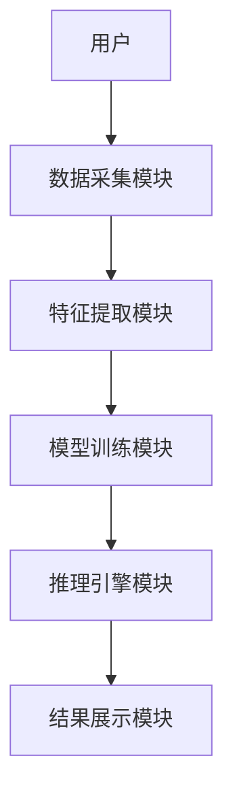
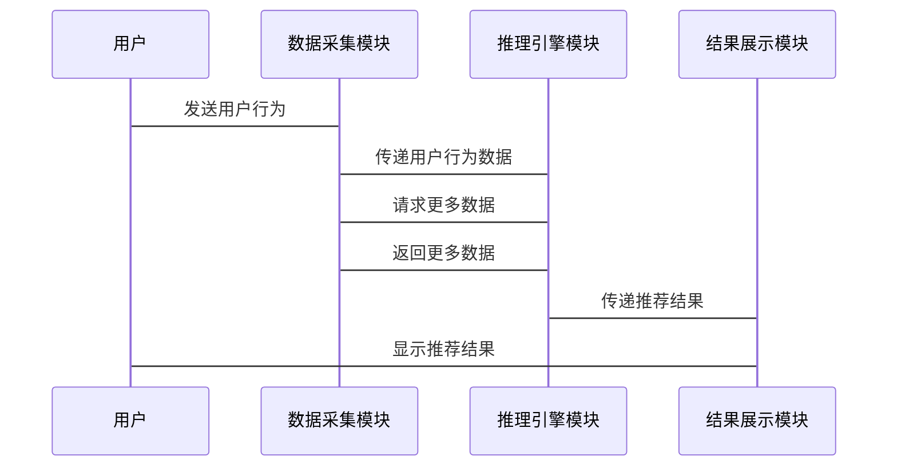

                 


# 开发AI Agent驱动的个性化推荐系统

> 关键词：AI Agent，个性化推荐，推荐系统，机器学习，深度学习，协同过滤，内容推荐，系统架构

> 摘要：  
个性化推荐系统在现代互联网应用中扮演着越来越重要的角色。传统的推荐系统依赖于协同过滤、基于内容的推荐等算法，而随着AI Agent技术的发展，推荐系统变得更加智能化、个性化和动态化。本文将详细介绍AI Agent驱动的个性化推荐系统的开发过程，从核心概念、算法原理、系统架构到项目实战，全面解析如何构建高效、智能的推荐系统。通过本文，读者将能够理解AI Agent在推荐系统中的应用，并掌握实际开发的关键技术。

---

# 第一部分: 推荐系统的背景与演变

## 第1章: 推荐系统的背景与演变

### 1.1 推荐系统的定义与应用

#### 1.1.1 推荐系统的定义
推荐系统是一种基于用户行为、偏好和数据的智能系统，旨在为用户提供个性化的内容、产品或服务推荐。推荐系统的核心目标是通过分析用户历史行为和数据，预测用户的兴趣，从而提供相关的推荐。

#### 1.1.2 推荐系统的应用场景
推荐系统广泛应用于多个领域：
- **电子商务**：推荐商品给用户，提升购买率和用户满意度。
- **社交媒体**：推荐用户可能感兴趣的内容或用户。
- **视频平台**：推荐用户可能喜欢的视频或节目。
- **音乐平台**：推荐用户可能喜欢的歌曲或专辑。
- **新闻平台**：推荐用户可能感兴趣的文章或新闻。

#### 1.1.3 推荐系统的重要性
推荐系统通过个性化推荐，能够显著提升用户体验、用户参与度和用户粘性。同时，推荐系统还能帮助企业提高销售额、广告点击率和内容消费量，具有重要的商业价值。

### 1.2 个性化推荐的必要性

#### 1.2.1 用户需求的多样性
用户的需求和兴趣是多样化的。同一件商品可能对不同用户的价值不同，推荐系统需要能够捕捉用户的个性化需求，提供精准的推荐。

#### 1.2.2 提高用户体验的价值
个性化推荐能够为用户提供更符合其兴趣的内容或产品，减少用户的搜索成本，提高用户的满意度和使用体验。

#### 1.2.3 个性化推荐的商业价值
通过个性化推荐，企业可以更精准地定位目标用户，提高转化率和销售额。同时，个性化推荐还能帮助企业在竞争激烈的市场中脱颖而出。

### 1.3 AI Agent在推荐系统中的角色

#### 1.3.1 AI Agent的定义
AI Agent（人工智能代理）是一种能够感知环境、自主决策并执行任务的智能实体。AI Agent能够通过学习和推理，优化其行为以达到预定目标。

#### 1.3.2 AI Agent在推荐系统中的作用
AI Agent在推荐系统中主要负责以下几个方面：
- **数据收集**：收集用户的交互数据，如点击、浏览、购买等。
- **特征提取**：从用户行为和数据中提取特征，用于推荐模型的训练。
- **模型训练**：训练推荐模型，优化推荐算法。
- **实时推理**：根据用户实时行为，动态生成推荐结果。

#### 1.3.3 AI Agent与传统推荐算法的区别
传统的推荐算法通常基于静态数据，推荐结果相对固定。而AI Agent能够通过动态学习和推理，实时调整推荐策略，提供更加灵活和个性化的推荐。

---

## 第2章: AI Agent驱动的推荐系统核心概念

### 2.1 推荐系统的核心要素

#### 2.1.1 用户特征
用户特征包括用户的属性（如年龄、性别、兴趣爱好）和行为数据（如点击、收藏、购买）。

#### 2.1.2 物品特征
物品特征包括商品或内容的属性（如类别、标签、描述）和评分数据。

#### 2.1.3 用户-物品交互数据
用户-物品交互数据包括用户对物品的操作记录，如点击、收藏、评分等。

### 2.2 AI Agent的核心原理

#### 2.2.1 AI Agent的基本工作原理
AI Agent通过感知环境、获取数据、分析数据、学习模型、生成推荐结果，从而实现个性化推荐。

#### 2.2.2 AI Agent的感知与决策能力
AI Agent能够通过传感器或数据接口感知环境，并基于感知到的信息进行决策和推理。

#### 2.2.3 AI Agent的自主学习能力
AI Agent能够通过机器学习算法，自主学习用户行为和偏好，优化推荐策略。

### 2.3 推荐系统的核心算法

#### 2.3.1 协同过滤算法
协同过滤是一种基于用户相似性或物品相似性的推荐算法。通过分析用户的行为数据，找到与目标用户相似的用户，推荐相似用户喜欢的物品。

#### 2.3.2 基于内容的推荐算法
基于内容的推荐算法通过分析物品的属性和特征，找到与用户兴趣相似的内容进行推荐。

#### 2.3.3 深度学习推荐算法
深度学习推荐算法通过构建神经网络模型，学习用户和物品的高维特征表示，生成推荐结果。

---

## 第3章: AI Agent驱动的推荐系统核心概念与联系

### 3.1 核心概念原理

#### 3.1.1 AI Agent的核心概念
AI Agent通过感知环境、学习数据、生成推荐，实现个性化推荐。

#### 3.1.2 推荐系统的核心概念
推荐系统通过分析用户特征和物品特征，生成个性化推荐结果。

#### 3.1.3 AI Agent与推荐系统的结合原理
AI Agent通过实时学习和推理，动态优化推荐策略，提高推荐系统的个性化和实时性。

### 3.2 核心概念对比表格

表3-1: AI Agent与传统推荐算法的对比

| 特性                | AI Agent推荐系统 | 传统推荐系统 |
|---------------------|------------------|--------------|
| 是否实时            | 是               | 否            |
| 是否动态调整         | 是               | 否            |
| 是否依赖用户行为数据  | 是               | 是            |
| 是否支持多模态数据    | 是               | 否            |
| 是否需要深度学习     | 是               | 否            |

### 3.3 ER实体关系图

```mermaid
erd
  user (用户)
    name: 用户名
    age: 年龄
    gender: 性别
    preferences: 兴趣爱好
  item (物品)
    id: 物品ID
    type: 类型
    category: 类别
    description: 描述
  interaction (用户-物品交互)
    user_id: 用户ID
    item_id: 物品ID
    action: 行为（如点击、收藏）
```

---

## 第4章: AI Agent驱动的推荐系统算法原理

### 4.1 协同过滤算法

#### 4.1.1 协同过滤的原理
协同过滤通过分析用户的行为数据，找到与目标用户相似的用户，推荐相似用户的喜欢的物品。

#### 4.1.2 协同过滤的实现步骤

1. 数据收集：收集用户的行为数据，如点击、评分。
2. 用户相似性计算：通过计算用户之间的相似性，如余弦相似度。
3. 推荐生成：根据相似用户的偏好，生成推荐列表。

#### 4.1.3 协同过滤的代码实现

```python
import numpy as np

# 用户-物品评分矩阵
user_item_matrix = np.array([[4, 3, 0], [2, 0, 3], [0, 1, 5]])

# 计算余弦相似度
def cosine_similarity(matrix):
    user_similarity = np.zeros((3,3))
    for i in range(3):
        for j in range(3):
            if i == j:
                user_similarity[i][j] = 1
            else:
                numerator = np.dot(matrix[i], matrix[j])
                denominator = np.linalg.norm(matrix[i]) * np.linalg.norm(matrix[j])
                if denominator != 0:
                    user_similarity[i][j] = numerator / denominator
                else:
                    user_similarity[i][j] = 0
    return user_similarity

user_similarity = cosine_similarity(user_item_matrix)
print("用户相似度矩阵：")
print(user_similarity)
```

#### 4.1.4 协同过滤的优缺点
- **优点**：简单易实现，适用于数据稀疏性较高的场景。
- **缺点**：计算复杂度高，难以处理大规模数据。

### 4.2 基于内容的推荐算法

#### 4.2.1 基于内容的推荐原理
基于内容的推荐算法通过分析物品的特征，找到与用户兴趣相似的内容进行推荐。

#### 4.2.2 基于内容的推荐实现步骤

1. 物品特征提取：提取物品的文本、图像等特征。
2. 用户兴趣建模：分析用户的偏好，构建用户兴趣模型。
3. 内容相似度计算：计算物品与用户兴趣的相似度，生成推荐列表。

#### 4.2.3 基于内容的推荐代码实现

```python
from sklearn.feature_extraction.text import TfidfVectorizer

# 物品描述
items = [
    "Action movie",
    "Comedy movie",
    "Drama movie"
]

# 特征提取
vectorizer = TfidfVectorizer()
tfidf = vectorizer.fit_transform(items)

# 用户兴趣
user_preference = ["喜欢动作电影"]

# 推荐生成
user_vector = vectorizer.transform(user_preference)
similarity = np.dot(tfidf.toarray(), user_vector.toarray().T)

print("内容相似度：", similarity)
```

#### 4.2.4 基于内容的推荐优缺点
- **优点**：能够处理数据稀疏性问题，推荐结果解释性强。
- **缺点**：难以捕捉用户兴趣的变化，推荐结果可能缺乏多样性。

### 4.3 深度学习推荐算法

#### 4.3.1 深度学习推荐原理
深度学习推荐算法通过构建神经网络模型，学习用户和物品的高维特征表示，生成推荐结果。

#### 4.3.2 深度学习推荐实现步骤

1. 数据预处理：对用户和物品数据进行特征提取和归一化处理。
2. 模型训练：构建深度学习模型，如神经网络协同过滤模型。
3. 模型推理：根据用户输入，生成推荐结果。

#### 4.3.3 深度学习推荐代码实现

```python
import keras
from keras.layers import Input, Dense
from keras.models import Model

# 输入层
user_input = Input(shape=(num_user_features,))
item_input = Input(shape=(num_item_features,))

# 隐层表示
user_embeddings = Dense(64, activation='relu')(user_input)
item_embeddings = Dense(64, activation='relu')(item_input)

# 模型合并
merged = keras.layers.concatenate([user_embeddings, item_embeddings])
dense_layer = Dense(64, activation='relu')(merged)
output_layer = Dense(1, activation='sigmoid')(dense_layer)

# 定义模型
model = Model(inputs=[user_input, item_input], outputs=output_layer)
model.compile(loss='binary_crossentropy', optimizer='adam')
model.summary()
```

#### 4.3.4 深度学习推荐的优缺点
- **优点**：能够捕捉复杂的用户和物品特征，推荐结果更加精准。
- **缺点**：计算复杂度高，需要大量的数据和计算资源。

---

## 第5章: AI Agent驱动的推荐系统系统架构

### 5.1 系统架构设计

#### 5.1.1 系统整体架构



#### 5.1.2 模块功能说明
- **数据采集模块**：负责采集用户行为数据，如点击、收藏、评分。
- **特征提取模块**：提取用户和物品的特征，如文本特征、行为特征。
- **模型训练模块**：训练推荐模型，优化推荐算法。
- **推理引擎模块**：根据用户实时行为，动态生成推荐结果。
- **结果展示模块**：将推荐结果展示给用户，如推荐列表、推荐理由。

#### 5.1.3 系统交互流程



### 5.2 系统接口设计

#### 5.2.1 系统接口设计

表5-1: 系统接口设计

| 接口名称       | 输入参数         | 输出参数         | 接口描述                   |
|----------------|------------------|------------------|---------------------------|
| 获取推荐结果     | 用户ID           | 推荐列表         | 根据用户ID返回推荐结果     |
| 更新用户行为     | 用户ID, 行为类型   | 状态码           | 更新用户的最新行为数据     |
| 训练推荐模型     | 训练数据         | 模型参数         | 更新推荐模型的参数         |

---

## 第6章: 项目实战——开发一个AI Agent驱动的个性化推荐系统

### 6.1 项目介绍

#### 6.1.1 项目背景
本项目旨在开发一个基于AI Agent的个性化推荐系统，用于电商场景下的商品推荐。

#### 6.1.2 项目目标
- 实现用户行为数据采集
- 构建推荐模型
- 提供实时推荐服务
- 展示推荐结果

### 6.2 环境安装

#### 6.2.1 安装Python环境
安装Python 3.8及以上版本，并安装必要的库：
```bash
pip install numpy pandas scikit-learn keras tensorflow
```

### 6.3 核心代码实现

#### 6.3.1 数据采集模块

```python
import logging

class DataCollector:
    def __init__(self, db_connection):
        self.db_connection = db_connection

    def collect_user_behavior(self, user_id):
        # 从数据库获取用户行为数据
        cursor = self.db_connection.cursor()
        cursor.execute("SELECT * FROM user_behavior WHERE user_id = %s", (user_id,))
        rows = cursor.fetchall()
        return rows

    def update_user_behavior(self, user_id, action):
        # 更新用户行为数据
        cursor = self.db_connection.cursor()
        cursor.execute("UPDATE user_behavior SET last_action = %s WHERE user_id = %s", (action, user_id))
        self.db_connection.commit()
```

#### 6.3.2 特征提取模块

```python
from sklearn.feature_extraction.text import TfidfVectorizer

class FeatureExtractor:
    def __init__(self):
        self.vectorizer = TfidfVectorizer()

    def extract_item_features(self, items):
        # 提取物品特征
        return self.vectorizer.fit_transform(items)

    def extract_user_features(self, user_profiles):
        # 提取用户特征
        return self.vectorizer.transform(user_profiles)
```

#### 6.3.3 模型训练模块

```python
from keras.models import Model
from keras.layers import Input, Dense

class RecommenderModel:
    def __init__(self, num_user_features, num_item_features):
        # 输入层
        user_input = Input(shape=(num_user_features,))
        item_input = Input(shape=(num_item_features,))

        # 隐层表示
        user_embeddings = Dense(64, activation='relu')(user_input)
        item_embeddings = Dense(64, activation='relu')(item_input)

        # 模型合并
        merged = keras.layers.concatenate([user_embeddings, item_embeddings])
        dense_layer = Dense(64, activation='relu')(merged)
        output_layer = Dense(1, activation='sigmoid')(dense_layer)

        # 定义模型
        self.model = Model(inputs=[user_input, item_input], outputs=output_layer)
        self.model.compile(loss='binary_crossentropy', optimizer='adam')

    def train(self, user_features, item_features, labels):
        # 训练模型
        self.model.fit([user_features, item_features], labels, epochs=10, batch_size=32)
```

#### 6.3.4 推理引擎模块

```python
class InferenceEngine:
    def __init__(self, model):
        self.model = model

    def generate_recommendations(self, user_id, user_features, item_features):
        # 预测推荐结果
        predicted_scores = self.model.predict([user_features, item_features])
        return predicted_scores
```

#### 6.3.5 结果展示模块

```python
def display_recommendations(recommendations):
    # 展示推荐结果
    for score in recommendations:
        print(f"推荐得分：{score[0]}")
```

### 6.4 代码解读与分析

#### 6.4.1 数据采集模块
数据采集模块负责从数据库中获取用户行为数据，并更新用户的最新行为。通过日志记录功能，可以监控数据采集过程中的异常情况。

#### 6.4.2 特征提取模块
特征提取模块使用TF-IDF方法，从用户描述和物品描述中提取特征向量，为后续的模型训练提供输入数据。

#### 6.4.3 模型训练模块
模型训练模块构建了一个神经网络模型，通过反向传播算法优化模型参数，提升推荐的准确性。

#### 6.4.4 推理引擎模块
推理引擎模块负责根据用户的实时行为，动态生成推荐结果。通过调用训练好的模型，可以快速得到推荐得分。

#### 6.4.5 结果展示模块
结果展示模块将推荐结果以用户友好的形式展示给用户，如推荐列表和推荐理由。

### 6.5 实际案例分析

#### 6.5.1 电商推荐系统案例

案例背景：
一家电商公司希望通过个性化推荐系统，提升用户的购买率和用户满意度。

解决方案：
1. 数据采集：收集用户的浏览、点击、收藏、购买行为数据。
2. 特征提取：提取用户的兴趣特征和物品的属性特征。
3. 模型训练：训练深度学习推荐模型，优化推荐算法。
4. 推理引擎：根据用户的实时行为，动态生成推荐结果。
5. 结果展示：将推荐结果展示在用户界面上。

实现步骤：
1. 数据采集模块：从数据库中获取用户行为数据。
2. 特征提取模块：提取用户的兴趣特征和物品的属性特征。
3. 模型训练模块：训练神经网络协同过滤模型。
4. 推理引擎模块：根据用户实时行为，生成推荐结果。
5. 结果展示模块：将推荐结果展示给用户。

### 6.6 项目小结

通过本项目，我们成功开发了一个基于AI Agent的个性化推荐系统，实现了用户行为数据采集、特征提取、模型训练、推理引擎和结果展示等功能。通过实际案例分析，验证了系统的有效性和可行性。未来，我们可以进一步优化模型，引入更多的推荐算法，提升推荐系统的个性化和实时性。

---

## 第7章: 最佳实践与小结

### 7.1 最佳实践

#### 7.1.1 小结
本文详细介绍了AI Agent驱动的个性化推荐系统的开发过程，从核心概念、算法原理到系统架构和项目实战，全面解析了推荐系统的开发要点。

#### 7.1.2 注意事项
- 在数据采集过程中，需要注意数据的准确性和完整性。
- 在特征提取过程中，需要选择合适的特征提取方法，提升模型的准确性。
- 在模型训练过程中，需要合理选择超参数，避免过拟合或欠拟合。
- 在推理引擎设计中，需要确保系统的实时性和响应速度。

#### 7.1.3 拓展阅读
- 《推荐系统导论》
- 《深度学习推荐系统实战》
- 《AI Agent与智能系统》

---

## 第8章: 结语

随着人工智能技术的不断发展，AI Agent驱动的个性化推荐系统将在未来的互联网应用中发挥越来越重要的作用。通过本文的介绍，读者可以掌握推荐系统的核心技术，了解AI Agent在推荐系统中的应用，并能够实际开发一个个性化的推荐系统。希望本文对读者有所帮助，激发更多人投身于人工智能和推荐系统的开发中。

--- 

**End of Article**

