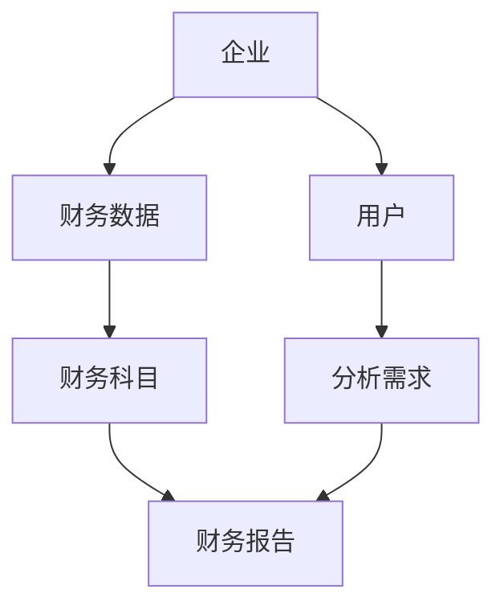
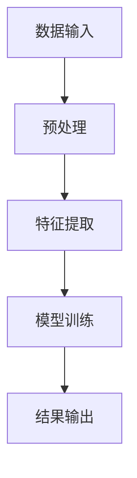
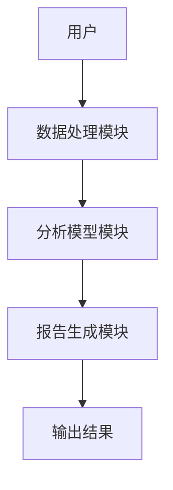
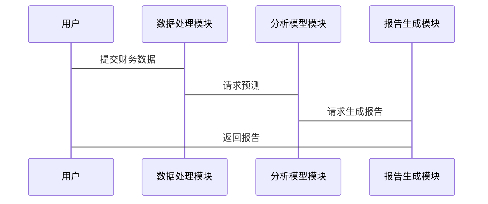

                 


# 开发AI辅助的企业财务情景分析工具

> 关键词：AI、财务分析、情景分析、NLP、机器学习、深度学习

> 摘要：随着企业对财务分析的需求日益增长，传统的财务分析方法逐渐暴露出效率低下、准确性不足的问题。通过引入人工智能（AI）技术，我们可以开发出更加智能、高效的财务情景分析工具。本文将详细探讨如何利用自然语言处理（NLP）、机器学习和深度学习等AI技术，构建一个能够自动化处理财务数据、生成情景分析报告的工具。文章从背景、核心概念、算法原理、系统架构到项目实战，全面解析开发过程中的关键点，为读者提供系统的开发思路。

---

# 第一部分: AI辅助的企业财务情景分析工具开发背景

## 第1章: 企业财务情景分析工具的背景与需求

### 1.1 问题背景

#### 1.1.1 传统财务分析的局限性
传统的财务分析主要依赖人工处理，包括数据录入、报表生成、趋势分析和预测等。这种方法不仅效率低下，还容易受到人为因素的影响，导致结果不够准确。

#### 1.1.2 AI技术在财务分析中的应用潜力
人工智能技术的快速发展为财务分析带来了新的可能性。通过自然语言处理（NLP）技术，可以自动解析财务文本；通过机器学习和深度学习，可以预测财务趋势并生成情景分析。

#### 1.1.3 企业财务情景分析工具的必要性
企业需要在复杂多变的市场环境中做出快速、准确的决策，传统的财务分析方法已经无法满足需求。开发一个能够实时处理财务数据、生成多种情景分析的工具，可以帮助企业在竞争中占据优势。

### 1.2 问题描述

#### 1.2.1 财务数据的复杂性与多样性
企业的财务数据来源多样，包括财务报表、银行流水、市场报告等，数据格式和内容差异较大，传统方法难以统一处理。

#### 1.2.2 传统分析方法的效率瓶颈
人工分析需要大量时间，且容易出现疏漏，尤其是在处理大量数据时，效率和准确性都无法保证。

#### 1.2.3 企业对实时、智能分析的需求
企业需要实时监控财务状况，并根据市场变化快速调整策略。传统的分析方法无法满足实时性和智能化的要求。

### 1.3 问题解决

#### 1.3.1 AI辅助分析的核心思路
通过AI技术，实现财务数据的自动采集、处理、分析和报告生成，减少人工干预，提高效率和准确性。

#### 1.3.2 从数据到决策的智能化转变
利用机器学习和深度学习模型，将财务数据转化为有价值的洞察，帮助企业在多种情景下做出最优决策。

#### 1.3.3 工具开发的目标与价值
目标是开发一个高效、智能的财务分析工具，价值在于提高企业财务分析的效率和准确性，支持实时决策。

### 1.4 边界与外延

#### 1.4.1 工具的功能边界
工具主要关注财务数据的分析和情景生成，不涉及数据采集和外部系统集成。

#### 1.4.2 相关领域的区别与联系
与传统财务分析相比，AI辅助工具在效率和准确性上有显著优势，但需要结合具体业务场景进行优化。

#### 1.4.3 应用场景的扩展性
工具可以应用于企业内部财务分析、投资决策、风险评估等领域，未来还可以扩展到更多业务场景。

### 1.5 概念结构与核心要素

#### 1.5.1 核心概念的层次结构
从底层数据到上层分析结果，形成一个完整的分析链条。

#### 1.5.2 关键要素的定义与属性
- 数据源：财务报表、市场报告、银行流水等。
- 数据处理：清洗、转换、特征提取。
- 分析模型：NLP、机器学习、深度学习模型。
- 分析结果：情景预测、趋势分析、风险评估。

#### 1.5.3 系统整体架构的初步框架
初步框架包括数据输入、数据处理、模型训练、结果输出四个主要环节。

### 1.6 本章小结
本章介绍了开发AI辅助财务分析工具的背景和需求，分析了传统方法的局限性，并提出了利用AI技术解决问题的核心思路。

---

## 第2章: AI辅助财务分析的核心概念与联系

### 2.1 核心概念原理

#### 2.1.1 自然语言处理（NLP）在财务文本分析中的应用
NLP技术可以用于解析财务报告、新闻等文本，提取关键信息，如财务数据、市场趋势等。

#### 2.1.2 机器学习在财务预测中的原理
机器学习模型（如随机森林、神经网络）可以用于预测财务指标，如收入、利润等。

#### 2.1.3 深度学习在复杂财务模型中的优势
深度学习模型（如LSTM）可以处理时间序列数据，适用于财务趋势预测。

### 2.2 核心概念属性对比

| 技术 | 优势 | 劣势 |
|------|------|------|
| NLP  | 自然语言理解能力强 | 对文本质量敏感 |
| 机器学习 | 模型解释性好 | 需要大量数据 |
| 深度学习 | 高精度 | 需要大量计算资源 |

### 2.3 ER实体关系图



### 2.4 本章小结
本章详细介绍了AI辅助财务分析的核心技术，包括NLP、机器学习和深度学习，并通过实体关系图展示了各部分的关系。

---

## 第3章: AI辅助财务分析的算法原理

### 3.1 算法原理概述

#### 3.1.1 NLP在文本分析中的应用流程
1. 数据预处理：分词、去停用词。
2. 特征提取：使用TF-IDF提取关键词。
3. 模型训练：训练分类器（如SVM）进行文本分类。

#### 3.1.2 机器学习在预测模型中的构建步骤
1. 数据清洗：处理缺失值、异常值。
2. 特征工程：提取有意义的特征。
3. 模型训练：训练随机森林模型。
4. 模型评估：验证准确率、召回率。

#### 3.1.3 深度学习模型的训练机制
1. 数据输入：将财务数据输入LSTM网络。
2. 模型训练：训练LSTM进行时间序列预测。
3. 模型优化：调整超参数，优化性能。

### 3.2 算法流程图



### 3.3 算法实现代码

```python
import pandas as pd
from sklearn.model_selection import train_test_split
from sklearn.ensemble import RandomForestRegressor

# 示例数据加载
data = pd.read_csv('financial_data.csv')
X = data[['revenue', 'profit', 'expenses']]
y = data['net_income']

# 数据划分
X_train, X_test, y_train, y_test = train_test_split(X, y, test_size=0.2, random_state=42)

# 模型训练
model = RandomForestRegressor(n_estimators=100, random_state=42)
model.fit(X_train, y_train)

# 模型预测
y_pred = model.predict(X_test)
```

### 3.4 数学公式

#### 3.4.1 随机森林模型
随机森林是一种基于决策树的集成学习方法，其预测结果是多个决策树预测结果的平均值：

$$ y = \frac{1}{n} \sum_{i=1}^{n} T_i(x) $$

其中，$T_i(x)$ 表示第 $i$ 棵决策树的预测结果，$n$ 是决策树的数量。

#### 3.4.2 LSTM模型
LSTM（长短期记忆网络）用于时间序列预测，其核心思想是通过门控机制保存长期信息：

$$ f_t = \sigma(W_f \cdot [h_{t-1}, x_t] + b_f) $$
$$ i_t = \sigma(W_i \cdot [h_{t-1}, x_t] + b_i) $$
$$ o_t = \sigma(W_o \cdot [h_{t-1}, x_t] + b_o) $$
$$ c_t = f_t \cdot c_{t-1} + i_t \cdot tanh(W_c \cdot [h_{t-1}, x_t] + b_c) $$
$$ h_t = o_t \cdot tanh(c_t) $$

### 3.5 本章小结
本章详细讲解了AI辅助财务分析中常用的算法原理，包括NLP、机器学习和深度学习，并通过代码示例和公式推导加深了对算法的理解。

---

## 第4章: 系统分析与架构设计方案

### 4.1 系统分析

#### 4.1.1 问题场景介绍
企业需要实时监控财务状况，并根据市场变化快速调整策略。

#### 4.1.2 项目介绍
开发一个AI辅助的财务情景分析工具，实现数据采集、处理、分析和报告生成。

### 4.2 系统功能设计

#### 4.2.1 领域模型Mermaid类图


### 4.3 系统架构设计

#### 4.3.1 系统架构Mermaid架构图


### 4.4 系统接口设计

#### 4.4.1 接口描述
- 数据处理模块提供API接口，接收财务数据并返回处理后的结果。
- 分析模型模块提供API接口，接收处理后的数据并返回预测结果。
- 报告生成模块提供API接口，接收预测结果并生成报告。

### 4.5 系统交互Mermaid序列图


### 4.6 本章小结
本章从系统分析的角度，详细设计了AI辅助财务分析工具的系统架构和接口设计，为后续开发奠定了基础。

---

## 第5章: 项目实战

### 5.1 环境安装

#### 5.1.1 安装Python和相关库
```bash
pip install numpy pandas scikit-learn tensorflow
```

### 5.2 系统核心实现源代码

#### 5.2.1 数据处理模块
```python
import pandas as pd

def data_processing(data):
    # 数据清洗
    data = data.dropna()
    # 数据转换
    data['date'] = pd.to_datetime(data['date'])
    return data
```

#### 5.2.2 分析模型模块
```python
from sklearn.ensemble import RandomForestRegressor

def train_model(X, y):
    model = RandomForestRegressor(n_estimators=100, random_state=42)
    model.fit(X, y)
    return model
```

#### 5.2.3 报告生成模块
```python
import matplotlib.pyplot as plt

def generate_report(predictions):
    plt.plot(predictions)
    plt.title('Financial Scenario Analysis')
    plt.xlabel('Time')
    plt.ylabel('Value')
    plt.show()
```

### 5.3 代码应用解读与分析

#### 5.3.1 数据处理模块解读
数据处理模块负责清洗和转换数据，确保数据的准确性和一致性。

#### 5.3.2 分析模型模块解读
分析模型模块使用随机森林回归模型进行预测，模型训练完成后可用于生成预测结果。

#### 5.3.3 报告生成模块解读
报告生成模块将预测结果可视化，帮助用户直观理解财务情景分析的结果。

### 5.4 实际案例分析

#### 5.4.1 案例背景
某企业希望预测未来三个月的收入趋势，基于过去三年的财务数据。

#### 5.4.2 数据准备
加载过去三年的财务数据，包括收入、利润、成本等。

#### 5.4.3 模型训练与预测
使用随机森林回归模型训练模型，并预测未来三个月的收入。

#### 5.4.4 报告生成
将预测结果生成可视化图表，展示未来三个月的收入趋势。

### 5.5 本章小结
本章通过实际案例展示了AI辅助财务分析工具的开发和应用过程，详细解读了各个模块的实现和代码。

---

## 第6章: 总结与展望

### 6.1 本项目总结
通过本项目，我们成功开发了一个AI辅助的财务情景分析工具，利用NLP、机器学习和深度学习技术，实现了财务数据的自动分析和预测。

### 6.2 未来展望
未来，可以进一步优化模型性能，扩展应用场景，结合更多AI技术（如强化学习）提升工具的智能化水平。

### 6.3 最佳实践 Tips
- 在数据处理阶段，确保数据的准确性和完整性。
- 在模型训练阶段，合理选择模型参数，避免过拟合。
- 在报告生成阶段，注重可视化效果，帮助用户更好地理解分析结果。

### 6.4 本章小结
本章总结了项目的开发成果，并展望了未来的发展方向，同时提供了一些实用的开发建议。

---

# 结语
开发AI辅助的企业财务情景分析工具是一项复杂而有意义的工程。通过本文的详细讲解，读者可以掌握从背景分析、算法实现到系统设计和项目实战的完整开发流程。希望本文能够为相关领域的从业者提供有价值的参考和启发，推动AI技术在财务分析中的广泛应用。

--- 

如果您对文章的某个部分感兴趣，或者需要更详细的技术解读，请随时提问！

