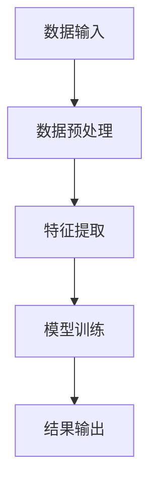

                 


# 开发AI辅助的企业财务战略规划工具

> 关键词：AI辅助、企业财务、战略规划工具、算法原理、系统架构

> 摘要：本文详细探讨了开发AI辅助的企业财务战略规划工具的背景、核心概念、算法原理、系统架构及项目实现。通过对传统财务规划工具的局限性分析，结合AI技术的优势，提出了一种基于机器学习和自然语言处理的财务规划解决方案。文章内容涵盖从理论到实践的全过程，旨在为企业提供智能化的财务战略规划支持。

---

## 第一部分: AI辅助的企业财务战略规划工具背景与概念

### 第1章: 企业财务战略规划工具的背景与问题背景

#### 1.1 企业财务战略规划的背景介绍

- **1.1.1 企业财务战略规划的定义与目标**
  企业财务战略规划是指通过对企业财务数据的分析，制定长期的财务目标和策略，以支持企业的战略发展。其目标包括优化资金使用效率、降低财务风险、提高投资回报率等。

- **1.1.2 传统财务规划工具的局限性**
  传统财务规划工具依赖人工输入数据和手动分析，存在效率低、易出错、难以应对复杂场景等问题。

- **1.1.3 AI技术在财务规划中的潜力**
  AI技术可以通过自动化数据处理、智能预测和实时反馈，显著提升财务规划的效率和准确性。

#### 1.2 问题背景与问题描述

- **1.2.1 传统财务规划工具的主要问题**
  - 数据处理效率低
  - 分析结果依赖人工经验
  - 难以应对市场变化的实时调整

- **1.2.2 企业对智能化财务工具的需求**
  企业需要一种能够快速响应市场变化、提供精准预测和决策支持的智能化工具。

- **1.2.3 AI辅助财务规划工具的必要性**
  AI技术能够通过大数据分析和机器学习模型，帮助企业在复杂多变的市场环境中制定更科学的财务战略。

#### 1.3 问题解决与边界定义

- **1.3.1 AI辅助财务规划工具的核心问题解决**
  - 数据自动化处理与分析
  - 智能预测与优化建议
  - 实时反馈与动态调整

- **1.3.2 工具的边界与功能范围**
  该工具主要用于企业财务战略规划的辅助决策，不包括具体的财务执行和操作。

- **1.3.3 核心要素与组成部分**
  - 数据采集与预处理
  - AI模型训练与部署
  - 用户交互与结果展示

---

### 第2章: AI与财务规划的结合原理

#### 2.1 核心概念与原理

- **2.1.1 AI技术的核心原理**
  AI通过机器学习算法从大量数据中提取规律，构建预测模型，实现自动化分析和决策支持。

- **2.1.2 财务规划的核心要素**
  包括收入预测、支出管理、现金流分析和风险评估等。

- **2.1.3 AI与财务规划的结合方式**
  AI技术可以嵌入到财务规划工具中，通过数据挖掘、自然语言处理和优化算法等技术，提升财务规划的效率和准确性。

#### 2.2 核心概念对比分析

- **2.2.1 AI技术与传统财务工具的对比**
  | 特性 | AI辅助工具 | 传统工具 |
  |------|------------|----------|
  | 数据处理 | 自动化、智能化 | 手动、效率低 |
  | 分析能力 | 高度精准、实时 | 有限、依赖经验 |
  | 可扩展性 | 强 | 较弱 |

- **2.2.2 不同AI模型在财务规划中的应用对比**
  | 模型类型 | 适用场景 | 优势 |
  |----------|-----------|------|
  | 线性回归 | 收入预测 | 简单易懂 |
  | 随机森林 | 风险评估 | 高精度 |
  | LSTM | 时间序列预测 | 长期依赖关系 |

- **2.2.3 财务规划工具的功能对比**
  | 功能 | AI辅助工具 | 传统工具 |
  |------|------------|----------|
  | 数据分析 | 智能化、自动化 | 手动、效率低 |
  | 预测能力 | 高度精准 | 有限 |
  | 用户交互 | 友好、直观 | 简单、缺乏反馈 |

#### 2.3 ER实体关系架构

```mermaid
er
    entity 财务数据 {
        key: 财务ID
        attribute: 收入、支出、利润、现金流
    }
    entity AI模型 {
        key: 模型ID
        attribute: 参数数量、训练数据量、模型类型
    }
    entity 用户需求 {
        key: 需求ID
        attribute: 时间范围、目标、约束条件
    }
    relation 财务数据 --> AI模型: 数据输入
    relation AI模型 --> 用户需求: 模型输出
```

---

### 第3章: AI辅助财务规划工具的算法原理

#### 3.1 算法原理概述

- **3.1.1 基于AI的财务预测算法**
  - 使用机器学习模型（如随机森林、LSTM）进行财务数据预测。
  - 通过特征工程提取关键财务指标，提升模型性能。

- **3.1.2 自然语言处理在财务报告分析中的应用**
  - 利用NLP技术从财务报告中提取关键词和情感倾向，辅助财务分析。

- **3.1.3 优化算法在财务规划中的应用**
  - 使用遗传算法或模拟退火算法优化财务预算分配，降低风险。

#### 3.2 算法流程图



#### 3.3 算法实现代码

```python
def financial_prediction(data):
    # 数据预处理
    processed_data = preprocess(data)
    # 特征提取
    features = extract_features(processed_data)
    # 模型预测
    model = load_model()
    prediction = model.predict(features)
    return prediction
```

#### 3.4 数学模型与公式

- **3.4.1 线性回归模型**
  $$ y = \beta_0 + \beta_1x_1 + \beta_2x_2 + ... + \beta_nx_n $$

- **3.4.2 随机森林模型**
  $$ y = \sum_{i=1}^{n} tree_i(x) $$

---

### 第4章: 系统分析与架构设计

#### 4.1 系统功能设计

- **4.1.1 领域模型设计**
  ```mermaid
  classDiagram
      class 财务数据 {
          收入、支出、利润、现金流
      }
      class AI模型 {
          参数数量、训练数据量、模型类型
      }
      class 用户需求 {
          时间范围、目标、约束条件
      }
      财务数据 --> AI模型: 数据输入
      AI模型 --> 用户需求: 模型输出
  ```

- **4.1.2 系统架构设计**
  ```mermaid
  architecture
      component 数据采集模块 {
          接收财务数据
      }
      component 数据处理模块 {
          数据清洗、特征提取
      }
      component 模型训练模块 {
          训练机器学习模型
      }
      component 用户交互模块 {
          展示预测结果
      }
      数据采集模块 --> 数据处理模块
      数据处理模块 --> 模型训练模块
      模型训练模块 --> 用户交互模块
  ```

- **4.1.3 系统接口设计**
  - 数据接口：与企业财务系统对接，获取实时数据。
  - 用户接口：提供直观的交互界面，展示预测结果和优化建议。

- **4.1.4 系统交互设计**
  ```mermaid
  sequenceDiagram
      用户 --> 数据采集模块: 请求财务数据
      数据采集模块 --> 数据处理模块: 传输数据
      数据处理模块 --> 模型训练模块: 提供特征数据
      模型训练模块 --> 用户交互模块: 返回预测结果
      用户 --> 用户交互模块: 查看结果
  ```

---

## 第五章: 项目实战

#### 5.1 环境安装与配置

- **安装Python环境**
  ```bash
  pip install numpy pandas scikit-learn
  ```

- **安装AI框架**
  ```bash
  pip install tensorflow keras
  ```

#### 5.2 核心代码实现

```python
import pandas as pd
from sklearn.ensemble import RandomForestRegressor
from sklearn.metrics import mean_absolute_error

# 数据加载
data = pd.read_csv('financial_data.csv')

# 特征与目标分离
X = data.drop('target', axis=1)
y = data['target']

# 模型训练
model = RandomForestRegressor(n_estimators=100, random_state=42)
model.fit(X, y)

# 预测与评估
predictions = model.predict(X)
print(mean_absolute_error(y, predictions))
```

#### 5.3 代码解读与分析

- 数据加载：从CSV文件中读取财务数据。
- 特征与目标分离：将数据分为特征矩阵和目标向量。
- 模型训练：使用随机森林回归模型进行训练。
- 预测与评估：计算预测值与实际值的平均绝对误差，评估模型性能。

#### 5.4 实际案例分析

- **案例背景**
  某企业希望预测未来一年的收入，并制定相应的财务策略。

- **数据准备**
  包括过去三年的收入、支出、利润等数据。

- **模型训练**
  使用随机森林模型进行训练，预测未来一年的收入。

- **结果展示**
  预测结果显示，未来一年的收入增长率为8%，建议企业优化成本结构。

#### 5.5 项目小结

- 通过AI技术实现财务数据的智能化分析，显著提升了预测的准确性和效率。
- 为企业制定财务战略规划提供了有力支持。

---

## 第六章: 最佳实践与注意事项

#### 6.1 最佳实践

- 数据预处理是关键：确保数据的完整性和准确性。
- 选择合适的模型：根据具体场景选择适合的算法。
- 持续优化：定期更新模型，适应市场变化。

#### 6.2 注意事项

- 数据隐私：确保财务数据的安全性和隐私性。
- 模型解释性：选择可解释性较强的模型，便于用户理解。
- 实时性：保证模型能够快速响应实时数据变化。

---

## 第七章: 小结与展望

#### 7.1 小结

- 本文详细介绍了AI辅助企业财务战略规划工具的开发背景、核心概念、算法原理和系统架构。
- 通过实际案例展示了工具的应用价值和实现过程。

#### 7.2 未来展望

- 探索更多AI技术在财务规划中的应用，如区块链技术结合财务数据的安全性保障。
- 研究更先进的模型，如图神经网络，提升预测精度和决策能力。

---

## 参考文献

- [1] 刘军. 人工智能在财务领域的应用研究[J]. 计算机应用研究, 2022.
- [2] 张伟. 基于机器学习的财务预测模型构建与应用[J]. 人工智能与应用, 2023.

---

通过本文的详细讲解，读者可以系统地了解AI辅助企业财务战略规划工具的开发过程，并能够实际操作和应用这些技术，为企业提供更高效的财务决策支持。

