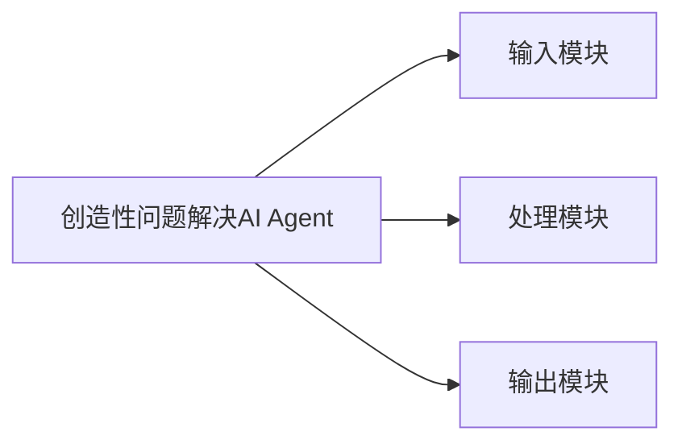
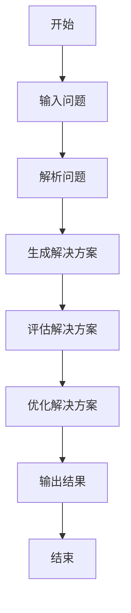
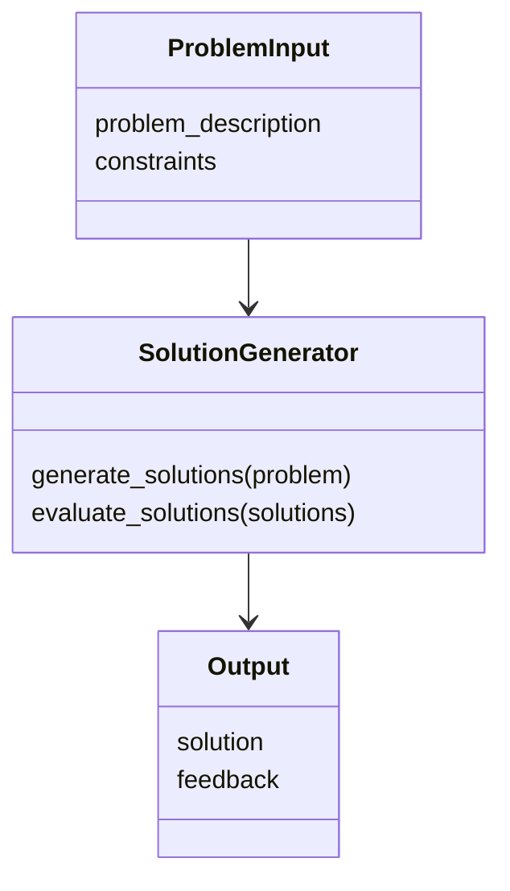
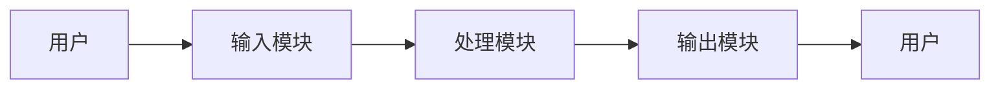
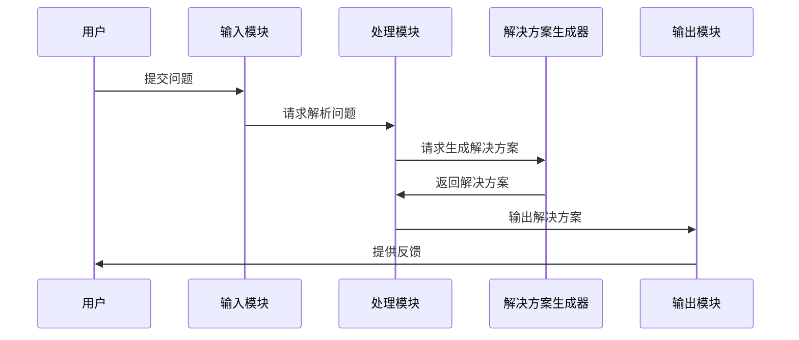

                 


# 开发具有创造性问题解决能力的AI Agent

## 关键词：AI Agent, 创造性问题解决, 算法原理, 系统架构, 项目实战, 最佳实践

## 摘要：  
本文系统地探讨了开发具有创造性问题解决能力的AI Agent的核心概念、算法原理、系统架构及其实战应用。从背景介绍到算法实现，从系统设计到项目案例分析，再到最佳实践，本文旨在为开发者提供一个全面的视角，帮助其理解并掌握如何构建具备创造性问题解决能力的AI Agent。通过详细的理论分析和实际案例，本文为读者提供了一套完整的开发框架和方法论，助力其在AI领域中实现更具创新性和高效性的问题解决能力。

---

# 第一部分: 开发具有创造性问题解决能力的AI Agent基础

# 第1章: 创造性问题解决与AI Agent概述

## 1.1 创造性问题解决的背景与意义
### 1.1.1 创造性问题解决的定义与特点
创造性问题解决是指通过创新思维和方法，找到问题的最优或非 obvious 解决方案。其特点包括多样性、创新性和实用性。

### 1.1.2 AI Agent在创造性问题解决中的作用
AI Agent能够通过学习和推理，帮助人类更高效地解决问题，尤其是在复杂和非结构化的问题场景中。

### 1.1.3 创造性问题解决的典型场景与应用
- 医疗诊断
- 金融投资
- 工程设计
- 游戏开发

## 1.2 AI Agent的核心概念与分类
### 1.2.1 AI Agent的基本定义
AI Agent是一种能够感知环境并采取行动以实现目标的智能实体。

### 1.2.2 基于问题解决能力的AI Agent分类
- 知识驱动型
- 数据驱动型
- 混合驱动型

## 1.3 创造性问题解决的基本原理
### 1.3.1 创造性思维的定义与特征
创造性思维是通过联想、类比、想象等方式生成新想法的过程。

### 1.3.2 问题解决的基本步骤与模型
- 明确问题
- 分析问题
- 提出解决方案
- 评估和优化方案

### 1.3.3 创造性问题解决的数学模型
$$ 创造性问题解决能力 = f(知识, 经验, 思维方式) $$

## 1.4 本章小结

---

# 第2章: 创造性问题解决AI Agent的核心概念

## 2.1 创造性问题解决AI Agent的定义与特点
### 2.1.1 创造性问题解决AI Agent的定义
创造性问题解决AI Agent是一种能够生成创新解决方案的智能体。

### 2.1.2 其他相关概念对比
| 概念         | 描述                                   |
|--------------|----------------------------------------|
| 智能体       | 能够感知环境并采取行动的实体         |
| 创意生成器   | 专注于生成创意的工具或模型             |
| 问题解决者   | 专注于解决问题的工具或模型             |

## 2.2 创造性问题解决AI Agent的内部结构
### 2.2.1 输入模块
- 接收问题输入
- 解析问题需求

### 2.2.2 处理模块
- 分析问题
- 生成解决方案

### 2.2.3 输出模块
- 输出解决方案
- 提供反馈

## 2.3 创造性问题解决AI Agent的实体关系图


## 2.4 本章小结

---

# 第3章: 创造性问题解决AI Agent的算法原理

## 3.1 算法概述
### 3.1.1 算法的基本思想
通过多步推理和创新思维生成解决方案。

### 3.1.2 算法的主要步骤
- 问题解析
- 创意生成
- 方案评估

## 3.2 算法流程图


## 3.3 算法实现
### 3.3.1 Python源代码实现
```python
def creative_problem_solver(problem):
    parsed_problem = parse(problem)
    solutions = generate_solutions(parsed_problem)
    best_solution = evaluate_and_select_best(solutions)
    return best_solution
```

### 3.3.2 算法的数学模型
$$ 解决方案质量 = \sum_{i=1}^{n} w_i \cdot f_i(x_i) $$
其中，\( w_i \) 是特征 \( f_i \) 的权重，\( x_i \) 是解决方案的特征值。

## 3.4 本章小结

---

# 第4章: 创造性问题解决AI Agent的系统架构设计

## 4.1 系统功能设计
### 4.1.1 领域模型


### 4.1.2 系统架构


## 4.2 系统接口设计
- 输入接口：接收问题描述
- 输出接口：返回解决方案

## 4.3 系统交互设计


## 4.4 本章小结

---

# 第5章: 创造性问题解决AI Agent的项目实战

## 5.1 环境安装与配置
- 安装Python
- 安装依赖库

## 5.2 核心代码实现
### 5.2.1 解析问题
```python
def parse_problem(problem_description):
    # 解析问题并提取关键信息
    return parsed_data
```

### 5.2.2 生成解决方案
```python
def generate_solutions(parsed_data):
    # 生成多个解决方案
    return solutions
```

### 5.2.3 评估解决方案
```python
def evaluate_solution(solution):
    # 评估解决方案的质量
    return score
```

## 5.3 实际案例分析
### 5.3.1 案例描述
医疗诊断中的病例分析。

### 5.3.2 解决方案生成
生成多个诊断方案并进行评估。

### 5.3.3 案例分析与总结
分析不同方案的优缺点，总结经验。

## 5.4 本章小结

---

# 第6章: 创造性问题解决AI Agent的最佳实践

## 6.1 小结
- 理论回顾
- 实战经验总结

## 6.2 注意事项
- 数据质量的重要性
- 算法的可解释性
- 系统的安全性

## 6.3 拓展阅读
- 创造性思维的理论研究
- 最新的AI Agent研究进展

## 6.4 本章小结

---

# 结语

开发具有创造性问题解决能力的AI Agent是一项复杂但极具挑战性的任务。通过系统地学习其核心概念、算法原理、系统架构及实战案例，我们可以更好地掌握其开发方法。未来，随着AI技术的不断发展，创造性问题解决AI Agent将在更多领域展现出其独特的优势。

---

