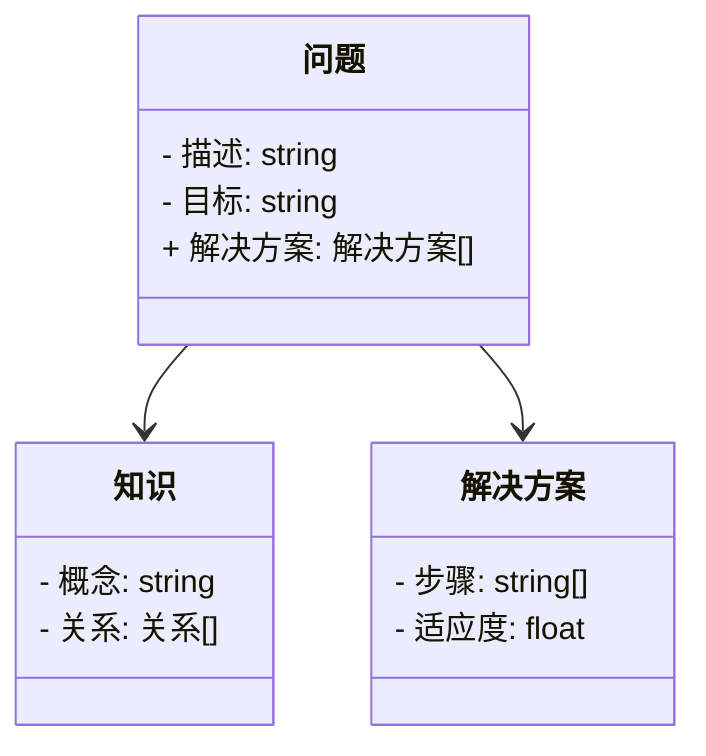

                 


# 开发具有创造性问题解决能力的AI Agent

> 关键词：AI Agent，创造性问题解决，人工智能，知识表示，多目标优化

> 摘要：本文详细探讨了开发具有创造性问题解决能力的AI Agent的关键技术与方法。从AI Agent的基本概念到创造性问题解决的理论基础，再到算法实现和系统架构设计，文章系统地分析了各个环节的实现细节，并通过实际案例展示了如何构建具备创造性思维的AI Agent。

---

## 第一部分: AI Agent与创造性问题解决概述

### 第1章: AI Agent的基本概念与背景

#### 1.1 AI Agent的定义与特点

AI Agent（智能体）是指能够感知环境、做出决策并采取行动以实现目标的实体。AI Agent的核心特点包括：

- **自主性**：能够在没有外部干预的情况下自主运作。
- **反应性**：能够根据环境的变化实时调整行为。
- **目标导向性**：具有明确的目标，并通过行动来实现这些目标。
- **学习能力**：能够通过经验改进自身的性能。

创造性问题解决能力是AI Agent的重要扩展，使其不仅能够解决已知问题，还能应对未知或复杂问题。

#### 1.2 AI Agent的发展背景

随着人工智能技术的快速发展，AI Agent的应用场景越来越广泛，包括自动驾驶、智能助手、机器人等。在这些应用场景中，AI Agent需要具备创造性问题解决能力，以应对复杂多变的环境。

创造性问题解决能力的必要性在于：

- **应对不确定性**：在复杂环境中，问题可能不明确或存在多种解决方案。
- **创新性需求**：在某些领域，如艺术创作、科学发现等，需要AI Agent能够生成创新性的解决方案。
- **提升用户体验**：通过创造性的解决方案，提升用户满意度和体验。

---

### 第2章: 创造性问题解决的理论基础

#### 2.1 创造性思维的定义与模型

创造性思维是指生成新颖且有价值的想法或解决方案的能力。常见的创造性思维模型包括：

- **知识-启发模型**：基于现有知识和经验，通过启发式方法生成新的解决方案。
- **随机-选择模型**：通过随机生成多种可能性，并选择最优解。

#### 2.2 AI Agent中的创造性问题解决框架

AI Agent的创造性问题解决框架通常包括以下几个步骤：

1. **问题建模**：将问题转化为AI Agent能够理解和处理的形式。
2. **知识表示**：将相关知识以适当的形式存储，以便推理和生成解决方案。
3. **生成与评估**：生成多种可能的解决方案，并评估其可行性和有效性。
4. **优化与选择**：对生成的方案进行优化，选择最优解或最佳方案。

---

## 第二部分: 创造性问题解决的算法与数学模型

### 第3章: 算法原理讲解

#### 3.1 A*算法

A*算法是一种常用的路径规划算法，适用于寻找最短路径的问题。其基本思想是通过评估每个节点的估价函数，选择下一个扩展的节点，直到找到目标节点。

**步骤分解：**

1. **初始化**：将起点加入优先队列。
2. **选择下一个节点**：从队列中选择估价函数最小的节点。
3. **扩展节点**：生成当前节点的所有邻居，并计算它们的估价函数。
4. **检查目标**：如果当前节点是目标节点，则返回路径。
5. **重复**：直到找到目标节点或队列为空。

**Python代码示例：**

```python
import heapq

def a_star_search(graph, start, goal):
    open PriorityQueue = [(0, start)]
    g_score = {node: float('inf') for node in graph.nodes}
    g_score[start] = 0
    f_score = {node: float('inf') for node in graph.nodes}
    f_score[start] = heuristic(start, goal)
    
    while PriorityQueue not empty:
        current_g, current_node = heappop(PriorityQueue)
        
        if current_node == goal:
            break
        for neighbor in graph.neighbors(current_node):
            tentative_g = g_score[current_node] + graph.weight(current_node, neighbor)
            if tentative_g < g_score[neighbor]:
                g_score[neighbor] = tentative_g
                f_score[neighbor] = tentative_g + heuristic(neighbor, goal)
                heappush(PriorityQueue, (f_score[neighbor], neighbor))
    
    return reconstruct_path(g_score, start, goal)
```

#### 3.2 遗传算法

遗传算法是一种模拟生物进化过程的优化算法，适用于多目标优化问题。其基本步骤包括：

1. **初始化种群**：随机生成一组候选解。
2. **评估适应度**：计算每个候选解的适应度值。
3. **选择与交叉**：根据适应度值选择优秀的候选解，并进行交叉操作生成新的候选解。
4. **变异**：对新候选解进行随机变异，增加多样性。
5. **重复**：直到达到终止条件（如达到最大迭代次数或找到满意解）。

**Python代码示例：**

```python
def genetic_algorithm(population, fitness_func, mutation_rate=0.1):
    max_fitness = max(fitness_func(individual) for individual in population)
    new_population = []
    
    for individual in population:
        if fitness_func(individual) == max_fitness:
            new_population.append(individual)
    
    while len(new_population) < len(population):
        parent1 = random.choice(new_population)
        parent2 = random.choice(new_population)
        child = crossover(parent1, parent2)
        if random.random() < mutation_rate:
            mutate(child)
        new_population.append(child)
    
    return new_population
```

---

### 第4章: 数学模型与公式推导

#### 4.1 知识表示与推理的数学模型

知识表示可以通过图论中的图结构表示，其中节点表示概念，边表示概念之间的关系。

**公式推导：**

假设我们有一个知识图谱，其中节点表示为$N_i$，边表示为$R_j$，则可以表示为：

$$
R_j = (N_i, N_k)
$$

其中，$N_i$和$N_k$是两个节点，$R_j$表示它们之间的关系。

#### 4.2 多目标优化的数学模型

多目标优化问题通常可以用以下数学模型表示：

$$
\min_{x} f_1(x), f_2(x), \dots, f_n(x)
$$

其中，$x$是决策变量，$f_i(x)$是目标函数。

---

## 第三部分: 系统架构与项目实战

### 第5章: 系统架构设计

#### 5.1 问题场景介绍

假设我们正在开发一个智能助手AI Agent，其目标是帮助用户解决问题。用户可能提出的问题包括：

- 如何优化我的工作效率？
- 怎样设计一个高效的算法？

#### 5.2 系统功能设计

系统功能包括：

1. **问题理解与建模**：解析用户的问题，并将其转化为AI Agent能够处理的形式。
2. **知识库查询**：从知识库中检索相关知识，用于生成解决方案。
3. **解决方案生成**：基于知识推理生成多种可能的解决方案。
4. **方案优化与选择**：对生成的方案进行优化，选择最优解。
5. **方案呈现**：将最优解以用户友好的形式呈现。

#### 5.3 领域模型设计

领域模型可以通过类图表示，包括问题、知识、解决方案等核心概念。



---

### 第6章: 项目实战

#### 6.1 环境安装

安装所需的库：

```bash
pip install numpy matplotlib
```

#### 6.2 核心代码实现

```python
import numpy as np
import matplotlib.pyplot as plt

def visualize_solution(solution):
    plt.figure(figsize=(8, 6))
    plt.plot(solution)
    plt.title('Solution Visualization')
    plt.xlabel('Step')
    plt.ylabel('Value')
    plt.show()
```

#### 6.3 案例分析

案例分析：假设我们需要优化一个函数$f(x) = x^2 - 2x + 1$。

1. **问题建模**：将函数优化问题转化为AI Agent能够处理的形式。
2. **知识表示**：将函数表示为$f(x) = x^2 - 2x + 1$。
3. **解决方案生成**：生成多种可能的优化策略。
4. **方案优化**：选择最优解，得到最小值。

**优化结果：**

$$
f(x) = (x-1)^2
$$

最小值出现在$x=1$，$f(1)=0$。

---

## 第四部分: 最佳实践与总结

### 第7章: 最佳实践

#### 7.1 小结

通过本文的介绍，我们了解了开发具有创造性问题解决能力的AI Agent的关键技术与方法。从理论基础到算法实现，再到系统架构设计，我们详细探讨了各个环节的实现细节。

#### 7.2 注意事项

- 在实际应用中，需要根据具体问题选择合适的算法和模型。
- 知识表示和推理的准确性对解决方案的质量至关重要。
- 多目标优化问题需要权衡各个目标的重要性。

#### 7.3 拓展阅读

推荐阅读以下书籍和论文：

- 《人工智能：一种现代方法》
- 《遗传算法及其应用》
- 《创造性思维的数学模型与算法》

---

## 总结

开发具有创造性问题解决能力的AI Agent是一项复杂而有趣的技术挑战。通过合理的系统设计和算法实现，我们可以构建出能够应对复杂问题的智能系统。未来，随着人工智能技术的不断进步，AI Agent将在更多领域展现出其强大的问题解决能力。

