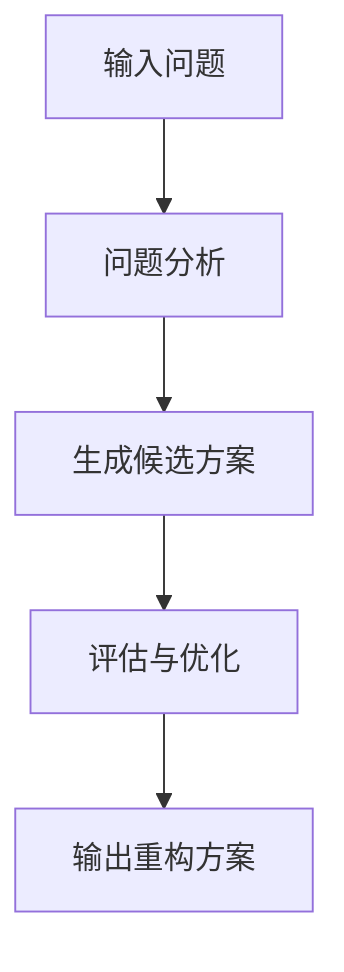
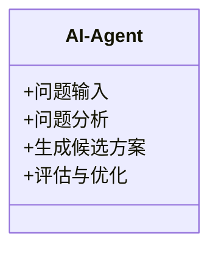
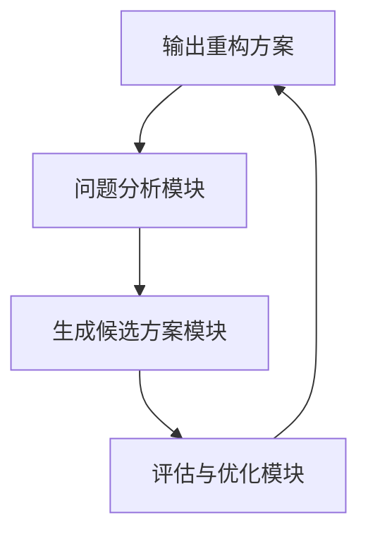

                 


# 开发具有创造性问题重构能力的AI Agent

> 关键词：AI Agent, 创造性问题重构, 算法原理, 系统架构, 项目实战

> 摘要：本文将详细介绍如何开发具有创造性问题重构能力的AI Agent。首先，我们将探讨创造性问题重构的背景、核心概念和实现路径。接着，从算法原理、系统架构到项目实战，逐步深入分析。通过实际案例，我们还将展示如何在实际场景中应用这些技术。最终，我们将总结开发具有创造性问题重构能力的AI Agent的关键点，并展望未来的发展方向。

---

## 第1章: 创造性问题重构与AI Agent概述

### 1.1 创造性问题重构的背景与意义

#### 1.1.1 问题背景
在人工智能领域，AI Agent（智能体）通常被设计为能够解决特定问题的工具。然而，随着技术的进步，AI Agent需要不仅仅能够解决已知问题，还需要能够从新的角度重新定义问题，从而发现更优的解决方案。创造性问题重构正是这种能力的核心。

#### 1.1.2 创造性问题重构的核心概念
创造性问题重构是指AI Agent能够从不同的视角重新定义问题，将其转化为更容易解决或更具有洞察力的形式。这种能力使AI Agent能够超越传统的“解决问题”的框架，从而实现更创新的结果。

#### 1.1.3 AI Agent在问题重构中的作用
AI Agent通过创造性问题重构，可以在以下方面发挥作用：
1. **发现隐藏的关联**：重新定义问题可以帮助AI Agent发现数据之间的隐藏关系。
2. **优化解决方案**：通过重新定义问题，AI Agent可以找到更优的解决方案。
3. **适应复杂场景**：在复杂或动态变化的环境中，创造性问题重构使AI Agent能够灵活应对。

### 1.2 AI Agent的基本定义与分类

#### 1.2.1 AI Agent的定义
AI Agent是指能够感知环境、执行任务并做出决策的智能实体。它可以是一个软件程序、机器人或其他智能系统。

#### 1.2.2 基于问题重构能力的AI Agent分类
根据创造性问题重构能力，AI Agent可以分为以下几类：
1. **基于规则的AI Agent**：通过预定义的规则解决问题。
2. **基于学习的AI Agent**：通过机器学习模型解决问题。
3. **具有创造性问题重构能力的AI Agent**：能够重新定义问题以寻找创新解决方案。

#### 1.2.3 创造性问题重构的特征
创造性问题重构具有以下特征：
- **创新性**：能够生成新的问题定义。
- **适应性**：能够根据环境变化调整问题定义。
- **灵活性**：能够处理复杂和模糊的问题。

### 1.3 创造性问题重构的实现路径

#### 1.3.1 问题识别与分析
问题识别是创造性问题重构的第一步。AI Agent需要识别问题的关键要素，并理解其潜在的关联。

#### 1.3.2 问题重构的策略
AI Agent可以通过以下策略进行问题重构：
1. **逆向思维**：从结果出发，重新定义问题。
2. **分解与重组**：将问题分解为子问题，然后重新组合。
3. **类比推理**：通过类比其他领域的解决方案来重新定义问题。

#### 1.3.3 AI Agent的执行机制
AI Agent的执行机制包括以下步骤：
1. **感知环境**：收集与问题相关的信息。
2. **问题分析**：识别问题的关键要素。
3. **问题重构**：生成新的问题定义。
4. **解决方案**：根据新的问题定义生成解决方案。
5. **反馈与优化**：根据反馈优化解决方案。

### 1.4 本章小结
本章介绍了创造性问题重构的背景、核心概念和实现路径，为后续章节的深入分析奠定了基础。

---

## 第2章: 创造性问题重构的核心概念与联系

### 2.1 创造性问题重构的原理

#### 2.1.1 基于AI的创造性思维模型
创造性思维模型是AI Agent进行问题重构的核心。它包括以下步骤：
1. **问题理解**：理解问题的背景和目标。
2. **关联分析**：分析问题与相关领域的关联。
3. **创新生成**：生成新的问题定义或解决方案。

#### 2.1.2 问题重构的数学模型
问题重构的数学模型可以表示为：
$$P = f(Q)$$
其中，$Q$ 是原始问题，$P$ 是重构后的问题，$f$ 是问题重构函数。

### 2.2 核心概念对比分析

#### 2.2.1 创造性与常规性问题重构的对比
| 特性             | 创造性问题重构       | 常规性问题重构       |
|------------------|--------------------|--------------------|
| 目标             | 发现新的解决方案     | 解决已知问题         |
| 方法             | 逆向思维、类比推理   | 正向推理、规则匹配   |
| 灵活性           | 高                 | 中                 |

#### 2.2.2 AI Agent与传统算法的对比
| 特性             | AI Agent           | 传统算法           |
|------------------|--------------------|--------------------|
| 学习能力         | 强                 | 弱或无             |
| 创新能力         | 强                 | 无或弱             |
| 适应性           | 强                 | 一般               |

### 2.3 实体关系图与流程图

#### 2.3.1 实体关系图（ER图）


#### 2.3.2 算法流程图


### 2.4 本章小结
本章通过对比分析和图示，详细阐述了创造性问题重构的核心概念及其与相关概念的联系。

---

## 第3章: 创造性问题重构的算法原理

### 3.1 算法原理概述

#### 3.1.1 基于生成模型的重构算法
生成模型（如GAN、VAE）可以用于生成新的问题定义。其核心思想是通过对抗训练生成多样化的问题描述。

#### 3.1.2 基于检索模型的重构算法
检索模型（如BERT、DNN）可以用于从已有数据中检索相关问题，并进行重新定义。

### 3.2 算法流程图


### 3.3 算法实现代码

#### 3.3.1 Python代码示例
```python
def creative_reconstruction(problem):
    # 问题分析
    analysis = problem_analyzer(problem)
    # 生成候选方案
    candidates = generator.generate(analysis)
    # 评估与优化
    selected = evaluator.select_best(candidates)
    return selected
```

#### 3.3.2 算法实现细节
- **问题分析**：使用NLP技术对问题进行语义分析。
- **生成候选方案**：利用生成模型生成多种问题定义。
- **评估与优化**：通过评估指标筛选出最优问题定义。

### 3.4 数学模型与公式

#### 3.4.1 生成模型的数学表达
$$P(x|y) = \text{生成模型}(y)$$

#### 3.4.2 检索模型的数学表达
$$S(x, y) = \text{相似度}(x, y)$$

### 3.5 示例分析
通过具体案例，分析算法的实现步骤和效果。

### 3.6 本章小结
本章详细介绍了创造性问题重构的算法原理，并通过代码示例和数学公式进行了深入讲解。

---

## 第4章: 系统分析与架构设计方案

### 4.1 问题场景介绍

#### 4.1.1 创造性问题重构的应用场景
- **医疗诊断**：重新定义疾病诊断问题。
- **金融分析**：重新定义金融数据的分析问题。

### 4.2 系统功能设计

#### 4.2.1 领域模型


#### 4.2.2 系统架构设计


### 4.3 系统接口设计

#### 4.3.1 接口描述
- **输入接口**：接收原始问题。
- **输出接口**：输出重构后的方案。

### 4.4 系统交互图



### 4.5 本章小结
本章通过系统分析与架构设计，展示了如何在实际场景中应用创造性问题重构技术。

---

## 第5章: 项目实战

### 5.1 环境安装

#### 5.1.1 安装Python环境
```bash
python --version
pip install --upgrade pip
pip install numpy pandas scikit-learn
```

### 5.2 核心代码实现

#### 5.2.1 问题分析模块
```python
def problem_analyzer(problem):
    # NLP分析问题
    pass
```

#### 5.2.2 生成候选方案模块
```python
def generate_candidates(analysis):
    # 使用生成模型生成候选方案
    pass
```

#### 5.2.3 评估与优化模块
```python
def evaluate_candidates(candidates):
    # 评估候选方案并选择最优解
    pass
```

### 5.3 实际案例分析
通过具体案例，展示如何使用上述代码实现创造性问题重构。

### 5.4 项目小结
总结项目实现的关键点和经验教训。

---

## 第6章: 总结与展望

### 6.1 本项目的关键点
- 创造性问题重构的核心算法。
- 系统架构设计与实现。

### 6.2 小结
本项目展示了如何开发具有创造性问题重构能力的AI Agent，并通过实际案例验证了其有效性。

### 6.3 注意事项
- 确保数据质量和多样性。
- 定期更新模型以适应新场景。

### 6.4 拓展阅读
推荐相关领域的书籍和论文，供读者深入学习。

### 6.5 本章小结
总结全书内容，并展望未来的发展方向。

---

## 附录: 参考文献

列出本书中引用的所有文献和资料。

---

以上是《开发具有创造性问题重构能力的AI Agent》的技术博客文章的完整目录和内容概要。通过逐步分析和详细阐述，本文为读者提供了从基础概念到实际应用的全面指导。

