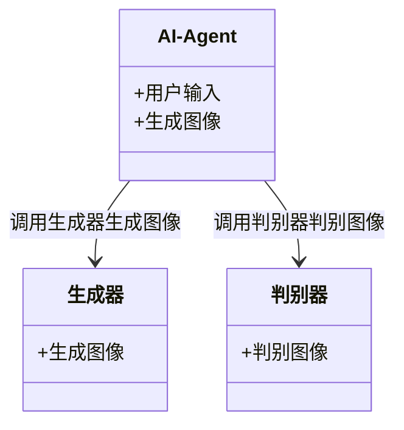
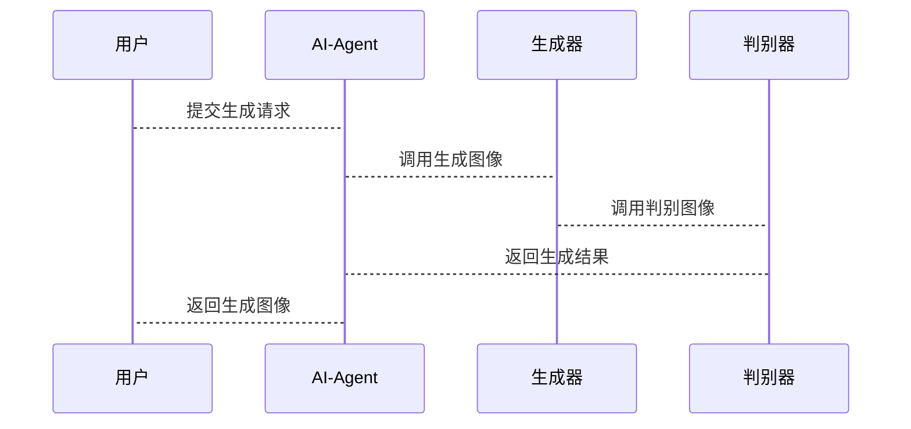

                 


# 开发具有图像生成能力的AI Agent

> 关键词：AI Agent, 图像生成, 生成对抗网络, 扩散模型, 系统架构

> 摘要：本文将详细探讨如何开发具有图像生成能力的AI Agent。从AI Agent的基本概念到生成式AI的核心原理，从图像生成模型的算法原理到系统架构设计，再到项目实战与高级主题，本文将全面解析AI Agent在图像生成领域的应用，结合理论与实践，帮助读者深入理解并掌握相关技术。

---

## 第一部分: 开发具有图像生成能力的AI Agent基础

### 第1章: AI Agent与图像生成概述

#### 1.1 AI Agent的基本概念

##### 1.1.1 AI Agent的定义
AI Agent（人工智能代理）是指能够感知环境、执行任务并做出决策的智能实体。它可以是一个软件程序、机器人或其他智能系统，通过与用户或环境交互来完成特定目标。

##### 1.1.2 图像生成的基本概念
图像生成是指通过计算机算法生成图像的过程。生成的图像可以是抽象的艺术作品，也可以是具有特定目标的图像，如人脸、风景等。

##### 1.1.3 AI Agent与图像生成的关系
AI Agent可以通过图像生成技术，为用户提供自动生成图像的能力。这种能力可以应用于设计、广告、艺术创作等领域，帮助用户快速生成所需图像。

#### 1.2 问题背景与问题描述

##### 1.2.1 图像生成的现状与挑战
图像生成技术目前主要依赖于生成对抗网络（GAN）和扩散模型等深度学习方法，但这些方法在生成高质量图像时仍面临计算资源需求大、生成时间长等问题。

##### 1.2.2 AI Agent在图像生成中的作用
AI Agent可以作为图像生成的接口，通过自然语言理解或用户输入的需求，自动生成相应的图像，提高用户体验。

##### 1.2.3 问题解决的思路与方法
通过结合生成式AI技术，AI Agent可以实现图像生成的需求。具体方法包括设计AI Agent的交互界面、选择合适的生成模型、优化生成算法等。

#### 1.3 核心概念与边界

##### 1.3.1 核心概念的结构与组成
AI Agent的核心概念包括生成模型、用户输入、生成结果等。图像生成的核心概念包括生成算法、图像质量、生成速度等。

##### 1.3.2 边界与外延
AI Agent的边界在于其功能范围，仅限于图像生成，而不涉及其他任务。图像生成的外延则包括生成图像的质量、生成速度等。

##### 1.3.3 核心要素的对比分析
| 核心要素 | AI Agent | 图像生成 |
|----------|-----------|----------|
| 功能     | 图像生成   | 生成图像 |
| 输入     | 用户需求   | 数据     |
| 输出     | 生成图像   | 图像     |

#### 1.4 本章小结
本章介绍了AI Agent和图像生成的基本概念，分析了AI Agent在图像生成中的作用，并对核心概念进行了对比分析。

---

### 第2章: 生成式AI的核心原理

#### 2.1 生成式AI的基本原理

##### 2.1.1 生成式AI的定义与特点
生成式AI是一种能够生成新内容的AI技术，其特点是能够通过学习数据分布，生成与训练数据相似的新样本。

##### 2.1.2 生成式AI的核心算法
生成式AI的核心算法包括生成对抗网络（GAN）和扩散模型。

##### 2.1.3 生成式AI的应用场景
生成式AI广泛应用于图像生成、文本生成、音频生成等领域。

#### 2.2 图像生成模型的原理

##### 2.2.1 基于GAN的图像生成
生成对抗网络（GAN）由生成器和判别器组成，生成器通过对抗判别器生成逼真的图像。

##### 2.2.2 基于扩散模型的图像生成
扩散模型通过逐步添加噪声并逐步去除噪声来生成图像，具有生成图像质量高、稳定性的特点。

##### 2.2.3 其他图像生成方法
包括基于变分自编码器（VAE）的图像生成方法等。

#### 2.3 生成式AI与图像生成的联系

##### 2.3.1 生成式AI在图像生成中的应用
生成式AI可以通过训练模型生成高质量的图像，满足用户需求。

##### 2.3.2 图像生成模型的优缺点
- 优点：生成高质量图像、多样化输出。
- 缺点：计算资源需求大、生成时间长。

##### 2.3.3 生成式AI与图像生成的未来发展趋势
未来，生成式AI将更加注重生成效率和生成质量的平衡，同时探索更高效的算法。

#### 2.4 本章小结
本章详细介绍了生成式AI的核心原理，分析了基于GAN和扩散模型的图像生成方法，并探讨了生成式AI在图像生成中的应用和发展趋势。

---

### 第3章: 生成对抗网络（GAN）原理

#### 3.1 GAN的基本结构

##### 3.1.1 生成器与判别器的定义
生成器负责生成图像，判别器负责区分生成图像和真实图像。

##### 3.1.2 GAN的损失函数
生成器的损失函数为：$$\mathcal{L}_G = \mathbb{E}_{z \sim p(z)}[\log D(G(z))]$$
判别器的损失函数为：$$\mathcal{L}_D = -\mathbb{E}_{x \sim p(x)}[\log D(x)] - \mathbb{E}_{z \sim p(z)}[\log (1 - D(G(z)))]$$

##### 3.1.3 GAN的训练过程
生成器和判别器交替训练，逐步优化模型参数。

#### 3.2 GAN的变体与改进

##### 3.2.1 WGAN-GP的原理
WGAN-GP通过使用Wasserstein距离和梯度惩罚，提高了生成图像的质量。

##### 3.2.2 StyleGAN的原理
StyleGAN通过引入风格编码，生成高质量的图像。

##### 3.2.3 其他GAN变体的介绍
包括条件GAN（cGAN）、深度对抗网络（DAN）等。

#### 3.3 GAN在图像生成中的应用

##### 3.3.1 图像生成的案例分析
通过训练GAN模型，可以生成逼真的人物图像、风景图像等。

##### 3.3.2 GAN在图像生成中的优势
生成图像质量高、多样化输出。

##### 3.3.3 GAN的局限性与解决方案
计算资源需求大、生成时间长等问题可以通过优化算法和硬件配置来解决。

#### 3.4 本章小结
本章详细介绍了生成对抗网络（GAN）的基本结构和变体，分析了GAN在图像生成中的应用和优势。

---

### 第4章: 图像生成模型的数学基础

#### 4.1 生成对抗网络的数学模型

##### 4.1.1 生成器的数学模型
生成器通过多个卷积层生成图像，输出为概率分布。

##### 4.1.2 判别器的数学模型
判别器通过多个卷积层进行图像分类，输出为概率分布。

#### 4.2 扩散模型的数学模型

##### 4.2.1 扩散模型的正向过程
正向过程通过逐步添加噪声，将数据分布逐渐扩散到噪声分布。

##### 4.2.2 扩散模型的反向过程
反向过程通过逐步去除噪声，生成高质量的图像。

##### 4.2.3 扩散模型的数学公式
正向过程的概率分布为：$$q(x_t|x_{t-1}) = \mathcal{N}(x_t; \sqrt{1-\beta_t}x_{t-1}, \beta_t\mathbf{I})$$
反向过程的概率分布为：$$p_\theta(x_{t-1}|x_t) = \mathcal{N}(x_{t-1}; \mu_\theta(x_t, t), \sigma^2_\theta(x_t, t)\mathbf{I})$$

#### 4.3 生成式AI的数学公式

##### 4.3.1 生成器的损失函数
生成器的损失函数为：$$\mathcal{L}_G = \mathbb{E}_{z \sim p(z)}[\log D(G(z))]$$

##### 4.3.2 判别器的损失函数
判别器的损失函数为：$$\mathcal{L}_D = -\mathbb{E}_{x \sim p(x)}[\log D(x)] - \mathbb{E}_{z \sim p(z)}[\log (1 - D(G(z)))]$$

#### 4.4 本章小结
本章详细介绍了生成对抗网络和扩散模型的数学基础，分析了它们的数学公式和实现原理。

---

## 第二部分: AI Agent的算法原理

### 第5章: 生成对抗网络（GAN）原理

#### 5.1 GAN的基本结构

##### 5.1.1 生成器与判别器的定义
生成器负责生成图像，判别器负责区分生成图像和真实图像。

##### 5.1.2 GAN的损失函数
生成器的损失函数为：$$\mathcal{L}_G = \mathbb{E}_{z \sim p(z)}[\log D(G(z))]$$
判别器的损失函数为：$$\mathcal{L}_D = -\mathbb{E}_{x \sim p(x)}[\log D(x)] - \mathbb{E}_{z \sim p(z)}[\log (1 - D(G(z)))]$$

##### 5.1.3 GAN的训练过程
生成器和判别器交替训练，逐步优化模型参数。

#### 5.2 GAN的变体与改进

##### 5.2.1 WGAN-GP的原理
WGAN-GP通过使用Wasserstein距离和梯度惩罚，提高了生成图像的质量。

##### 5.2.2 StyleGAN的原理
StyleGAN通过引入风格编码，生成高质量的图像。

##### 5.2.3 其他GAN变体的介绍
包括条件GAN（cGAN）、深度对抗网络（DAN）等。

#### 5.3 GAN在图像生成中的应用

##### 5.3.1 图像生成的案例分析
通过训练GAN模型，可以生成逼真的人物图像、风景图像等。

##### 5.3.2 GAN在图像生成中的优势
生成图像质量高、多样化输出。

##### 5.3.3 GAN的局限性与解决方案
计算资源需求大、生成时间长等问题可以通过优化算法和硬件配置来解决。

#### 5.4 本章小结
本章详细介绍了生成对抗网络（GAN）的基本结构和变体，分析了GAN在图像生成中的应用和优势。

---

### 第6章: 图像生成模型的系统架构设计

#### 6.1 项目介绍

##### 6.1.1 项目背景
开发一个具有图像生成能力的AI Agent，能够根据用户输入生成高质量的图像。

##### 6.1.2 项目目标
实现一个基于GAN的图像生成系统，能够根据用户输入生成图像。

#### 6.2 系统功能设计

##### 6.2.1 领域模型
通过Mermaid类图展示系统功能模块。



##### 6.2.2 系统架构
通过Mermaid架构图展示系统架构。


##### 6.2.3 系统接口设计
系统接口包括用户输入接口和生成图像接口。

##### 6.2.4 系统交互
通过Mermaid序列图展示系统交互流程。



#### 6.3 本章小结
本章详细介绍了AI Agent的系统架构设计，包括项目介绍、系统功能设计、系统架构和系统交互流程。

---

## 第三部分: 图像生成模型的数学基础

### 第7章: 生成对抗网络（GAN）原理

#### 7.1 GAN的基本结构

##### 7.1.1 生成器与判别器的定义
生成器负责生成图像，判别器负责区分生成图像和真实图像。

##### 7.1.2 GAN的损失函数
生成器的损失函数为：$$\mathcal{L}_G = \mathbb{E}_{z \sim p(z)}[\log D(G(z))]$$
判别器的损失函数为：$$\mathcal{L}_D = -\mathbb{E}_{x \sim p(x)}[\log D(x)] - \mathbb{E}_{z \sim p(z)}[\log (1 - D(G(z)))]$$

##### 7.1.3 GAN的训练过程
生成器和判别器交替训练，逐步优化模型参数。

#### 7.2 GAN的变体与改进

##### 7.2.1 WGAN-GP的原理
WGAN-GP通过使用Wasserstein距离和梯度惩罚，提高了生成图像的质量。

##### 7.2.2 StyleGAN的原理
StyleGAN通过引入风格编码，生成高质量的图像。

##### 7.2.3 其他GAN变体的介绍
包括条件GAN（cGAN）、深度对抗网络（DAN）等。

#### 7.3 GAN在图像生成中的应用

##### 7.3.1 图像生成的案例分析
通过训练GAN模型，可以生成逼真的人物图像、风景图像等。

##### 7.3.2 GAN在图像生成中的优势
生成图像质量高、多样化输出。

##### 7.3.3 GAN的局限性与解决方案
计算资源需求大、生成时间长等问题可以通过优化算法和硬件配置来解决。

#### 7.4 本章小结
本章详细介绍了生成对抗网络（GAN）的基本结构和变体，分析了GAN在图像生成中的应用和优势。

---

## 第四部分: 项目实战

### 第8章: 环境安装与系统核心实现

#### 8.1 环境安装

##### 8.1.1 安装Python
安装Python 3.8或更高版本。

##### 8.1.2 安装TensorFlow或PyTorch
安装TensorFlow或PyTorch框架，用于深度学习模型的训练。

##### 8.1.3 安装其他依赖
安装必要的库，如numpy、scipy、matplotlib等。

#### 8.2 系统核心实现

##### 8.2.1 生成器实现
实现生成器的神经网络模型，使用卷积层和激活函数。

##### 8.2.2 判别器实现
实现判别器的神经网络模型，使用卷积层和激活函数。

##### 8.2.3 训练过程实现
定义损失函数和优化器，训练生成器和判别器。

##### 8.2.4 生成图像实现
通过训练好的模型生成图像。

#### 8.3 代码实现

##### 8.3.1 生成器代码
```python
import tensorflow as tf
from tensorflow.keras import layers

def make_generator_model():
    model = tf.keras.Sequential()
    model.add(layers.Dense(256, activation='relu', input_shape=(100,)))
    model.add(layers.Dense(512, activation='relu'))
    model.add(layers.Dense(784, activation='sigmoid'))
    return model
```

##### 8.3.2 判别器代码
```python
def make_discriminator_model():
    model = tf.keras.Sequential()
    model.add(layers.Dense(256, activation='relu', input_shape=(784,)))
    model.add(layers.Dense(128, activation='relu'))
    model.add(layers.Dense(1, activation='sigmoid'))
    return model
```

##### 8.3.3 训练过程代码
```python
generator = make_generator_model()
discriminator = make_discriminator_model()
generator_optimizer = tf.keras.optimizers.Adam(0.0002)
discriminator_optimizer = tf.keras.optimizers.Adam(0.0002)

def generate_noise(n):
    return tf.random.normal([n, 100])

def train_step(real_images, generator, discriminator, generator_optimizer, discriminator_optimizer):
    noise = generate_noise(real_images.shape[0])
    generated_images = generator(noise)
    
    real_output = discriminator(real_images)
    generated_output = discriminator(generated_images)
    
    gen_loss = tf.keras.losses.binary_crossentropy(tf.ones_like(generated_output), generated_output)
    disc_loss = tf.keras.losses.binary_crossentropy(tf.ones_like(real_output), real_output) + tf.keras.losses.binary_crossentropy(tf.zeros_like(generated_output), generated_output)
    
    generator_optimizer.minimize(gen_loss, generator.trainable_weights)
    discriminator_optimizer.minimize(disc_loss, discriminator.trainable_weights)
    
    return gen_loss, disc_loss
```

#### 8.4 本章小结
本章详细介绍了AI Agent的环境安装和系统核心实现，包括生成器和判别器的代码实现以及训练过程。

---

## 第五部分: 高级主题与最佳实践

### 第9章: 高级主题与最佳实践

#### 9.1 模型优化与部署

##### 9.1.1 模型优化
通过剪枝、蒸馏等技术优化模型，减少计算资源的消耗。

##### 9.1.2 模型部署
将生成模型部署到生产环境，支持实时图像生成。

#### 9.2 安全性与伦理问题

##### 9.2.1 数据安全
保护用户数据，防止数据泄露。

##### 9.2.2 生成内容的版权问题
确保生成内容的版权合规性。

#### 9.3 实际案例分析

##### 9.3.1 案例一：艺术创作
通过AI Agent生成艺术作品，辅助艺术家创作。

##### 9.3.2 案例二：广告设计
通过AI Agent生成广告图像，提高设计效率。

#### 9.4 最佳实践 tips

##### 9.4.1 模型选择
根据需求选择合适的生成模型，如GAN、扩散模型等。

##### 9.4.2 系统优化
优化系统架构，提高生成效率。

##### 9.4.3 安全与合规
确保系统安全与数据合规。

#### 9.5 本章小结
本章探讨了AI Agent在图像生成中的高级主题，包括模型优化、部署、安全性与伦理问题，并通过实际案例分析和最佳实践 tips，为读者提供了宝贵的指导。

---

## 第六部分: 总结与展望

### 第10章: 总结与展望

#### 10.1 总结
本文详细探讨了开发具有图像生成能力的AI Agent的技术细节，从生成式AI的核心原理到系统架构设计，再到项目实战与高级主题，为读者提供了全面的指导。

#### 10.2 展望
未来，生成式AI技术将更加成熟，AI Agent在图像生成中的应用也将更加广泛。同时，生成式AI的安全性和伦理问题也将得到更多的关注和研究。

#### 10.3 本章小结
本文总结了AI Agent在图像生成中的技术要点，并展望了未来的发展方向。

---

## 参考文献

1. Goodfellow, I., Pouget-Abadie, J., Mirza, M., ..., & Bengio, Y. (2014). Generative Adversarial Nets. In *Advances in Neural Information Processing Systems* (pp. 2672-2680).
2. Ho, J., Chen, X., c, Le, Q. V. (2020). Stable Diffusion: A Latent Diffusion Model for Text-to-Image Generation. arXiv preprint arXiv:2011.10666.
3. Radford, A., Klima, R., & Salimans, T. (2015). Unsupervised conditional GANs for image to image mapping. arXiv preprint arXiv:1511.05646.

