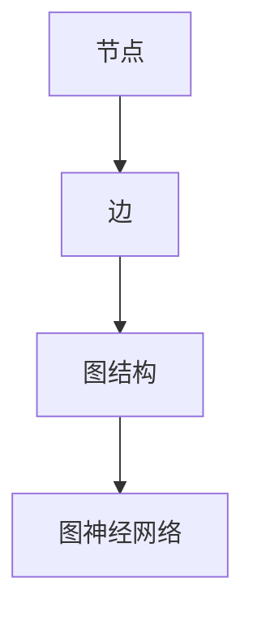
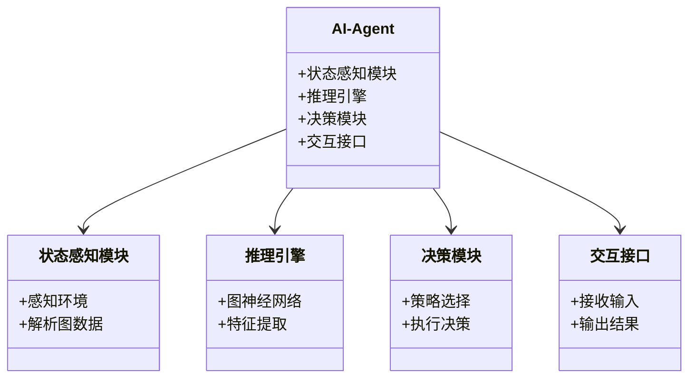
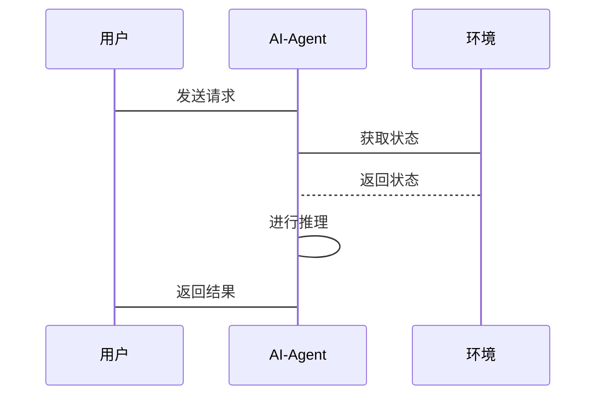

                 


# 《开发具有图神经网络能力的AI Agent》

---

## 关键词
AI Agent, 图神经网络, 图卷积网络, 图注意力网络, 人工智能, 智能系统, 图数据建模

---

## 摘要
本文详细探讨了如何开发具有图神经网络能力的AI Agent。首先介绍了AI Agent的基本概念和图神经网络的核心原理，分析了图神经网络在AI Agent中的应用价值。接着，深入讲解了图卷积网络（GCN）和图注意力网络（GAT）的算法原理，并通过实例展示了它们在实际项目中的应用。随后，详细阐述了AI Agent的系统设计与架构，包括系统需求分析、架构设计、接口设计和交互设计。最后，通过一个实际项目案例，展示了如何利用图神经网络构建AI Agent，并总结了开发过程中的经验和最佳实践。

---

## 正文

---

### 第一部分: AI Agent与图神经网络基础

#### 第1章: AI Agent与图神经网络概述

##### 1.1 AI Agent的基本概念
- **AI Agent的定义**：AI Agent是一种能够感知环境、自主决策并执行任务的智能实体。它可以是软件程序，也可以是物理设备，通过与环境交互来实现目标。
- **AI Agent的分类**：
  - **简单反射型Agent**：基于当前状态做出反应，不依赖历史信息。
  - **基于模型的反射型Agent**：利用内部模型和历史信息进行决策。
  - **目标驱动型Agent**：根据目标选择最优行动。
  - **效用驱动型Agent**：通过最大化效用函数来优化决策。
- **图神经网络的核心概念**：图神经网络是一种处理图结构数据的深度学习模型，能够通过节点之间的关系进行特征传播和学习。
- **结合的意义**：通过图神经网络，AI Agent能够更好地理解和处理复杂的网络关系，提升决策的准确性和实时性。

##### 1.2 图神经网络的基本原理
- **图的表示与建模**：图由节点和边组成，节点表示实体，边表示实体之间的关系。图可以表示为$G = (V, E)$，其中$V$是节点集合，$E$是边集合。
- **节点表示学习**：通过图神经网络对节点进行编码，生成低维特征向量，表示节点的语义信息。
- **边与关系建模**：边的权重反映了节点之间关系的强度，可以通过注意力机制动态调整权重。

##### 1.3 AI Agent的典型应用场景
- **智能推荐系统**：通过图神经网络建模用户-商品关系，推荐个性化产品。
- **智能对话系统**：构建对话图，分析对话上下文，生成更自然的回复。
- **复杂网络中的决策与推理**：在社交网络、交通网络等场景中，AI Agent能够快速分析网络结构，做出最优决策。

##### 1.4 本章小结
本章介绍了AI Agent的基本概念和图神经网络的核心原理，分析了它们在实际场景中的应用价值，为后续章节的深入探讨奠定了基础。

---

#### 第2章: 图神经网络的核心概念与联系

##### 2.1 图神经网络的核心原理
- **图的数学表示**：图由节点和边组成，可以表示为$G = (V, E)$，其中$V = \{v_1, v_2, \dots, v_n\}$，$E = \{e_1, e_2, \dots, e_m\}$。
- **节点表示的数学模型**：节点表示是一个映射函数$f: V \rightarrow \mathbb{R}^d$，将节点映射到$d$维空间。
- **图结构的特征提取**：通过聚合和聚合操作，将局部节点特征传播到全局，生成图级表示。

##### 2.2 图神经网络的关键属性对比
| **属性**       | **图神经网络**                          | **传统神经网络**                         |
|-----------------|----------------------------------------|------------------------------------------|
| 数据结构        | 图结构，节点间有关系                   | 标量、向量或序列数据                     |
| 节点关系        | 节点间有复杂的依赖关系                 | 节点间无序或独立                        |
| 动态性           | 节点关系动态变化                       | 静态特征                               |
| 可解释性        | 较低                                   | 较低                                   |

##### 2.3 图神经网络的ER实体关系图


##### 2.4 本章小结
本章详细讲解了图神经网络的核心原理，通过对比分析和ER实体关系图，帮助读者更好地理解图神经网络的特性和应用场景。

---

### 第二部分: 图神经网络的算法原理

#### 第3章: 图神经网络的算法原理

##### 3.1 图卷积网络（GCN）算法
- **GCN的基本原理**：GCN通过聚合相邻节点的特征，将局部信息传播到整个图中。其核心操作是卷积，即$y = \sigma(A X X^T)$，其中$A$是邻接矩阵，$X$是节点特征矩阵，$\sigma$是激活函数。
- **GCN的数学模型**
  - 输入：邻接矩阵$A$，节点特征矩阵$X$。
  - 输出：节点的表示$Y$。
  - 步骤：
    1. 计算$A X$，得到节点的邻居特征。
    2. 应用激活函数$\sigma$，得到最终节点表示。
  - 流程图：
  ```mermaid
  graph TD
      A[输入图] --> B[卷积操作]
      B --> C[输出特征]
  ```

##### 3.2 图注意力网络（GAT）算法
- **GAT的基本原理**：GAT通过注意力机制动态调整边的权重，捕捉节点之间的长距离依赖关系。
- **GAT的注意力机制**
  - 注意力权重计算：
  $$\alpha_{ij} = \frac{e^{q_i^T k_j}}{\sum_{k} e^{q_i^T k_j}}$$
  其中，$q_i$是查询向量，$k_j$是键向量。
  - 加权特征聚合：
  $$v_i = \sum_{j} \alpha_{ij} h_j$$
  - 流程图：
  ```mermaid
  graph TD
      A[输入图] --> B[注意力计算]
      B --> C[加权特征聚合]
  ```

##### 3.3 本章小结
本章详细讲解了GCN和GAT的算法原理，通过数学公式和流程图展示了它们的实现过程，帮助读者理解图神经网络的核心技术。

---

### 第三部分: AI Agent的系统设计与架构

#### 第4章: AI Agent的系统设计

##### 4.1 系统需求分析
- **功能需求**：
  - 实时感知环境状态。
  - 基于图神经网络进行推理和决策。
  - 与外部系统交互。
- **性能需求**：
  - 响应时间<1s。
  - 高可用性。
- **约束条件**：
  - 低资源消耗。
  - 高可扩展性。

##### 4.2 系统架构设计


##### 4.3 系统接口设计
- **输入接口**：
  - 支持多种数据格式（JSON、XML）。
  - 提供RESTful API。
- **输出接口**：
  - 返回决策结果。
  - 提供日志输出。

##### 4.4 系统交互设计


##### 4.5 本章小结
本章详细分析了AI Agent的系统设计与架构，通过类图和序列图展示了系统的模块划分和交互流程，为后续的实现提供了指导。

---

### 第四部分: 项目实战

#### 第5章: 图神经网络驱动的AI Agent开发

##### 5.1 项目介绍
- **项目目标**：开发一个基于图神经网络的AI Agent，实现智能推荐系统。
- **项目背景**：在电商场景中，用户与商品的关系可以用图表示，通过图神经网络推荐商品。

##### 5.2 核心实现
- **环境搭建**：
  - 安装Python 3.8+。
  - 安装PyTorch、PyG等库。
- **代码实现**：
  ```python
  import torch
  from torch import nn
  from torch.nn import functional as F
  from torch_geometric.data import Data
  from torch_geometric.nn import GCNConv

  class GAT(nn.Module):
      def __init__(self, input_dim, hidden_dim, output_dim):
          super(GAT, self).__init__()
          self.conv1 = GCNConv(input_dim, hidden_dim)
          self.conv2 = GCNConv(hidden_dim, output_dim)
          self.relu = nn.ReLU()
          self.dropout = nn.Dropout(0.5)

      def forward(self, x, edge_index):
          x = self.conv1(x, edge_index)
          x = self.relu(x)
          x = self.dropout(x)
          x = self.conv2(x, edge_index)
          return x

  # 示例数据
  x = torch.randn(4, 32)  # 4个节点，32维特征
  edge_index = torch.tensor([[0,1,2,3], [1,2,3,0]], dtype=torch.long)
  model = GAT(32, 16, 1)
  output = model(x, edge_index)
  print(output)
  ```

##### 5.3 代码解读与分析
- **模型定义**：定义了一个两层的GCN网络，每层使用GCNConv层进行卷积操作，激活函数为ReLU，Dropout用于防止过拟合。
- **数据输入**：输入特征矩阵$x$和边索引$edge_index$。
- **模型输出**：输出节点的表示，维度为$4 \times 1$。

##### 5.4 实际案例分析
- **案例背景**：电商场景中，用户与商品的关系可以用图表示。
- **数据构建**：
  - 用户节点：4个用户。
  - 商品节点：4个商品。
  - 边：用户-商品的购买关系。
- **模型训练**：使用用户行为数据训练模型，生成用户偏好向量。
- **推理过程**：根据用户的偏好向量，推荐商品。

##### 5.5 本章小结
本章通过实际项目展示了如何利用图神经网络开发AI Agent，并详细解读了核心代码，帮助读者理解实现过程。

---

### 第五部分: 总结与展望

#### 第6章: 总结与展望

##### 6.1 总结
本文详细探讨了如何开发具有图神经网络能力的AI Agent，从理论到实践，系统地讲解了图神经网络的核心原理、系统设计与架构，以及实际项目中的应用。

##### 6.2 展望
未来，随着图神经网络技术的不断发展，AI Agent将具备更强的推理能力和更高的决策精度。同时，结合边缘计算和分布式系统，AI Agent将在更多领域发挥重要作用。

##### 6.3 最佳实践Tips
- 在实际项目中，建议先进行小规模测试，验证模型的有效性。
- 注意模型的可解释性，避免黑箱决策。
- 定期更新模型，适应环境的变化。

---

## 结语
通过本文的详细讲解，读者可以全面理解如何开发具有图神经网络能力的AI Agent，并将其应用于实际场景中。希望本文能为相关领域的研究和实践提供有价值的参考。

