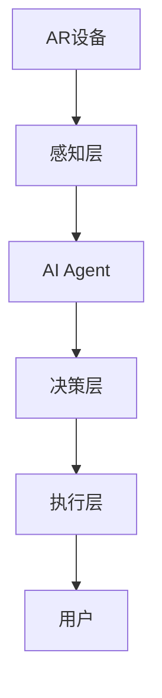
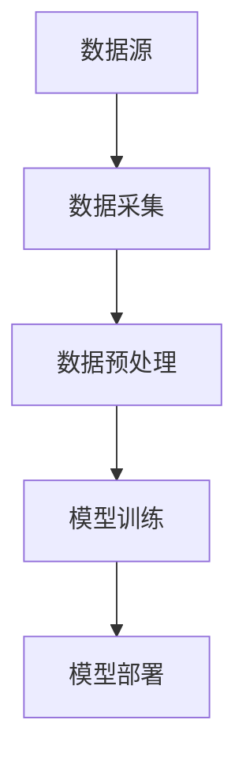
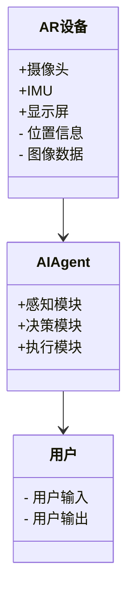
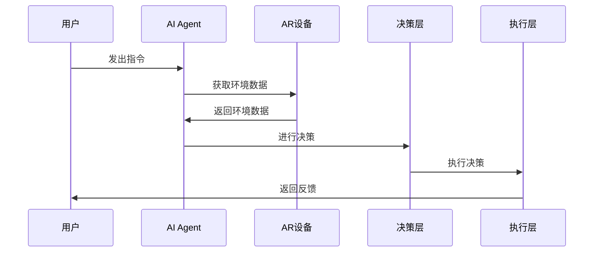

                 


# 开发具有增强现实能力的AI Agent

> 关键词：增强现实（AR）、人工智能（AI）、AI Agent、计算机视觉、深度学习、系统架构

> 摘要：本文将深入探讨开发具有增强现实能力的AI Agent的关键技术与方法。首先，我们将介绍增强现实和AI Agent的基本概念与背景，分析它们的协同工作原理。接着，我们将详细讲解增强现实与AI Agent的核心技术、算法原理和系统架构设计。最后，我们将通过一个实际项目案例，展示如何实现一个具备增强现实能力的AI Agent，并总结开发中的最佳实践与未来发展方向。

---

## 第1章: 增强现实与AI Agent的背景与基础

### 1.1 增强现实技术的现状与发展趋势

#### 1.1.1 增强现实的基本概念与技术原理
增强现实（Augmented Reality，AR）是一种通过计算机生成的虚拟信息叠加在现实世界上的技术。它通过将数字内容与真实环境相结合，为用户提供更加丰富的感知体验。AR的核心技术包括图像处理、空间定位与追踪、用户交互等。

- 图像处理：通过计算机视觉技术对真实环境进行分析和增强。
- 空间定位与追踪：利用摄像头、IMU等传感器实现对物体的定位与追踪。
- 用户交互：通过手势、语音等方式实现用户与虚拟内容的互动。

#### 1.1.2 增强现实的核心技术与实现方式
AR的实现依赖于多种技术的结合：

1. **图像处理**：包括图像分割、目标检测、图像识别等技术。
2. **空间定位与追踪**：通过SLAM（同时定位与地图构建）技术实现对物体的实时追踪。
3. **用户交互**：支持手势、语音、触觉等多种交互方式。

#### 1.1.3 增强现实的行业应用与未来发展
AR技术已经在游戏、教育、医疗、工业等多个领域得到广泛应用。随着技术的进步，未来的AR将更加智能化，与AI技术的结合将为用户提供更强大的功能。

### 1.2 AI Agent的基本概念与能力

#### 1.2.1 AI Agent的定义与分类
AI Agent（智能代理）是指能够感知环境、自主决策并采取行动的智能体。它可以分为以下几类：

1. **简单反射型**：基于规则的简单反应。
2. **基于模型的反应型**：基于内部模型进行决策。
3. **目标驱动型**：以目标为导向进行决策。
4. **效用驱动型**：通过效用函数进行优化决策。

#### 1.2.2 AI Agent的核心能力与功能模块
AI Agent的核心能力包括：

1. **感知能力**：通过传感器或数据源获取环境信息。
2. **决策能力**：基于感知信息进行推理和决策。
3. **执行能力**：通过执行机构采取行动。

#### 1.2.3 AI Agent与人类交互的方式
AI Agent可以通过以下方式与人类交互：

1. **文本交互**：通过自然语言处理技术实现对话。
2. **语音交互**：通过语音识别与合成技术实现语音交互。
3. **视觉交互**：通过计算机视觉技术实现视觉交互。

### 1.3 增强现实与AI Agent的结合

#### 1.3.1 增强现实与AI Agent的协同工作原理
AR为AI Agent提供了多维度的感知能力，而AI Agent则为AR提供了智能化的决策能力。两者的结合使得AI Agent能够更准确地理解环境并做出更智能的决策。

#### 1.3.2 增强现实能力对AI Agent的提升作用
1. **多模态感知**：通过AR技术，AI Agent可以同时获取视觉、听觉等多种感知信息。
2. **实时反馈**：AR技术可以实时将环境信息反馈给AI Agent，使其能够更快地做出反应。

#### 1.3.3 增强现实AI Agent的应用场景与潜力
1. **游戏娱乐**：例如AR游戏《Pokémon Go》。
2. **教育培训**：通过AR技术进行虚拟教学。
3. **工业应用**：例如在工业设备中使用AR进行故障诊断。

---

## 第2章: 增强现实与AI Agent的核心概念与联系

### 2.1 增强现实的核心技术与实现原理

#### 2.1.1 AR的图像处理技术
AR的图像处理技术包括图像分割、目标检测等。例如，使用深度学习模型YOLO进行目标检测，可以实现对现实环境中物体的识别与定位。

#### 2.1.2 AR的空间定位与追踪技术
AR的空间定位与追踪技术通过SLAM技术实现。例如，使用ORB-SLAM算法可以在复杂环境中实现高精度的定位与追踪。

#### 2.1.3 AR的用户交互技术
AR的用户交互技术包括手势识别、语音识别等。例如，使用Leap Motion进行手势识别，或者使用Google Cloud Speech API进行语音识别。

### 2.2 AI Agent的核心能力与算法原理

#### 2.2.1 AI Agent的感知能力
AI Agent的感知能力通过传感器或数据源获取环境信息。例如，使用摄像头获取图像信息，或者使用麦克风获取语音信息。

#### 2.2.2 AI Agent的决策与推理能力
AI Agent的决策与推理能力基于感知信息进行推理和决策。例如，使用强化学习算法进行决策，或者使用逻辑推理进行推理。

#### 2.2.3 AI Agent的自适应学习能力
AI Agent的自适应学习能力通过机器学习技术实现。例如，使用深度学习模型进行在线学习，或者使用强化学习模型进行离线学习。

### 2.3 增强现实与AI Agent的协同关系

#### 2.3.1 增强现实为AI Agent提供多维度感知能力
通过AR技术，AI Agent可以同时获取视觉、听觉等多种感知信息。例如，通过AR技术获取图像信息，通过语音识别技术获取语音信息。

#### 2.3.2 AI Agent为增强现实提供智能决策能力
通过AI Agent，增强现实系统可以实现智能化的决策与交互。例如，AI Agent可以根据用户的意图生成相应的AR内容。

#### 2.3.3 两者结合的系统架构与数据流关系
以下是增强现实与AI Agent结合的系统架构图：



---

## 第3章: 增强现实与AI Agent的数学模型与算法原理

### 3.1 增强现实中的图像处理算法

#### 3.1.1 图像分割的数学模型
图像分割可以通过深度学习模型实现。例如，使用U-Net模型进行图像分割。

$$
\text{U-Net模型的损失函数} = \text{交叉熵损失} + \text{Dice损失}
$$

#### 3.1.2 图像识别的深度学习模型
图像识别可以通过卷积神经网络（CNN）实现。例如，使用ResNet模型进行图像分类。

$$
\text{ResNet的输出} = \text{全局平均池化}(\text{卷积层输出})
$$

#### 3.1.3 图像增强的算法原理
图像增强可以通过随机数据增强技术实现。例如，使用数据增强库（如augmentor）进行图像旋转、缩放、裁剪等操作。

### 3.2 AI Agent中的决策算法

#### 3.2.1 基于强化学习的决策模型
强化学习是一种基于奖励机制的决策算法。例如，使用DQN算法进行决策。

$$
\text{DQN算法的Q值更新} = r + \gamma \max(Q(s', a'))
$$

#### 3.2.2 基于规则的决策系统
基于规则的决策系统通过预定义规则进行决策。例如，使用决策树进行分类。

#### 3.2.3 基于概率推理的决策方法
基于概率推理的决策方法通过概率模型进行决策。例如，使用贝叶斯网络进行推理。

$$
\text{贝叶斯网络的概率更新} = P(a|e) = \frac{P(e|a)P(a)}{P(e)}
$$

### 3.3 增强现实与AI Agent结合的算法流程

#### 3.3.1 数据采集与预处理流程
以下是数据采集与预处理流程图：



#### 3.3.2 多模态数据融合算法
多模态数据融合算法可以通过融合视觉、听觉等多种数据源实现更准确的决策。例如，使用融合模型进行多模态数据融合。

#### 3.3.3 智能决策与反馈机制
智能决策与反馈机制通过实时反馈优化决策过程。例如，使用强化学习算法进行实时反馈。

---

## 第4章: 增强现实与AI Agent的系统架构设计

### 4.1 系统功能需求分析

#### 4.1.1 增强现实功能模块
增强现实功能模块包括图像处理、空间定位与追踪等功能。

#### 4.1.2 AI Agent功能模块
AI Agent功能模块包括感知、决策、执行等功能。

#### 4.1.3 用户交互功能模块
用户交互功能模块包括手势识别、语音识别等功能。

### 4.2 项目介绍

#### 4.2.1 项目背景
本项目旨在开发一个具备增强现实能力的AI Agent，用于实现增强现实环境中的智能交互。

#### 4.2.2 项目目标
本项目的目标是实现一个具备增强现实能力的AI Agent，能够通过AR设备与用户进行智能交互。

### 4.3 系统功能设计

#### 4.3.1 领域模型
以下是领域模型类图：



#### 4.3.2 系统架构设计
以下是系统架构图：


#### 4.3.3 系统接口设计
系统接口设计包括AR设备与AI Agent之间的接口、AI Agent与用户之间的接口等。

#### 4.3.4 系统交互设计
以下是系统交互序列图：



---

## 第5章: 项目实战

### 5.1 环境搭建

#### 5.1.1 开发工具安装
安装Python、TensorFlow、OpenCV等开发工具。

#### 5.1.2 项目依赖安装
安装项目所需的依赖库，例如：
```
pip install numpy
pip install matplotlib
pip install tensorflow
```

### 5.2 系统核心实现源代码

#### 5.2.1 图像处理代码
以下是一个简单的图像处理代码示例：

```python
import cv2
import numpy as np

# 读取图像
image = cv2.imread('input.jpg')

# 图像灰度化
gray_image = cv2.cvtColor(image, cv2.COLOR_BGR2GRAY)

# 图像二值化
binary_image = cv2.threshold(gray_image, 127, 255, cv2.THRESH_BINARY)[1]

# 显示图像
cv2.imshow('Binary Image', binary_image)
cv2.waitKey(0)
cv2.destroyAllWindows()
```

#### 5.2.2 AI Agent决策代码
以下是一个简单的AI Agent决策代码示例：

```python
class AI_Agent:
    def __init__(self):
        self.state = 'idle'
    
    def perceive(self, environment):
        # 获取环境信息
        self.environment = environment
    
    def decide(self):
        # 根据环境信息做出决策
        if self.environment['status'] == 'emergency':
            self.state = 'action'
        else:
            self.state = 'idle'
    
    def execute(self):
        # 根据决策执行动作
        if self.state == 'action':
            self.execute_action()
```

### 5.3 代码应用解读与分析

#### 5.3.1 图像处理代码解读
上述图像处理代码实现了图像的灰度化和二值化，可以用于AR技术中的图像增强。

#### 5.3.2 AI Agent决策代码解读
上述AI Agent决策代码实现了基于环境信息的决策逻辑，可以用于增强现实环境中的智能决策。

### 5.4 实际案例分析和详细讲解剖析
通过上述代码实现一个简单的增强现实AI Agent，可以应用于增强现实环境中的目标识别与跟踪。

### 5.5 项目小结
本项目通过结合增强现实技术和AI Agent技术，实现了一个具备增强现实能力的AI Agent。项目的实现过程包括环境搭建、代码实现、测试与优化等步骤。

---

## 第6章: 总结与展望

### 6.1 最佳实践 tips
1. 在开发增强现实AI Agent时，需要注重多模态数据的融合与处理。
2. 在设计AI Agent的决策算法时，需要考虑实时性与准确性。
3. 在实现系统架构时，需要注重系统的可扩展性和可维护性。

### 6.2 小结
本文深入探讨了开发具有增强现实能力的AI Agent的关键技术与方法，包括增强现实技术、AI Agent技术、算法原理与系统架构设计等。

### 6.3 注意事项
在开发过程中，需要注意系统的实时性与稳定性，避免出现系统崩溃或性能瓶颈。

### 6.4 拓展阅读
1. 《增强现实技术与应用》
2. 《人工智能与机器学习》
3. 《深度学习与计算机视觉》

---

通过本文的详细讲解，读者可以深入了解开发具有增强现实能力的AI Agent的关键技术与方法，并能够通过实际项目案例掌握相关技术的实现与应用。

