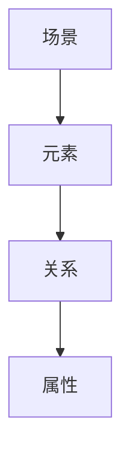
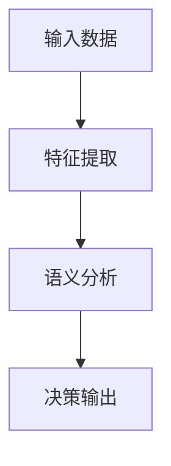

                 


# 开发具有复杂场景理解能力的AI Agent

## 关键词
- AI Agent
- 复杂场景理解
- 深度学习
- 自然语言处理
- 系统架构设计

## 摘要
随着人工智能技术的飞速发展，AI Agent（智能体）在复杂场景理解中的应用变得越来越重要。本文将从AI Agent的基本概念出发，详细探讨复杂场景理解的关键技术，包括感知、决策和执行的算法原理，系统架构设计，以及实际项目的实现。通过本文，读者将能够全面了解如何开发具有复杂场景理解能力的AI Agent，并掌握相关的技术和方法。

---

## 第一部分: 开发具有复杂场景理解能力的AI Agent背景介绍

### 第1章: AI Agent的基本概念与问题背景

#### 1.1 问题背景
##### 1.1.1 当前AI Agent的发展现状
AI Agent是一种能够感知环境、自主决策并执行任务的智能实体。随着深度学习和自然语言处理技术的进步，AI Agent已经在多个领域得到了广泛应用，如智能助手、自动驾驶、智能客服等。

##### 1.1.2 复杂场景理解的必要性
在实际应用中，AI Agent需要处理复杂的场景，例如多轮对话、上下文理解、意图识别等。传统的基于规则的方法在复杂场景下表现不佳，而深度学习方法能够更好地捕捉场景中的复杂关系。

##### 1.1.3 问题的挑战与机遇
复杂场景理解的挑战主要在于如何准确捕捉场景中的隐含信息和上下文关系。而机遇则在于，随着技术的进步，AI Agent在医疗、金融、教育等领域的应用潜力巨大。

#### 1.2 问题描述
##### 1.2.1 AI Agent的核心目标
AI Agent的核心目标是通过感知环境、理解场景、做出决策并执行任务，从而实现与人类或其他系统的高效交互。

##### 1.2.2 复杂场景理解的关键问题
复杂场景理解的关键问题包括多模态信息的融合、上下文的关联性分析、意图识别的准确性等。

##### 1.2.3 问题的边界与外延
复杂场景理解的边界在于如何在有限的计算资源下实现高效的场景分析，而外延则涉及如何将技术应用于实际场景中。

### 第2章: 复杂场景理解的核心概念

#### 2.1 核心概念
##### 2.1.1 复杂场景的定义与特征
复杂场景是指包含多个相互关联的元素，且这些元素之间的关系较为复杂，需要AI Agent具备多层次的理解能力。

##### 2.1.2 AI Agent的理解能力层次
AI Agent的理解能力层次包括感知、理解、推理和决策四个层次。

##### 2.1.3 复杂场景理解的数学模型
复杂场景理解的数学模型可以通过图结构来表示，其中节点表示场景中的元素，边表示元素之间的关系。

#### 2.2 核心概念的联系
##### 2.2.1 复杂场景理解的ER实体关系图

##### 2.2.2 信息处理流程图


---

## 第二部分: 复杂场景理解的算法原理

### 第3章: AI Agent的感知与决策算法

#### 3.1 感知算法
##### 3.1.1 基于深度学习的特征提取
深度学习模型（如卷积神经网络和循环神经网络）常用于特征提取，能够有效捕捉场景中的关键特征。

##### 3.1.2 注意力机制的数学模型
$$ \text{注意力权重} = \text{softmax}(\frac{QK^T}{\sqrt{d}}) $$
其中，$Q$是查询向量，$K$是键向量，$d$是向量的维度。

##### 3.1.3 基于Transformer的编码器
Transformer模型通过自注意力机制实现了高效的特征提取，广泛应用于自然语言处理任务。

#### 3.2 决策算法
##### 3.2.1 基于强化学习的决策模型
强化学习通过奖励机制训练AI Agent在复杂场景中的决策能力，典型算法包括Q-Learning和深度强化学习。

##### 3.2.2 基于规则的决策模型
在某些场景下，基于规则的决策模型可以与深度学习模型结合，提升决策的准确性和效率。

#### 3.3 执行算法
##### 3.3.1 基于规划的执行策略
规划算法通过构建状态空间和动作空间，生成最优执行策略。

##### 3.3.2 基于反馈的执行优化
通过实时反馈调整执行策略，提升AI Agent在复杂场景中的适应能力。

---

## 第三部分: 系统分析与架构设计

### 第4章: 复杂场景理解的系统架构设计

#### 4.1 系统架构设计
##### 4.1.1 系统功能模块设计
系统功能模块包括感知模块、理解模块、决策模块和执行模块。

##### 4.1.2 系统架构图

##### 4.1.3 功能模块的交互流程


#### 4.2 系统接口设计
##### 4.2.1 系统接口的定义
系统接口包括输入接口和输出接口，分别用于接收数据和返回结果。

##### 4.2.2 接口设计的注意事项
确保接口设计的灵活性和可扩展性，便于后续功能的扩展和优化。

#### 4.3 系统交互流程
##### 4.3.1 交互流程图


---

## 第四部分: 项目实战

### 第5章: 实战开发与案例分析

#### 5.1 项目环境安装
##### 5.1.1 安装Python和相关库
需要安装的Python库包括TensorFlow、PyTorch、transformers等。

##### 5.1.2 安装依赖包
使用pip命令安装所需的依赖包：
```bash
pip install numpy pandas tensorflow transformers
```

#### 5.2 核心代码实现
##### 5.2.1 感知模块的实现
```python
import tensorflow as tf
from tensorflow.keras import layers

model = tf.keras.Sequential([
    layers.Conv2D(32, (3,3), activation='relu', input_shape=(224, 224, 3)),
    layers.MaxPooling2D((2,2)),
    layers.Conv2D(64, (3,3), activation='relu'),
    layers.MaxPooling2D((2,2)),
    layers.Flatten(),
    layers.Dense(128, activation='relu'),
    layers.Dense(num_classes, activation='softmax')
])
```

##### 5.2.2 决策模块的实现
```python
import torch
from transformers import BertTokenizer, BertModel

tokenizer = BertTokenizer.from_pretrained('bert-base-uncased')
model = BertModel.from_pretrained('bert-base-uncased')
```

#### 5.3 案例分析
##### 5.3.1 案例一：多轮对话场景
分析多轮对话中的上下文关系，提取用户的意图，并生成相应的回复。

##### 5.3.2 案例二：复杂任务场景
分析复杂任务中的任务分解和执行顺序，生成最优执行策略。

#### 5.4 项目小结
通过项目实战，我们掌握了复杂场景理解的核心技术，并验证了理论的可行性。

---

## 第五部分: 最佳实践与总结

### 第6章: 最佳实践与总结

#### 6.1 最佳实践
##### 6.1.1 系统设计的注意事项
在系统设计中，需要注重模块的独立性和可扩展性。

##### 6.1.2 代码实现的注意事项
在代码实现中，需要注重代码的可读性和可维护性。

#### 6.2 小结
通过本文的学习，读者掌握了复杂场景理解的核心技术，能够开发具有复杂场景理解能力的AI Agent。

#### 6.3 注意事项
在实际应用中，需要注意数据的质量和模型的可解释性。

#### 6.4 拓展阅读
推荐读者阅读《深度学习》和《强化学习实战》等书籍，进一步提升技术水平。

---

以上是《开发具有复杂场景理解能力的AI Agent》的完整内容。

